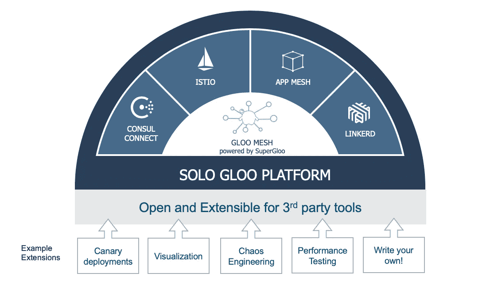

# 超级英雄来救援了！使得为服务网格编写扩展变得更加容易

> 原文：<https://itnext.io/supergloo-to-the-rescue-making-it-easier-to-write-extensions-for-service-mesh-4b78fd0e2415?source=collection_archive---------3----------------------->

SuperGloo 是一个大规模服务网格编排的开源项目。SuperGloo 提供了一个自以为是的抽象层，简化了一个或多个服务网格的安装、管理和操作，如部署在本地、云中的 [Istio](https://istio.io/) 、 [AWS App Mesh](https://aws.amazon.com/app-mesh/) 、 [Linkerd](https://linkerd.io/) 和[hashi corp consult](https://www.consul.io/)或您需要的任何组合。

有越来越多的文章讨论 SuperGloo 的原因，如 [Christian Posta 的](https://blog.christianposta.com/)[“solo . io 简化了谷歌云中企业的服务网格和无服务器采用”](https://medium.com/solo-io/solo-io-streamlines-service-mesh-and-serverless-adoption-for-enterprises-in-google-cloud-c93b8aa04d81)。本文将关注 SuperGloo 如何帮助像 [Weaveworks Flagger](https://github.com/weaveworks/flagger) 这样的软件包在多个服务网格上工作，如 Istio 和 AWS App Mesh，它们都支持流量转移。

Flagger 是一个很酷的开源项目，可以自动推广 Kubernetes 服务的 Canary 部署。您将 Flagger Canary Kubernetes 自定义资源(CRD)与您的部署相关联，Flagger 将遵循您定义的规则来帮助推出新版本。它检测何时部署了新版本的服务，与现有版本并行实例化新版本，在两个版本之间缓慢转移请求流量，并使用您定义的 Prometheus metric 健康检查来确定 Flagger 是应该继续将更多流量转移到新版本还是回滚到旧版本。由于金丝雀 CRD 是一个 YAML 文件，这为您提供了一种声明性的方式来确保您的所有服务升级都遵循您指定的复杂部署策略，并补充了在 [Weave Flux](https://github.com/weaveworks/flux) 和 [JenkinsX](https://jenkins-x.io/) 中使用的 GitOps 管道。

更多关于金丝雀部署和交通转移的信息在下面的帖子里。 [Gloo](https://gloo.solo.io/) 使用与 Istio 相同的底层数据平面技术 [Envoy](https://www.envoyproxy.io/) ，提供 Flagger 和 Knative 使用的流量转移功能。Gloo 是一个 API/功能网关，而不是一个全服务网格，因此 Gloo 可以用于不需要全服务网格实现的所有能力和重量的用例。

*   [使用加权目的地的 Gloo 功能网关的 Canary 部署](https://scott.cranton.com/canary-deployments-with-weighted-routes.html)
*   [通过 Knative 和 Solo.io Gloo 实现服务自动化](https://scott.cranton.com/knative-and-gloo.html)
*   [Jenkins X 无服务器应用](https://jenkins-x.io/developing/knative/)

本文快速介绍了如何使用 Istio 在 SuperGloo 上设置 Flagger `podinfo`示例应用程序，这样大家就可以看到其中涉及的内容，如果愿意的话也可以自己尝试一下。

# 安装 Kubernetes 和头盔

我们旅程的第一步是运行一个基本的本地 Kubernetes 集群。我的朋友 Christian Hernandez 向我介绍了 Kubernetes sig 测试团队的 kind(T21)。假设您有一个本地运行的 Docker 副本，例如 Docker Desktop，这是一种快速、轻量级的方法来加速/减速本地集群。如果您愿意，这个例子在`minikube`中也同样适用。下面的代码完成了大多数 Kubernetes 集群所需的基本工作。

*   创建一个具有一个控制平面节点和一个工作节点的`kind`集群
*   将`KUBECONFIG`配置为`kind`为每个`kind`集群创建一个单独的`kubeconfig`文件
*   安装舵杆和舵杆，并为舵杆提供服务账户

# 使用 SuperGloo 安装和配置 Istio

神奇的事情发生了，所以让我们花点时间梳理一下由于这几行代码而发生的所有事情。

第一个命令`supergloo init`将 SuperGloo 安装到您的 Kubernetes 集群中，这相当于使用 Helm 安装 SuperGloo。

第二个命令`kubectl --namespace supergloo-system rollout status deployment/supergloo --watch=true`是一个等到 SuperGloo 部署完全部署并运行的工具。这类似于在安装头盔时使用`--wait`选项。

`supergloo install istio ...`命令声明一个定制资源，SuperGloo 控制器按照声明安装和配置 Istio。在这种情况下，我们使用 Istio 的 Prometheus 安装来安装 Istio 版本 1.0.6，并使用 Istio 在标签为`istio-injection=enabled`的名称空间内的所有 pod 中部署 sidecars，即 [Istio 自动注入 sidecars 的默认行为](https://scott.cranton.com/kubectl%20--namespace%20supergloo-system%20rollout%20status%20deployment/supergloo%20--watch=true)。这个命令性的`supergloo install istio`命令创建了下面的清单，如果您愿意，您可以`kubectl apply`创建。更多细节请参考完整的`[Install](https://supergloo.solo.io/v1/github.com/solo-io/supergloo/api/v1/install.proto.sk#istioinstall)`规格。

# 安装 Weaveworks Flagger

以下安装 Flagger 及其相关部件。以下是安装 Flagger 的快速总结。更多详情请访问 [Flagger Doc 网站](https://docs.flagger.app/)。

1.  添加对 Flagger helm repo 的引用
2.  等待舵柄完全运转。只有从头开始创建 Kubernetes 集群的快速脚本有问题
3.  创建允许 Flagger 修改 SuperGloo/Istio 资源的群集角色绑定
4.  参考 Istio 提供的 Prometheus 安装核心 Flagger，并告诉 Flagger that SuperGloo 是网格控制器
5.  安装 Flagger 的 Grafana 仪表盘，该仪表盘不在本演示中使用
6.  安装 Flagger 的 LoadTester，如果没有足够的用户流量，它可以帮助在 Canary 部署期间生成测试流量

# 安装 Weaveworks Flagger 示例应用程序

示例应用程序`[podinfo](https://github.com/stefanprodan/k8s-podinfo)`是简单的 golang web 应用程序。它配备了 Prometheus，因此我们可以判断它的性能是否良好，这有助于我们的 Canary 部署验证新版本是否能够处理传入流量。如果您想让部署显式失败，示例应用程序还提供了钩子来允许您生成错误，以查看 Flagger Canary 如何处理这种情况。关于 Flagger 示例应用程序选项的全部细节在此处。以下是安装步骤的摘要。

1.  安装一个`test`名称空间、示例 Kubernetes 部署清单和一个(可选的)水平 pod 自动缩放器
2.  为示例应用程序部署 Canary 策略。稍后会有更多的细节
3.  等待金丝雀控制器报告它已经完全准备好了，这意味着 Istio 和 Flagger 已经完全部署好并正在运行

Canary 清单有一个将它与 podinfo 部署相关联的目标引用。Canary 分析称，每增加一个`interval` (1 分钟)标记，新版本的请求流量就会增加`stepWeight` (10%)，直到`maxWeight` (50%)，只要`metrics`保持在定义的健康范围内。如果超过`threshold` (5)个健康检查失败，则回滚到旧版本的 100%流量，并删除新版本部署。还有一个可选部分，允许 Flagger loadtester 生成额外的流量，以帮助验证新的 Canary 版本，即，如果新版本没有处理任何请求，很难知道新版本是否工作。

# 部署新的映像版本，并观察 canary 部署

首先，我们检查当前部署的映像版本，并将其打印出来，以帮助我们验证测试是否如我们所期望的那样更新了服务；应该是`quay.io/stefanprodan/podinfo:1.4.0`。然后，为了使更改更加明显，我们触发一个后台进程，在五秒钟的延迟后将图像版本更新为`quay.io/stefanprodan/podinfo:1.4.1`。然后，我们循环并打印出 podinfo 的更改事件，以查看流量权重的变化，直到 Canary 报告成功。如果您想尝试引入错误来查看 Canary 回滚，您需要更改这个循环。最后，我们将打印出图像版本，应该是`quay.io/stefanprodan/podinfo:1.4.1`一切顺利。

# 清理 Kubernetes

最后一步是清理 Kubernetes 集群，在我们的例子中，这意味着通过运行`kind delete cluster`并取消设置`KUBECONFIG`环境变量来删除 kind 集群。

# 一起看一切

这里有一个[asci NEMA](https://asciinema.org/)的屏幕记录，记录了整个示例脚本的运行，如果您想亲自尝试，之后您可以看到整个脚本。Asciinema 记录器可以加速任何长时间运行的命令，也就是说，如果一个命令需要两秒以上的时间来执行，则回放会延迟两秒。这种加速将运行时间从 15 分钟以上减少到大约两分钟。

# 摘要

希望这个例子让您了解了 SuperGloo 是如何支持 Flagger 这样的金丝雀部署引擎的。在 SuperGloo 之前，你要么需要学习如何自己安装所有的 Istio，要么只能使用 GKE 或 AWS 的托管 Istio 或 App Mesh 安装。这些都是很好的托管产品，但是它们将您的选择限制在它们当前支持的版本和配置上。

SuperGloo 提供了一个很好的抽象和管理层来帮助扩展利用一个或多个服务网格，而不需要深入到任何一个网格(如 Istio 或 App Mesh)的巨大 API 表面区域中。SuperGloo 使应用程序可以轻松地使用底层网格中他们需要的东西。根据我听到的反馈，这有助于在服务网格上的采用，也就是说，许多人目前正在试验 Istio 或 App Mesh 或 Linkerd 的 on 功能，通常是流量转移或相互 TLS，他们发现很难管理和配置整个网格，即使他们没有使用这些其他功能。SuperGloo 的救援，以帮助更容易地使用服务网格的部分增值今天，并允许您添加更多的，因为你需要它包括混合和匹配多个服务网格轻松获得最大的投资回报。

我强烈建议你自己多学习，因为学习新技术很有趣，尤其是那些能帮助你解决复杂挑战并加速你部署更大更复杂系统的技术。

*   超级 Gloo
*   [旗手](https://docs.flagger.app/)
*   [Istio](https://istio.io/)
*   [服务网状集线器](https://servicemeshhub.io)