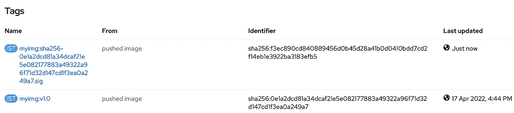

# 通过 Cosign 和 Kyverno 为内部 Kubernetes 提供供应链安全性

> 原文：<https://itnext.io/supply-chain-security-with-cosign-and-kyverno-for-on-premise-kubernetes-2fa40ceef3c0?source=collection_archive---------3----------------------->


对于任何认真采用云的人来说，供应链安全正变得越来越重要。本文探讨了私有注册表中的容器映像如何被验证为它所声称的那样，并由验证策略强制执行。

## 工具和环境

我将使用 [Sigstore 的 Cosign](https://github.com/sigstore/cosign) 工具来签署容器图像，并使用 [Kyverno](https://kyverno.io) 策略引擎来验证图像。目标 Kubernetes 环境是 OpenShift(版本 4.10)。

与使用 Cosign 和 Kyverno 时处理常见的公共可用图像注册中心不同，我的探索将主要集中在本地容器注册中心，这是来自 OpenShift 的私有注册中心。

## 容器图像

一个 toy Golang Web 处理程序应用程序被用来演示这个过程。构建图像的多阶段 Dockerfile 文件如下所示。

```
FROM golang as builder
WORKDIR /build
COPY ./src /buildRUN CGO_ENABLED=0 go build -o serving *.goFROM alpine
WORKDIR /app
COPY --from=builder /build/serving /appENTRYPOINT ["./serving"]
```

使用 Buildah 工具构建并将映像推送到 OpenShift 的私有注册表中。

```
buildah build-using-dockerfile -f ./Dockerfile -t myimg:v1.0 .buildah push --tls-verify=false --creds=anyone:$(oc whoami -t) myimg:v1.0 docker://default-route-openshift-image-registry.apps.dev-ocp410.ibmcloud.io.cpak/cosign-exp/myimg:v1.0
```

## 用连署签署图像

从 Github 版本中获取最新的 Cosign 工具。如下创建密钥对，

```
COSIGN_PASSWORD=password cosign generate-key-pair
```

一对密钥，`cosign.pub and cosign.key`文件被创建。

登录 OCP 私人登记处，

```
cosign login default-route-openshift-image-registry.apps.dev-ocp410.ibmcloud.io.cpak -u any -p $(oc whoami -t)
```

用私钥对图像签名，

```
COSIGN_PASSWORD=password cosign sign --key cosign.key --allow-insecure-registry default-route-openshift-image-registry.apps.dev-ocp410.ibmcloud.io.cpak/cosign-exp/myimg:v1.0
```

请注意，注册表的证书是自签名的，我们添加了允许不安全的注册表标志以跳过错误消息。

如果我们检查 OpenShift 图像流，



创建一个特殊的图像标签作为连署签名。

我们现在可以用公钥来验证它，

```
COSIGN_PASSWORD=password **cosign verify** --key cosign.pub --allow-insecure-registry default-route-openshift-image-registry.apps.dev-ocp410.ibmcloud.io.cpak/cosign-exp/myimg:v1.0Verification for default-route-openshift-image-registry.apps.dev-ocp410.ibmcloud.io.cpak/cosign-exp/myimg:v1.0 --
The following checks were performed on each of these signatures:
  - The cosign claims were validated
  - The signatures were verified against the specified public key[{"critical":{"identity":{"docker-reference":"default-route-openshift-image-registry.apps.dev-ocp410.ibmcloud.io.cpak/cosign-exp/myimg"},"image":{"docker-manifest-digest":"sha256:0e1a2dcd81a34dcaf21e5e082177883a49322a96f71d32d147cd1f3ea0a249a7"},"type":"cosign container image signature"},"optional":null}]
```

我们如何确保映像在运行前得到验证和确认？我们用 Kyverno 政策强制执行。

## 部署 Kyverno 并验证

标准 Kyverno 部署很简单。我们使用舵图方法。

```
helm repo add kyverno [https://kyverno.github.io/kyverno/](https://kyverno.github.io/kyverno/)
helm repo update
helm install kyverno kyverno/kyverno -n kyverno --create-namespace
```

一旦 pod 运行并准备就绪，我们就可以执行下面的 Kyverno 策略来验证图像是否由我们签名。

```
apiVersion: kyverno.io/v1
kind: Policy
metadata:
  name: verify-image-in-namespace
  namespace: cosign-exp
spec:
  validationFailureAction: enforce
  background: false
  rules:
    - name: verify-image
      match:
        any:
        - resources:
            kinds:
              - Pod
      verifyImages:
        - image: "image-registry.openshift-image-registry.svc*"
          key: |-
            -----BEGIN PUBLIC KEY-----
           MFkwEwYHKoZIzj...SKIPPED...
            -----END PUBLIC KEY-----
```

创建一个名称空间策略，在该名称空间内，所有来自私有注册中心的图像，通过匹配`image-registry.openshift-image-registry.svc*`，必须用另一对用于签名图像的公钥进行验证。

注意，因为我们的目标是集群内使用，所以容器注册中心将是 OpenShift 内部名称，`image-registry.openshift-image-registry.svc:5000`

现在部署应用程序，

```
apiVersion: apps/v1
kind: Deployment
metadata:
  name: cosign-exp-app
  labels:
    app: cosign-exp-app
spec:
  replicas: 1
  selector:
    matchLabels:
      app: cosign-exp-app
  template:
    metadata:
      labels:
        app: cosign-exp-app
    spec:
      containers:
      - name: cosign-exp-app
        image: image-registry.openshift-image-registry.svc:5000/cosign-exp/myimg:v1.0
        ports:
        - containerPort: 8080
```

由于映像已经签名，我们希望部署能够成功。然而，

```
Error from server: error when creating "cosign-exp-app.deploy.yaml": admission webhook "mutate.kyverno.svc-fail" denied the request:resource Deployment/cosign-exp/cosign-exp-app was blocked due to the following policiesverify-image-in-namespace:
  autogen-verify-image: 'image verification failed for image-registry.openshift-image-registry.svc:5000/cosign-exp/myimg:v1.0:
    Get "[https://image-registry.openshift-image-registry.svc:5000/v2/](https://image-registry.openshift-image-registry.svc:5000/v2/)": x509: certificate
    signed by unknown authority'
```

因为我们使用的是私有注册中心，所以证书是由 OpenShift 内部 CA 签名的，Kyverno 不知道这个 CA。

## 修复错误

不像 Cosign 现在支持带有命令标志的私有 CA。嵌入式联合签名功能尚不支持私有根 CA，正如本[未决问题#2396](https://github.com/kyverno/kyverno/issues/2396) 所指出的。

我们可以通过将私有根 CA 添加到系统信任的 CA 中来解决这个问题。

当在集群内部使用私有注册表时，其证书由 OpenShift CA 签名，该证书可以如下提取:

```
oc -n openshift-service-ca get secret signing-key -o jsonpath='{.data.tls\.crt}' | base64 -d > service-ca.crt
```

使用 service-ca.crt，我们可以通过扩展映像从系统更新受信任的 ca，

```
FROM ubuntu as certBaseADD service-ca.crt /usr/local/share/ca-certificates/
#notice the trailing slashRUN apt update && apt install -y ca-certificates && update-ca-certificatesFROM ghcr.io/kyverno/kyverno:v1.6.2
USER root
COPY --from=certBase /etc/ssl/certs/ca-certificates.crt /etc/ssl/certs/
USER 10001
```

构建并将其作为`image-registry.openshift-image-registry.svc:5000/kyverno/my-kyverno:v1.0`推入 OpenShift 私有注册表

## 私有注册表的配置

除了根 CA 证书之外，我们还需要对私有注册中心进行一些进一步的配置。需要注册表验证。

对于 OpenShift，我们可以创建一个服务帐户，并为映像访问分配适当的 RBAC 权限。然后，它的令牌可以用于注册表身份验证。

```
kubectl -n kyverno create sa sa-image-verifier
```

绑定以下现成的 ClusterRole，system:image-puller，for image

```
apiVersion: rbac.authorization.k8s.io/v1
kind: ClusterRoleBinding
metadata:
  name: kyverno-image-verifier
roleRef:
  apiGroup: rbac.authorization.k8s.io
  kind: ClusterRole
  name: system:image-puller
subjects:
- kind: ServiceAccount
  name: sa-image-verifier
  namespace: kyverno
```

在 Kyverno 名称空间中创建密码，将令牌值作为密码，

```
kubectl -n kyverno create secret docker-registry **regcred-for-kyverno** --docker-server=image-registry.openshift-image-registry.svc:5000 \
--docker-username=token \
--docker-password=$(oc -n kyverno sa get-token sa-image-verifier)
```

## 更新 Kyverno 头盔版本

通过所有这些更新，创建以下值 YAML 文件，

```
image:
  repository: image-registry.openshift-image-registry.svc:5000/kyverno/my-kyverno
  tag: v1.0initImage:
  repository: ghcr.io/kyverno/kyvernopre
  tag:  v1.6.2 #default the same as image.tag, so need to set the correct tagextraArgs:
  - --imagePullSecrets=regcred-for-kyverno
```

更新头盔版本，

```
helm upgrade --install -n kyverno kyverno kyverno/kyverno -f values.yaml
```

## 验证测试

让我们测试没有签名的映像部署。使用 oc 命令删除特殊标记，

```
oc delete istag myimg:sha256-0e1a2dcd81a34dcaf21e5e082177883a49322a96f71d32d147cd1f3ea0a249a7.sig
```

*联合签名清理不适用于 OCP 私人注册中心。*

部署失败，

```
Error from server: error when creating "cosign-exp-app.deploy.yaml": admission webhook "mutate.kyverno.svc-fail" denied the request:resource Deployment/cosign-exp/cosign-exp-app was blocked due to the following policiesverify-image-in-namespace:
  autogen-verify-image: 'image verification failed for image-registry.openshift-image-registry.svc:5000/cosign-exp/myimg:v1.0:
    signature mismatch'
```

重新提交映像并重新部署，部署成功。

## 结论

通过一些特殊的设置和修复，可以使用 Cosign 和 Kyverno 工具来管理私有图像的供应链安全性。