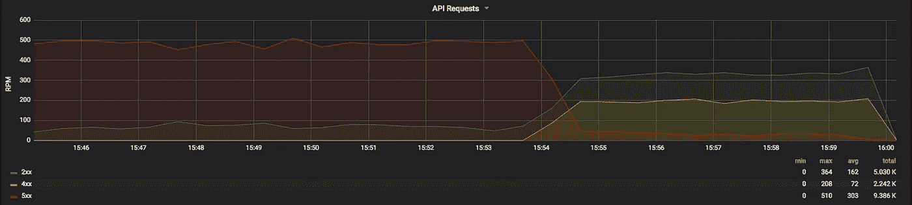

# 在网站流量突然激增的情况下生存 Kubernetes 上的大使全球限速

> 原文：<https://itnext.io/surviving-a-sudden-spike-in-website-traffic-global-rate-limiting-with-ambassador-a19dd2dfda46?source=collection_archive---------4----------------------->

想象一下你的网站登上了[黑客新闻](https://news.ycombinator.com/)的头版。流量开始飙升。不幸的是，你的网站还没有为此做好准备。您的数据库在负载下开始崩溃。随着性能的下降，用户开始点击浏览器中的重新加载，希望获得一个请求，这会给服务器增加更多的负载。

你是做什么的？

# 全局速率限制

您希望尽可能快地缓解性能问题，同时努力扩展您的后端。您可以使用速率限制来做到这一点，即限制您的应用程序接收的请求总数。有许多限制速率的方法。

由于我们的网站正在崩溃，我们将应用一个快速的每用户速率限制，以防止单个用户向我们的应用程序发送太多请求。

# 大使速率限制

大使有一个强大的速率限制 API。传入的请求可以用*标记。*这些请求标签暴露给第三方速率限制服务，该服务可以使用这些标签来做出速率限制决定。在 Ambassador Pro 中，我们还包括一个利用该 API 的集成速率限制服务。

# 在 Ambassador 中部署全局速率限制

通过在全局大使`Module`中配置`default_labels`，我们可以通过大使将请求标签应用于所有请求。

```
---
apiVersion: ambassador/v1
kind: Module
name: ambassador
config:
  default_label_domain: ambassador
  default_labels:
    ambassador:
      defaults:
      - remote_address
```

`remote_address`值告诉 Ambassador 用客户机 IP 地址标记每个请求。这允许将外部速率限制服务配置为基于通过 Ambassador 的每个客户端 IP 进行速率限制。在 Ambassador Pro 中，这很容易用一个`RateLimit`对象来配置。

```
apiVersion: getambassador.io/v1beta1
kind: RateLimit
metadata:
  name: global-rate-limit
spec:
  domain: ambassador
  limits:
  - pattern: [{remote_address: "*"}]
    rate: 10
    unit: second
```

这将配置 Ambassador Pro 以限制单个用户每秒 10 个请求。如果用户超过这个限制，Ambassador 将使用 HTTP 429 拒绝请求。

# 监视

通过 Ambassador 的统计输出，我们可以主动跟踪速率限制配置对系统的影响。



这个 Grafana 仪表板显示了通过大使提出的 15 分钟的请求。

我们可以看到，在我们实现速率限制之前，我们后端的可用性是不一致的，向我们的用户返回了大量的 500 错误(红线)。在 Ambassador 中配置了每个用户的速率限制后，我们可以看到 500 的数量下降，200(绿线)的数量上升，因为来自霸道用户的请求被抑制，允许更多的用户访问我们的 API。此外，429 响应也有所增加(黄线)，因为用户受到速率限制。

# 结论

速率限制是一种保护您的应用程序免受拒绝服务攻击的强大技术，无论拒绝服务是恶意的还是意外的。为了进一步了解速率限制技术，[本文](https://www.getambassador.io/user-guide/rate-limiting)涵盖了速率限制的不同用例及场景。关于 Ambassador 中速率限制的更多信息，请参见关于[基本](https://www.getambassador.io/user-guide/rate-limiting-tutorial)和[高级速率限制](https://www.getambassador.io/user-guide/advanced-rate-limiting)的文档。

本文的早期版本 *最初出现在大使博客上。*