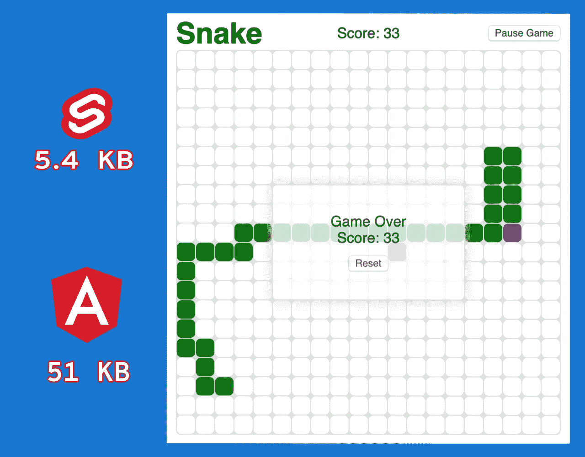

# 纤薄的 Web 组件— 5.4KB

> 原文：<https://itnext.io/svelte-web-component-5-4kb-4afe46590d99?source=collection_archive---------2----------------------->

让我们来看看如何制作真实的 Web 组件，并将其与使用不同框架创建的类似 Web 组件进行比较。



声明:这不是苗条和棱角的对比。这是如何创建苗条的网页组件，作为一个旁注，我分享了类似的网页组件用 Angular 创建。在我看来，它们是非常不同的，这不是一篇比较框架的文章。

# 什么是苗条？

> “苗条是构建用户界面的一种全新方式。React 和 Vue 等传统框架在*浏览器*中完成大部分工作，而 Svelte 将这些工作转变为*编译步骤*，这发生在你构建应用的时候。”

这个解释直接来自 [Svelte.dev](https://svelte.dev/) 网站。请访问网站了解更多信息。

**查看 GitHub repo 和 Readme 了解更多信息**

> *👨‍💻* [*瘦 Web 组件 GitHub 库*](https://github.com/gogakoreli/svelte-snake-web-component) *🎮* [*这里看一下成品*](https://gogakoreli.github.io/svelte-snake-web-component/)**📝** [*阅读第二篇:* *棱角分明的蛇网组件— 51KB*](/angular-9-snake-web-component-96f61e63b158)

# 如何创建苗条的 Web 组件？

## 1.设置苗条项目

从 Svelte 提供的克隆模板和设置软件包开始

```
npx degit sveltejs/template svelte-web-component
cd svelte-web-component
npm install
npm run dev
```

## 2.使用 TypeScript(可选)

尽管 Svelte 还没有对 TypeScript 的官方支持，但是有一种方法可以做到。社区里有 VS 代码扩展和模板。但是现在我将坚持使用 JavaScript，我将独立地使用 TypeScript 来编写和编译 TS 文件，并将它们用作 JS 文件。看看官方[路线图](https://github.com/sveltejs/svelte/issues/4518)。

`tsc --init`将创建`tsconfig.json`文件，您需要指定几个选项。`"outDir": "./src", "rootDir": "./ts", "baseUrl": "./ts",`这样你就可以把 ts 文件放在 TS 文件夹里，在 TS watcher 的帮助下，它们会被编译并保存到 src 文件夹里。

```
npm install *typescript* --save-dev
tsc --init
tsc --watch
```

## 3.创建苗条的组件

`App.svelte`组件将位于来自模板的 src 文件夹中。它将被导入到创建和导出应用程序的`main.js`文件中。

*   首先你需要更新`rollup.config.js`:

```
plugins: [
  svelte({
    **customElement: true,**
```

*   然后我改名为`**App.svelte -> snake.svelte**` 并相应地更新了`main.js`
*   您需要告诉 Svelte，您将把您的组件导出为 Web 组件。在细长组件中使用这一行:
    `**<svelte:options tag=”svelte-snake” immutable={true} />**`
    无论您在标签中放入什么，都会在最后的`bundle.js`中成为实际的 web 组件标签。**另外，请注意我使用的是** `**immutable={true}**`，因为我的状态是不可变的，因此 Svelte 使用引用相等检查来提高性能。
*   您不需要在`main.js`中实际创建组件，因为我们将导出为 web 组件。您只需要导入和导出组件。看一下我举的`main.js` :
    `**import Snake from ‘./snake.svelte’;
    export default Snake;**`的例子
*   更新`public/index.html`以使用我们的 Web 组件，以便它在开发过程中正确显示在浏览器中。
    `**<body> <svelte-snake></svelte-snake> </body>**`

您已经准备好开发`snake.svelte`组件，然后我们将把它导出为 Web 组件。

## 4.构建和部署

执行`**npm run build**`和`bundle.js`文件将在`public/build`文件夹中创建。它包含我们完成的网页组件的风格和 Svelte 的额外代码，使其工作。

我将 Web 组件发布到 GitHub 页面。你也可以这样做，看看[GitHub 入门页面](https://help.github.com/en/github/working-with-github-pages/configuring-a-publishing-source-for-your-github-pages-site)。它也将服务于`bundle.js`文件 gzipped，这就是为什么我不自己做。

*   在项目的根文件夹中创建`docs`文件夹
*   将`bundle.js`复制到文档文件夹中
*   创建`index.html`文件并放入`docs`文件夹。它需要适当的基础 href 和脚本导入。看一下我的例子:
    `<base href=”https://gogakoreli.github.io/svelte-snake-web-component/">
    <script defer src=’bundle.js’></script>`
*   最后你可以使用:`<body> <svelte-snake></svelte-snake> </body>`
*   你可以告诉 GitHub 从你的项目的`docs`文件夹中提供静态文件。
    进入 GitHub 库设置- >选项- > GitHub 页面- >来源- > `master branch /docs folder`

## 5.捆绑大小

项目的`src`文件夹包含几个 JS 文件和一个 Svelte 组件。

让我们看看它们的尺寸:

*   `**input.js, main.js, map.js, models.js, snake.js, store.js**` **: ~10.7KB，~2.6KB (Gzipped)**
*   `**snake.svelte**` **: ~3.5KB，~1.2KB (Gzipped)**

在`npm run build`之后，Svelte 将所有的源文件编译成一个`bundle.js`文件，该文件包含了使 Web 组件工作所需的所有 Svelte 函数。在 Svelte 中没有运行时，有一些功能可以使模板根据变化进行相应的更新，所有的反应代码都可以正常工作。这段代码是在编译时生成的。我没有使用的任何东西都不会出现在`bundle.js`中。还有`bundle.js`被缩小变丑。

*   `**bundle.js**` **: ~13.7KB，~ 5.4 kb(gzip)**

## 6。自己尝试苗条的网络组件

`bundle.js`包含使`svelte-snake` Web 组件工作所需的所有代码。您可以在您的计算机上创建样本`index.html`，在浏览器中打开它，并查看成品和捆尺寸。以下列`index.html`为例:

index.html 样本

## 7.与有角蛇形腹板部件相比

**📝** [**Angular Snake Web 组件— 51KB**](/angular-9-snake-web-component-96f61e63b158) **:** 阅读我的另一篇文章，在那里我创建了与 Angular 9 完全相同的 Web 组件。Angular 的最终包大小要大得多:大约 51KB (Gzipped)对大约 5.4KB (Gzipped)，但这并不意味着 Angular 或 Svelte 在创建 Web 组件方面更好。

*   Angular 附带了运行时，由于 RxJS，bundle 也变大了。Angular 是一个完整的框架，即使在产品构建期间有一个非常好的树摇动过程，Angular 也是有成本的。当构建最小的包大小不是最优先考虑的应用程序时，这个成本可以忽略不计。Angular 拥有非常完善的生态系统，拥有更大的足迹是有道理的。在我看来，Angular Web 组件是有意义的，它们有自己的目标用例。
*   因为没有运行时，所以 Svelte 的占用空间更小。Svelte 设法在编译时确定组件工作所需的内容。然后注入特定的瘦函数，使模板、绑定和反应代码工作。没有单独的运行时来查找对更新模板的更改。你写反应式代码，Svelte 把它变成命令式的对应物以获得性能。

**查看 GitHub repo 和 Readme 了解更多信息**

> *👨‍💻* [*瘦 Web 组件 GitHub 库*](https://github.com/gogakoreli/svelte-snake-web-component) *🎮* [*这里看一下成品*](https://gogakoreli.github.io/svelte-snake-web-component/)**📝** [*阅读第二篇:* *棱角分明的蛇网组件— 51KB*](/angular-9-snake-web-component-96f61e63b158)

你认为这篇文章有趣吗？

**单击👏按钮**传播文章
[**在 Twitter 上关注我@ gogakoreli**](https://twitter.com/GogaKoreli)在 Medium 上关注我[戈加 Koreli](https://medium.com/u/9d3b09790759?source=post_page-----4afe46590d99--------------------------------)