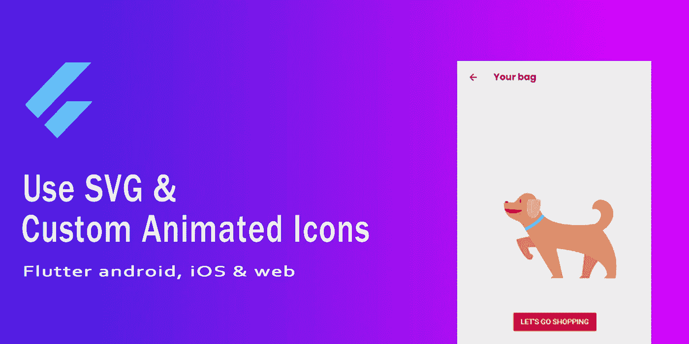
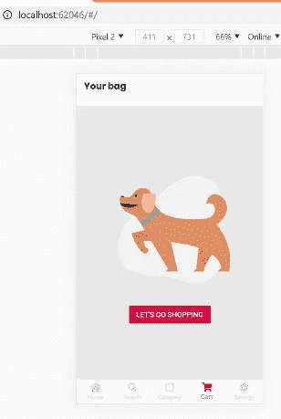
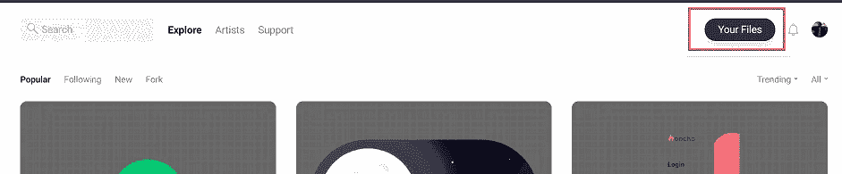
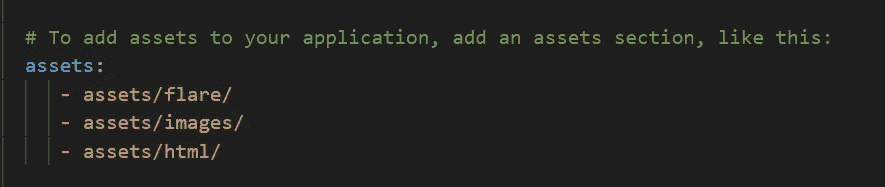
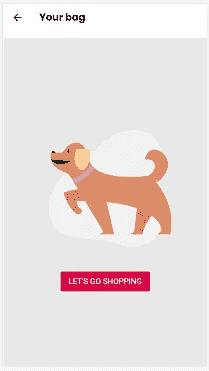
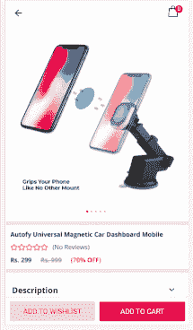
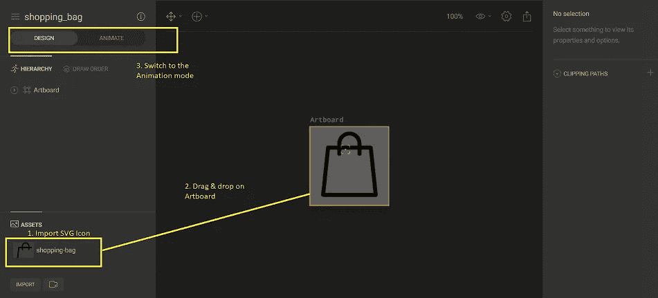
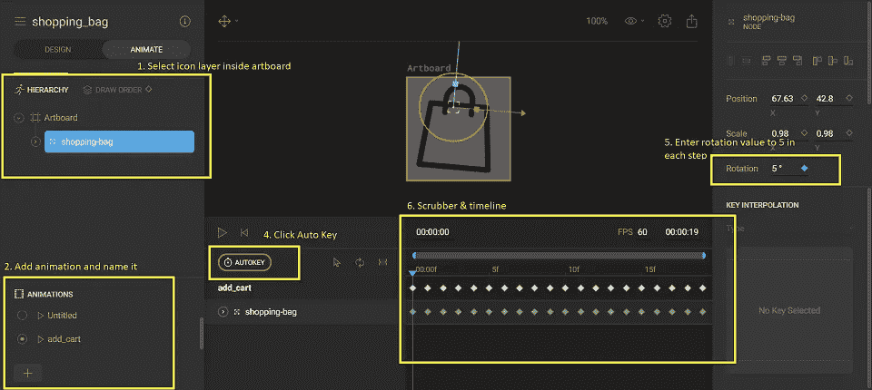
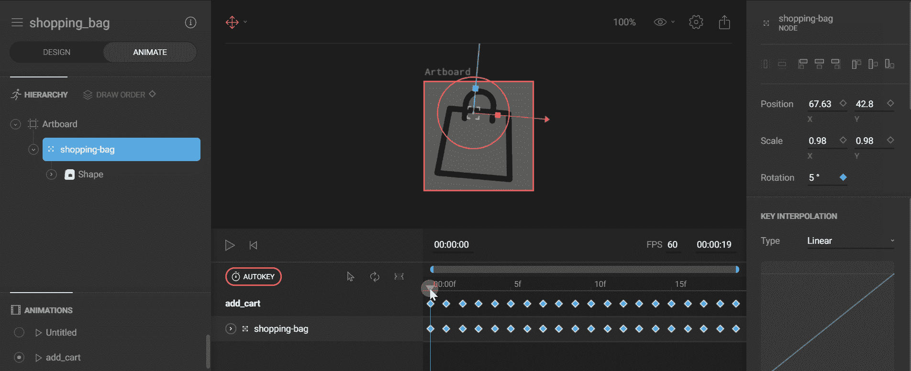

# 颤振:SVG 和自定义动画图标与最小的努力

> 原文：<https://itnext.io/svg-and-custom-animated-icons-in-flutter-ios-android-web-with-minimum-effort-118c2d71b2e7?source=collection_archive---------0----------------------->



这篇文章涵盖了两件事:

1.  在 flutter (android、iOS 和 web)中使用 SVG 插图、图标和其他资源。
2.  创建自定义动画图标，并在 flutter (android、iOS 和 web)中与之交互。

你没听错**“最小工作量”**因为这是我们在关注应用程序的业务逻辑时想要做的。

**背景**

目前，没有直接的方法在 flutter 中渲染 SVG，因为 flutter 本身不支持它。然而，这可以通过以下两种方式实现:

1.  使用 [flutter_svg](https://pub.dev/packages/flutter_svg) 插件。这个插件为你做了繁重的工作，用最少的努力从资产和网络渲染 SVG。看看这个[教程](https://dev.to/mightytechno/render-svg-in-flutter-app-4kan)。然而，这个插件不支持网络平台。
2.  使用 [Flare](https://rive.app/) 设计工具和 [flare_flutter](https://pub.dev/packages/flare_flutter) 插件。我将在本文中重点介绍这种方法，因为通过这种方式，我们将能够在 **flutter web 平台**(显然与 android 和 iOS 平台一起)上使用 SVG，这也将有助于我们创建可以使用控制器制作动画的酷自定义动画图标。

**入门！**

**第 1 部分:在 flutter 应用程序(iOS、Android 和 web)中使用 SVG**



**最终输出:**在 flutter web、android 和 iOS 中使用 SVG 插图

a)从[这里](https://undraw.co/illustrations)下载一个 SVG 插图(更多免费资源在最后)，或者准备一个由你的设计师创建的。

b)。如果你还没有注册，请到 https://rive.app/[网站](https://rive.app/)注册。将鼠标悬停在右上角的**“您的文件”**按钮上，并从下拉菜单中选择**“新文件”**选项。



c)。在下一步中点击**“保存”**，您将看到这个界面:


火炬设计工具

d)。让我们快速进入这个令人敬畏的工具，通过 4 个步骤获得我们的输出。

**步骤 1。**导入(或拖拽& drop)你下载的 SVG 文件。

**第二步。**将 SVG 资源拖放到画板上。

**步骤三。**如果需要，调整画板的尺寸。

**第四步。**点击**【导出】**按钮，以**【二进制】**格式导出文件，其他设置不变。

这将导出一个名为" **empty_cart2.flr"** 或您命名的任何名称的文件。现在，我们准备在我们的 flutter 应用程序中使用 SVG，并使我们的 UI 在视觉上更具吸引力。

在您的 flutter 应用程序中，在您的***publibsec . YAML***文件中添加一个依赖项

```
flare_flutter: any
```

如果您还没有，在您的 flutter 文件结构的根目录中创建一个名为**“assets”、**的文件夹。在 assets 文件夹中，创建另一个名为**“flare”**的文件夹，并将下载的**“empty _ cart 2 . FLR”**粘贴到其中。

在***publibsec . YAML***文件中添加包含 flare 文件的文件夹路径



最后，在您想要显示 SVG 的地方添加下面的小部件:

```
Container(
 height: 300,
 width: double.inifinity,
 child: FlareActor.asset(AssetFlare(
   bundle: rootBundle,
   name: '"assets/flare/empty_cart2.flr')
 )
)
```



这就是了。

很简单，对吗？那么让我们进入下一部分吧。

第 2 部分:创建一个定制的动画图标，并在你的 flutter 应用程序中与之交互。

动画图标是一种很好的方式，可以让你的移动应用变得生动，把枯燥的"*搞定事情"* UI 变成更具互动性和使用乐趣的 UI。动画图标的使用案例很多。你可以在底部导航中使用它们，就像在这个[教程](https://fireship.io/lessons/animated-navigation-flutter-flare/)中一样


f [ireship.io](https://fireship.io/lessons/animated-navigation-flutter-flare/) 的颤振耀斑 2D 动画基础

在这篇文章中，我们将重点放在动画我们的袋子图标，作为一个指示，让用户知道项目已被添加到购物车。我们将在点击**“添加到购物车”**按钮时触发该动画。我们玩吧。



**最终输出:**自定义添加到购物车动画图标

1.  首先从你选择的网站下载一个 SVG 图标。
2.  将其导入到 flare 设计工具中(有关详细步骤，请参考上面的第 1 部分)



火炬设计工具

3.一旦资源被导入到 rive 工具中，并且您对画板和 SVG 图标的大小感到满意，切换到 **"ANIMATE"** 模式，如上图所示(步骤 3)。



切换到动画模式后，您可以立即创建动画，这非常容易。你所要做的就是移动画刷和改变旋转值，动画会自动录制。

1.  展开画板并选择导入的 SVG 图标。这将在 flare 设计工具的右侧显示相应的属性。
2.  点击底部的 **'+'** 图标，创建一个新的动画，命名为**“add _ cart”。**这个名字是 ***重要的*** 因为你将在 flutter 代码中使用这个名字来制作图标动画(我们稍后会讲到)。
3.  准备好迎接魔法吧。

4.确保选择了**“AUTOKEY”**选项。

5.将旋转值设置为 5 度(或您喜欢的任何值)。

我们将重复第 5 步，在每一步移动洗涤器一点。首先，我们将旋转值从 0 度增加到 25 度，然后我们将通过在每一步中减少 5 度使其回到 0 度，然后我们将旋转值从 0 度增加到-25 度并最终使其回到 0 度。此时，您可以按下播放按钮，并看到图标已经动画。



更改旋转值并向前移动洗涤器

6.最后一步是使用导出按钮导出我们的动画图标。另存为二进制，其他设置保留默认值。这将下载一个名为**“shopping _ bag . FLR”**的文件

现在我们将看到如何在按钮点击时使用这个图标。

声明一个 flare 控制器并初始化它

```
FlareControls _controls;
void initState() {
 _controls = FlareControls();
 super.initState();
}
```

使用 flare actor 小部件显示图标

```
Container(
 height: 30,
 width: 30,
 margin: const EdgeInsets.only(right: 10),
 child: FlareActor(
  'assets/flare/shopping_bag.flr',
  color: Colors.black,
  controller: _controls,
)),
```

单击按钮时，使用连接到 flare actor 的控制器来激活图标

```
onTap(){
  _controls.play("add_cart");
}
```

这里的**“add _ cart”**是我们在 flare design tool 中创建动画时，在上述步骤 2 中给出的动画名称。

[查看使用 flare 和 flutter_bloc 创建的动画图标的完整示例。](https://gist.github.com/subhendupsingh/13ee378f623b82e6a12fe551513cfe81)

**免费 SVG 插图&图标:**

1.  [未绘制](https://undraw.co/)
2.  [绘图工具包](https://www.drawkit.io/)
3.  [图标 8](https://icons8.com/illustrations)
4.  [脸红](https://blush.design/)
5.  svgrepo

我希望这篇文章能帮助你在应用程序中添加很酷的插图和图标。如果这篇文章对你有帮助，可以考虑在 twitter 上关注我😊

[**推特**](https://twitter.com/subhendupsingh)

如果您正试图将支付网关集成到您的移动应用程序中，该应用程序必须运行在 android、iOS 和 web 平台上，请查看[这篇关于如何使用 HTML 和 javascript 在 flutter 中集成支付网关的文章](https://medium.com/@sps.1431990/flutter-web-razorpay-payment-gateway-integration-792d6e015409)。当官方支付网关插件不支持 web 平台时，这很有用。

[](https://medium.com/@sps.1431990/flutter-web-razorpay-payment-gateway-integration-792d6e015409) [## Flutter Web: Razorpay 支付网关集成

### 在 flutter web 平台上集成 razorpay 支付网关。

medium.com](https://medium.com/@sps.1431990/flutter-web-razorpay-payment-gateway-integration-792d6e015409)