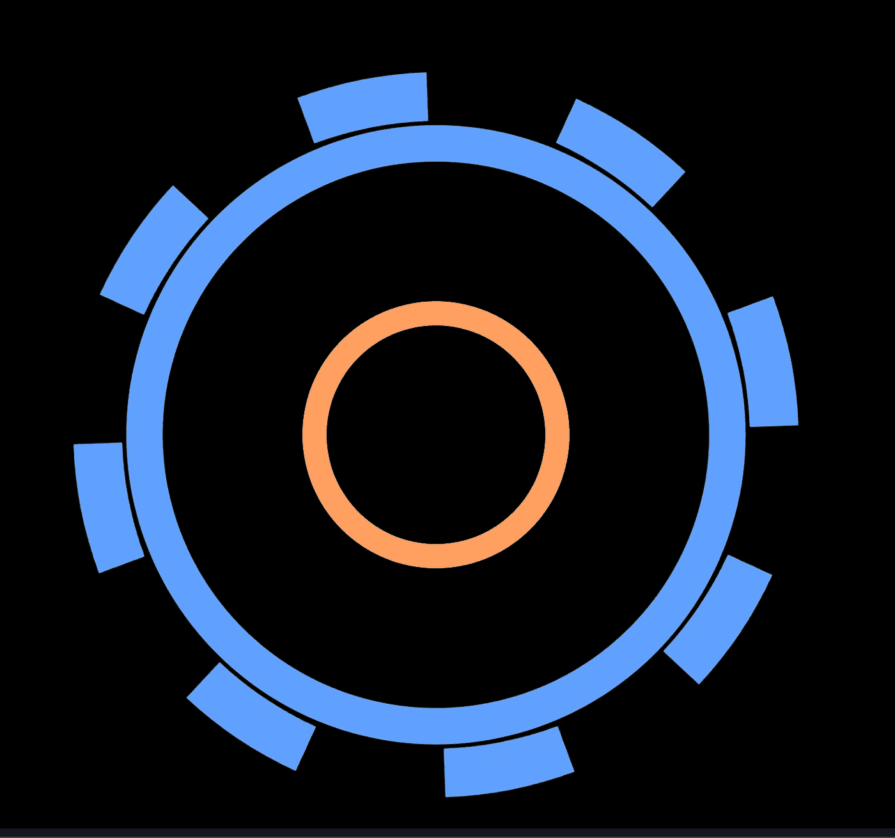

# SVG 齿轮图标

> 原文：<https://itnext.io/svg-gear-icons-f9a33c7d91b?source=collection_archive---------3----------------------->

## 如何用可缩放矢量图形创建齿轮

## 对图标使用 SVG

可缩放矢量图形是一种为 web、移动设备等创建图标资源的优秀语言。在本文中，我们将简要回顾 SVG 的语法，并探索如何使用 circle 和 arc 函数来创建齿轮。

用 SVG 创建的图标可以直接在许多应用程序中使用，也可以用 ImageMagick [convert](https://imagemagick.org/script/convert.php) 命令行工具等工具转换成 PNG 或其他格式。这使得 SVG 对于制作各种各样的图形资源非常有用和高效。

## SVG 语法

任何有 HTML 经验的人都会熟悉 SVG 的语法，因为它们都是基于 XML 的。SVG 文件应该有扩展名`.svg`，并以包含`xmlns`和`viewBox`属性的`**svg**`声明开始。

`[viewBox](https://developer.mozilla.org/en-US/docs/Web/SVG/Attribute/viewBox)`定义了`min-x`、`min-y`、`width`和`height,`，它们共同指定了视口的零参考点和尺寸。图形元素使用标签定义，具有几何图形和样式的属性。

为了绘制齿轮图标，将使用`<path>`和`<circle>`。使用`<g>`标签将路径元素组合成一个实体，允许每个元素继承组中定义的样式和转换。在`path`数据中，用`**M**`将光标移动到起点，然后用`**A**`命令画出一条弧线。

## Gear SVG 源

齿轮画布定义为有`64x64`个单元，在`0,0`处有一个`x/y`:

齿轮的内圆和外圆由`<circle>`定义，包含笔画颜色和宽度、填充(透明)、x/y 位置和半径的属性。每个圆圈被放置在`32x32`(T2 网格的中心)，较小的橙色圆圈有`r=10`，较大的蓝色圆圈有`r=24`。

齿轮齿在`<g>`标签中定义，该标签设置颜色、描边宽度和组的最终整体旋转。其中每一个都被定义为一个弧，起点为`32, 4`(靠近画布顶部)，x/y 半径值为`32, 32`，并扫掠到点`42, 6`。

每个圆弧都画在相同的位置，然后使用[旋转](https://developer.mozilla.org/en-US/docs/Web/CSS/transform-function/rotate())变换旋转到所需的位置，这大大简化了过程。

> 更多关于在 SVG 中定义路径的语法，请看 Mozilla 的[这一页。](https://developer.mozilla.org/en-US/docs/Web/SVG/Tutorial/Paths)

## 结论

SVG 对于从头开始创建图标和其他图形资源非常有用，并为制作复杂的形状和插图提供了强大的功能。

关注我，获取更多关于计算机图形和其他主题的教程。祝你下一个项目好运，感谢你的阅读！

~8 位黑客