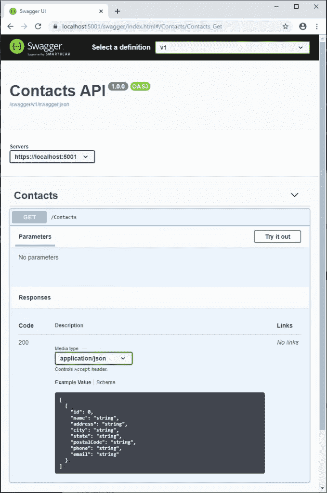

# 带有 NSwag 和 ASP.NET 核心 3 的 Swagger/OpenAPI

> 原文：<https://itnext.io/swagger-openapi-with-nswag-and-asp-net-core-3-43efb2055251?source=collection_archive---------2----------------------->

现在。NET Core 3 已经发布了，我认为这是一个重新审视使用 Swagger/OpenAPI 公开 API 文档的好时机。在过去，我写过关于使用 [Swashbuckle 来揭露 Swagger 文档](https://elanderson.net/2017/10/swagger-and-swashbuckle-with-asp-net-core-2/)的帖子，但是为了这篇帖子，我打算试用 [NSwag](https://github.com/RicoSuter/NSwag) 。

## 什么是 OpenAPI vs Swagger？

引用[招摇过市的文件](https://swagger.io/docs/specification/about/):

> **OpenAPI 规范**(原 Swagger 规范)是 REST APIs 的 API 描述格式。OpenAPI 文件允许你描述你的整个 API。API 规范可以用 YAML 或 JSON 编写。这种格式易于学习，对人和机器都可读。
> 
> **Swagger** 是一套围绕 OpenAPI 规范构建的开源工具，可以帮助你设计、构建、文档化和消费 REST APIs。

## 什么是 NSwag？

引用 [NSwag GitHub 自述](https://github.com/RicoSuter/NSwag):

> NSwag 是 Swagger/OpenAPI 2.0 和 3.0 工具链，用于。网，。NET Core，Web API，ASP.NET Core，TypeScript (jQuery，AngularJS，Angular 2+，Aurelia，KnockoutJS 等等)等平台，用 C#写的。 [OpenAPI/Swagger 规范](https://github.com/OAI/OpenAPI-Specification)使用 JSON 和 JSON 模式来描述 RESTful web API。NSwag 项目提供了从现有的 ASP.NET Web API 控制器生成 OpenAPI 规范的工具，以及从这些 OpenAPI 规范生成客户端代码的工具。

关于 NSwag 的一个巧妙之处是，除了 OpenAPI 规范之外，它还有工具来帮助生成 API 消费者端。

## 示例项目

在这篇文章中，我通过。NET CLI 使用以下命令。并不是说所有这些都可以通过 Visual Studio UI 来完成，如果这是您的偏好。

```
dotnet new webapi
```

对我来说，这个项目将是一个新系列文章的开始，所以我还添加了一个解决方案文件，并添加了上面创建的项目。这些命令是可选的。

```
dotnet add sln
dotnet sln add src\ContactsApi\ContactsApi.csproj
```

## 添加 NSwag

在与项目文件相同的目录中使用 CLI，使用以下命令添加对 **NSwag 的引用。AspNetCore** 到项目。

```
dotnet add package NSwag.AspNetCore
```

接下来，在您喜欢的编辑器中打开我们创建的项目/目录，并打开 **Startup.cs** 文件。在**配置服务**功能中添加**服务。addopenapodocculation**。

```
public void ConfigureServices(IServiceCollection services)
{
    services.AddControllers();
    services.AddOpenApiDocument();
}
```

然后在**末尾配置**功能添加对 **app 的调用。使用 OpenApi** 和 **app。使用 swaggeri 3**。

```
public void Configure(IApplicationBuilder app, IWebHostEnvironment env)
{
    if (env.IsDevelopment()) app.UseDeveloperExceptionPage();

    app.UseHttpsRedirection();
    app.UseRouting();
    app.UseAuthorization();

    app.UseEndpoints(endpoints =>
    {
        endpoints.MapControllers();
    });

    app.UseOpenApi();
    app.UseSwaggerUi3();
}
```

注意，NSwag 也支持 [ReDoc](https://github.com/Rebilly/ReDoc) ，如果你喜欢它胜过 [Swagger UI](https://github.com/swagger-api/swagger-ui) 。

## 样本模型和控制器

现在我们已经安装了 NSwag，让我们为它创建一个新的端点来显示。按照我的标准，我将以联系人为例进行说明。首先我创建了一个**模型**目录，然后在其中添加了下面的**联系人**类。

```
public class Contact
{
    public int Id { get; set; }
    public string Name { get; set; }
    public string Address { get; set; }
    public string City { get; set; }
    public string State { get; set; }
    public string PostalCode { get; set; }
    public string Phone { get; set; }
    public string Email { get; set; }
}
```

接下来，在**控制器**目录中添加一个 **ContactsController** ，它在下面的代码中返回 5 个普通联系人的列表。

```
[ApiController]
[Route("[controller]")]
public class ContactsController : ControllerBase
{
    private readonly ILogger<ContactsController> _logger;

    public ContactsController(ILogger<ContactsController> logger)
    {
        _logger = logger;
    }

    [HttpGet]
    public IEnumerable<Contact> Get()
    {
        return Enumerable.Range(1, 5).Select(index => new Contact
        {
            Id = index,
            Name = $"Test{index}",
            Address = $"{index} Main St.",
            City = "Nashville",
            State = "TN",
            PostalCode = "37219",
            Phone = "615-555-5555",
            Email = $"test{index}@test.com"
        });
    }
}
```

## 结果

运行您的项目，然后在浏览器中导航到您的基本 URL /swagger。例如 my for my project 即[**https://localhost:5001/swagger**。](https://localhost:5001/swagger.)你应该会看到类似下面这样的东西，这将让你探索你的 API，甚至使用你在 UI 中看到的**试用**按钮来执行针对你的 API 的请求。



## 包扎

就像使用 Swashbuckle 一样，NSwag 使得开始提供 API 文档变得非常容易。这篇文章只讲述了最基本的内容，我期待着深入了解 NSwag 的一些更高级的特性，比如客户端生成。

微软的 docs 网站上有一篇关于 NSwag 入门的文章，我推荐阅读。这是我计划在未来介绍的一些东西的预览，但是有一些属性可以添加到控制器中，帮助 NSwag 提供关于 API 可以返回什么的更好的细节，并且微软有一个关于使用 web API 约定的文档，使得应用一些通用约定变得容易。

*原载于* [*埃里克·安德森*](https://elanderson.net/2019/10/swagger-openapi-with-nswag-and-asp-net-core-3/) *。*