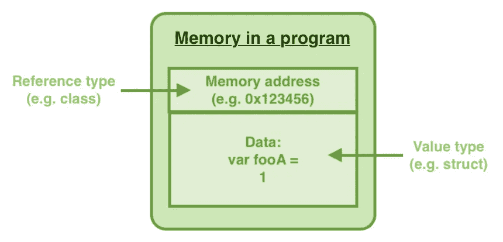
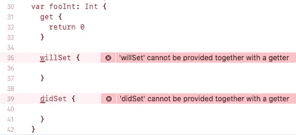

# Swift 101 —基本属性

> 原文：<https://itnext.io/swift-101-basic-property-92f02256dc07?source=collection_archive---------2----------------------->

在 Swift world 中，有`class`、`struct`、`enumeration`等多种数据类型。他们的区别是什么？`class`在**引用类型**中，但`struct`在**值类型**中。

每个财产可以分为**存储财产**和**计算财产**。第一个有一个固定值，但是后者的值是在每次访问时计算的。此外，Swift 为用户提供了一些观察者来监听值变化回调— `**willSet**`和`**didSet**`。

以上术语都是初学者的常见挑战。在本文中，我将简要介绍它们并指出一些技巧。希望这对你有用。

# 引用类型(类)与值类型(结构)

`Class`和`Struct`是 Swift 中的两种主要内存类型。`Class`在**引用类型**中，指向内存的**内存地址**，但`struct`在值类型中，**指向存储在内存地址的数据**。

因此，常量`class`实例有一个常量内存地址，它的变量数据可以随时改变。然而，常量`struct`实例有常量数据但有变量地址。参考第 15 行，当常量结构的数据被改变时，它将抛出一个编译错误。

`Struct`推荐首选。然而，当代码被设计为子类并且必须由 Objective-C 代码访问时，开发人员应该选择`class`。

# 计算属性— Getter 和 Setter

计算属性是一个特殊的属性，它有一个 getter 函数和一个 setter 函数。它的值是由 getter 函数在每次被访问时确定的(见第 15 行),而不是一个具有固定值的存储属性。当值改变时，Setter 函数被调用(见第 19 行)。

常见的用例是使用持久存储进行数据处理。getter 函数可以从存储器中检索数据，setter 函数可以直接将数据设置到存储器中。它可以大大简化代码。

Setter 函数在 computed 属性中是可选的。当计算属性中没有 setter 函数时，它被视为只读属性。

# 观察者— willSet 和 didSet

`willSet`和`didSet`是观察变量数据变化的另一个有用代码。

`willSet`在数据实际更改之前被调用，它有一个默认常量`newValue`，显示将要设置的值。

数据存储后立即调用`didSet`，它有一个默认常量`oldValue`，显示被覆盖的前一个值。

`willSet`和`didSet`不能用于计算属性，因为`set`函数已经覆盖了它们的功能，实际上`getter`只能存储属性不能设置！

# 懒惰的财产

`lazy`是一个很棒的关键字，它可以将对象的初始化推迟到第一次被访问的时候。当初始化过程很长或消耗内存时，这很有用。

在第 13 行，`lengthyClass`实例被初始化，日志被打印 100000000 次。然而，`lazyLengthyClass`实例被标记为`lazy`，直到在第 22 行的`viewDidLoad`方法中被访问，初始化过程才被调用。

# 摘要

1.  引用类型实例指向内存地址，而不是数据
2.  值类型实例指向数据，但不指向地址
3.  当计算属性被访问和改变时，Getter 和 setter 函数被调用。
4.  `willSet`和`didSet`在存储的属性改变之前和之后被调用。
5.  `lazy`实例在第一次被访问之前不会被初始化。

# 参考

## 1.Swift Properties 官方文档

 [## 属性-Swift 编程语言(Swift 5.3)

### 属性将值与特定的类、结构或枚举相关联。存储属性存储常数和…

docs.swift.org](https://docs.swift.org/swift-book/LanguageGuide/Properties.html) 

## 2.毛毛. es

 [## 理解引用和值类型

### 最近我在 r/swift 中偶然发现了一个 Reddit 线程，其中一个用户对为什么他的代码的输出感到困惑…

毛毛. es](https://fluffy.es/reference-vs-value-type/) 

## 3.苹果博客——价值和参考类型

 [## 价值和参考类型- Swift 博客

### Swift 中的类型分为两类:第一类是“值类型”，其中每个实例都保留其…

developer.apple.com](https://developer.apple.com/swift/blog/?id=10#:~:text=Types%20in%20Swift%20fall%20into,usually%20defined%20as%20a%20class) 

## 4.在结构和类之间选择

 [## Apple 开发者文档

### 编辑描述

developer.apple.com](https://developer.apple.com/documentation/swift/choosing_between_structures_and_classes) 

欢迎您通过[Twitter @ my rik _ chow](https://twitter.com/myrick_chow)关注我，了解更多信息和文章。感谢您阅读这篇文章。祝您愉快！😄