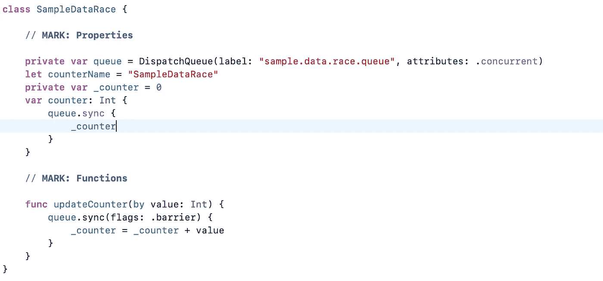
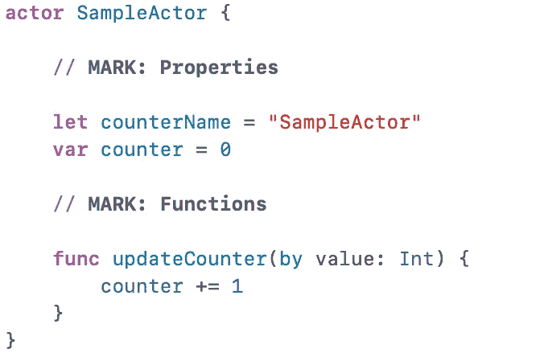
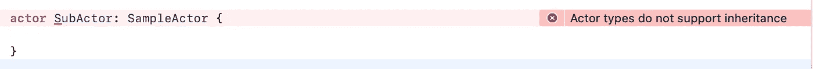
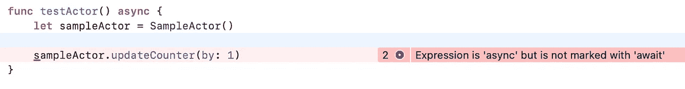
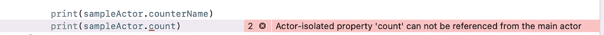
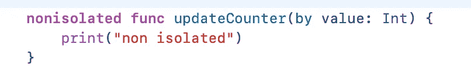

# Swift 中的演员

> 原文：<https://itnext.io/swift-actors-e80ff0dc1832?source=collection_archive---------0----------------------->

## Swift 新的并发编程将我们带到了编码风格的下一个层次。

西蒙·赫里在[上拍照](https://unsplash.com?utm_source=medium&utm_medium=referral)

Swift 中的 Actors 是 Swift 编程世界中处理数据竞争和并发问题的一个很酷的附加功能。在进一步讨论 Swift Actor 之前，我们需要了解数据竞争以及[线程杀毒器](/thread-sanitizer-in-ios-8438ee3c8c76)如何帮助我们找到它。当多个线程访问同一个内存时，会发生数据竞争，例如，一个线程读取值，另一个线程写入值。这种数据竞争导致灾难性的崩溃和难以调试和解决的不可预测的功能问题。幸运的是，Xcode 中的 Thread Sanitizer 帮助我们找到这种数据竞争，并通过更新我们的逻辑或代码来解决它。如果你没有听说过螺纹消毒剂，请看看我关于[螺纹消毒剂的简单报道](/thread-sanitizer-in-ios-8438ee3c8c76)[这里](/thread-sanitizer-in-ios-8438ee3c8c76)。

Swift 5.5 提供了许多好的补充，让我们在这篇文章中详细讨论 Swift 中的演员。这将减轻 iOS/Mac 开发人员高效处理多线程用例的负担。

## 以前是如何处理数据竞争的？

在 Swift Actor 之前，为了处理数据竞争，我们需要改变我们的设计或实现，或者我们需要使用带锁的 DispatchQueue 来避免写和读同时发生。这是一个示例类，我们用栅栏锁处理数据竞争。

使用调度队列和锁处理数据竞争

如果我们阅读上面的示例类，我们已经做了相当多的事情来避免数据竞争。我们有一个队列，它有一个屏障标志，当它被另一个线程写入时，它停止读取。为了同步更新或读取，我们还有一个私有属性。我们心中也会有一些问题，比如，我们需要使用哪个锁，以及属性数量的队列数量？。演员在 Swift 正在从 iOS 15 和 Swift 5.5 让我们的生活更简单。

让我们看看 Swift Actor 的相同用例。简单干净。不是吗？

这里简化了相当多的代码，并且没有带锁的调度队列，这使得我们可以编写清晰的代码并容易理解。在幕后，Swift Actor 通过优化同步过程来强制编译器进行同步访问，并防止我们在不知不觉中引入数据竞争。好了，让我们来了解或多了解一下斯威夫特演员。

> **注意:**如果您的应用支持 iOS15 以下版本，您需要有回退逻辑来处理数据竞争，因为 Swift actors 仅从 iOS 15 开始可用。

## 什么是雨燕演员？

actor 中的 Swift 与 class 或 struct 相同，我们可以像下面这样用关键字“actor”定义 actor。

swift 演员声明

好的，这里我们的大脑开始问这个参与者是值类型还是引用类型。因为这在数据竞赛中扮演着重要的角色。swift 中的 Actor 是一个类似类的引用类型。因此，每当副本发生变化时，原始副本也会发生变化。那么，有什么区别呢？。是的，这里有一些阶级和演员的区别。Actor 不支持继承，因此我们将没有覆盖，方便初始化和所有。

Swift actor 不支持继承。

然而，最大的区别是隔离数据访问。

## 从参与者访问数据:

好的，现在让我们看看如何从演员那里获取数据。
如果我们像往常一样尝试访问 actor，编译器会抛出如下错误。

从 swift actors 访问数据

访问参与者的可变属性

因为我们不确定何时授予读/写访问权限。因此，swift 推出了新的 async。因此，我们可以使用 await 和 async，它将序列化我们对数据的访问。这么容易不是吗:)。计算属性也会出现这种错误，但常量不会出现，因为常量属性不会发生数据竞争

## 隔离访问与非隔离访问？

Swift Actors 有两种类型的访问:隔离访问和非隔离访问。默认情况下，actor 中的所有访问都是隔离的，以防止数据竞争。我们可能会遇到这样的用例，比如我们希望拥有一些我们确信不会有数据竞争的函数。那么在那里使用 async/await 是没有意义的。在这种情况下，我们可以将该方法标记为非 SOA。

swift actors 中的非隔离访问

想了解更多关于@MainActor in Swift 的信息吗？[请查看我的文章，了解@ swift](https://devcracker.medium.com/mainactor-in-swift-detailed-walkthrough-94044c83118b)中的 MainActor。

从[这里](https://devcracker.medium.com/membership)升级您的中级会员资格，阅读大量文章并提升您的技能。