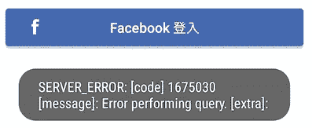
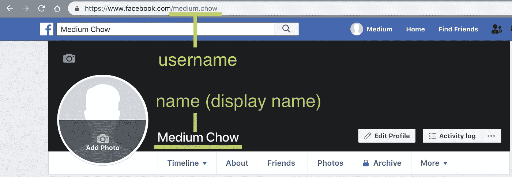
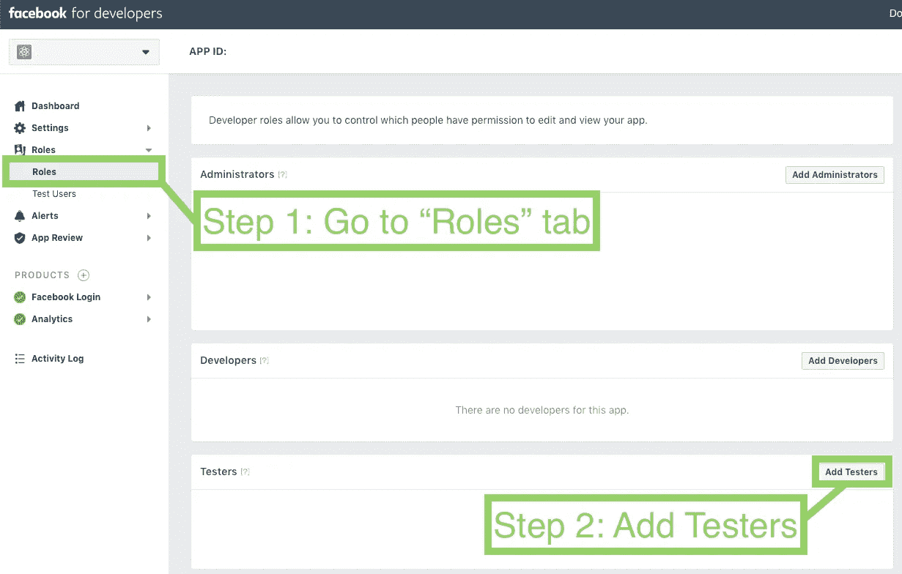
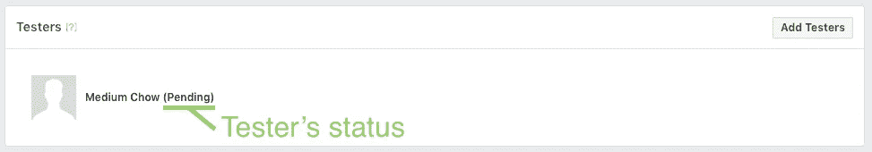
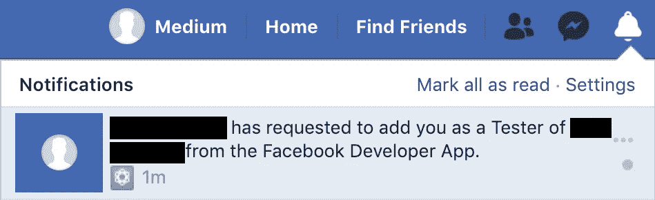
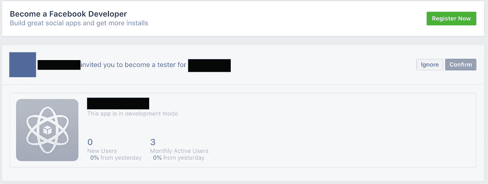
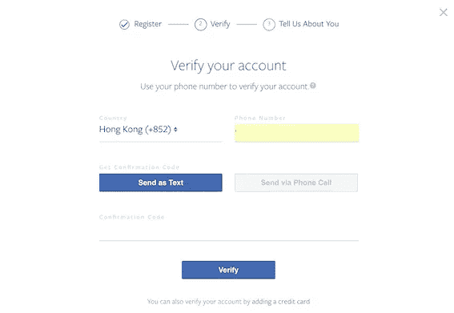
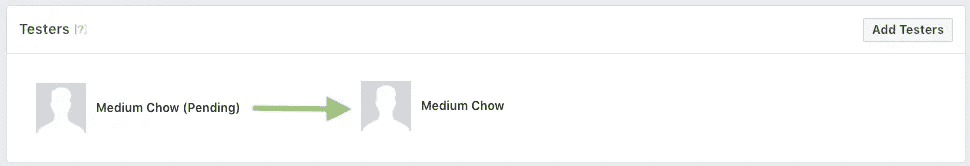

# iOS 和 Android 脸书 SDK 登录错误

> 原文：<https://itnext.io/swift-android-facebook-sdk-login-error-4659c18c264b?source=collection_archive---------2----------------------->


acebook 登录是许多应用程序的一个常见功能，但开发人员有时会对脸书登录 SDK 返回的错误代码感到困惑。本文将经历其中一个错误代码`1675030` — **查询错误(用户不是测试人员)**。

F 首先，在脸书开发者控制台中有四种类型的角色:

1.  管理人员
2.  开发者
3.  试验装置
4.  分析用户

然而，在**开发阶段**，只有**管理员**、**开发人员**和**测试人员**被允许测试脸书登录功能。不属于这些类别的人会失败，并出现以下错误:

**Android Studio 错误日志:**

```
E/fb4a.GraphServiceQueryExecutor: query error
```

**应用截图:**



从 Android 版本捕获的屏幕

`Error performing query`对用户或开发者来说都不是一个明确的信息。经过研究，根本原因是**用户不是脸书开发者控制台**的注册测试人员。参见下面的步骤将他添加为测试员:

# 步骤 1:找到测试人员的脸书用户名

首先，确保你明白脸书世界中`username`和`name`的区别。

1.`username`是代表您个人资料的唯一标识符。它也是指向您的脸书页面的 url 路径的一部分。

2.`name`是您的脸书账户的显示名称，不必唯一。

你必须找到测试者的`username`，只要简单地进入他的脸书页面，复制`[https://www.facebook.com/](https://www.facebook.com/.)` [之后的所有内容。](https://www.facebook.com/.)



# 步骤 2:将他的脸书帐户添加到测试人员列表中

您(管理员)必须转到**脸书开发者控制台**并从左侧菜单导航到`Roles`选项卡。然后在`Testers`会话中点击`Add Testers`按钮:



接着输入在步骤 1 中找到的`username`:


成功邀请测试人员后，测试人员列表将更新如下:



更新“测试者”列表

# 步骤 3:要求测试人员接受成为测试人员的邀请

将会有一个**邀请**发送到测试者的脸书账户。测试人员可以通过在**脸书页面**查看他的通知来查看邀请。



测试人员必须接受邀请，首先注册成为**脸书开发者**。



注册脸书开发商很简单，只需要你的电话号码。



验证过程结束后，接受邀请的`Confirm`按钮将被激活。按下**，所有步骤完成**，然后测试仪可以顺利测试脸书登录功能。

作为管理员，您可以在脸书开发者控制台查看测试人员的更新状态。如果测试者接受邀请，则`Pending`状态将被取消(见下图)。然而，如果测试仪忽略了邀请，则**整个测试仪条目**将被删除。



# 摘要

作为一名脸书测试人员，测试脸书 SDK 中的所有特性是必要的。作为一名开发人员，脸书开发人员控制台的设置经常被忽视。我们应该关注脸书 SDK 的实现和脸书开发者控制台的设置，因为它们彼此密切相关。

希望这篇文章能帮你解决你的问题！如需了解更多信息，请在[Twitter @ myrik _ chow](https://twitter.com/myrick_chow)关注我。感谢您阅读这篇文章。祝您愉快！😄