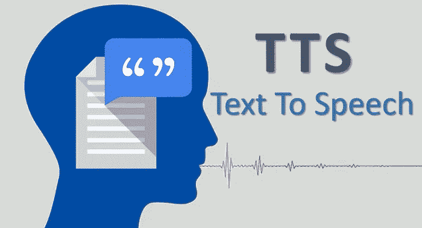
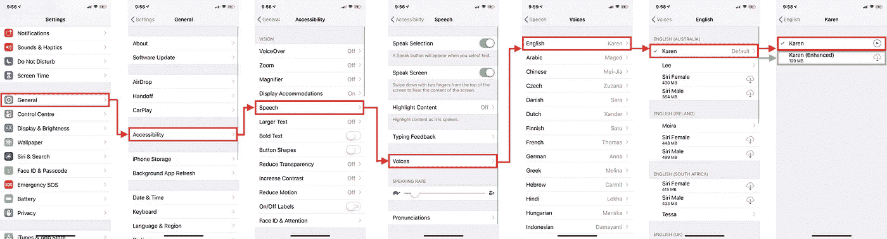
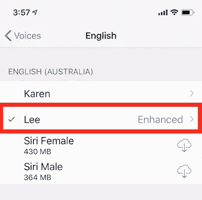
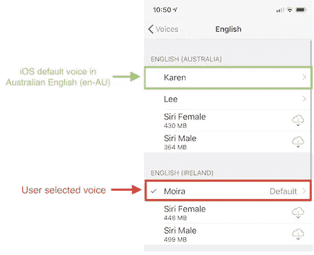
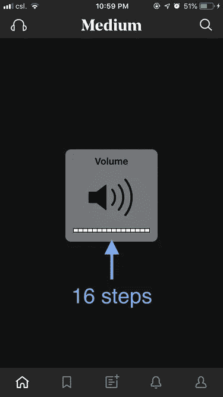
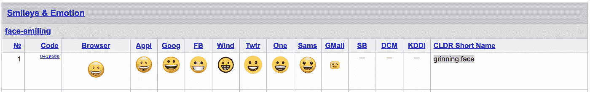
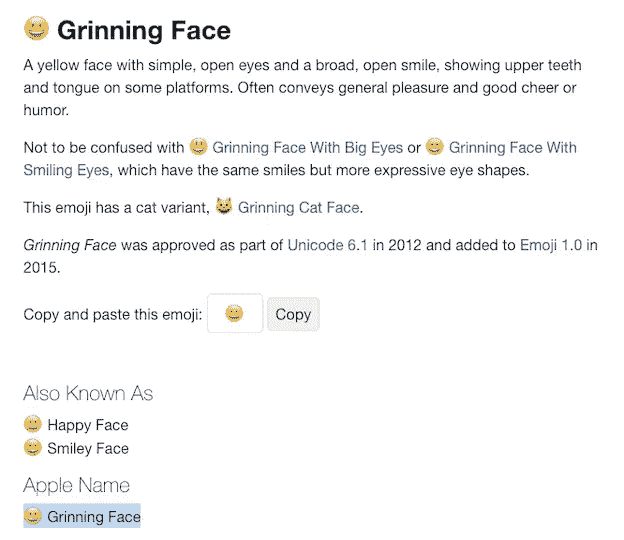
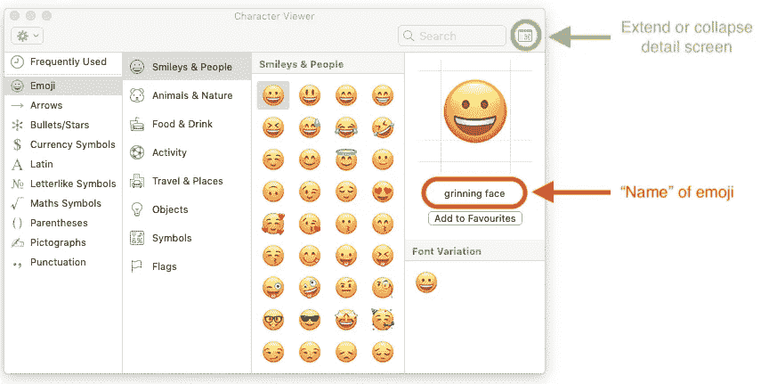

# 尽可能深入的快速文本到语音转换工具

> 原文：<https://itnext.io/swift-avfoundation-framework-text-to-speech-tool-f3e3bfc7ecf7?source=collection_archive---------2----------------------->



H 有没有想过把文字转换成语音供盲人使用 app？苹果在 iOS 和 MacOS 系统中都做了一个很棒的 [**VoiceOver**](https://www.apple.com/accessibility/iphone/vision/) 功能，通过提供**音频反馈**帮助盲人使用应用程序。幸运的是，苹果公司还为开发者开放了文本到语音的功能。API 是`AVSpeechSynthesizer`，属于`AVFoundation`框架。本文将讨论使用该 API 时的**细节**和**陷阱**。

让我们先对整篇文章有个大概的印象:

# 语音合成器

`AVSpeechSynthesizer`是:

1.  在`AVFoundation`框架下
2.  从 iOS 开始可用`7.0`

它提供了与语音相关的功能:

1.  玩
2.  中止
3.  继续(仅针对暂停的演讲)
4.  停止

**重要属性:**

1.  一个队列`AVSpeechUtterance`，包含一组语音参数:
    1.1 文本
    1.2 语音
    1.3 速率
    1.4 音高乘数
    1.5 音量(应该更好地命名为“相对音量”)
    1.6 发声前延迟
    1.7 发声后延迟
2.  带有 **6** 语音回调的`AVSpeechSynthesizerDelegate`对象:
    2.1 did start
    2.2 did finish
    2.3 did pause
    2.4 did continue
    2.5 did cancel
    2.6 willSpeakRangeOfSpeechString

# AVSpeechUtterance

制作一个 `VSpeechUtterance`用于存储 **7 个语音参数**，这些参数在上述会话中声明。最后会传到`AVSpeechSynthesizer`输出语音。参见以下代码:

**注 1:** 当多个`AVSpeechUtterance`实例传递到`AVSpeechSynthesizer`时，它们不会同时**输出**，而是**排队**逐个输出。

**注 2:**
iOS 中的音频通道每次只允许**一个音源**。当一个`AVSpeechSynthesizer`实例正在输出语音时，任何其他`AVSpeechSynthesizer`实例都不能中断它。来自其他`AVSpeechSynthesizer`实例**的`speak()`请求被完全忽略，没有任何运行时错误和警告**。开发人员应该记住这一点。

## AVSpeechUtterance 参数 1:文本

T4 框架非常强大，可以识别许多不同的文本格式。见下文的文本和相应的发音:

1.  **纯文本**——“Hello world”:“Hello world”
2.  **表情符号**——《❤️》:“红心”
    **它的发音应该和*[*unicode consortium*](https://unicode.org/emoji/charts/full-emoji-list.html#1f603)*或*[*emojipedia*](https://emojipedia.org/)*里说的一样。但是，* ***并不是每一个*** *表情符号发音都能和官网上说的吻合。例如，“*😀*在 iOS 中读作* **龇牙咧嘴眼睛正常的脸**，在[表情百科](https://emojipedia.org/smiling-face-with-open-mouth/) *中读作**咧开嘴的脸**。这将在本文的后面部分讨论。*
3.  **前缀单位(美元)**—“$ 100.99”:“一百美元九十九美分”
4.  **后缀单位(厘米)——**“10 厘米”:十厘米
5.  **未发现词—**“hdbjfcng”:“H-D-B-J-F-C-N-G”

它可以大大减少开发人员将特殊字符或短语解析成可理解的语音的责任。

## AVSpeechUtterance 参数 2:语音

世界上有许多不同的语言，每一种语言在不同的国家都有不同的口音。以英语(en)为例，iOS 中总共有 **5 种支持的英语口音**。它们是:

1.  英国英语
2.  美国英语
3.  澳大利亚英语
4.  爱尔兰英语
5.  南非英语(en-ZA)

苹果公司通过在 iOS 中提供 [52 首默认音轨](https://gist.github.com/myrickchow32/6027dd79b4499daeed91367c0afad11b)来照顾 iOS 用户，并且所有音轨都处于“**紧凑**模式。用户可以手动将音轨升级到“**增强**模式，以获得更好的音质。设置(红色)和升级(绿色)的步骤见下图:



在 iOS 设置中查看和升级语音的步骤

有两种方法可以为`AVSpeechUtterance`的语音参数初始化`AVSpeechSynthesisVoice`对象:

1.  **通过声音标识符(不言自明)**
    可用声音标识符的列表可以通过`AVSpeechSynthesisVoice.speechVoices()`来检索。参见以下代码:

**2。通过语音语言代码**

语言代码可以是**短格式**或**长格式**。

例如，英语:

*   简短形式:“en”
*   长格式:“en-AU”、“en-GB”、“en-IE”、“en-US”、“en-ZA”

初始化的`AVSpeechSynthesisVoice`由 **2 个因子**改变:

*   语言代码类型
*   用户是否对特定的口音有自己的偏好。

**因素 1 —简写/长写语言代码:**

对于长形式的“en-AU”，它直接指向**澳大利亚英语**口音。

然而，**“en”**代表大范畴“英语”，因而**歧义**。其他例子还有**【es】**(西班牙语)**【fr】**(法语)**【nl】**(荷兰语)**【pt】**(葡萄牙语)**【zh】**(中文)。他们指的是哪种特定的口音？这要看苹果做的定义:

*   “en”是指**“en-US”**
*   “es”是指**“ES-ES”**
*   “fr”是指**“FR-FR”**
*   “nl”是指**“NL-NL”**
*   “pt”是指**“PT-PT”**
*   “zh”是指**“zh-CN”**

**因素 2:用户对语言类别的偏好**

每个语言类别可能包含**一个重音列表**。以“英语”为例，有 5 种口音:

1.  英式英语
2.  美国英语
3.  澳大利亚英语( **en-AU**
4.  爱尔兰英语
5.  南非英语

如果在“en-AU”类别中，`AVSpeechSynthesisVoice(language: "en-AU")`将返回用户选择的音轨。



但是，用户可以选择除输入的语言代码**“en-AU”**之外的另一种口音，即**“en-US”或“en-GB”或“en-IE”或“en-ZA”。在这种情况下，iOS 会将“en-AU”口音的**系统默认声轨**返回给你，即“Karen”，这是固定的。**

****

****注意:**如果存在，将返回默认音轨的增强版本。**

**以下是所有英语口音的系统默认音轨列表:**

1.  **英国英语(en-GB)——**丹尼尔****
2.  **美国英语(en-US)——**萨曼莎****
3.  **澳大利亚英语——卡伦**
4.  **爱尔兰英语**
5.  **南非英语(en-ZA)——**泰莎****

## **AVSpeechUtterance 参数 3:音量**

**Vvolume 参数是**相对于设备体积的相对体积**，范围从`0.0`到`1.0`。**

****在 iOS 12 中****

*   **共 16 个音量级别**
*   **每个级别占最大音量的 6.25%。**

****

**卷页面的 iOS 屏幕截图**

****示例**:**

*   **第八音量级别由用户选择**
*   **`volume`参数设置为`0.5`**
*   **实际输出音量:
    8 * 0.5 =第四级音量(4 * 6.25% =最大音量的 25%)**

**这可以防止 iOS 应用程序设置的音量**大于用户首选设备的音量**。**

## **AVSpeechUtterance 参数 4:速率**

**T42 ate 控制语音输出的速度。范围从`0.0`到`1.0`，默认值为`0.5`。**

## **AVSpeechUtterance 参数 5: PitchMultiplier**

**itchMultiplier 控制每个单词发音的清晰度。范围从`0.5`到`2.0`，默认值为`1.0`。**

**如果设置太低，**女声音轨听起来会像男声！**因此，该参数应小心处理，甚至干脆忽略。**

## **AVSpeechUtterance 参数 6 & 7:preutterancedlay & postuterancedlay**

**Preuterancedelay 是启动电流`AVSpeechUtterance`之前的时间延迟，`postUtteranceDelay`是相反的意思。**

****切记:**
两次连续发言之间的总延迟
=
`postUtteranceDelay`**上一次** `AVSpeechUtterance` +
`preUtteranceDelay`下一次**`AVSpeechUtterance`。****

# ****语音操作****

****`AVSpeechSynthesizer`中提供了 **4** 语音操作:****

1.  ****玩****
2.  ****中止****
3.  ****继续****
4.  ****停止****

## ****操作 1 —播放:****

****P 铺设语音轨道很简单。只是将`AVSpeechUtterance`对象传递给`AVSpeechSynthesizer`实例的`speak()`。****

****注意多次调用`speak()`**不会拦截当前播放的语音**。所有新添加的音轨都在**队列**中逐一输出。****

****如果要覆盖当前播放的音轨，必须先用`stop()`停止。****

## ****操作 2 —暂停:****

****2 选项可用于暂停正在播放的语音。它们是:****

1.  ******avspeechboundary . immediate**
    语音在当前发音处暂停。****
2.  ****语音在整个单词的最后一个发音时暂停****

******示例**:****

*   ****原话:“中”****
*   ****发音:“**我**”—“**迪**”—“**嗯**”****
*   ****AVSpeechBoundary.immediate 可以在“ **Me** ”或“ **Di** ”或“ **Um** ”处停止讲话****
*   ****AVSpeechBoundary.word 只能在“ **Um** 处停止语音****

## ****操作 3 —继续:****

****只有当**暂停**而**没有** **停止**时，演讲才能继续。****

## ****操作 4 —停止:****

****S 与`pause()`类似，有 2 个选项可以停止正在播放的语音。它们是:****

1.  ****AVSpeechBoundary.immediate****
2.  ****AVSpeechBoundary.word****

******注意:**停止的发言**无论如何都不能恢复**。如果可能的话，考虑暂停演讲。****

# ****AVSpeechSynthesizerDelegate****

****一个 VSpeechSynthesizerDelegate 共提供了 **6 个** **回调**，用于显示`AVSpeechSynthesizer`在输出语音时的不同状态。它们是:****

1.  ****开始了****
2.  ****完成****
3.  ****停顿****
4.  ****继续吗****
5.  ****取消****
6.  ****willSpeakRangeOfSpeechString****

## ****案例 1 —将演讲播放到结尾:****

1.  ****播放演讲(didStart)****
2.  ****完成演讲****

## ****案例 2——播放和停止演讲:****

1.  ****播放演讲(didStart)****
2.  ****停止演讲****

## ****案例 3——播放和继续演讲:****

1.  ****播放演讲(didStart)****
2.  ****暂停演讲****
3.  ****继续演讲****
4.  ****直到演讲结束(didFinish)****

# ****语音合成器的实用考虑****

## ****考虑 1:英文和其他语言的混合文本****

****If you are targeting your app to global market, it sometimes might contain paragraph mixing with texts in **both English and other languages**. Take below string “**Hong Kong (香港) is in Asia.**” as an example:****

****所有紧凑和增强版本的声音轨道可以处理这种情况相当顺利。然而，由于不同声道的口音不同，你不应该期望每个英语单词都有 100%流利的英语发音。必须有一点点的交换。****

## ****考虑 2:应用程序生命周期中的 iOS 中断 AVSpeechSynthesizer****

****当应用程序被发送到后台(例如，按下 Home 键)时，iOS 自动通过**平滑音量减小**停止`AVSpeechSynthesizer`，当应用程序再次被发送到前台时，通过**平滑音量增大**恢复。开发者可以监控`AppDelegate`类中`**applicationDidEnterBackground**`和`**applicationDidBecomeActive**`的状态。这有助于开发者为用户提供满意的用户体验！****

## ****考虑 3:即使 UIViewController 被解除或弹出，语音也不会停止****

****即使在 UIViewController 被**解除**或**弹出**之后，iOS 仍继续输出语音，因此保存对`AVSpeechSynthesizer`实例的引用。它阻止 UIViewController 去初始化，直到`AVSpeechSynthesizer`完成整个语音。参见以下代码:****

******日志:******

```
**viewDidDisappear
...
(Wait until AVSpeechSynthesizer completes the whole speech)
...
AVFoundationDemoViewController is deinit.**
```

******解决方案:******

## ****考虑四:用音乐 app 打断****

********

*******音乐*** app 在后台时可以输出声音。但是，它与其他应用程序共享相同的音频通道。这意味着当其他应用程序想要使用音频通道输出声音时，音乐音轨将被停止。前台的应用程序在使用音频通道时拥有更高的特权**。但是，当其他应用程序处理音频通道时，iOS 不会恢复原始音乐轨道。UX 的设计者应该注意这对用户体验的副作用。******

## ****考虑 5:表情符号的解释****

********

****如前所述，`AVSpeechSynthesizer`支持表情符号，但苹果对每个表情符号有自己的解释。它与 Unicode Consortium*或[Emojipedia](https://emojipedia.org/) 的文档并非 100%匹配。*****

*****例如，常见的表情符号😀在 iOS 中读作“**带着正常眼睛的狞笑脸**”，但是在 Unicode Consortium 和 [Emojipedia](https://emojipedia.org/grinning-face/) 中的[文档都显示它应该只是“**狞笑脸**”。](https://unicode.org/emoji/charts/full-emoji-list.html#1f603)*****

**********

*****截屏来自[Unicode Consortium](https://unicode.org/emoji/charts/full-emoji-list.html#1f603)关于表情符号😀*****

**********

*****从[表情百科](https://emojipedia.org/grinning-face/)截取的关于表情的屏幕😀*****

*****这时，你们中的一些人可能会认为 Mac 中有一个“**字符查看器**”(**命令+控制+空格**)用于输入表情符号，并且每个表情符号都有一个名称。这是苹果的解释吗？答案是“没有”。的名字😀依然是“狞笑脸”。*****

**********

*****在谷歌搜索了很长时间后，我仍然无法找到任何官方文件显示苹果公司如何解读每个 emoji 符号。如果你能找到任何相关文档，请**在评论区**分享，这将对我有很大帮助。谢谢您们。*****

## *****结论:*****

1.  *****`AVSpeechSynthesiser`可以识别**纯文本**、**表情符号**、**前缀单元**和**后缀单元**。如果选择正确的语音参数，它还可以处理混合了英语和其他语言单词的**句子。*******
2.  *****`AVSpeechSynthesiser`有一个 `**AVSpeechUtterance**` 的**队列，逐个播放**物品，而不是同步播放所有物品。*********
3.  *****需要确认**没有其他** `**AVSpeechSynthesiser**` **实例正在输出语音**，否则输出语音的请求将被忽略，不会出现错误信息。*****
4.  *****`AVSpeechUtterance`中的语音参数根据**输入的语言代码**和**用户选择的特定语言的口音**而变化。*****
5.  *****音量参数确保应用程序输出的音量不会高于当前设备的音量。*****
6.  *****停止的讲话**永远不能恢复**。*****
7.  *****可以在`AppDelegate.swift`中的`**applicationDidEnterBackground**`和`**applicationDidBecomeActive**`处设置`AVSpeechSynthesiser`的自定义逻辑*****
8.  *****有必要**停止**任何活动的`AVSpeechSynthesiser`，以便**成功地对**uiview controller 进行去初始化。*****
9.  *****`AVFoundation`框架对表情符号的解读还**不确定**需要进一步考虑。(发现有用信息请留言。)*****

*****感谢您阅读这篇文章。如需了解更多信息，请在[Twitter @ myrik _ chow](https://twitter.com/myrick_chow)关注我。希望你能更好地理解如何用`AVSpeechSynthesizer`将文本转换成语音！让我们创建一个伟大的应用程序！😊*****