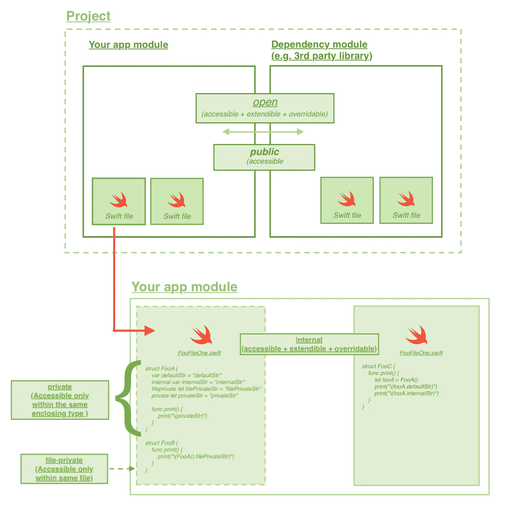
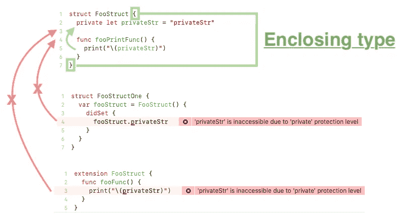
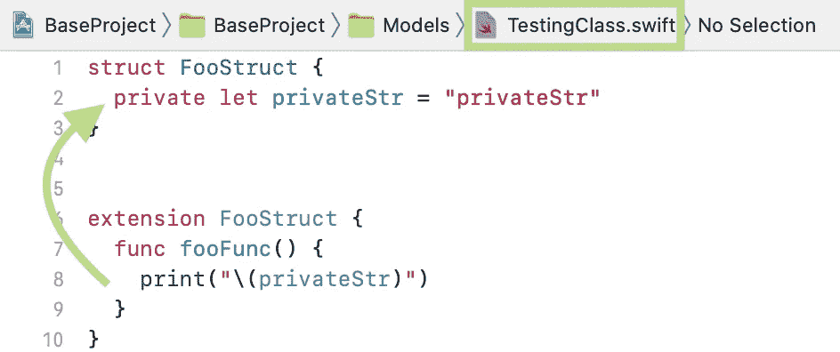
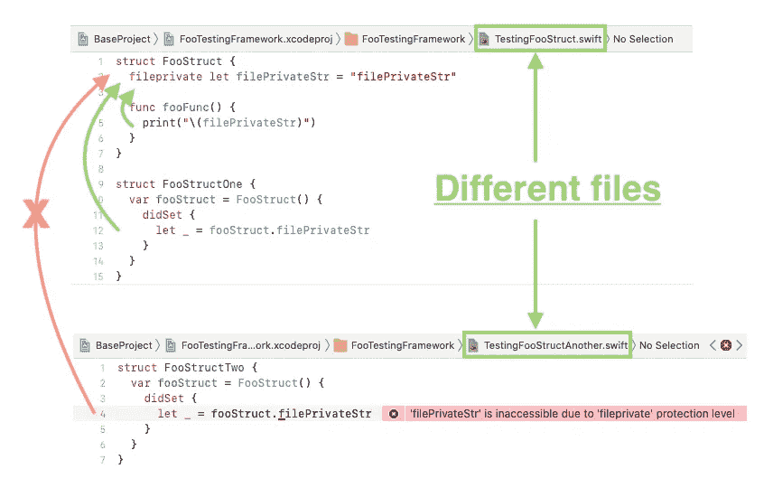
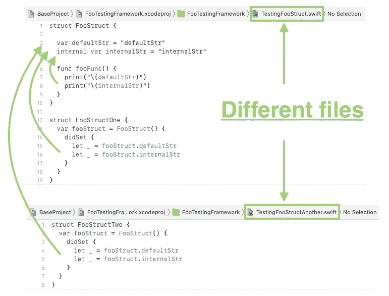
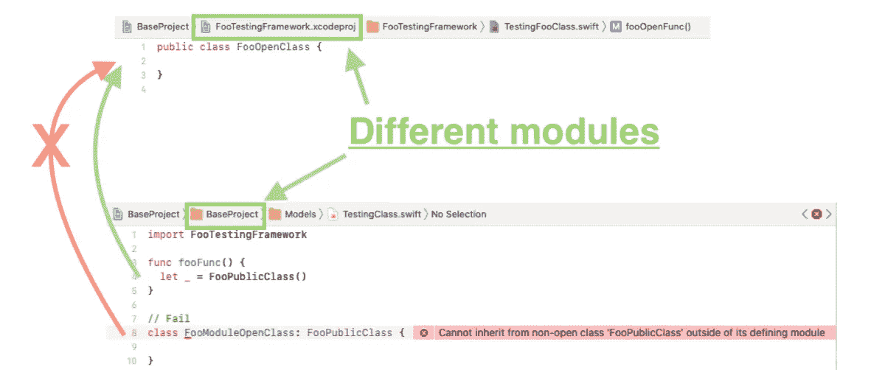
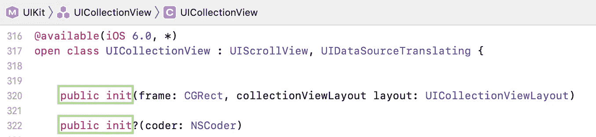
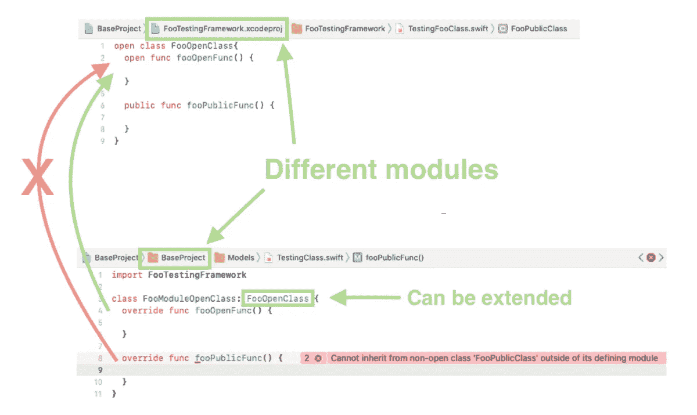
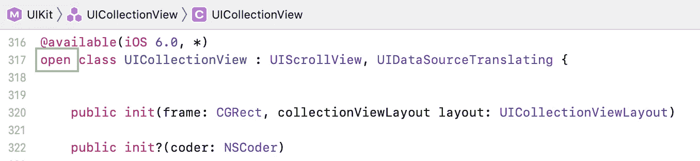

# Swift Basic —访问控制

> 原文：<https://itnext.io/swift-basic-access-control-a7e97ab25006?source=collection_archive---------5----------------------->

wift 为代码提供了不同的可访问级别。它们包括`private`、`fileprivate`、`internal`、`public`和`open`。这个特性可以限制其他开发人员访问、扩展和覆盖创建者的实现。当一个框架/库被创建并在不同的开发者之间共享时，这是很有用的。

在开始之前，有必要对什么是`module`有一个清楚的了解。模块是一个单独的代码分发单元，例如您的应用程序和通过`CocoaPods`安装的第三方。

`open`和`public`用于声明跨不同模块的代码可访问性级别。`internal`、`fileprivate`和`private`用于 Swift 文件级。

# 访问控制—私有

`private`表示声明的代码(`class`、`struct`、`enum`、`property`、`method`等)只能在当前的封闭类型内访问。

`extension`作用域只有在扩展的`class`、`struct`和`enum`的同一个文件中声明，才能访问那些私有属性。

# 访问控制—文件私有

每个 Swift 文件可以包含多个`class`、`struct`和`enum`等。`fileprivate`表示代码只能在同一个 Swift 文件中访问。

# 访问控制—内部(默认)

`Internal`是 Swift world 中默认的访问控制。那些`internal`类可以在同一个模块内自由访问。开发人员甚至可以将其子类化，并覆盖内部的属性和函数。

# 访问控制—公共

`public`表示可以跨不同模块访问的特定`class`，但是**不能**被子类化。

示例用法是一个类的`init`函数，目的是防止其他开发人员进行异常初始化。

# 访问控制—开放

是所有其他访问控制中最不受限制的。所有的`open` `class`都可以被访问和子类化，在模块之间没有限制**。甚至可以覆盖类中的`open`函数和属性。**

例如，`UICollectionView`是一个`open`类，开发者可以创建一个自定义的`UICollectionView`。

# 摘要

访问控制为开发者提供了一个很好的工具来限制不同部分代码的访问权限。当您正在开发 SDK / API 供其他开发人员实现时，这很有用。它们包括:

1.  `private` —最受限制的类型和属性只能在当前封闭类型中访问
2.  `fileprivate` —只能在同一文件中访问
3.  `internal` —这是默认的访问控制，可以在同一个模块内自由访问。
4.  `public` —可以跨不同模块(应用模块和第三方库)访问类，但不能对其进行子类化，也不能覆盖其内容。
5.  `open` —最不受限制的访问控制，其他开发者可以子类化它，覆盖那些开放属性。

要开发一个安全稳定的程序，建议先考虑`private`，在放松访问控制前三思。

# 参考和进一步阅读

1.  关于 Swift 访问控制的官方文件

 [## 访问控制—Swift 编程语言(Swift 5.3)

### 访问控制限制其他源文件和模块中的代码对您的部分代码的访问。此功能支持…

docs.swift.org](https://docs.swift.org/swift-book/LanguageGuide/AccessControl.html) 

欢迎您关注我，在[Twitter @ myrik _ chow](https://twitter.com/myrick_chow)获取更多信息和文章。感谢您阅读这篇文章。祝您愉快！😄