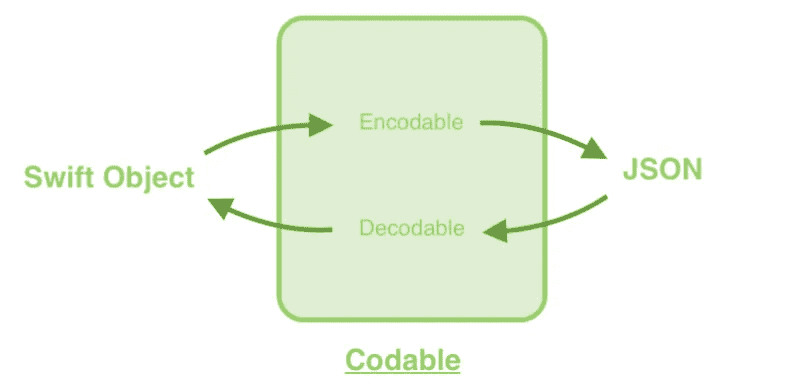
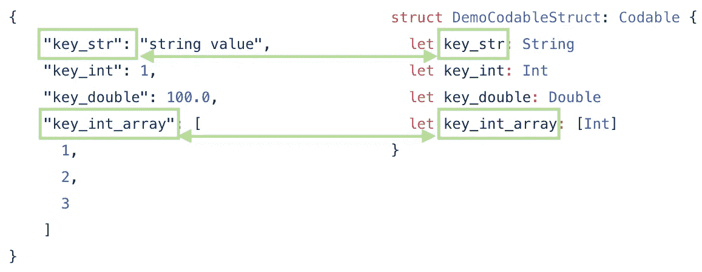

# Swift Codable — JSON 解析器

> 原文：<https://itnext.io/swift-codable-json-parser-8661bb57bea7?source=collection_archive---------2----------------------->

C `odable`是一个可以将 Swift 对象本身转换成和转换出`Data`类型的协议。`Codable`是`Encodable`和`Decodable`协议的类型别名。这是一个易于使用的官方协议，用于将`JSON`对象从服务器解析为 Swift 对象。

`Encodable`用于必须将 Swift 对象序列化并发送到服务器的情况。另一方面，当服务器 JSON 数据需要解序列化时，使用`Decodable`。

此外，符合`Codable`的自定义对象现在可以直接保存到`UserDefaults`和从`UserDefaults`中检索，只需 3 个步骤。它节省了大量的样板代码。

 [## Swift UserDefault —只需 3 步即可保存自定义对象！

### 将自定义对象保存到 UserDefaults 是否困难且繁琐？现在，您只需 3 个主要步骤即可保存和检索它…

medium.com](https://medium.com/@myrickchow/swift-userdefault-save-custom-object-in-3-steps-only-f4dcf76e85b4) 

我们开始吧！

# 基本解析—简单的 JSON

我们以上面的 JSON 为例，试着解析成 Swift 对象。它有 4 个字段，类型为`String`、`Int`、`Double`，数组为`Int`。它们是 JSON 数据中常见的类型。

通过创建一个符合`Codable`的对象，JSON 可以直接解码成 Swift 对象。

默认情况下，Swift 结构中的属性名称映射到 JSON 中的关键字名称。

# 按键定制

按照惯例，JSON 中使用 snake case(例如`foo_key`)而 Swift 语言中使用 camel case(例如`fooKey`)。当一个 snake case 属性出现在一个 Swift 对象中的时候是超级烦人的。因此，Apple 引入了一个`CodingKey`协议来提供除原始属性名之外的自定义映射键。

所有属性都用骆驼字体书写，如`strProp`、`intProp`、`doubleProp`、`intArrayProp`。`init(from decoder: Decoder)`为解码`Data`提供自定义处理。`Decoder`使用`CustomMappingKey`中定义的密钥进行解码。

# 编码定制

为了减少服务器的流量，只有有用的字段才应该序列化并发送给服务器。`encode(to encoder: Encoder)`提供定制电子监管和忽略多余字段的机会。在上面的例子中，只有`strProp`和`intProp`被序列化，而`doubleProp`和`intArrayProp`被忽略。

# 参考和进一步阅读

## 1.可编码文件

 [## Apple 开发者文档

### 可编码的

developer.apple.com](https://developer.apple.com/documentation/swift/codable) 

## 2.以简单的方式将自定义对象保存到用户默认值

 [## Swift UserDefault —只需 3 步即可保存自定义对象！

### 将自定义对象保存到 UserDefaults 是否困难且繁琐？现在，您可以只通过 3 个主要步骤来保存和检索它…

medium.com](https://medium.com/@myrickchow/swift-userdefault-save-custom-object-in-3-steps-only-f4dcf76e85b4) 

欢迎您通过[Twitter @ my rik _ chow](https://twitter.com/myrick_chow)关注我，了解更多信息和文章。感谢您阅读这篇文章。祝您愉快！😄