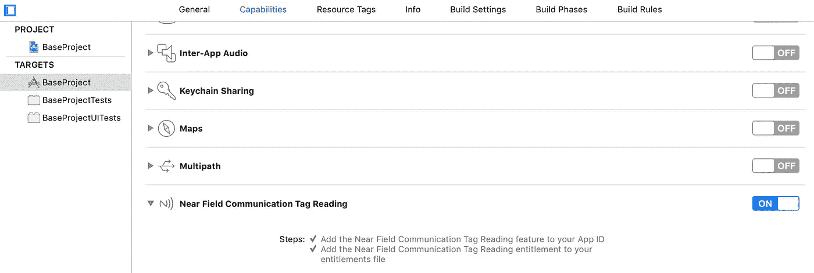
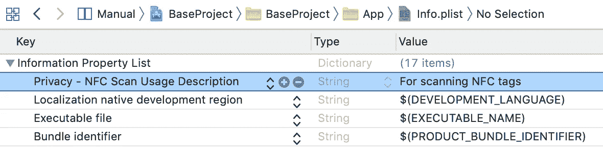
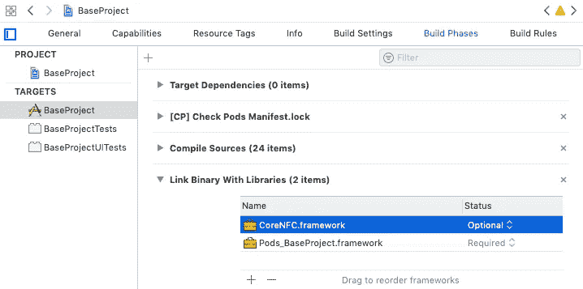
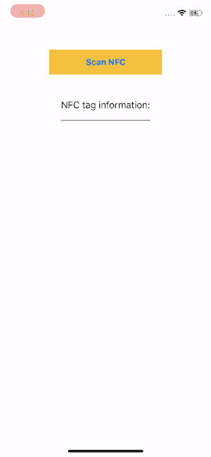
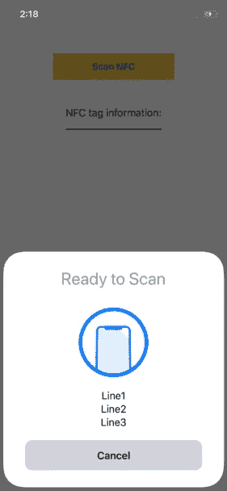
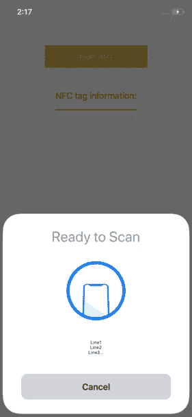

# 尽可能快的 Swift CoreNFC

> 原文：<https://itnext.io/swift-corenfc-as-quick-as-possible-79544796cd0a?source=collection_archive---------0----------------------->


**NFC** 代表“近场通信”。当两个电子设备相距不到 4 厘米时，它们可以通过 NFC 传输数据。NFC 可用于电子支付。它是多年前发明的，但自 2016 年 iPhone7 推出以来，它刚刚被苹果引入 iPhone 系列。要测试具有 NFC 功能的应用程序，必须使用真实设备，而不是 iOS 模拟器。

要设置 NFC 项目，在苹果开发者控制台中注册应用 ID 时，必须在“应用服务”会话中启用“NFC 标签读取”。


在 Apple Developer Console 中注册应用程序 ID 时，应用程序服务会话的屏幕截图

其次，必须在应用目标会话的“功能”选项卡中启用“近场通信标签读取”。



“功能”选项卡中的“近场通信标签读取”

T 第三，“隐私 NFC 扫描使用说明”必须添加到 Info.plist 中。否则，`libsystem_kernel.dylib __pthread_kill`会终止应用程序，Xcode 控制台不会显示错误消息。



Info.plist 截图

如果你的应用中的 NFC 是一个可选功能，你可能希望那些没有 NFC 芯片的设备运行你的应用，那么在 iOS 12 **中 CoreNFC.framework **必须**设置为**“可选”**。**



否则，应用程序将在启动时崩溃，并显示以下消息，显示“**corenfc . framework”**无法加载。

```
**dyld: Library not loaded: /System/Library/Frameworks/CoreNFC.framework/CoreNFC****Referenced from: /var/containers/Bundle/Application/DF6D870C-4928-40F6-A242-BAB9C07B3737/BaseProject.app/BaseProject****Reason: image not found**
```

# 现在就开始编码吧！

# 一实施`NFCNDEFReaderSessionDelegate`

# 如何解释来自[NFCNDEFMessage]对象的 NFC 信息？

NFC 信息存储在`NFCNDEFMessage`对象内`record` 的`payload`中。

每个`NFCNDEFMessage`对象包含一个“记录”列表，每个记录包含:
1。NSData 形式的“有效载荷”包含标记消息
2。
3。
4【类型】。"标识符"

## 示例:

*   NFC 标签原始消息:**“ABC”**
*   ASCII 码的原始消息:
    —0:97[a]
    —1:98[b]
    —2:99[c]
*   在 ASCII 表中的`NFCNDEFMessage` 的`record`中扫描到`payload` —0:2【文本开始】。
    —1:101【e】
    —2:110【n】
    —3:97【a】
    —4:98【b】
    —5:99【c】

## 为什么原始消息“abc”前面有“en”？

> “所有语言代码都必须按照 RFC 3066 [RFC3066]进行。不得省略语言代码。语言代码长度编码在状态字节的六个最低有效位中。因此，通过用值 0x3F 屏蔽状态字节很容易找到。
> — NFC 数据交换格式(NDEF)技术规范，NFC 论坛

因此，在转换为字符串进行显示之前，记录的有效载荷必须前进 3！

```
record.payload.advanced(by:3)
```

# didDetectNDEFs 的处理结果

## 情况 1(使用参数初始化— `invalidateAfterFirstRead: true)`):

如果使用`invalidateAfterFirstRead`等于 true 初始化 NFC 读取器会话，在成功检测到标签并完成蓝色标记动画(持续约 3 秒)后，NFC 标签读取对话框将自动关闭。

由于这 3 秒钟的时间间隔，UIAlertController 出现，但被 NFC 标签读取对话框完全覆盖，用户无法与任何`UIAlertAction`交互。这导致了糟糕的用户体验。见下图 gif:



## 情况 2(使用参数初始化— `invalidateAfterFirstRead: false)`):

如果 NFCNDEFReaderSession 初始化为`invalidateAfterFirstRead`等于假，可以手动关闭 NFC 读取标签对话框。

然而，NFC 会话实际上可以在蓝勾动画完成后被取消。因此，在显示 UIAlertController 之前调用`nfcSession.invalidate()`并不能保证 NFC 标签读取对话框实际上已经关闭。这有大约 0.5 秒的时间间隔。因此，UIAlertController 仍然在 NFC 标签读取对话框后面显示很短的一段时间。用户体验并不完美。


## 情况 3(带参数初始化— `invalidateAfterFirstRead: false + 1s delay)`):

最后，提供最佳用户体验的解决方案是给 DispatchQueue 大约 1 秒的延迟，以确保在显示 UIAlertController 之前完全关闭 NFC 标签读取对话框。


# 次要提醒:

1.  NFCNDEFReaderSession 读取 NFC 标签的默认超时时间为 60 秒。下面是超时的错误消息。

```
**Session is invalidated due to maximum session timeout**
```

2.NFC 标签读取对话框中的警告消息针对 3 行文字进行了优化。第四行在末尾被截断。



3.NFC 标签读取对话框和取消按钮的标题不可定制，区域设置固定为设备区域设置。

# 结论:

1.  确保在 Apple 开发人员控制台为您的应用程序启用了“NFC 标签读取”。
2.  必须在应用程序功能列表中检查“近场通信标签读取”。
3.  确保您的真实设备具有 NFC 芯片或将 CoreNFC.framework 设置为可选框架。
4.  必须填写“隐私-NFC 扫描使用说明”以请求使用用户 NFC 芯片的许可。
5.  使用`invalidateAfterFirstRead: false`创建 NFCNDEFReaderSession，并延迟一秒钟来显示任何 UIAlertController 或导航到任何页面。
6.  `didDetectNDEFs`回调在后台线程中运行，从不直接更新 UI。

欢迎您在[Twitter @ myrik _ chow](https://twitter.com/myrick_chow)关注我，了解更多信息。感谢您阅读这篇文章。祝您愉快！😄