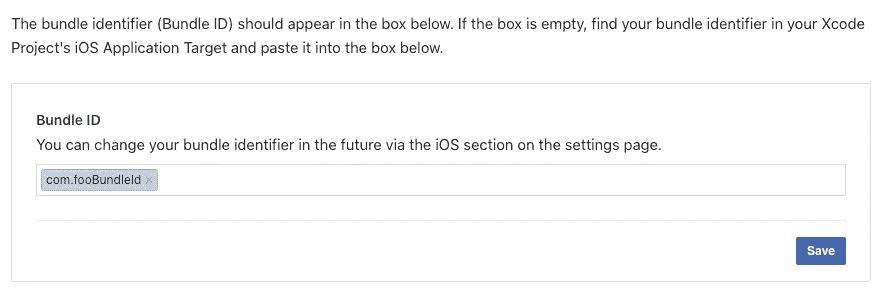
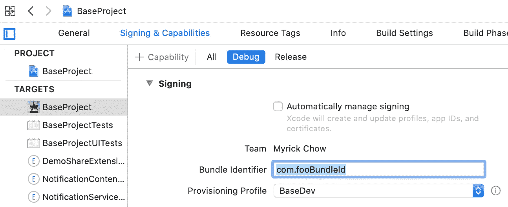
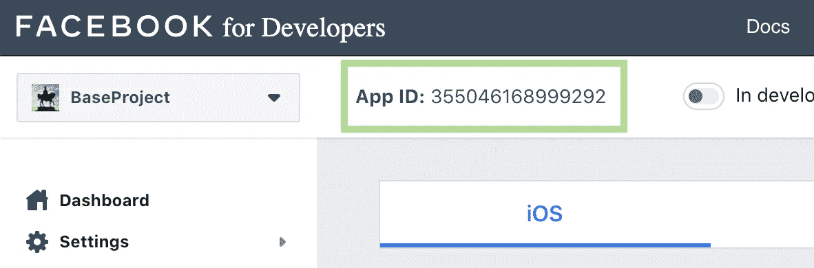
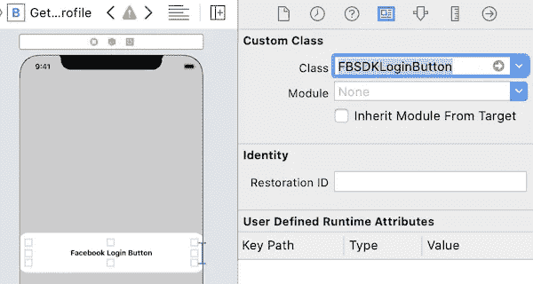
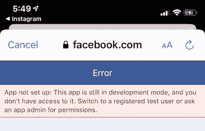

# Swift —脸书 iOS 登录 SDK

> 原文：<https://itnext.io/swift-facebook-ios-login-sdk-dada412d8341?source=collection_archive---------2----------------------->


F acebook 是一个很棒的社交媒体，允许用户以新闻和故事的形式上传图片、视频和链接到脸书平台。如今，脸书是大多数人生活中的必需品。

脸书提供了一个易于使用的 SDK，允许应用程序开发人员在他们的应用程序中实现登录和注销功能。用户身份验证通过后，app 可以代表用户查询用户数据，甚至将媒体共享到脸书。这些数据可能包括用户的公共档案、电子邮件甚至朋友列表。


脸书用户数据是让你的 app 了解更多用户信息和偏好的重要关键。它还可以帮助吸引用户的朋友安装你的应用程序。你想通过实现脸书 SDK 来发展你的应用吗？从这里开始吧！

# 设置


## 步骤 1)注册一个脸书开发者账户

你可以在[脸书开发者控制台](https://developers.facebook.com/)注册一个脸书开发者账号，创建一个脸书项目。

## 步骤 2)在 iOS 项目中添加脸书登录 SDK 依赖项

脸书登录 SDK 可以通过 3 种方式导入，Swift Package Manager、CocoaPods 和 Carthage。在我看来，CocoaPods 是最方便的。

将下面一行代码添加到`Podfile`并运行`pod install`来下载依赖项。

```
pod 'FBSDKLoginKit'
```

## 步骤 3)向脸书提交捆绑包 ID



捆绑包标识符是您的应用程序的唯一标识符。

## 步骤 4)配置 info.plist

将以下内容应用到`info.plist`文件，以设置与脸书服务器通信的密钥。

将这些`{facebook_app_id}`(第 6 行& 11)替换为您自己的应用 id:



## 步骤 5)最终—更新 AppDelegate

# 使用 SDK 登录按钮登录


默认脸书 SDK 登录按钮



脸书 SDK 提供了一个易于使用的登录和注销按钮— `FBSDKLoginButton`。通过在 Storyboard 声明按钮的类型和请求的权限(第 9 行)，它就可以使用了。`LoginButtonDelegate`在用户登录/退出成功或失败时触发。

> 除了`public_profile`和`email`之外，所有需要用户信息的应用都将接受脸书的审查。脸书将拒绝任何不能为额外敏感信息提供充分理由的应用程序。
> 因此，在第 9 行设置权限前请三思。

# 使用自定义按钮登录


脸书 SDK 提供了一个`LoginManager`来处理登录/注销功能，开发者可以使用自定义的登录按钮。代替`LoginButtonDelegate`，`LoginManager`将脸书登录结果作为回调来处理。

# 以测试员身份登录



非注册测试者的错误

脸书限制了在应用程序开发阶段可以测试登录功能的公共用户群。上述错误信息令人沮丧，可以通过在脸书控制台将测试人员的脸书帐户添加为注册测试人员来解决该错误。参见我的另一篇关于解决这个问题的文章:

[](/swift-android-facebook-sdk-login-error-4659c18c264b) [## iOS 和 Android 脸书 SDK 登录错误

### 脸书 SDK 有时会返回不清楚的错误代码和错误消息。其中之一是 1675030 —查询错误(用户不是…

itnext.io](/swift-android-facebook-sdk-login-error-4659c18c264b) 

# 检索敏感用户信息

用户登录后，你得到了访问令牌，应用程序现在可以从脸书服务器检索用户的个人信息。`GraphAPI`必须使用。您可以从官方文档网站找到在`GraphRequest`中使用的可能字段的完整列表:

[](https://developers.facebook.com/docs/graph-api/reference/user) [## 图形 API 用户文档-开发人员脸书

### POST/v 8.0//users HTTP/1.1 Host:graph . Facebook . com…

developers.facebook.com](https://developers.facebook.com/docs/graph-api/reference/user) 

而且，根据[官方文档](https://developers.facebook.com/docs/facebook-login/permissions/review)，如果你的 app 要求超过`public_profile`和`email`，那么在你的 app 可以被 app 开发者以外的人使用之前，还需要经过脸书的审核。这个过程大概持续几个星期。

# 注销


脸书 SDK 注销功能是直接的，如果使用默认的`FBSDKLoginButton`，则调用`LoginButtonDelegate`的`loginButtonDidLogOut: loginButton`。

# 检查用户是否已登录

`AccessToken`是一个存储登录用户信息的类。`tokenString`是代表应用程序而不是用户向脸书 API 发出请求的关键。

# 摘要

1.  脸书 SDK 提供身份验证功能，用于在通过 SDK 登录后检索用户敏感的个人信息。
2.  开发人员可以使用 SDK 默认登录按钮或自定义按钮来为用户显示登录按钮。SDK 默认的相对更容易实现。
3.  用户通过 SDK 登录后会生成访问令牌。它可用于从脸书服务器检索用户的个人信息。
4.  请求除`public_profile`和`email`之外的敏感信息时应慎重考虑。在 app 可以在 App Store 和谷歌 Play 商店发布之前，必须通过脸书审查。可以持续几个星期！
5.  只有注册测试人员可以在开发阶段测试脸书登录功能。测试人员的标识符必须由管理员首先在脸书控制台添加。

# 你可能会喜欢

[](/ios-swift-facebook-sharing-e473e6b2fc48) [## iOS Swift 脸书共享

### 如今，通过脸书分享是如此普遍。脸书为开发者提供了一个共享 SDK 来实现共享到…

itnext.io](/ios-swift-facebook-sharing-e473e6b2fc48) [](https://medium.com/@myrickchow/firebase-authentication-facebook-i-93aaf489839d) [## 基于防火墙的认证—脸书一号

### 如今脸书登录闻名而 Firebase 提供认证工具通过脸书访问令牌创建用户…

medium.com](https://medium.com/@myrickchow/firebase-authentication-facebook-i-93aaf489839d) 

# 参考

## 1.脸书评论应用程序要求敏感的个人信息

[](https://developers.facebook.com/docs/facebook-login/permissions/review) [## 审查-脸书登录-文档-脸书开发者

### 权限被分为不同的类别，这些类别反映了它们是如何呈现给人员和审阅过程的。一些集合…

developers.facebook.com](https://developers.facebook.com/docs/facebook-login/permissions/review) 

## 2.关于从脸书服务器请求个人信息的 GraphAPI 文档

[](https://developers.facebook.com/docs/graph-api/reference/user) [## 图形 API 用户文档-开发人员脸书

### POST/v 8.0//users HTTP/1.1 Host:graph . Facebook . com…

developers.facebook.com](https://developers.facebook.com/docs/graph-api/reference/user) 

## 3.关于脸书登录的高级主题

[](https://developers.facebook.com/docs/facebook-login/ios/advanced#custom-login-button) [## 高级-脸书登录-文档-开发人员的脸书

### 如果你的应用程序要求的不仅仅是 public_profile 和电子邮件，脸书必须在你发布之前审查它。了解更多信息…

developers.facebook.com](https://developers.facebook.com/docs/facebook-login/ios/advanced#custom-login-button) 

欢迎您通过[Twitter @ my rik _ chow](https://twitter.com/myrick_chow)关注我，了解更多信息和文章。感谢您阅读这篇文章。祝您愉快！😄