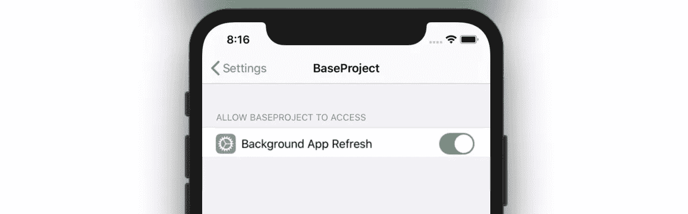
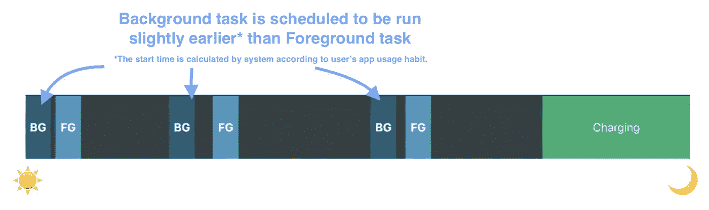
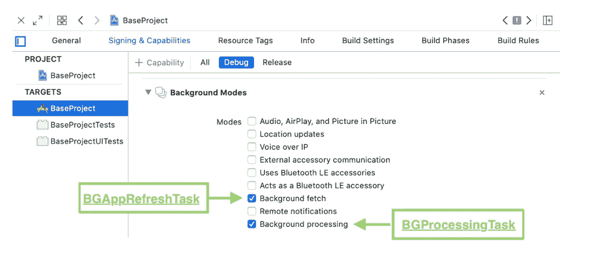
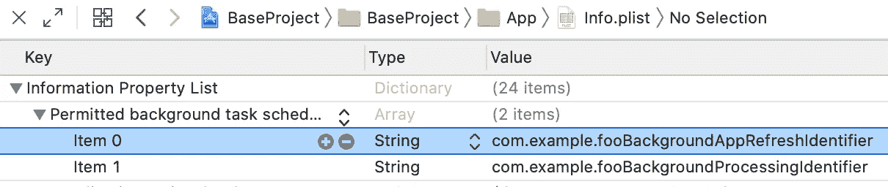
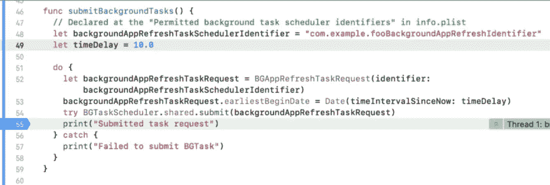
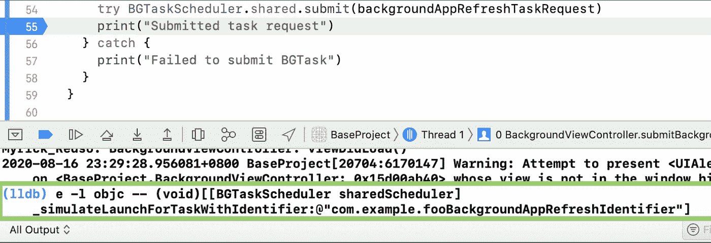

# Swift iOS 后台任务框架—后台应用程序更新分 4 步进行

> 原文：<https://itnext.io/swift-ios-13-backgroundtasks-framework-background-app-refresh-in-4-steps-3da32e65bc3d?source=collection_archive---------0----------------------->



I OS 允许 app 刷新 it 内容，即使是发送到后台。iOS 可以智能地研究用户的行为，并在日常使用之前安排后台任务。当应用程序恢复到前台时，从其服务器检索最新信息并显示给用户是有用的。比如社交媒体应用(脸书，Instagram & WhatsApp)和新闻应用。



前台和后台任务的说明；复制自 WWDC 2019 演示幻灯片

从 iOS 13 开始，苹果增加了一个新的框架——**background tasks**——处理 iOS 和 app 端之间的后台任务请求。[BGAppRefreshTask](https://developer.apple.com/documentation/backgroundtasks/bgapprefreshtask)&[BGProcessingTask](https://developer.apple.com/documentation/backgroundtasks/bgprocessingtask)是两种可用的后台任务类型。BGAppRefreshTask 可以有 **30 秒**来完成它的工作，BGProcessingTask 可以有**一分多钟**。对于旧的[应用(_:performFetchWithCompletionHandler:)](https://developer.apple.com/documentation/uikit/uiapplicationdelegate/1623125-application)方式，处理方式有所不同。

后台任务的执行取决于几个条件，包括:

1.  “后台应用程序刷新”的用户权限
2.  充电器供电
3.  网络连接

让我们看看如何设置后台应用程序刷新，并了解使用它的细节！

# 后台应用更新的 4 个步骤

## 步骤 1)为应用程序目标启用后台模式

如果分别使用了 [BGAppRefreshTask](https://developer.apple.com/documentation/backgroundtasks/bgapprefreshtask) 和 [BGProcessingTask](https://developer.apple.com/documentation/backgroundtasks/bgprocessingtask) ，则进入 app target 的**后台模式**会话，检查**后台获取**和**后台处理**选项。



应用程序目标的功能会话

## 步骤 2)添加“**允许的后台任务调度程序标识符**

转到`info.plist`并添加“**允许的后台任务计划程序标识符**属性，其标识符为[BGAppRefreshTaskRequest](https://developer.apple.com/documentation/backgroundtasks/bgapprefreshtaskrequest)和[BGProcessingTaskRequest](https://developer.apple.com/documentation/backgroundtasks/bgprocessingtaskrequest)。



属性列表模式

## 步骤 3)注册调度器任务标识符

用上一步定义的标识符和后台任务触发时执行的完成处理程序将调度程序任务注册到`BGTaskScheduler`。

> 根据[官方文档](https://developer.apple.com/documentation/backgroundtasks/bgtaskscheduler)，`BGTaskRequest`的启动处理程序应该在 app 启动序列结束前注册，即[应用(_:didFinishLaunchingWithOptions:)](https://developer.apple.com/documentation/uikit/uiapplicationdelegate/1622921-application)。

> 相同任务标识符的重复注册会导致 iOS 终止应用程序！！以下是错误消息:

```
*** Terminating app due to uncaught exception 'NSInternalInconsistencyException', reason: 'Launch handler for task with identifier com.example.fooBackgroundAppRefreshIdentifier has already been registered'
```

## 步骤 4)将`BGTaskRequest`提交给`BGTaskScheduler`

提交一个`BGTaskRequest`会抛出以下异常:

1.  `BGTaskSchedulerErrorCodeUnavailable`
    用户在应用设置页面禁用了“后台应用刷新”选项
2.  `BGTaskSchedulerErrorCodeTooManyPendingTaskRequests`
    一次可以调度 1 个刷新任务和 10 个处理任务。
3.  `BGTaskSchedulerErrorCodeNotPermitted` 在 app 功能的后台模式会话中，不检查相应的**“后台获取”**或**“后台处理”**。

以下是`BGAppRefreshTaskRequest`的代码:

# 模拟 BGTask

在开发过程中，等待 iOS 触发`BGTask`是一项繁琐的工作，因为 iOS 控制`BGTask`的确切触发时间，以优化设备性能。因此，Apple 提供了以下命令(`[simulateLaunchForTaskWithIdentifier](https://developer.apple.com/documentation/backgroundtasks/starting_and_terminating_tasks_during_development)` [&](https://developer.apple.com/documentation/backgroundtasks/starting_and_terminating_tasks_during_development) `[simulateExpirationForTaskWithIdentifier](https://developer.apple.com/documentation/backgroundtasks/starting_and_terminating_tasks_during_development)`)来模拟和终止一个`[BGTask](https://developer.apple.com/documentation/backgroundtasks/bgtask)`:

> 这些命令不是 Swift 代码，只能在 Xcode 终端上执行。按照以下步骤触发 Xcode 中的`[BGTask](https://developer.apple.com/documentation/backgroundtasks/bgtask)`:

## 步骤 1:在将 BGTask 提交给 BGTaskScheduler 后，随时暂停应用程序



## 步骤 2:在 Xcode 终端运行命令



## 第三步:恢复你的应用程序

您可以看到，注册的 BGTask 的完成处理程序随后被触发。


# BGAppRefreshTask 与 BGProcessingTask

## `Property: expirationHandler`

`BGTask`最重要的属性是`expirationHandler`。当`BGTask`由于超时或其他问题而必须被系统终止时，iOS 将调用这个回调函数。

## 函数:setTaskCompleted(成功: )

这是一个重要的功能，它通知后台任务调度程序任务已经完成。开发者应该尽快调用这个函数，因为额外的电池电量会被消耗，一旦所有后台任务完成，iOS 就会暂停应用程序！

## 比较:用法

`BGAppRefreshTask`用于更新少量信息，例如从服务器获取最新的股票价格和新闻。发送到后台后，持续时间限制在 **30s** 左右。

`BGProcessingTask`用于执行耗时的加工。BGProcessingTask 的时间可以从**到分钟**！然而，处理任务仅在设备**空闲**时运行。当用户**开始使用设备**时，系统终止任何正在运行的后台处理任务。后台刷新任务不受影响。因此，有必要为上一节介绍的`BGTask`对象设置`expirationHandler`。只要用户在过去一周内使用过你的应用程序，系统将在接下来的两天内尽力满足该请求。

# BGAppRefreshTaskRequest 和 BGProcessingTaskRequest

## 普通字段)`earliestBeginDate`

它表示应该执行此任务的最早日期。然而，**最早日期不等于确切日期**。iOS 不保证任务将在最早的日期开始，并且可以延迟电源优化和应用程序使用模式的后台任务。

## BGProcessingTaskRequest —配置 1)需要网络连接

指示此后台进程是否需要网络连接。默认值为 false。

## BGProcessingTaskRequest —配置 2)需要外部电源

指示此后台进程是否要求设备连接到外部电源。只有当任务是资源密集型的，以最小化对电池寿命的影响时，才设置为真。

# 监控后台应用刷新授权


用户拥有启用/禁用**“后台应用刷新”**的最终权限，即使网络和电池状况都处于良好水平。如果后台应用程序刷新是一项关键功能，开发人员应监控相应的授权，并将用户重定向到设置应用程序。

我们可以使用`[UIApplication.shared.backgroundRefreshStatus](https://developer.apple.com/documentation/uikit/uiapplication/1622994-backgroundrefreshstatus)`来获取后台 App 刷新的当前授权状态。有三种可能的值:

1.  `[available](https://developer.apple.com/documentation/uikit/uibackgroundrefreshstatus/available)`—用户已启用后台应用刷新功能。这是首次安装应用程序时的默认值。
2.  `[denied](https://developer.apple.com/documentation/uikit/uibackgroundrefreshstatus/denied)` —用户已明确禁用后台应用刷新功能。我们可以将用户重定向到应用程序设置页面，用代码`UIApplication.shared.open(URL(string: UIApplication.openSettingsURLString)!)`切换回状态。
3.  `[restrict](https://developer.apple.com/documentation/uikit/uibackgroundrefreshstatus/restricted)` —由于帐户限制，例如家长控制，用户无法切换后台刷新状态

# 监控授权状态的变化

用户更改后台应用刷新状态后，可以通过观察`[UIApplication.backgroundRefreshStatusDidChangeNotification](https://developer.apple.com/documentation/uikit/uiapplication/1623085-backgroundrefreshstatusdidchange)`通知来通知应用。这可用于向用户显示任何弹出对话框，以解释后台应用刷新对应用流的用途和重要性。

# 摘要

1.  只有当用户启用“后台应用刷新”时，才能执行后台任务。
2.  后台任务标识符必须添加到`info.plist`中的“**允许的后台任务调度程序标识符”**字段
3.  `BGAppRefreshTask` can 有 30s，`BGProcessingTask`有 1 分多钟完成其后台任务。
4.  任何时候都可以安排总共 1 个刷新任务和 10 个处理任务。
5.  任务标识符的注册应在应用程序使用选项[应用程序(_:didfinesslaunchingwithoptions:)](https://developer.apple.com/documentation/uikit/uiapplicationdelegate/1622921-application)完成启动之前完成
6.  相同任务标识符的重复注册会导致 iOS 终止您的应用程序。
7.  已经触发的后台任务以后不能再次触发。必须再次重新提交/重新安排。

# 你可能喜欢的东西:

如果您必须使用运行 iOS 12 或更低版本的设备来支持用户，请使用[应用程序(_:performFetchWithCompletionHandler:)](https://developer.apple.com/documentation/uikit/uiapplicationdelegate/1623125-application)和[setMinimumBackgroundFetchInterval(:_)](https://developer.apple.com/documentation/uikit/uiapplication/1623100-setminimumbackgroundfetchinterva)来代替。您可以在下面找到更多信息:

[](/swift-ios-background-app-refresh-in-3-steps-cadac5733c1e) [## Swift iOS 后台应用程序 3 步刷新

### iOS 允许应用程序定期刷新其内容，即使它被发送到后台。有多少限制…

itnext.io](/swift-ios-background-app-refresh-in-3-steps-cadac5733c1e) 

# 参考和进一步阅读:

1.WWDC 2019 会议[707:App 后台执行的进步](https://developer.apple.com/videos/play/wwdc19/707/)样本代码。

 [## Apple 开发者文档

### WWDC 2019

developer.apple.com](https://developer.apple.com/documentation/backgroundtasks/refreshing_and_maintaining_your_app_using_background_tasks) 

2.背景任务框架官方文档

后台任务| Apple 开发者文档

 [## Apple 开发者文档

### 后台任务| Apple 开发者文档

developer.apple.com](https://developer.apple.com/documentation/backgroundtasks) 

欢迎您在[Twitter @ myrik _ chow](https://twitter.com/myrick_chow)关注我，了解更多信息和文章。感谢您阅读这篇文章。祝您愉快！😄