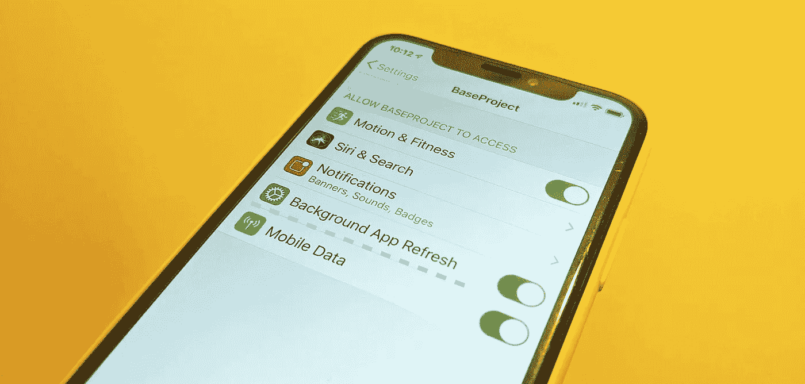
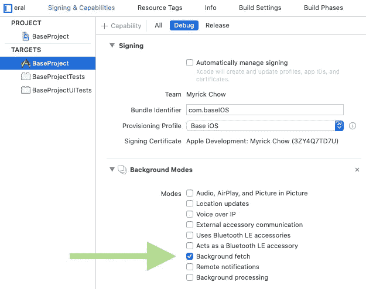
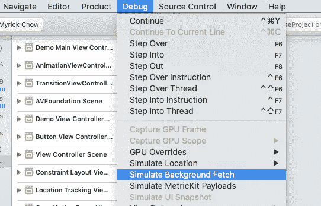
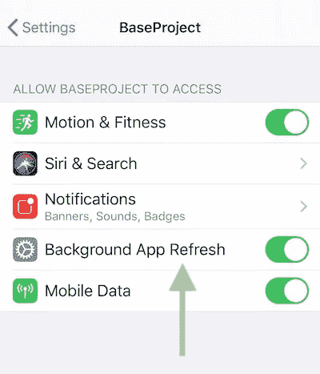

# Swift iOS 后台应用程序 3 步刷新

> 原文：<https://itnext.io/swift-ios-background-app-refresh-in-3-steps-cadac5733c1e?source=collection_archive---------0----------------------->

iOS 允许应用程序定期刷新其内容，即使它被发送到后台。当应用程序恢复到前台时，应用程序从其服务器检索最新信息并显示给用户是有用的。例如社交媒体应用程序(脸书、Instagram & WhatsApp)和新闻应用程序。

然而，这种后台应用程序刷新有很多限制，包括:

1.  用户权限
2.  刷新周期
3.  每次刷新执行的持续时间(最长 30 秒)

让我们看看如何设置后台应用程序刷新，并了解使用它的细节和技巧！

# 后台应用刷新的 3 个步骤

1.  在应用目标选项卡的“**后台模式**”会话中，勾选“**后台获取**”选项

2.设置应用启动时应用刷新的最小间隔(`didFinishLaunchingWithOptions`)

> 切记， **iOS 有权限控制 app 刷新的确切时间间隔！**这个参数只是告诉 iOS app 期望的最高频率。

3.在`AppDelegate.swift`中实现`[application(_:performFetchWithCompletionHandler:)](https://developer.apple.com/documentation/uikit/uiapplicationdelegate/1623125-application)`方法。

# 通过 Xcode 模拟后台应用程序刷新

无限期等待 iOS 触发后台应用程序刷新是不值得的。为了节省时间，Xcode 提供了一个在模拟器和真实设备上模拟后台应用程序刷新的功能。

请转到调试选项卡并单击“**模拟后台提取**”。

# 后台应用刷新详细信息

1.  iOS**不**保证 app 刷新的确切周期。只有当网络状况良好且设备不在[低功耗模式](https://support.apple.com/en-hk/HT205234#:~:text=Low%20Power%20Mode%20reduces%20the,and%20off%20from%20Control%20Center.)下运行时，它才会向`performFetchWithCompletionHandler`触发事件。这可以确保数据提取有可能成功。
2.  在`performFetchWithCompletionHandler`回调中应该尽快调用`completionHandler`。这是因为冗长的过程消耗更多的能量。为了给用户提供更好的 UX，苹果将重新安排应用程序的更新时间，那些需要漫长过程的应用程序将会减少更新频率。
3.  后台 app 刷新的最大持续时间限制在 **30s** 。我们可以通过在`performFetchWithCompletionHandler`注销`[UIApplication.shared.backgroundTimeRemaining](https://developer.apple.com/documentation/uikit/uiapplication/1623029-backgroundtimeremaining)`来测试它。

# 监控后台应用刷新授权

U ser 拥有启用/禁用“后台应用刷新”的最终权限，即使网络和电池状况都处于良好水平。如果后台应用程序刷新是一项关键功能，开发人员应监控相应的授权，并将用户重定向到设置应用程序。

我们可以使用`[UIApplication.shared.backgroundRefreshStatus](https://developer.apple.com/documentation/uikit/uiapplication/1622994-backgroundrefreshstatus)`来获取后台 App 刷新的当前授权状态。有三种可能的值:

1.  `[available](https://developer.apple.com/documentation/uikit/uibackgroundrefreshstatus/available)`—用户已启用后台应用刷新功能。这是首次安装应用程序时的默认值。
2.  `[denied](https://developer.apple.com/documentation/uikit/uibackgroundrefreshstatus/denied)` —用户已明确禁用后台应用刷新功能。我们可以将用户重定向到应用程序设置页面，用代码`UIApplication.shared.open(URL(string: UIApplication.openSettingsURLString)!)`切换回状态。
3.  `[restrict](https://developer.apple.com/documentation/uikit/uibackgroundrefreshstatus/restricted)` —由于帐户限制，用户不能切换后台刷新状态，例如家长控制

## 监控授权状态的变化

用户更改后台应用刷新状态后，可以通过观察`[UIApplication.backgroundRefreshStatusDidChangeNotification](https://developer.apple.com/documentation/uikit/uiapplication/1623085-backgroundrefreshstatusdidchange)`通知来通知应用。这可用于向用户显示任何弹出对话框，以解释后台应用刷新对应用流的用途和重要性。

# 你可能喜欢的东西:

如果你必须用运行 iOS 13 或以上版本的设备来支持用户，请使用新推出的 [BackgroundTasks 框架](https://developer.apple.com/documentation/backgroundtasks)来代替。您可以在下面找到更多信息:

 [## Swift iOS 后台任务框架—后台应用程序更新分 4 步进行

### iOS 13 引入了一个全新的框架——background tasks，用于处理 app 发送到…时的后台任务

itnext.io](/swift-ios-13-backgroundtasks-framework-background-app-refresh-in-4-steps-3da32e65bc3d) 

# 更多阅读和参考资料:

## 1.Apple 官方文档—使用后台应用程序刷新来更新您的应用程序

 [## Apple 开发者文档

### 编辑描述

developer.apple.com](https://developer.apple.com/documentation/uikit/app_and_environment/scenes/preparing_your_ui_to_run_in_the_background/updating_your_app_with_background_app_refresh) 

## 2.Raywenderlich 背景模式教程

 [## 背景模式教程:入门

### 在本教程中，你将创建一个应用程序，使用最常见的背景模式:音频播放，位置更新…

www.raywenderlich.com](https://www.raywenderlich.com/5817-background-modes-tutorial-getting-started) 

欢迎您在[Twitter @ myrik _ chow](https://twitter.com/myrick_chow)关注我，了解更多信息和文章。感谢您阅读这篇文章。祝您愉快！😄