# Swift iOS CLLocationManager 一体化

> 原文：<https://itnext.io/swift-ios-cllocationmanager-all-in-one-b786ffd37e4a?source=collection_archive---------0----------------------->


苹果公司为客户提供了许多优质服务。其中最有用和最著名的功能是她的位置探测技术。在 [GPS](https://medium.com/@myrickchow/as-simple-as-possible-why-does-gps-need-at-least-4-satellite-signals-5bff178fedc0) 和 cell tower 信号的帮助下，iOS 可以操纵用户的当前位置。许多应用程序利用这一功能制作了优秀的应用程序，例如谷歌地图、苹果地图和口袋妖怪 Go！

是负责处理所有位置请求和系统回调的框架。它提供了许多高级 API，用于配置位置请求和通知任何位置信息更新的应用程序，包括坐标和航向方向。您还可以借助 GPX 文件来模拟一系列位置更新，以便进行调试。

[](https://myrickchow.medium.com/simulate-debugging-location-in-ios-24496cbbc9d9) [## 模拟 iOS 中的调试位置

### 如何在 iOS 中调试位置服务？GPX 的文件是关键！带时间戳的坐标可以帮助你完全模拟…

myrickchow.medium.com](https://myrickchow.medium.com/simulate-debugging-location-in-ios-24496cbbc9d9) 

`CoreLocation`是一个大框架，我希望这篇文章能帮助你更好地理解它，并用它制作一个出色的应用程序。开始吧！

# 项目设置—信息列表和功能

## 1.为位置隐私添加显示消息

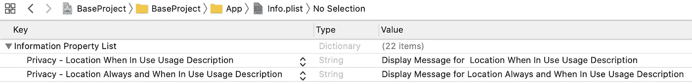

带有两个私钥和值的 info.plist 的屏幕截图

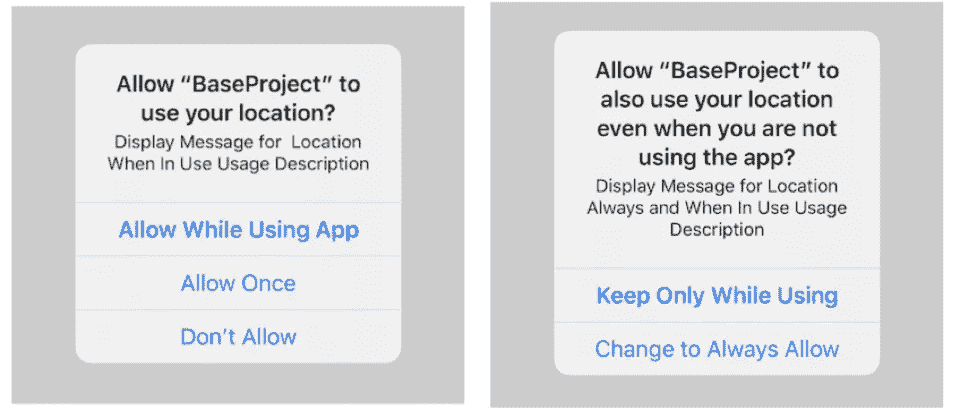

请求“使用中”(左)和“始终”(右)的授权对话框

当请求[requestwheniuseauthorization()](https://developer.apple.com/documentation/corelocation/cllocationmanager/1620562-requestwheninuseauthorization)和`[requestAlwaysAuthorization](https://developer.apple.com/documentation/corelocation/cllocationmanager/1620551-requestalwaysauthorization)()`时，这些消息显示在认证对话框中

1.  如果需要前景定位，必须增加`[NSLocationWhenInUseUsageDescription](https://developer.apple.com/documentation/bundleresources/information_property_list/nslocationwheninuseusagedescription)`**。**
2.  **如果 app 想在后台状态下检索位置信息，必须添加`[NSLocationAlwaysAndWhenInUseUsageDescription](https://developer.apple.com/documentation/bundleresources/information_property_list/nslocationalwaysandwheninuseusagedescription)`和`[NSLocationWhenInUseUsageDescription](https://developer.apple.com/documentation/bundleresources/information_property_list/nslocationwheninuseusagedescription)`。**

> **不要把`[Privacy — Location Always Usage Description](https://developer.apple.com/documentation/bundleresources/information_property_list/nslocationalwaysusagedescription)`和`[Privacy — Location Usage Description](https://developer.apple.com/documentation/bundleresources/information_property_list/nslocationusagedescription)`的键搞混了。前者从 iOS 11 开始**已被弃用**，后者只在 MacOS app 中使用**

## **2.项目能力**

**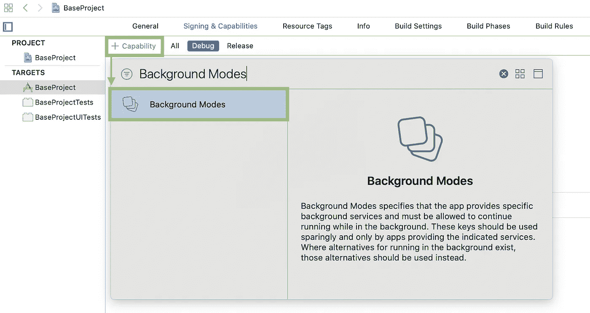**

**目标>签名和功能> "+功能"->后台模式**

**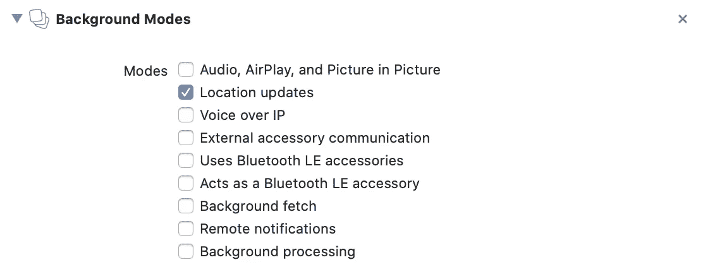**

**必须勾选“位置更新”**

**如果你的应用程序想要在后台状态下检索位置信息，必须在“后台模式”选项卡中选中“位置更新”选项！**

# **7 个步骤—请求一次性位置信息**

## **步骤 1:导入核心位置依赖关系**

**`CoreLocation`是包含`CLLocationManager`的框架，T5 是用于检索位置信息和处理由位置变化触发的所有事件的帮助器类，例如地理围栏(当用户进入或退出特定的`[CLCircularRegion](https://developer.apple.com/documentation/corelocation/clcircularregion)`时)和[监视重要的位置变化](https://developer.apple.com/documentation/corelocation/cllocationmanager/1423531-startmonitoringsignificantlocati)。**

## **步骤 2:声明 CLLocationManager 变量**

**为了保存对`CLLocationManager`的强引用，有必要在`ViewController`级别声明一个变量。这可以确保我们在整个`ViewController`生命周期中处理相同的`CLLocationManager`。**

## **步骤 3:初始化并配置 CLLocationManager**

**许多属性可以选择性地配置给一个`CLLocationManager`，但是只有`delegate`属性(`CLLocationManagerDelegate`)是处理来自`CLLocationManager`的所有回调所必须的。其他属性包括[期望精度](https://developer.apple.com/documentation/corelocation/cllocationmanager/1423836-desiredaccuracy)、[活动类型](https://developer.apple.com/documentation/corelocation/cllocationmanager/1620567-activitytype)、[距离过滤器](https://developer.apple.com/documentation/corelocation/cllocationmanager/1423500-distancefilter)和[航向过滤器](https://developer.apple.com/documentation/corelocation/cllocationmanager/1620550-headingfilter)等。这些都将在以后的会议中详细讨论。**

## **步骤 4:请求位置授权**

**可以请求两种类型的位置授权，一种是“正在使用中”，另一种是“总是”。**

****

**背景位置使用指示器**

****“使用中”**仅在 app 在**前台**或后台位置使用指示器**启用**的后台检索位置信息时请求。**

****【总是】**当位置信息可以在后台检索时，即使后台位置使用指示器**被禁用**也需要。**

> **要获得“始终”授权，您的应用程序必须首先请求“使用时”权限，然后请求“始终”授权。**
> 
> **参考:[苹果文档](https://developer.apple.com/documentation/corelocation/cllocationmanager/1620551-requestalwaysauthorization)**

## **步骤 5:实现 CLLocationManagerDelegate**

**`CLLocationManagerDelegate`对于处理从`CLLocationManager`触发的所有事件至关重要。最重要的回调是`[locationManager(_:didChangeAuthorization:)](https://developer.apple.com/documentation/corelocation/cllocationmanagerdelegate/1423701-locationmanager)`、`[locationManager:didUpdateLocations:](https://developer.apple.com/documentation/corelocation/cllocationmanagerdelegate/1423615-locationmanager?language=objc)`和`[locationManager:didFailWithError:](https://developer.apple.com/documentation/corelocation/cllocationmanagerdelegate/1423786-locationmanager?language=objc)`。它们将在以后的另一节课中讨论。**

## **步骤 6:当“使用中”或“总是”授权被授予时请求位置**

**在`[locationManager(_:didChangeAuthorization:)](https://developer.apple.com/documentation/corelocation/cllocationmanagerdelegate/1423701-locationmanager)`得到正确的许可确认后，通过调用[request location()](https://developer.apple.com/documentation/corelocation/cllocationmanager/1620548-requestlocation),`CLLocationManager`可以开始通过 GPS 或蜂窝塔网络获取位置信息。**

## **步骤 7:处理位置信息**

**就在`CLLocationManager`检索到位置信息后，用嵌入在`locations`参数中的信息触发`[locationManager:didUpdateLocations:](https://developer.apple.com/documentation/corelocation/cllocationmanagerdelegate/1423615-locationmanager?language=objc)` 。**

**C `[LLocation](https://developer.apple.com/documentation/corelocation/cllocation)`是一个包含大量关于位置的有用信息的类。有用的是既有纬度又有经度的`[CLLocationCoordinate2D](https://developer.apple.com/documentation/corelocation/cllocationmanagerdelegate/1423786-locationmanager?language=objc)`、关于位置检索时间的`timestamp`和关于应用程序对位置的信任程度的`horizontalAccuracy`。**

**下面是一个`CLLocation`对象的例子:**

```
{
  coordinate: {
    latitude: 22.42550181697769,
    longitude: 114.23000319878552
  },
  altitude: 23.69447899864746,
  horizontalAccuracy: 65.0,
  verticalAccuracy: 10.0,
  floor: {
    level: 1
  },
  speed: 32.0,
  speedAccuracy: 1.0,
  timestamp: 2020-08-02 15:14:33,
  courseAccuracy: 0.4,
  course: 33.2,
}
```

# **进一步讨论**

**现在，我们将讨论`CLLocationManager`的配置和`CLLocationManagerDelegate`的相应回调。如果你只是想在前台获得一个单一的位置信息，你已经完成，可以跳过以下部分。我将介绍以下配置和特性:**

1.  **授权状态**
2.  **期望精度(纬度和经度)**
3.  **距离过滤器(公差单位为米)**
4.  **航向(磁北极和真北的方向)**
5.  **活动类型**
6.  **地理围栏(进入/退出一个区域)**
7.  **航向和速度**
8.  **持续监控位置更新**
9.  **监控重要的位置变化**
10.  **监控标题更新**

# **授权状态**

**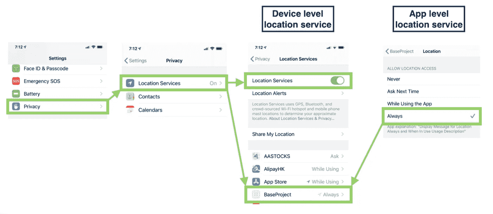**

**用户可以在两个级别向应用授予位置授权，即**系统级**和**应用级**。系统级授权是一个全局设置，可以禁用或启用设备中的所有应用程序。应用程序级别 1 仅指定给特定应用程序，包含 5 种不同的授权状态(尽管上图中仅显示了 4 种状态):**

1.  **`[CLAuthorizationStatus.denied](https://developer.apple.com/documentation/corelocation/clauthorizationstatus/denied)`
    设置选项:系统设置:**【位置服务】**在系统层面被禁用或者
    **飞机**模式开启，禁止设备检索任何位置数据。**
2.  **`[CLAuthorizationStatus.notDetermined](https://developer.apple.com/documentation/corelocation/clauthorizationstatus/notdetermined)`
    设置选项:**下次询问****
3.  **`[CLAuthorizationStatus.authorizedWhenInUse](https://developer.apple.com/documentation/corelocation/clauthorizationstatus/authorizedwheninuse)`
    使用 App 时设置选项:**
4.  ****`[CLAuthorizationStatus.authorizedAlways](https://developer.apple.com/documentation/corelocation/clauthorizationstatus/authorizedalways)`
    设置选项:**始终******
5.  ****`[CLAuthorizationStatus.restricted](https://developer.apple.com/documentation/corelocation/clauthorizationstatus/restricted)`
    受**家长控制**限制****

****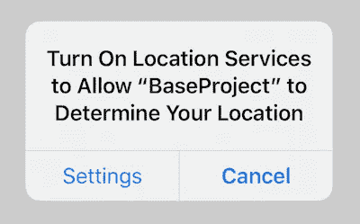****

****当 app 请求位置授权但系统级位置服务被禁用时，弹出上述对话框，将用户重定向到`Settings`页面，手动切换回位置服务。这个弹出对话框是默认的 iOS 行为，开发者不需要为此执行任何代码。****

****此外，可以使用`[CLLocationManager.locationServicesEnabled()](https://developer.apple.com/documentation/corelocation/cllocationmanager/1423648-locationservicesenabled)`来检查系统定位服务是否启用，然后在应用程序端显示某些消息。****

# ****期望精度****

********

****不同的精度导致不同水平的电池使用。为了更精确的定位，系统必须使用来自卫星的 GPS 信号，精度可以达到几十米。但是，缺点是电池使用率高。通过使用精度较低的电平手段(~城市街区)——**手机信号**，功耗大大降低。****

****共有 7 个`CLLocationAccuracy`常量。默认值为`kCLLocationAccuracyBest`。****

1.  ****`[kCLLocationAccuracyBestForNavigation](https://developer.apple.com/documentation/corelocation/kcllocationaccuracybestfornavigation)` —精度是所有可用选项中最高的；它需要相对**更大的力量**来保持高精度。**官方建议仅在手机插电时使用此选项！******

****2.`[kCLLocationAccuracyBest](https://developer.apple.com/documentation/corelocation/kcllocationaccuracybest)`(默认)—精确度高，但不如`kCLLocationAccuracyBestForNavigation`精确****

****3.`[kCLLocationAccuracyNearestTenMeters](https://developer.apple.com/documentation/corelocation/kCLLocationAccuracyNearestTenMeters)`—10 米****

****4.`[kCLLocationAccuracyHundredMeters](https://developer.apple.com/documentation/corelocation/kcllocationaccuracyhundredmeters)`—100 米****

****5.`[kCLLocationAccuracyKilometer](https://developer.apple.com/documentation/corelocation/kcllocationaccuracykilometer)`—1 公里****

****6.`[kCLLocationAccuracyThreeKilometers](https://developer.apple.com/documentation/corelocation/kcllocationaccuracythreekilometers)`—3 公里****

*****参考:*[*CLLocationAccuracy 官方文档*](https://developer.apple.com/documentation/corelocation/cllocationaccuracy)****

# ****距离过滤器****

********

****这是用户为了让`CLLocationManager`触发位置更新而必须“水平”移动的**最小距离**(单位为米)。“水平地”的定义是沿着纬度(南北方向)和经度(西向东方向)而不是高度(由低到高的方向)。****

****默认值是`[kCLDistanceFilterNone](https://developer.apple.com/documentation/corelocation/kcldistancefilternone)`，这意味着水平方向的每一个变化都会触发`[locationManager:didUpdateLocations:](https://developer.apple.com/documentation/corelocation/cllocationmanagerdelegate/1423615-locationmanager?language=objc)`回调。****

****通过将其设置为较小的值，可以消除由随机信号不稳定性导致的位置更新。****

*****参考:* [*距离滤波器*](https://developer.apple.com/documentation/corelocation/cllocationmanager/1423500-distancefilter)****

# ****标题****

****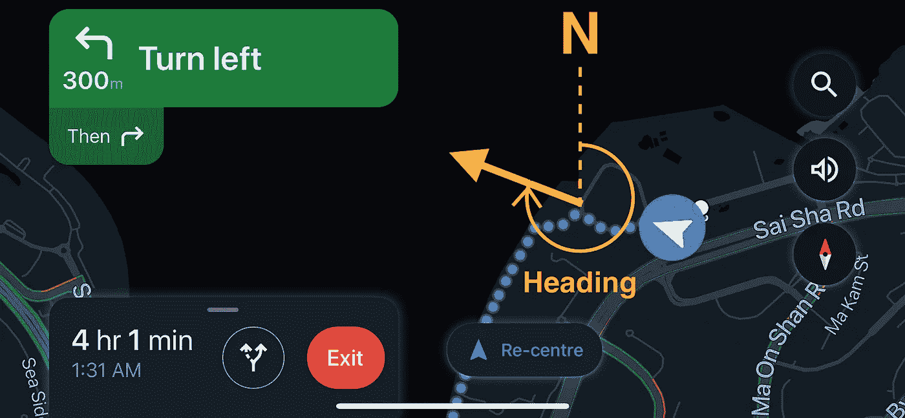****

****“航向”表示用户设备的方向与磁北或真北之间的度数。这里有一个例子:****

****didUpdateHeading****

```
**{
  magneticHeading: 123.333,
  trueHeading: ...,
  headingAccuracy: ...,
  x: ...,
  y: ...,
  z: ...,
  timestamp: ...
}**
```

****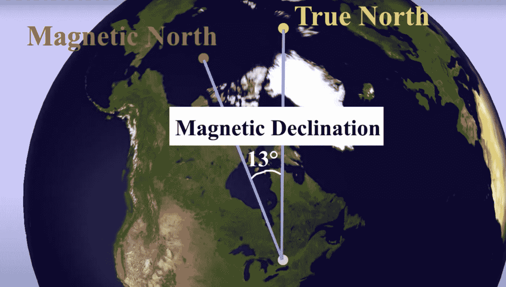****

****地磁北极和真北相距约 1000 公里，这导致了地球上大多数地方的磁偏角。****

****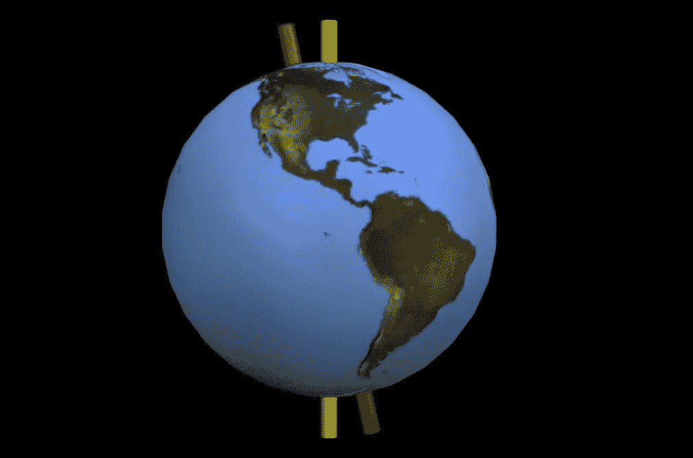****

****黄色是旋转轴****

****磁北极是磁铁的南极指向的北极。然而，真北是地球自转轴在磁北方向的尖端。建议观看一段 [Youtube 视频——指南针:真北 vs 磁北](https://www.youtube.com/watch?v=ieW7Hzrr8pw)以了解更多信息。****

****一句话总结，我们通常在地图导航中使用`magneticHeading`的值就是`trueHeading`。****

# ****活动类型****

********

****当**不可能**改变位置时，`CLLocationManager`确定在后台状态暂停位置更新的策略以节省功耗是一个变量。有 5 种不同类型的`activityType`:****

1.  ****`[automotiveNavigation](https://developer.apple.com/documentation/corelocation/clactivitytype/automotivenavigation)`:用于车载导航****
2.  ****`[otherNavigation](https://developer.apple.com/documentation/corelocation/clactivitytype/othernavigation)`:用于汽车以外的其他交通工具，如轮船、火车等****
3.  ****`[fitness](https://developer.apple.com/documentation/corelocation/clactivitytype/fitness)`:用于行人导航
    *室内位置禁用****
4.  ****`[airborne](https://developer.apple.com/documentation/corelocation/clactivitytype/airborne)`:用于飞机导航****
5.  ****`[other](https://developer.apple.com/documentation/corelocation/clactivitytype/other)`:默认值****

****根据`activityType`暂停位置服务后，重启服务是开发者的责任，而不是 iOS！`[UNLocationNotificationTrigger](https://developer.apple.com/documentation/usernotifications/unlocationnotificationtrigger)`****

# ****地理围栏(区域监测)****

****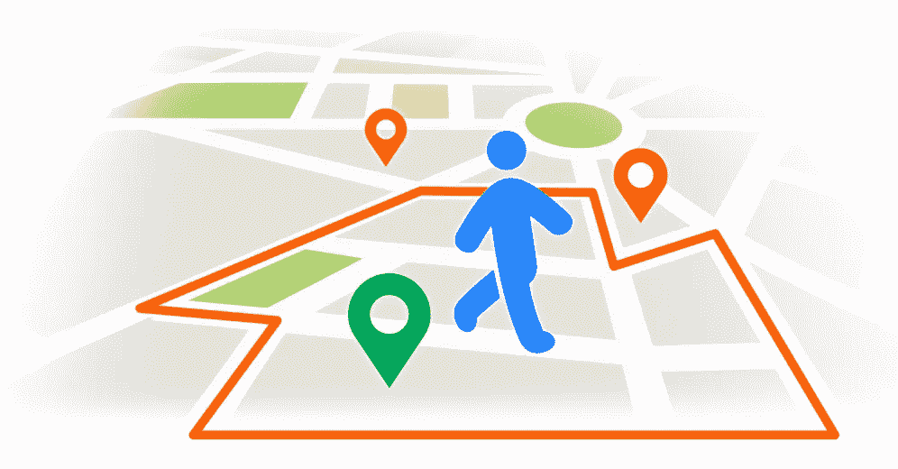****

****当 iOS 检测到用户“刚刚”进入和退出由带有纬度、经度和半径的`[CLCircularRegion](https://developer.apple.com/documentation/corelocation/clcircularregion)`定义的区域时，可以通知应用程序。****

****上面的代码不言自明。当用户进入和退出特定的`[CLCircularRegion](https://developer.apple.com/documentation/corelocation/clcircularregion)`、`[locationManager:didEnterRegion:](https://developer.apple.com/documentation/corelocation/cllocationmanagerdelegate/1423560-locationmanager?language=objc)`和`[locationManager:didExitRegion:](https://developer.apple.com/documentation/corelocation/cllocationmanagerdelegate/1423630-locationmanager?language=objc)`将被分别调用。****

> ****在 iOS 架构中，用于监控`CLLocationRegion`的资源由设备中的所有应用共享。所以 iOS 为了平衡所有 app 的利益，把`CLLocationRegion`的最大金额限制在了**【20】**之间。****
> 
> ****参考:[苹果开发者文档——监控用户与地理区域的接近度](https://developer.apple.com/documentation/corelocation/monitoring_the_user_s_proximity_to_geographic_regions)****

# ****航向和速度****

****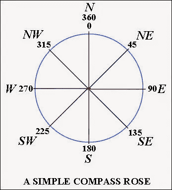****

****设备用户移动的方向。它是一个代表从磁北开始计数的度数的`Double`。精度可参考`courseAccuracy`字段，但仅从 iOS 13.4 开始可用。****

****在`CLLocationManager`检测到两个或更多位置信息之前，它可以计算速度并通过`speedAccuracy`将其存储在`speed`字段中。****

*****参考:*[*CLLocationDirection |苹果开发者文档*](https://developer.apple.com/documentation/corelocation/cllocationdirection)****

# ****持续监控位置更新****

********

****除了请求单个位置，app 还可以通过调用`[startUpdatingLocation(](https://developer.apple.com/documentation/corelocation/cllocationmanager/1423750-startupdatinglocation))`来持续监控位置更新。它使用`distanceFilter`来设置每次位置更新的距离容差。换句话说，只有当用户从最后检测到的位置移动了特定的距离时，应用程序才会被通知。****

****新的位置都被发送到[location manager:diddupdatelocations:](https://developer.apple.com/documentation/corelocation/cllocationmanagerdelegate/1423615-locationmanager?language=objc)。****

# ****监控重要的位置变化****

****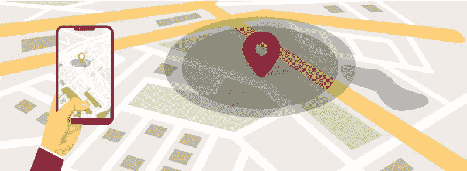****

****`[startMonitoringSignificantLocationChanges()](https://developer.apple.com/documentation/corelocation/cllocationmanager/1423531-startmonitoringsignificantlocati)`提供与`[startUpdatingLocation(](https://developer.apple.com/documentation/corelocation/cllocationmanager/1423750-startupdatinglocation))`类似的服务。它们都提供持续的位置更新服务，即使应用程序被发送到后台。****

****然而，`[startMonitoringSignificantLocationChanges()](https://developer.apple.com/documentation/corelocation/cllocationmanager/1423531-startmonitoringsignificantlocati)`中的距离公差是由系统决定的。只有当用户行驶了 500 米或更远时，应用程序才能收到通知。两个连续的通知必须至少相隔 5 分钟。****

# ****监控标题更新****

****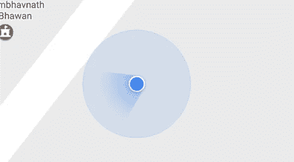****

****就像坐标(纬度和经度)信息一样，iOS 提供了一种在用户航向改变时获得通知的方法。用法类似于`[startUpdatingLocation(](https://developer.apple.com/documentation/corelocation/cllocationmanager/1423750-startupdatinglocation))`功能。****

# ****摘要****

****框架为我们提供了一个用户友好的工具来检测用户的位置信息，并在位置信息改变时提供通知。****

****在开始编码之前，`[NSLocationAlwaysAndWhenInUseUsageDescription](https://developer.apple.com/documentation/bundleresources/information_property_list/nslocationalwaysandwheninuseusagedescription)`和`[NSLocationWhenInUseUsageDescription](https://developer.apple.com/documentation/bundleresources/information_property_list/nslocationwheninuseusagedescription)`需要添加到项目`info.plist`中，以提供请求授权的消息。****

****`CLLocationManager`可配置`desiredAccuracy`、`activityType`、`distanceFilter`和`headingFilter`。它还可以在用户位置(500 米以上)发生重大变化时通知应用程序，但连续通知必须间隔 5 分钟。****

# ****您可能对以下内容感兴趣:****

****[](https://myrickchow.medium.com/simulate-debugging-location-in-ios-24496cbbc9d9) [## 模拟 iOS 中的调试位置

### 如何在 iOS 中调试位置服务？GPX 的文件是关键！带时间戳的坐标可以帮助你完全模拟…

myrickchow.medium.com](https://myrickchow.medium.com/simulate-debugging-location-in-ios-24496cbbc9d9) [](https://medium.com/@myrickchow/as-simple-as-possible-why-does-gps-need-at-least-4-satellite-signals-5bff178fedc0) [## 尽可能简单—为什么 GPS 至少需要 4 个卫星信号？

### GPS 是一种基于卫星的导航系统，用于在全球范围内定位用户位置。我们来看看 GPS 的解释可以是怎样的…

medium.com](https://medium.com/@myrickchow/as-simple-as-possible-why-does-gps-need-at-least-4-satellite-signals-5bff178fedc0) 

欢迎您在[Twitter @ my rik _ chow](https://twitter.com/myrick_chow)关注我，了解更多信息和文章。感谢您阅读这篇文章。祝您愉快！😄****