# Swift 本地通知一体化

> 原文：<https://itnext.io/swift-local-notification-all-in-one-ee6027ea6e3?source=collection_archive---------0----------------------->

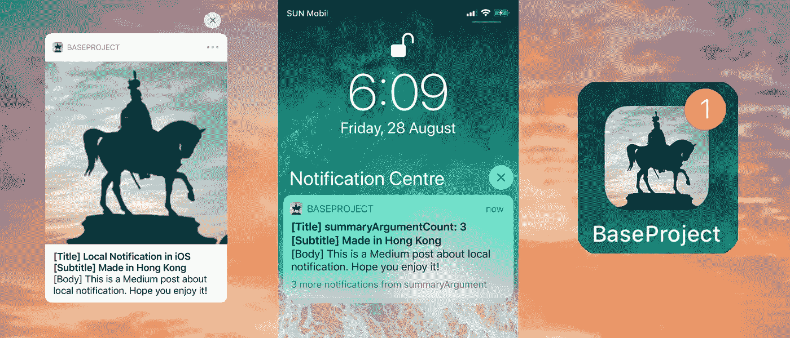

通知是一个非常优雅的工具，用来通知用户新的信息和警告。iOS 通知有两种类型—本地通知和远程通知。由于日历事件、秒表或位置更新，本地通知由应用程序独立触发。另一方面，远程通知由服务器触发并从 APNs 传递。

iOS 中通知的图示

除了触发器之外，本地通知与远程通知有许多共同的属性。在设置和处理用户交互方面有一些有趣的部分和技巧。在本文中，它包括以下几个部分:

1.  背景信息—通知样式
2.  基本代码和总体流程图
3.  未通知操作和未通知类别的声明
4.  请求通知授权
5.  通知内容的设置
6.  通知触发器的设置
7.  在应用程序前台显示通知
8.  处理用户对取消通知操作的选择
9.  删除待定或已发送的通知

希望这篇文章对理解本地通知的细节有所帮助。我们开始吧！

# 背景信息—通知样式

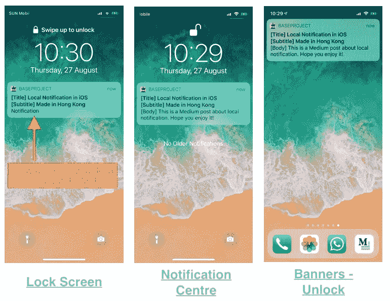

iOS 中总共有 3 种通知方式。它们是:

1.  **锁屏** —用户解锁设备前隐藏正文消息
2.  **通知中心** —解锁设备后，用户可以在通知中心管理通知
3.  **横幅-解锁** —屏幕上方弹出新通知。

用户可以在系统设置中切换不同类型的通知:

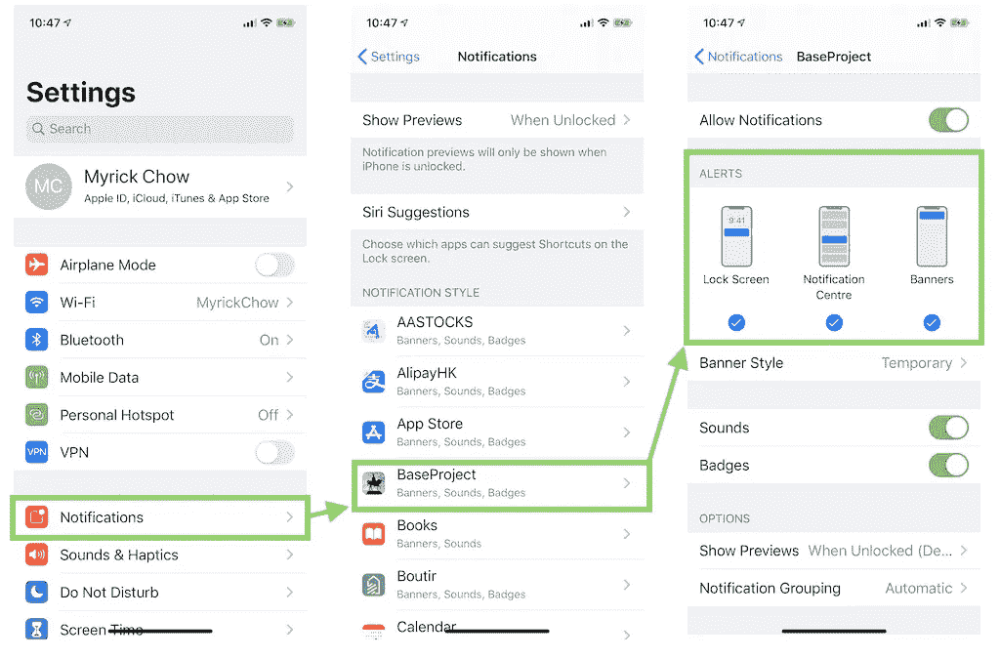

# 基本代码和总体流程图

这篇文章比较长，可以归纳为这两组代码。`AppDelegate.swift`是 app 的入口点，也是设置`UNUserNotificationDelegate`和`UNNotificationCategory`属性的地方。`NotificationViewController.swift`用于设置通知内容及其触发。

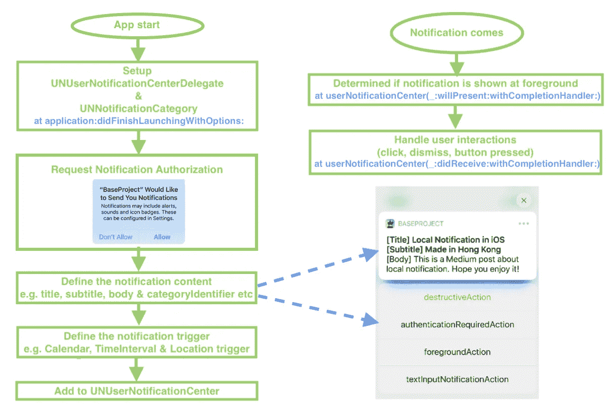

总体流程图

# 未通知操作&未通知类别

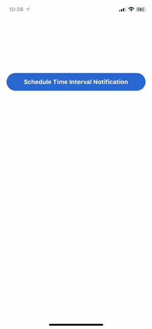

根据官方文件，所有通知中心的设置应该在应用程序已经启动之前完成，即在`application:didFinishLaunchingWithOptions:`。

iOS 提供了两种类型的 notification action—**un notification action**和**UNTextInputNotificationAction**。UNNotificationAction 只是一个带有简单点击动作的按钮，见左边 gift 的前 3 个按钮。UNTextInputNotificationAction 是一个按钮，它可以显示一个带有 submit 按钮的 UITextField，供用户输入消息，请参见左边 gif 中的最后一个按钮。

## 3 种不通知行为

1.  [需要认证](https://developer.apple.com/documentation/usernotifications/unnotificationactionoptions/1648196-authenticationrequired)

当敏感或加密信息用于执行此操作时，将使用此选项。只有在设备解锁后，才能通知应用程序用户的选择。

2.[破坏性](https://developer.apple.com/documentation/usernotifications/unnotificationactionoptions/1648199-destructive)

这种类型的标题在亮暗模式下都显示为红色。红色代表警报。通常会触发不可撤销的动作。

3.[前景](https://developer.apple.com/documentation/usernotifications/unnotificationactionoptions/1648192-foreground)

这种类型的操作按钮将用户带回应用程序。

## 处理未通知操作的操作

开发人员必须实现[userNotificationCenter(_:did receive:with completionhandler:)](https://developer.apple.com/documentation/usernotifications/unusernotificationcenterdelegate/1649501-usernotificationcenter)来处理用户对通知的操作。用户可以执行 4 种可能的操作:

1.  驳回通知
2.  只需点击通知即可打开通知
3.  点击一个简单的`UNNotificationAction`
4.  通过输入一个字符串触发一个`UNTextFieldNotificationAction`

通过在应用程序开始时定义的标识符，可以区分不同类型的无通知操作。一旦它处理完动作，就必须调用`completionHandler`。

为了检测用户取消通知，即第 11 行的`UNNotificationDismissActionIdentifier`，必须将`customDismissAction`设置为`UNNotificationCategory`的`options`。

# 请求通知权限

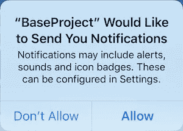

应用程序可以通过不同的选项请求显示通知的权限，包括以下常见选项:

1.  [提醒](https://developer.apple.com/documentation/usernotifications/unauthorizationoptions/1649499-alert) —使应用程序能够在屏幕顶部弹出通知，并在通知中心显示，请参见上一节“通知样式”了解更多信息。
2.  [声音](https://developer.apple.com/documentation/usernotifications/unauthorizationoptions/1649505-sound) —可以是默认或自定义声音，不超过 30 秒。

3.[徽章](https://developer.apple.com/documentation/usernotifications/unauthorizationoptions/1649526-badge)

## 其他不常见的选项有:

1.  [紧急警报](https://developer.apple.com/documentation/usernotifications/unauthorizationoptions/2963120-criticalalert)

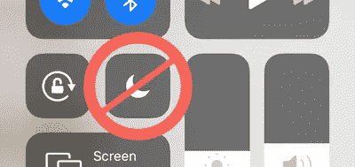

关键警报可以绕过“请勿打扰”功能

需要苹果公司颁发的[特别授权](https://developer.apple.com/contact/request/notifications-critical-alerts-entitlement/)，以便在设备**静音**或**启用“请勿打扰”模式**时显示声音提示！申请权利可以持续大约两个月。

2.[提供通知设置](https://developer.apple.com/documentation/usernotifications/unauthorizationoptions/2990405-providesappnotificationsettings)

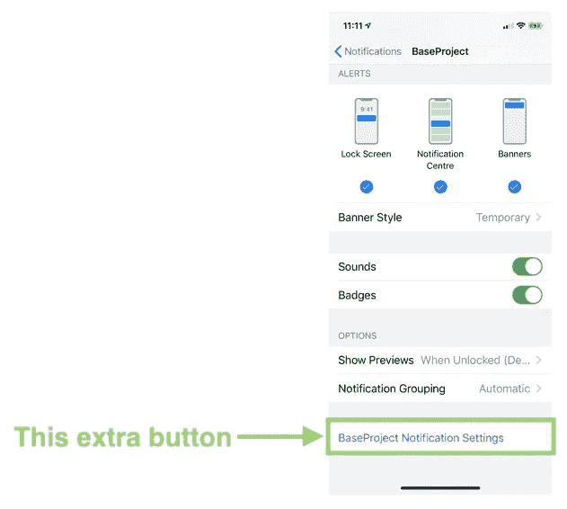

在应用内通知设置页面添加一个按钮，用于将用户重定向到应用页面。开发人员必须处理回调，并向用户显示相关信息。回调是[unusernotificationcenteredelegate](https://developer.apple.com/documentation/usernotifications/unusernotificationcenterdelegate)的[userNotificationCenter(_:openSettingsFor:)](https://developer.apple.com/documentation/usernotifications/unusernotificationcenterdelegate/2981869-usernotificationcenter)

3. [carPlay](https://developer.apple.com/documentation/usernotifications/unauthorizationoptions/1649525-carplay)

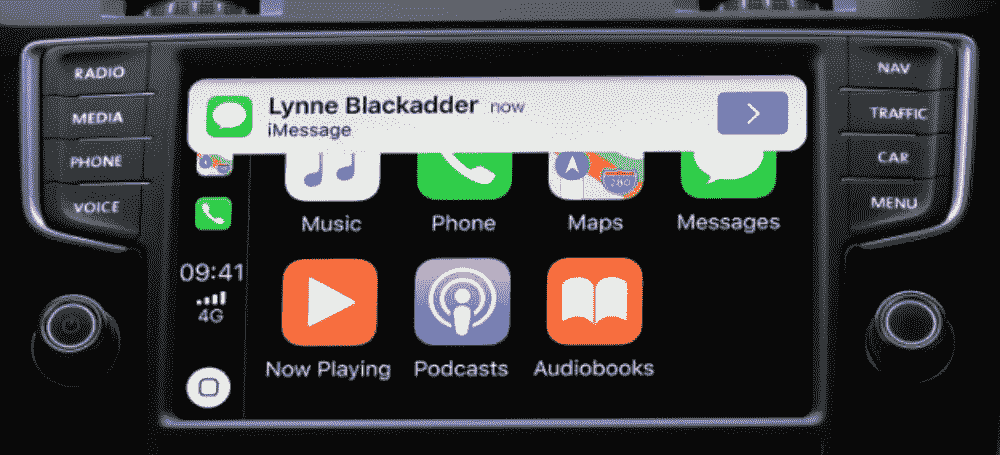

4.[临时](https://developer.apple.com/documentation/usernotifications/unauthorizationoptions/2993019-provisional)
向通知中心临时发布不中断通知的能力。

5.[公告](https://developer.apple.com/documentation/usernotifications/unauthorizationoptions/3240649-announcement)
Siri 通过 AirPods 自动读出消息的能力。

# 未通知内容

## 1.标记

Badge 通常用来表示一个 app 的未读通知数量。例如，WhatsApp 中未读消息的数量。

## 2.标题、副标题和正文

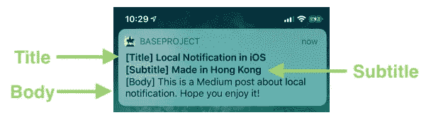

## 3.附件

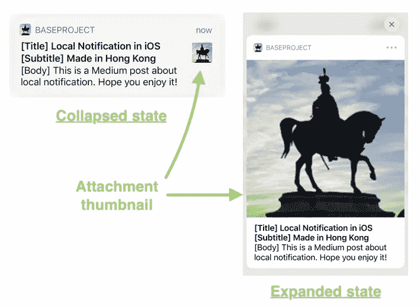

iOS 支持不同种类的媒体附件，包括图像、音频和视频。通过[，通知服务应用程序扩展](https://developer.apple.com/documentation/usernotifications/unnotificationserviceextension)必须被实现以下载用于远程通知的资源。

## 4.类别标识符

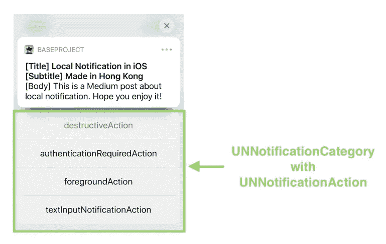

`CategoryIdentifier`用一定的`UNNotificationActions`定义类别。

## 5.launchImageName

应用程序启动以响应通知时显示的启动图像或故事板的名称

## 6.声音

`defaultCritical`只有当应用程序通过苹果认证并获得苹果授予的特殊权利时，才能使用声音。否则，用`default`音代替。

要使用自定义声音，请确保将声音文件作为引用添加到项目中，而不是简单地添加到项目文件夹中。

## 7.线程标识符

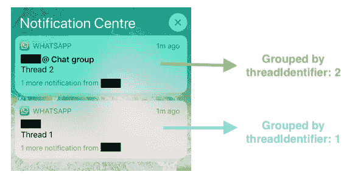

用于将相关通知分组在一起的标识符。以 WhatsApp 为例，每个联系人和每个聊天室都有自己的`threadIdentifier`，以便将相关的消息通知分组在一起。

## 8.用户信息

`userInfo`是一个字典，可以包含一些键值对格式的信息。当用户打开通知并触发[userNotificationCenter(_:did receive:with completionhandler:)](https://developer.apple.com/documentation/usernotifications/unusernotificationcenterdelegate/1649501-usernotificationcenter)函数时，可以检索到这些信息。

## 9 . summaryargument & summaryArgumentCount

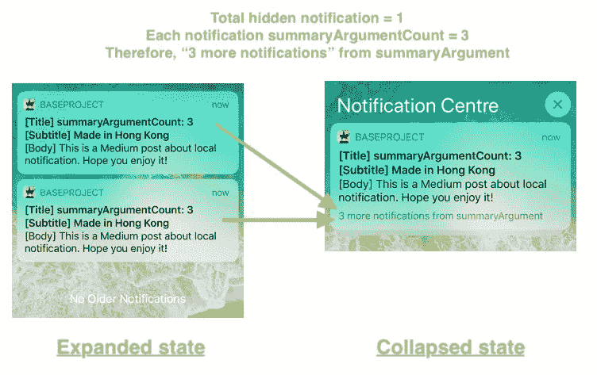

`summaryArgument`是分组通知集的显示字符串。`summaryArgumentCount`是每个通知所代表的“通知”数量。

从上图中可以看出，即使只有 2 个通知被归入一个组，也会显示“来自 summaryArgument 的 3 个以上的通知”。这是因为每个隐藏通知都会导致“3”个参数计数。

## 10.targetContentIdentifier

应用程序用来标识通知内容的值。

# 扳机

苹果公司向开发者提供三种本地通知触发器:

## 1.[未通知触发](https://developer.apple.com/documentation/usernotifications/uncalendarnotificationtrigger)

在特定的日期和时间弹出本地通知。在不同的文化/地区，一周的开始是不同的。必须先仔细检查一下。

## 2.UNTimeIntervalNotificationTrigger

通知会在特定时间过后立即显示。

> 不重复通知的`*timeInterval*`必须大于 0，重复一个的**必须大于 60，否则将抛出运行时异常。**

## 3.UNLocationNotificationTrigger

当用户进入或退出由其坐标和半径(以米为单位)定义的特定地理区域时，会触发通知。

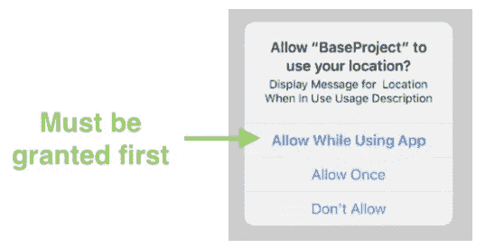

请记住，为了监控位置变化，必须授予“使用时”位置许可。有关 CoreLocation 框架的更多详细信息，请参考以下文章:

 [## Swift iOS CLLocationManager 一体化

### 如何在 iOS 中获取用户位置？CoreLocation 为您提供了多少配置？让我们点击阅读更多！

itnext.io](/swift-ios-cllocationmanager-all-in-one-b786ffd37e4a) 

为了消除任何虚假触发，iOS 有自己的方法来确定用户是否真的进入/退出了某个区域。根据[官方文件](https://developer.apple.com/documentation/corelocation/monitoring_the_user_s_proximity_to_geographic_regions)，用户必须越过边界一段最小距离，并在边界的同一侧停留至少 20 秒。

# 处理待定请求和已发送的通知

添加通知触发请求后，app 可以通过以下方式取消请求:

触发通知触发器并将通知发送到通知中心后，应用程序可以通过以下方式删除它:

# 在前台显示横幅通知

默认情况下，只有当 app 在**后台**或**被用户或系统**终止时，才会自动显示横幅通知。然而，有时有必要显示横幅通知，即使应用程序在前台。例如，非消息页面的消息应用和报警应用。

为了在前台显示横幅通知，必须实现[unusernotificationcenteredelegate](https://developer.apple.com/documentation/usernotifications/unusernotificationcenterdelegate)的函数[userNotificationCenter(_:will present:with completion handler:)](https://developer.apple.com/documentation/usernotifications/unusernotificationcenterdelegate/1649518-usernotificationcenter)。用合适的`UNNotificationPresentationOptions`调用`completionHandler`弹出通知。

# 摘要

1.  本地通知需要推送通知授权。即使用户授予了权限，他/她仍然可以禁用/启用不同样式的通知，例如横幅
2.  提醒、声音和徽章是 app 请求的常用`UNAuthorizationOptions`
3.  `UNUserNotification`委托和注册`UNNotificationCategory`的设置应在`application:didFinishLaunchingWithOptions:`完成。
4.  前台通知默认是隐藏的，应该在[用户通知中心(_:will present:with completion handler:)](https://developer.apple.com/documentation/usernotifications/unusernotificationcenterdelegate/1649518-usernotificationcenter)调用带有合适`UNNotificationPresentationOptions`的`completionHandler`
5.  通知内容包括标题、副标题、正文、徽章、线程标识符和类别标识符等。
6.  通知操作是长按通知时显示的按钮。他们必须在`application:didFinishLaunchingWithOptions:`登记。
7.  3 `UNNotificationTrigger`是`UNCalendarNotificationTrigger`、`UNTimeIntervalNotificationTrigger`和`UNLocationNotificationTrigger`
8.  开发者可以在[用户通知中心(_:did receive:with completion handler:)](https://developer.apple.com/documentation/usernotifications/unusernotificationcenterdelegate/1649501-usernotificationcenter)处理用户选择的按钮

# 阅读和参考

## 1.从您的应用程序本地安排通知

 [## Apple 开发者文档

### 编辑描述

developer.apple.com](https://developer.apple.com/documentation/usernotifications/scheduling_a_notification_locally_from_your_app) 

## 2.声明可操作的通知类型

 [## Apple 开发者文档—通知类型

### 编辑描述

developer.apple.com](https://developer.apple.com/documentation/usernotifications/declaring_your_actionable_notification_types) 

## 3.处理通知和与通知相关的操作

 [## Apple 开发者文档

### 编辑描述

developer.apple.com](https://developer.apple.com/documentation/usernotifications/handling_notifications_and_notification-related_actions) 

欢迎您在[Twitter @ my rik _ chow](https://twitter.com/myrick_chow)关注我，了解更多信息和文章。感谢您阅读这篇文章。祝您愉快！😄