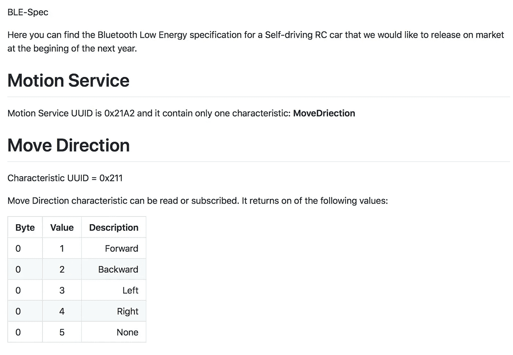
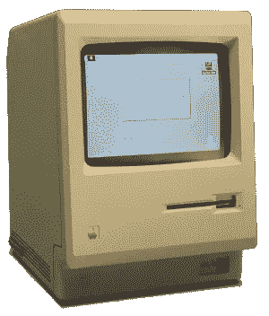
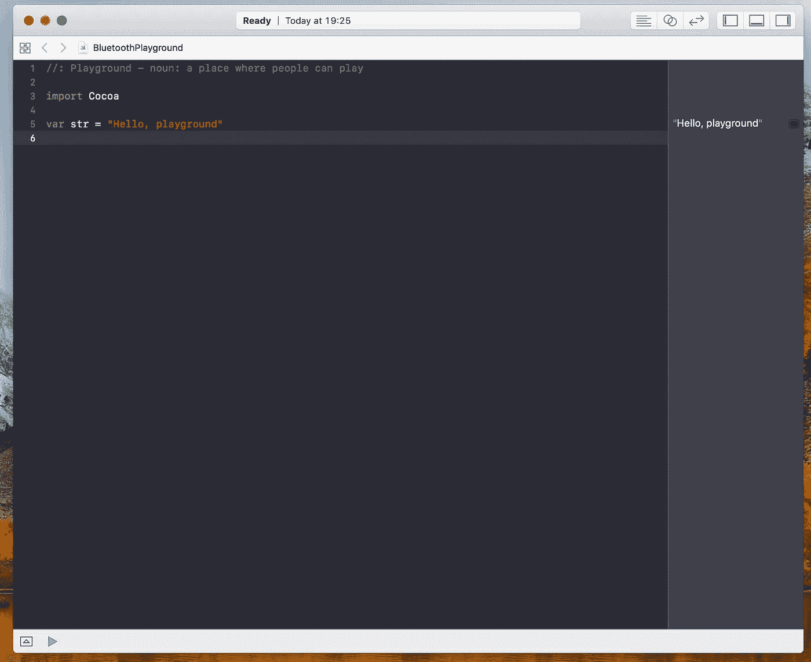
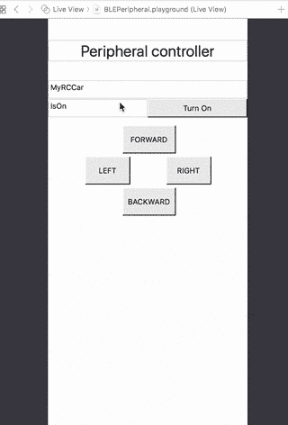
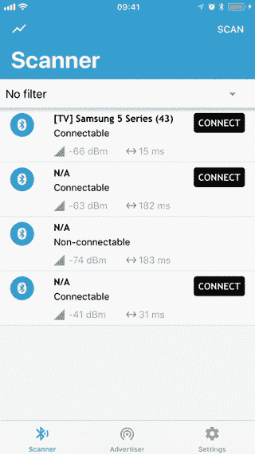

# Swift Playgrounds —模拟蓝牙低能耗

> 原文：<https://itnext.io/swift-playgrounds-simulating-bluetooth-low-energy-cf5738c15a8c?source=collection_archive---------1----------------------->

您可能知道，创建一个使用蓝牙低能耗与一些外部设备通信的移动应用程序，如心率、遥控汽车或任何其他带有 BLE 的物联网设备，可能非常棘手且耗时。

好奇为什么…？

## 蓝牙低能耗

蓝牙低能耗是一种通信协议，允许您与任何内置蓝牙芯片的物联网设备通信，并使用 CBATT 请求和响应从该设备读取和写入信息。

一般来说，蓝牙设备称为外设，手机 app 是一个可以连接给定外设的中心。外围设备可以广告一些广告数据，如名称和已知服务。服务是特性的集合。一个外围设备可以有几个服务，每个服务可以有一个或多个特征。您可以从任何特性中读取数据，在值发生变化时得到通知，或者向该特性中写入一些数据。外围设备和中央设备之间传输的最大数据量为 20 字节！是的，字节，不是比特，不是千字节，不是兆字节，只是字节。Int64 有 8 个字节，所以你可以一次发送 2 个 Int64 值。简单什么事？

## 设备原型制作

任何物联网设备的硬件原型都需要很长很长的时间。你知道 PCB 原型制作、PCB 蚀刻、传感器和芯片焊接、创建第二个、第三个原型……这需要一些时间。

在原型准备好之后，软件专家需要准备一些低级操作系统，所有的芯片和传感器逻辑都已编码。

每个人都可能犯错误，因此需要一些额外时间来调试和测试设备。所有这一切都发生在你开始使用移动应用程序之前！但也许不是！

## 救援的快速操场

模拟自动驾驶汽车 BLE 界面真的很容易，你唯一需要做的就是蓝牙规范和你的 Mac 电脑。

## 要求

*   遥控汽车 BLE 接口规范:

RCCar 蓝牙规范

*   Mac 机器

资料来源:Wikipedia.org

*   Xcode + MacOS 游乐场

# 我们开始吧

一开始，我们需要为 CBPeripheralManager 创建一些抽象。下面我们来讨论一下实现。

TurnOn 方法分配 CBPeripheralManager，它创建给定的对象并将对象委托分配给自己。

在调用 *turnOn* 方法之前，我们需要注册我们希望包含在广告数据中的所有海关服务和特征。为此，我准备了“registerservicecontroller(_ service controller:service controller)”方法。

当 peripheralDidUpdateState 方法被调用，并且我们确定给定的外围设备是打开的，我们可以开始广告数据。广告数据包括:

*   “cbadvertisementdatalocalnamekey ”,这是给定外围设备的广告名称
*   ` cbadvertisementdataserviceuuidskey '这是给定外围设备正在共享的公开广告服务

*关闭*方法是停止广告并删除给定外设的引用。

其他委托方法可用于处理 BLE 读取和写入。

*   *func peripheral manager(_ peripheral manager，didReceiveRead request:CBATTRequest)*当某个外部蓝牙中心(我们的应用程序)想要从给定特征读取数据时执行
*   *func peripheral manager(_ peripheral manager，did receive write requests:[CBATTRequest])*是当某个蓝牙中心试图将一些数据写入给定特征时调用的方法
*   *func peripheral manager(_ peripheral manager，central: CBCentral，did subscribe to character istic:CB character istic)在每次有人希望得到给定特性的每个变化的通知时被调用*

让我们检查一下 ServiceController 协议要求:

如您所见，服务控制器是某种代理，它将读/写和订阅请求传输到给定的特征。

这是我们的 MotionService 实现:

正如您所看到的，read 请求被转移到 movmentCharacteristic，就像任何订阅请求一样。任何写入的请求都会被忽略，因为来自该特性的数据是只读的。

在 object init 中，您可以看到 MotionService 有一个名为 Service 的属性，它是 CBMutableService 的一种类型。这个对象是在 CBPeripheralManager 开始公布数据之前添加的。*CBMutableService(type:CBUUID(string:“0x2fa 2”)，primary: true)* init 方法给我们提供了定义服务 UUID 和服务主选项的可能性。
此外，在外围设备开始广告之前，需要使用 CBMutableCharacteristic 向 CBMutableService 注册该服务中包含的每个特征。

让我们检查特性控制器要求:

如您所见，它与 ServiceController 协议定义非常相似，因此让我们检查一下示例实现:

让我们做一个简单的概述:

MotionCharacteristic 具有 CBMutableCharacteristic 属性，该属性是 CBMutableService 特征数组要求，该属性描述了可以对给定特征执行的所有操作:
*cbmutable character istic(type:CBUUID(string:“0x1a2b”)，属性:[。阅读，。通知]，值:零，权限:[。可读])。*这里我们需要定义给定特征、属性: (读、写、通知)和权限的 UUID。可读、可写)。

要处理读取请求，您只需将新数据值放入 *request.data* 属性。并使用以下签名调用外围设备实例上的方法:*peripheral . response(响应:请求，结果:。成功)*

要处理给定服务上要通知的任何更改，我们需要使用给定的签名对 CBPeripheralManager 执行方法: *updateValue(Data，for: CBMutableCharacteristic，onSubscribedCentrals: nil)。*

这就是为什么我们需要在*方法被调用后存储外围引用。*

让我们把这些放在一起:

就在那之后，我们可以成为外围设备的主人，强迫它做我们想做的事情！

让我们使用 https://itunes.apple.com/pl/app/nrf-connect/id1054362403?的[来检查结果 mt=8](”<a) " > nRF Connect —北欧半导体 ASA < /a >

仅此而已！

游乐场代码可以在这里找到:[https://github.com/gregiOS/Playgrounds](https://github.com/gregiOS/Playgrounds)

另外，你可以在这里查看我的另一篇关于蓝牙低能耗的文章:

[https://blog . untitled kingdom . com/swift-playground-bluetooth-low-energy-8 Fe 15 EB 2 e 6 df](https://blog.untitledkingdom.com/swift-playground-bluetooth-low-energy-8fe15eb2e6df)