# Swift UIImagePickerController

> 原文：<https://itnext.io/swift-uiimagepickercontroller-e37ece745740?source=collection_archive---------2----------------------->

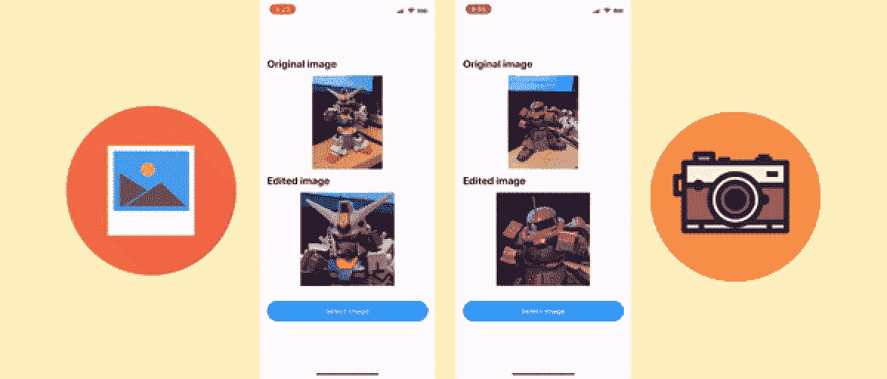

演示从相册和相机源中选择媒体

将用户照片和视频上传到服务器是定制用户资料或在社交媒体上发帖的常见做法。例如，脸书、Twitter 和 WhatsApp 等。苹果提供了一个简单易用的工具`UIImagePickerController`，允许开发者以一种简单的方式在应用程序中实现这一功能。

开发人员可以定义文件的媒体类型(照片或视频)和输入源(用户的相册或相机)。用户还可以在将选定的图像发送到服务器之前，对其进行裁剪和剪切。

本文将介绍每种媒体选择方法的设置过程和主要属性。希望这能帮助你更多地了解 iOS 中的媒体选择！开始吧！

# 从相册中选择照片和视频

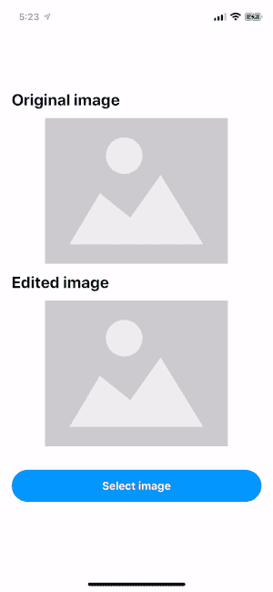

从相册中选择照片的演示

## 第 1 部分— [源类型](https://developer.apple.com/documentation/uikit/uiimagepickercontroller/1619167-sourcetype)

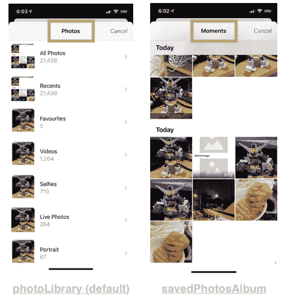

不同种类的源类型—照片图库和保存照片图库

`sourceType`代表文件的来源。它可以是:

1.  `photoLibrary`(默认)显示相册选择页面
2.  `savedPhotosAlbum`直接显示时刻页面

## 第 2 部分— [媒体类型](https://developer.apple.com/documentation/uikit/uiimagepickercontroller/1619173-mediatypes)

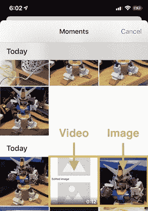

视频和图像是 UIImagePickerViewController 的两种媒体类型

`mediaTypes`定义在`UIImagePickerViewController`显示的文件类型，可以是以下之一:

1.  `UTType.image.identifier`代表图像来源
2.  `UTType.video.identifier`代表视频源

## 第 3 部分— [允许编辑](https://developer.apple.com/documentation/uikit/uiimagepickercontroller/1619137-allowsediting)

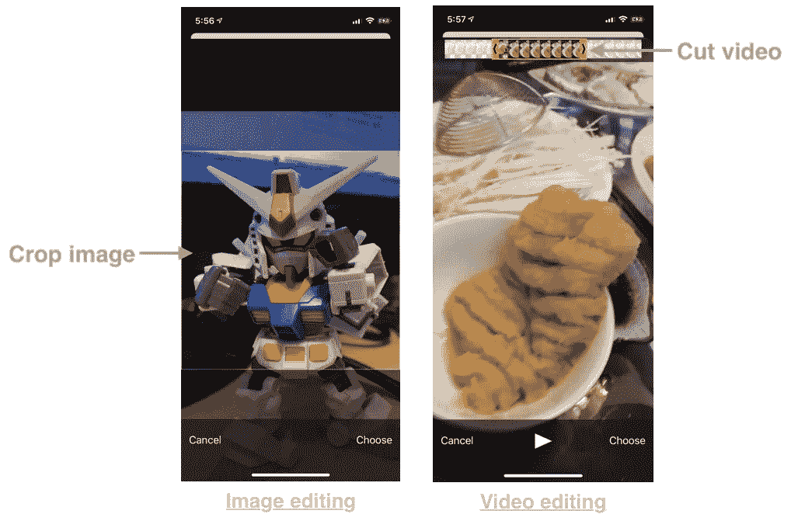

用于在提交到应用程序之前编辑媒体的界面

`allowEditing`表示用户可以在选择照片和视频后对其进行编辑。图像可以裁剪，视频可以剪切。

## 第 4 部分—设置代表

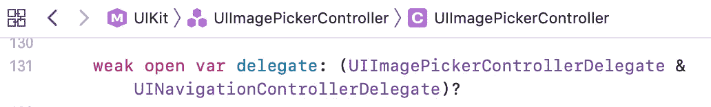

关于委托属性的 UIImagePickerController 的源代码

`UIImagePickerController`的`delegate`属性属于特殊类型。既是`[UIImagePickerControllerDelegate](https://developer.apple.com/documentation/uikit/uiimagepickercontrollerdelegate)`又是`[UINavigationControllerDelegate](https://developer.apple.com/documentation/uikit/uinavigationcontrollerdelegate)`。细节将在以后的会议中讨论。

## 第 5 部分—呈现 UIImagePickerViewController

最后一部分只是简单地将`UIImagePickerViewController`呈现为普通的`UIViewController`。

# 拍摄照片和视频

从摄像机源捕获媒体的演示

## 第 1 部分:摄像头和麦克风权限

从摄像机源捕获图像和视频需要摄像机和麦克风权限

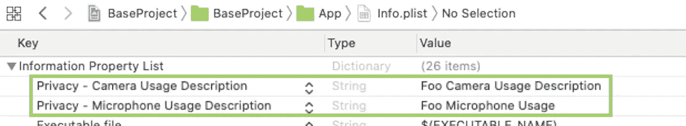

相机和麦克风许可密钥必须添加到 info.plist

在拍照或录制视频之前，必须授予相机和麦克风权限。开发者必须在`info.plist`处声明`NSCameraUsageDescription`和`NSMicrophoneUsageDescription`，然后系统会为我们处理许可请求。

## 第 2 部分— [媒体类型](https://developer.apple.com/documentation/uikit/uiimagepickercontroller/1619173-mediatypes)

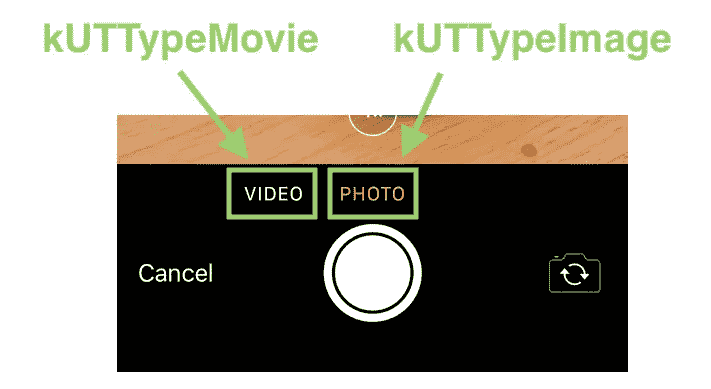

相机模式下 UIImagePickerViewController 的不同媒体类型

`mediaTypes`定义相机拍摄的文件类型。

## 第 3 部分:相机设置

有 3 个标准摄像机参数:

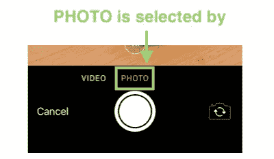

相机设置

1.  `[cameraCaptureMode](https://developer.apple.com/documentation/uikit/uiimagepickercontroller/1619141-cameracapturemode)`:或者`.photo`(默认)或者`.video`。它定义了相机启动时的初始媒体类型是照片还是视频。
2.  `[cameraDevice](https://developer.apple.com/documentation/uikit/uiimagepickercontroller/1619117-cameradevice)`:或者`.rear`(默认)或者`.front`
3.  `[cameraFlashMode](https://developer.apple.com/documentation/uikit/uiimagepickercontroller/1619124-cameraflashmode)`:可以是`.auto`(默认)、`.on`或`.off`。

## 第 4 部分—其他:[允许编辑](https://developer.apple.com/documentation/uikit/uiimagepickercontroller/1619137-allowsediting)，设置代理&呈现 UIImagePickerViewController

提交到应用程序前编辑媒体的界面

其他属性与从用户相册中选择媒体的属性相同。有关更多信息，请参考上一节课。

# `UIImagePickerControllerDelegate`

`[UIImagePickerControllerDelegate](https://developer.apple.com/documentation/uikit/uiimagepickercontrollerdelegate)`用于处理用户的动作，包括确认和取消媒体选择。`[UIImagePickerControllerDelegate](https://developer.apple.com/documentation/uikit/uiimagepickercontrollerdelegate)`只有两个回调:

## 1.image picker controller(_:didfinishpickingmediahwithinfo:)

这是用户刚刚选择或捕获媒体时的回调(在可选地编辑文件之后)。

`info`包含所选文件的所有数据，而`mediaType`可用于区分选择的是图像还是视频文件。不同的选定文件返回不同的信息。

通过按键`originalImage`和`editedImage`可以找回原始图像和编辑后的图像。编辑过的视频网址可以通过`mediaURL`检索。

## 2.imagepickercontrollerdicancel(_:)

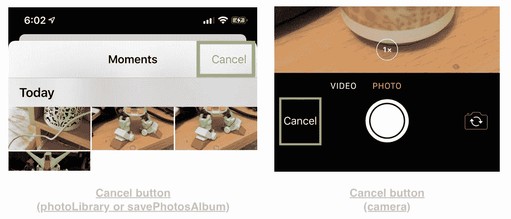

UIImagePickerViewController 上的“取消”按钮

当在媒体选择模式或捕获模式下按下取消按钮时，会触发此回调。

> 在`[UIImagePickerControllerDelegate](https://developer.apple.com/documentation/uikit/uiimagepickercontrollerdelegate)`的两次回调中，当用户确认或取消选择时，开发者有责任解除`UIImagePickerController`。

# 限制

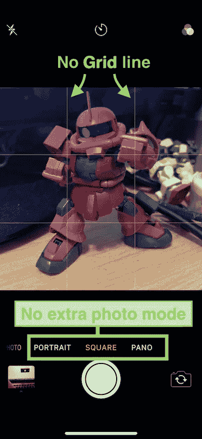

系统摄像头应用程序屏幕截图-显示网格线和额外照片模式

1.  每次只能选择一个文件
2.  默认情况下，捕获视频的持续时间不能超过 10 分钟。
3.  没有网格线可以显示
4.  并非所有照片类型都受 UIImagePickerViewController 支持。比如全景，现场照片，延时和慢动作

# 摘要

1.  `UIImagePickerViewController`提供了一个易于使用的 API，用户可以从设备中选择照片或视频。可以从时刻、相册或相机中选择或捕捉媒体文件。
2.  需要相机和麦克风权限才能通过相机录制视频和拍摄照片。开发者必须在`info.plist`声明`NSCameraUsageDescription`和`NSMicrophoneUsageDescription`
3.  相机可以配置为捕捉模式、相机设备和闪光模式。然而，在`UIImagePickerViewController`中没有网格线和额外的照片模式。
4.  一旦用户确认或取消媒体选择过程，开发人员需要解除`UIImagePickerViewController`。

# 参考

## 1.apple UIImagePickerViewController 官方文档

 [## apple UIImagePickerViewController 开发人员文档

developer.apple.com](https://developer.apple.com/documentation/uikit/uiimagepickercontroller?language=objc) 

欢迎您关注我，在[Twitter @ my rik _ chow](https://twitter.com/myrick_chow)获取更多信息和文章。感谢您阅读这篇文章。祝您愉快！😄