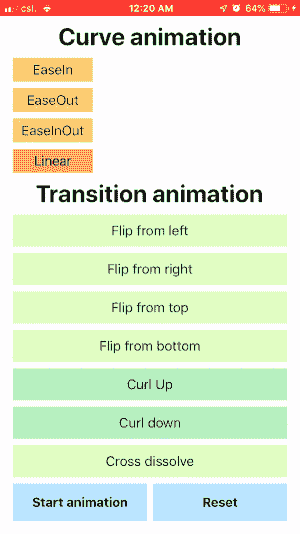
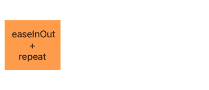
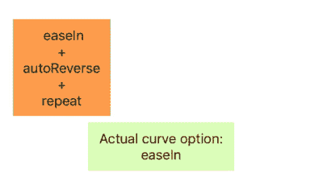
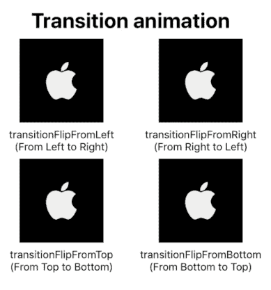
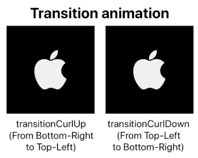
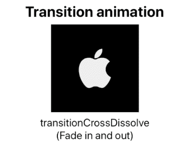

# 快速 UIView 可爱的动画和过渡

> 原文：<https://itnext.io/swift-uiview-lovely-animation-and-transition-d34bd623391f?source=collection_archive---------0----------------------->

为了改善整体用户体验，操作系统应用程序通常使用大量平滑的动画来使应用程序看起来更漂亮。大量的 iOS 默认小部件已经用 UIKit 动画实现了。例如，在 UINavigationController 中的页面之间转换时的动画，呈现 UIViewController 和显示系统键盘等。同时，苹果开放 UIView 动画 API，供开发者轻松创建自定义动画。让我们简单看一下那些默认动画是什么样子的。



曲线和过渡动画

# 曲线动画

UIKit 中总共有 4 个常用的曲线动画选项，每个选项在不同的时间帧中的速度都不同。


所有动画都有相同的持续时间— 1.0 秒


下面是相应的描述:
*(如果你已经从上图中得到了主旨，可以跳过😄)*

1.  **curveEaseIn (Blue)** 虽然它的初速度很低，但在**恒定加速度**下，它在终点达到最高速度。
2.  **curveEaseOut(红色)** 一个`curveEaseIn`的水平翻转。
3.  **curveEaseInOut(黄色)** `curveEaseIn`前半段和`curveEaseOut`后半段的组合。
4.  **curveLinear(绿色)** 随着**零加速度**，其速度在整个动画中大致保持不变。

## 其他曲线动画选项:

1.  **allowUserInteraction** 😅！幸运的是，通过设置一个额外的动画选项`allowUserInteraction`和原来的曲线动画选项，可以启用交互。见下文:

2.**重复**



不言自明。简单地无限重复原始动画。要阻止它:

3.**自动反转**



*   `autoreverse`的定义有点棘手。向前动画与向后动画相反。例如，如果向前动画是`curveEaseIn`，向后动画是`curveEaseOut`。
*   注意，`autoreverse`必须与`repeat`配合使用，否则反向动画完成后，视图会立即移动到正向动画的原始目的地。

# 旁注:关注 NSLayoutConstraint

到目前为止，在观看动画的过程中，你还有什么问题吗？🧐

```
Q1: What happened to the original leading margin constraint when UIView (e.g. easeInLabel) is horizontally moved? Constantly updating?Q2: If other views' Auto-Layout constraint is pinned to the position of easeInLabel, will they move at the same time? Will there be any chaos? 
```

苹果公司明确表示，即使有任何转换应用于任何 UIView，自动布局也不会更新。这防止了对其他相关 UIView 的任何重新调整，因此不会发生混乱。

> 在 iOS 8.0 及更高版本中，`*transform*`属性不影响自动布局。自动布局根据视图未变换的框架计算视图的对齐矩形。
> 参考:[转换— UIView |苹果开发者文档](https://developer.apple.com/documentation/uikit/uiview/1622459-transform)

# 过渡

共有 7 个常见的过渡动画选项，可分为 3 类，由 UIKit 提供。它们是:

1.  轻弹

*   transitionFlipFromLeft
*   transitionFlipFromRight
*   过渡触发器
*   transitionFlipFromBottom



2.冰上溜石游戏

*   过渡曲线
*   过渡曲线下降



3.其他的

*   过渡交叉溶解



## 与其他`UIView.AnimationOptions`的组合

过渡动画也可以像之前显示的那样与`allowUserInteraction`、`repeat`和`autoreverse`一起工作。下面是演示代码:

# 结论

1.  动画是让 iOS app 看起来有吸引力的有力工具！
2.  常见的动画有两种，即“曲线动画”和“过渡动画”。
3.  曲线动画选项包括`curveEaseIn`、`curveEaseOut`、`curveEaseInOut`和`linear`。它们的初速度和终速度不同。
4.  过渡选项包括三个主要类别，即`flipping`、`curling`和`other`。所有选项为`transitionFlipFromLeft`、`transitionFlipFromRight`、`transitionFlipFromTop`、`transitionFlipFromBottom`、`transitionCurlUp`、`transitionCurlDown`和`transitionCrossDissolve`。
5.  曲线动画和过渡动画都可以与其他动画选项配合使用，如`allowUserInteraction`、`repeat`和`autoreverse`。
6.  对于`autoreverse`，必须将**与`repeat`设置在一起，否则会产生奇怪的动画。**

如需了解更多信息，请在[Twitter @ myrik _ chow](https://twitter.com/myrick_chow)关注我。感谢您阅读这篇文章。祝您愉快！😄