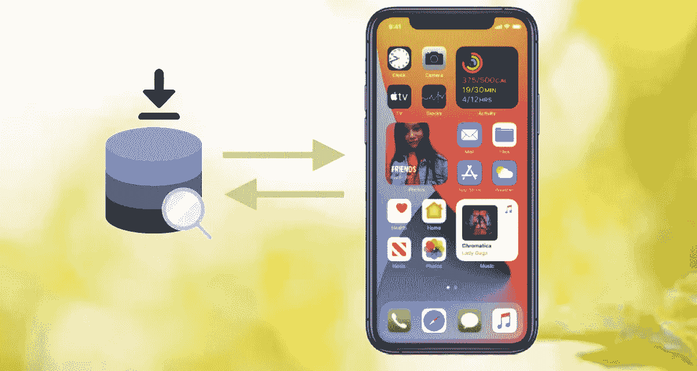

# Swift UserDefault —只需 3 步即可保存自定义对象！

> 原文：<https://itnext.io/swift-userdefault-save-custom-object-in-3-steps-only-f4dcf76e85b4?source=collection_archive---------0----------------------->

从原始数据(如`String`、`Int`、`Double`、`Data`、`Array`、`Bool`、&、`URL`)到`[UserDefaults](https://developer.apple.com/documentation/foundation/userdefaults)`的转换是一项简单的任务，但对定制对象的转换却并非易事。在过去，开发人员可能需要以`Dictionary`的格式保存一个对象，并手动解析它。

幸运的是，苹果发布了一个新协议`[Codable](https://developer.apple.com/documentation/swift/codable)`。任何符合`Codable`的类/结构都可以通过`[JSONEncoder](https://developer.apple.com/documentation/foundation/jsonencoder)`和`[JSONDecoder](https://developer.apple.com/documentation/foundation/jsondecoder)`与`Data`格式相互转换。然后我们可以直接在`UserDefaults`中保存和检索`Data`。

我们只需要 3 个主要步骤来实现自定义对象的保存和解析。开始编码吧！

# 最终目标

用于保存和检索数据的语法冗长而乏味。最好简化成只有一行代码(见上面第 2 行&第 5 行)。详细内容将包含在后面的“更简单、更易读的代码”部分。

# 分步指南

## 步骤 1)对象声明—符合`Codable protocol`

`Codable`是`Encodable`和`Decodable`协议的类型别名。对象必须符合`Codable`，以便通过`[JSONEncoder](https://developer.apple.com/documentation/foundation/jsonencoder)`和`[JSONDecoder](https://developer.apple.com/documentation/foundation/jsondecoder)`编码为`Data`格式和从`Data`格式解码。

> 请记住，任何嵌套对象也必须符合`Codable`协议，以便将整个对象与`Data`相互转换，并在稍后阶段保存到用户默认值。

## 步骤 2)保存数据

在第 2 行，为`UserDefaults`创建一个`extension`可以简化用法并增加代码可读性(见第 13 行)。

在第 5 行，`JSONEncoder`将可编码对象编码到`Data`，稍后将数据保存到`UserDefaults`。

在第 13 行，保存`Data`到`UserDefaults`的代码与保存原语类型类似，即`UserDefaults.standard.set(100, forKey: "fooKey")`。

## 步骤 3)检索数据

在第 5 行，保存的`Data`由`data(forKey:)`函数从`UserDefaults`中检索，当数据尚未保存到该键时为`nil`。

在第 8 行，`JSONDecoder`将检索到的`Data`解码成输入的可编码的`dataType`。它可能抛出错误，因为检索到的`Data`可能包含无效的键值对。

在第 14–15 行，检查可选状态后，解码后的`Codable`对象可以直接使用。

# 更简单、可读性更强的代码

为了进一步简化从`UserDefaults`保存和检索数据的代码，我们可以使用上面所示的`static` Swift 属性的`getter`和`setter`函数(第 4 行&第 7 行)。

因此，保存和检索数据的代码可以分别简化为一行代码(参见第 14 & 15 行)。

# 摘要

`UserDefaults`可以简单保存符合`Codable`协议的自定义对象。`JSONEncoder`和`JSONDecoder`在处理数据转换中起着重要的作用。嵌套对象也必须符合`Codable`协议才能成功编解码。

# 进一步阅读:

1.  关于`Codable`协议的更多信息

 [## Swift Codable — JSON 解析器

### Codable 是一种可以将 Swift 对象本身转换为数据类型或从数据类型转换出来的协议。Codable 是…的类型别名

itnext.io](/swift-codable-json-parser-8661bb57bea7) 

欢迎您通过[Twitter @ my rik _ chow](https://twitter.com/myrick_chow)关注我，了解更多信息和文章。感谢您阅读这篇文章。祝您愉快！😄