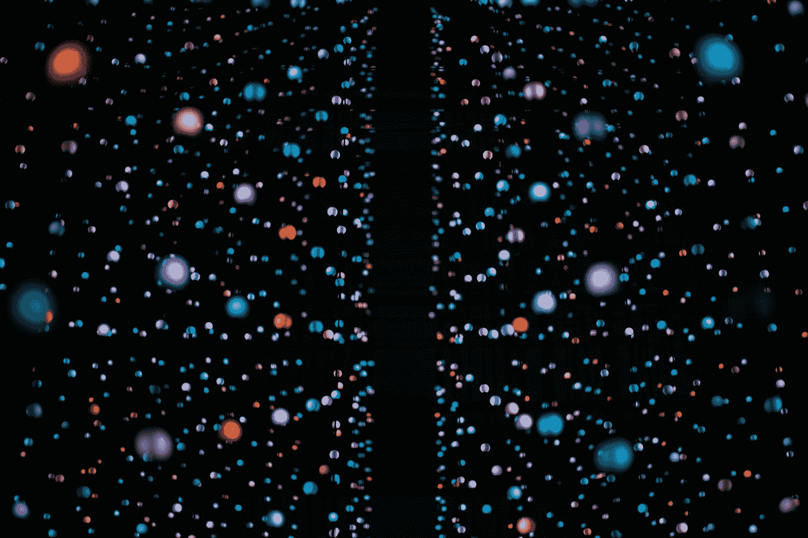
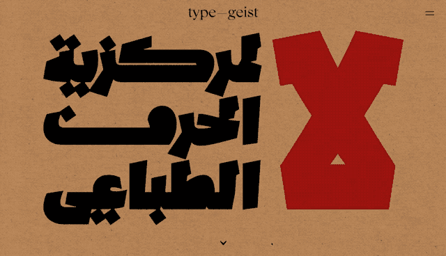
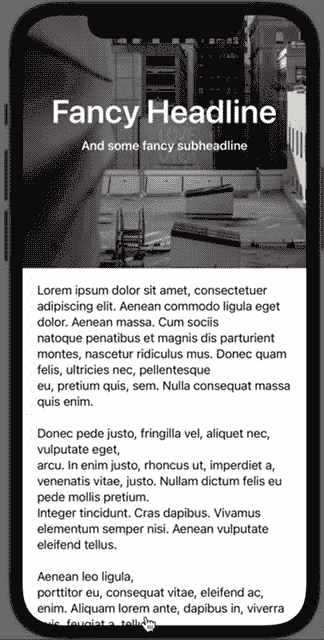

# SwiftUI:为你的视图添加一个漂亮的标题倾斜动画

> 原文：<https://itnext.io/swiftui-add-a-nice-header-skew-animation-to-your-views-1ec39146aaf1?source=collection_archive---------0----------------------->

照片由乔纳斯·德尼尔在 [Unsplash](https://unsplash.com?utm_source=medium&utm_medium=referral) 上拍摄

在一些关于排版的研究中，我在我访问的一个网站上发现了一个有趣的 UI 效果，我认为它可以完美地应用于 SwiftUI:

https://typegeist.org/[上的头球动画](https://typegeist.org/)

滚动页面会很好地倾斜、阴影和旋转标题，就好像它在某种立方体上一样。

虽然这个动画当然是在 web 的 JS/CSS 中实现的，但它应该很容易在 Swift 和 SwiftUI 中采用，并为任何带有某种标题部分的视图创建良好的效果。

## 目标

我们的最终目标是拥有某种类似于网页版的文章视图，标题部分后面跟着一些纯文本:

为了简单起见，我们只使用一个长的虚拟文本，并从[https://unsplash.com](https://unsplash.com)中选取一些图像作为标题背景。

在幕后，我们将使用一个包装在 ScrollView 中的堆栈，其中我们将使用一个 GeometryReader 来测量滚动位置。

**效果本身其实很简单，由三件事组成:**

1.  图像的旋转
2.  图像的垂直移动与应用的旋转同步
3.  一些阴影来模拟一个更加真实的 3D 效果

## 旋转

为了计算旋转，我们用两个新函数扩展了角度结构:

1.  *偏移(高度:CGFloat，插入:CGFloat)*
2.  *旋转(来自:* GeometryProxy *)*

第一个函数计算一个偏移量，将滚动量转换为旋转本身，以确保动画不会太快。基本上就是我们视图当前高度的 1%的计算。我们可以在这里使用绝对值，但这将限制功能，只支持一个静态高度的标题容器。使用这种方法，标题可以具有任何高度，并且转换是动态的，因为它使用相对值。

第二个函数是计算并返回实际的旋转。我们首先利用之前定义的函数来计算滚动偏移量，然后计算滚动平移本身的偏移量。

最后一步是计算旋转的值。如果用户滚动了视图，我们返回滚动值乘以我们之前计算的偏移量的度数。

取普通值会导致旋转太快，不能很好地与视图的顶部边缘对齐。

## 滚动偏移量

接下来，我们用一个简单的函数来扩展 GeometryProxy 结构，以计算 ScrollView 中 GeometryReader 的滚动位置。没有这个，就不可能测量用户滚动视图的量。

计算 ScrollView 滚动的偏移量

## 阴影

效果的最后一部分是添加一些阴影。为此，我们在标题视图中添加了一个简单的函数:

## 完整视图

如前所述，我们通过将 VStack 封装在 Scrollview 中来构建文章视图。忽略开头的大型虚拟文本，我们从第 42 行开始进行扩展。

第 65 行标记了标题视图本身的开始，与第 114 行的主内容视图分开。如前所述，我们只是将一个 ZStack 封装在一个 GeometryReader 中，并用我们的图像、标题和副标题填充它。

ZStack 是阴影所需要的，这个阴影是由某个矩形(第 93 行)实现的，这个矩形利用了我们之前的阴影函数。

标题视图本身是在 ContentView 的第 118 行实现的。在下面，我们只是添加虚拟文本。

这差不多就是全部了。有了这个，我们就能达到最初的预期效果。