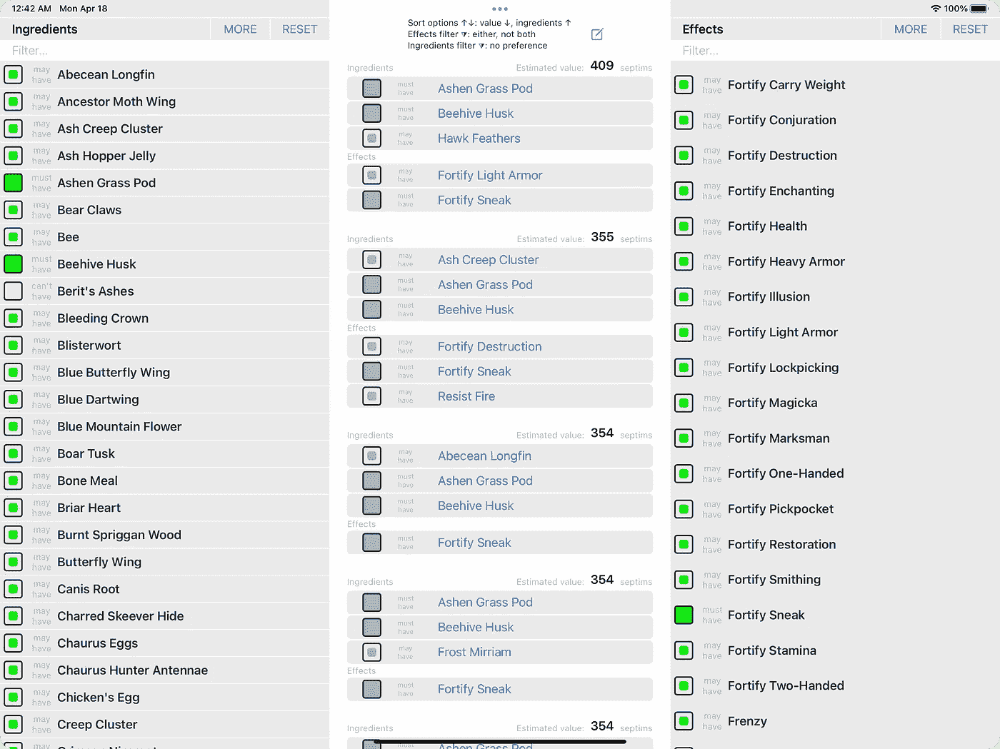
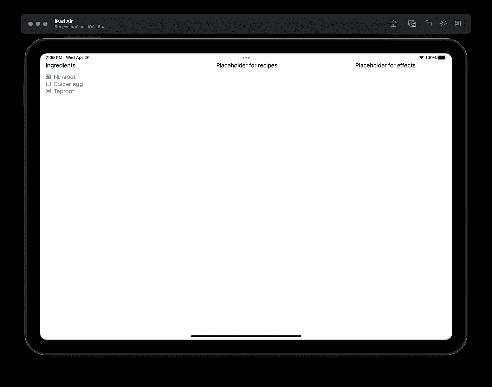
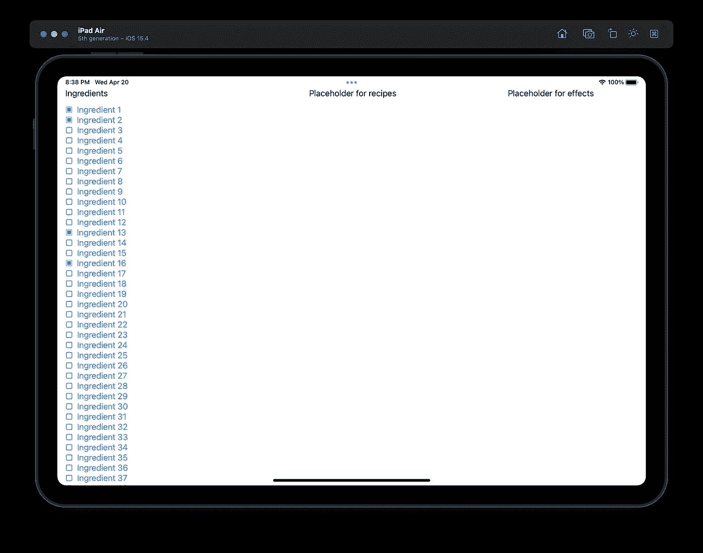

# SwiftUI 案例研究:兄弟会炼金术士的数据建模

> 原文：<https://itnext.io/swiftui-case-study-brotherhood-alchemist-ed72bf8969ee?source=collection_archive---------0----------------------->

SwiftUI 相对较新，我们 iOS 开发社区中的许多人仍在适应这种声明性语言。在 SwiftUI 中有很多简单的如何管理“状态”的例子，但是很少有实际的完全工作的应用程序例子。

在这篇文章中，我将讲述我在使用 SwiftUI & Combine 从零开始重写兄弟会炼金术士时学到的经验。我如何学会不对数据建模，以及它如何影响这个相对简单的应用程序的性能。

黑暗兄弟会手形符号(用作应用程序图标)

# 基本要求

Brotherhood Alchemist 是一个 iPhone/iPad 应用程序，用户可以在其中选择想要的成分和效果，应用程序会列出所有可用的匹配炼金术配方。这是一款 Skyrim(电脑游戏)的配套应用。

为了达到这个效果，每种成分有四种效果；比如回复生命值，伤害耐力等等。兄弟会炼金术士的 1.2 版本捆绑了 110 种独特的成分，结合了 55 种独特效果中的 4 种。

对于每种效果或成分，用户能够指定结果屏幕中显示的食谱是否“必须具有”、“可能具有”或“不能具有”成分或效果。

例如，用户在其当前库存中可能没有任何“Nirnroot ”,因此他们可以将该成分设置为“不能有”。他们可能有多余的主根，或者只是在寻找包含主根的食谱，所以他们将其设置为“必须有”。其他允许但非绝对必要的成分设置为“可能有”。类似地，一个用户可能只寻找治疗药剂，所以他们设置“再生生命值”为“必须拥有”，设置“伤害生命值”为“不能拥有”。

当所有的成分和效果都设置为“可能有”时，该应用程序会生成超过 25，000 种食谱。一个有效的配方是通过将两种或两种以上具有共同功效的配料相匹配而产生的。一些组合创造了多达 5 种效果的有效药剂。

# 用户界面设计

风景版 iPad 上的兄弟会炼金术士

在 iPad 上，设计相对简单。我们将屏幕分成三列:左边包含配料，右边包含效果，中间包含匹配的食谱。

为了实现这个设计，我们有一个 ContentView，它为每一列定义了一个带有自定义 SwiftUI 视图的 HStack。

每个视图都由一个位于其根的 VStack 和一个 ScrollView 组成，VStack 包含标题，scroll view 本身包含 LazyVStack 和 ForEach 循环。

# 挑战

我们必须对数据建模并管理状态，以便可以在不影响效果列表的情况下切换成分(而不是重新绘制效果列表)。同样，我们希望能够切换效果，而不会导致成分列表被重新绘制。每当成分或效果被切换时，食谱列表应该被刷新。

虽然 SwiftUI 有一些内置的状态比较逻辑来避免刷新，但我们将回顾可用于避免不必要的视图刷新的技术，以及在应用程序中管理和共享状态的不同方式。

最后，我们将介绍我确定的将视图更新减少到最低限度的方法之一。

# 示例的来源

 [## GitHub-ekscrypto/swift ui-案例研究-兄弟会-炼金术士:Medium.com 的配套资源库…

### 此时您不能执行该操作。您已使用另一个标签页或窗口登录。您已在另一个选项卡中注销，或者…

github.com](https://github.com/ekscrypto/SwiftUI-Case-Study-Brotherhood-Alchemist) 

# 第 1 部分—入门

首先，我们将创建我们的成分和效果基本类型。现在我们可以忽略成分和效果之间的联系。

如果我们遵循一些“基本的”SwiftUI 教程，我们可能会倾向于从 ContentView 中的@State 变量开始。让我们从这一点开始，看看它会把我们引向何方。

我们还将限制自己，现在只讨论 IngredientsList 和 ContentView，看看它们是如何交互的。

第 1 至第 3 部分测试应用的 iPad 预览

## 基本数据类型

第 1 部分的 DataTypes.swift

## 内容视图

第 1 部分的 ContentView.swift

## 配料明细视图

## 配料清单

第 1 部分的 IngredientsList.swift

## 观察到的行为

点击配料时，ingredients 列表中定义的按钮被触发，toggle(ingredient:)功能更新所选配料的数组。这又会导致重新处理 IngredientsList 和 IngredientInfo 视图之一。

第 1 部分的 Xcode 控制台日志

理想情况下，我们希望只对 IngredientInfo 进行重新处理，但是因为“selected”参数是从 IngredientsList 接收的，所以这是不可能的。

> **经验教训** : SwiftUI 足够智能，能够通过比较以前发送的参数和更新的参数，知道子视图是否需要处理。只有当参数不同时，才会重新处理子视图。

# 第 2 部分—将“选定”绑定到 IngredientInfo

我想探索的一个解决方案是，是否有可能将 IngredientsList 中使用的@Binding“转发”到 IngredientInfo，并让 IngredientInfo 执行切换和自我更新。

我们仍然需要 ContentView 来保存@State 变量，因为它需要能够在以后与 Recipes 列表共享该状态。让我们试一试，看看会发生什么。

## 配料明细视图

第 2 部分的 IngredientInfo.swift

显著变化:

*   第 5 行:我们定义了@Binding。
*   第 9 行:现在有了来自 IngredientsList 列表的按钮
*   第 13 行:我们更新了如何检测成分是否被选中
*   第 19–25 行:增加了切换(成分:)功能

## 配料清单

第 2 部分的 IngredientsList.swift

显著变化:

*   切换选择的按钮和代码不再存在
*   第 16 行:我们将@Binding 转发给子视图。我们可以在这里使用 Binding(projectedValue: …)或$selected，实现相同的行为。如果有人对最理想的语法有详细的了解，请随时发表评论！

## 观察到的行为

当点击其中一种配料时，现在在 IngredientInfo 中定义的按钮被触发，toggle(ingredient:)更新所选配料列表。

每次更新时不再处理 IngredientList，而是刷新每个 IngredientInfo 视图。随着更多的成分和效果有待添加，这是不可取的。控制台清楚地显示了三个 IngredientInfo，每当我们切换其中任何一个时，它们都会被更新。

第 2 部分的 Xcode 控制台日志

注意，多亏了 LazyVStack，只有当前屏幕上的成分会被更新，即使我们有了 110 种成分。但理想情况下，我们希望更新单个 IngredientInfo 视图。

> **经验教训**:如果视图实际上从绑定中提取了任何数据，那么将@Binding 转发给每个视图将导致当绑定的数据改变时，这些视图中的每一个都被处理。
> 
> **额外的经验教训**:当数据改变时，接收@Binding 并简单地转发它不会导致视图被处理。

# 第 3 部分—在 IngredientInfo 中使用闭包

由于@Binding 导致每个 IngredientInfo 视图在对所选成分的任何更改时被处理，因此我们可以为 IngredientInfo 提供一个闭包，让它更新自己的状态。

## 配料明细视图

第 3 部分的 IngredientInfo.swift

显著变化:

*   第 5 行:接收按钮被按下时要执行的动作
*   第 6 行:定义@State 变量来跟踪 UI 更新的选择状态
*   第 11 行:用切换操作的结果更新我们的@State
*   第 14 行:使用@State 变量更新 UI

## 配料清单

第 3 部分的 IngredientsList.swift

显著变化:

*   第 16 行:向 IngredientInfo 提供按钮被按下时要执行的操作
*   第 23–31 行:实现切换选择的代码
*   选择状态不再转发给 IngredientInfo

## 观察到的行为

当点击一个成分时，IngredientInfo 中的按钮执行它从 IngredientsList 收到的闭包。这反过来更新所选的配料，然后返回更新的选择状态。有了更新的状态，按钮的动作闭包中的代码现在可以更新它的状态了。

查看日志，我们可能认为我们有一个可行的解决方案，因为只有 IngredientInfo 得到更新。因此，在下面的第 4 部分中，我们将添加更多的成分来巩固我们的解决方案。

第 3 部分的 Xcode 控制台日志

> **经验教训**:我们可以为子视图提供一个闭包，而不是提供@Binding，在某些情况下，这可能足以阻止所有视图的刷新。
> 
> **额外的经验教训**:即使一个视图接收到一个@Binding 并修改了它的内容值，如果该视图没有在它的视图构建器中使用一个值，当该值改变时，该视图将不会被重新处理。

# 第 4 部分—更多成分

基于我们在第 3 部分中的成功经验，让我们看看是否可以添加更多的成分并保持预期的行为。

第 4 部分测试应用的 iPad 预览

## 包含更多成分的内容视图

第 4 部分的 ContentView.swift

显著变化:

*   第 4 行:用 100 个动态生成的成分替换了 3 个成分

## 观察到的行为

令人惊讶的是一切正常！老实说，当视图被滚动到屏幕之外时，我期望视图被释放。然而，一旦在 LazyVStack 中启动了一个视图，即使该视图不再可见，它的状态也会保持不变。

> **经验教训** : LazyVStack 只会实例化足够的视图来填充屏幕，但是会保持之前实例化的视图的状态，即使它们不再可见。

# 第 5 部分—过滤

现在我们已经解决了视图刷新问题，让我们看看是否可以实现成分过滤，以便用户可以快速找到所需的成分。

为此，我们需要通过添加一个文本字段来修改 IngredientsList 视图。在文本字段中输入的值将用于成分名称的部分匹配。为了使我们的生活更容易，我们将回到我们最初在第 1、2 和 3 部分中的 3 种成分的列表。

## 配料清单

第 5 部分的 IngredientsList.swift

显著变化:

*   第 6 行:一个新的@State 变量，包含用户输入的过滤器
*   第 8–14 行:计算属性，用于轻松检索与过滤器匹配的成分
*   第 20 行:添加 Textfield 来捕获用户的过滤器
*   第 23 行:迭代过滤后的成分而不是配料

## 观察到的行为

我们的配料清单和预期的一样有效。每种成分都可以保持其状态，无论是过滤掉的还是可见的。

这样做的原因是**状态是基于每个 id 维护的**。由于我们的配料的 id(UUID)对于每种配料都是唯一的和永久的，因此 LazyVStack/ForEach 和 SwiftUI 能够跟踪每种配料的状态，并在过滤器更新时重新绘制视图。

> **经验教训**:一旦一个视图被实例化，这个视图的状态就以每个 Id 为基础被保存。如果视图在将来的某个时候以相同的 Id 重新出现，那么在调用视图构建器之前，该视图的状态将被恢复。

# 第 6 部分—重置

兄弟会炼金术士应用程序提供了一些重置选项，但为了我们的案例研究，让我们假设重置按钮会将所有效果重置回未选中状态。

因为这是在 IngredientsList 中定义的按钮，所以让我们看看是否可以简单地更新我们收到的@Binding，类似于我们如何切换配料。

## 配料清单

第 6 部分的 IngredientsList.swift

显著变化:

*   第 19–27 行:用带有标题和重置按钮的 HStack 替换只包含“配料”标题的简单文本。
*   第 51–53 行:将所有成分的状态重置为未选择的功能

## 观察到的行为

当列表出现时，如果我们切换成分，一切似乎都像预期的那样工作。然而，当我们按下重置按钮时，我们会注意到配料没有被重置。

这是因为每个 IngredientInfo 都维护自己的@State，因此即使修改了@Binding，IngredientInfo 视图上的可视指示器也不会重置。

我们可以确认@Binding 已被正确修改，方法是首先打开一个成分，点击 reset 按钮，然后尝试关闭该成分。因为当我们再次点击重置以切换配料时，已经通过点击重置取消选择了配料，所以在@Binding 中，配料将从未选择变为已选择，并且 IngredientInfo 将再次显示为已选择。

很明显，用户感到困惑，应用程序不再显示我们想要的状态。

> **经验教训**:当一个视图保持它自己的@状态时，它会与应用程序中发生的其他状态变化断开连接。

我们正在有效地尝试同时从两个不同的地方维护相同的状态。我们可以使用 NotificationCenter 通知或@Environment 变量来通知每个视图应用程序的主状态已经改变。然而，如果可能的话，应该避免**试图在多个地方同步状态**。

我们已经知道，对每个 IngredientInfo 使用@Binding 将导致在切换任何成分时处理每个 IngredientInfo 视图(参见第 2 部分)。

我们还知道，如果我们手动将选定的状态传递给 IngredientInfo，将会重新处理 IngredientList 和受影响的 IngredientInfo 视图。

也许我们可以调整我们的数据模型来跟踪所选择的状态。

# 第 7 部分—可观察物体

SwiftUI 允许我们观察对象的变化。理论上，这应该允许一个对象实例被转发给所有视图，然后每个视图观察对象的状态。根据我们如何组织我们的数据模型，这可能是有用的，但它可能不会为我们选择的成分列表工作。

不过，让我们看看当我们试图将成分列表包装成一个可观察的对象时会发生什么

## 数据类型

第 7 部分的 DataTypes.swift

显著变化:

*   第 13–15 行:添加了声明为 ObservableObject 的选定类
*   第 14 行:@Published 变量，以确保对象将正确地传播。成分更新时的 objectWillChange()通知

## 内容视图

第 7 部分的 ContentView.swift

显著变化:

第 10 行:对于新选择的类，我们将@State 变量替换为“let”。

## 成分详细信息

第 7 部分的 IngredientInfo.swift

显著变化:

*   第 5 行:用新选择的类定义了@ObservedObject
*   第 7–9 行:正确计算生活质量，以方便检查当前是否选择了配料
*   第 17 行:使用 computed 属性更新 UI
*   第 24–28 行:更新了切换函数以更新所选的类对象

## 配料清单

第 7 部分的 IngredientsList.swift

显著变化:

*   第 5 行:我们不再收到所选成分的@ Binding 替换为对我们选择类的简单“字母”引用
*   第 35 行:我们将选定的对象引用传递给 IngredientInfo 视图

## 观察到的行为

复位功能最终按预期工作。成分的状态既可以由 IngredientInfo 切换，也可以由 IngredientsList 重置。但是，由于所选的类会在所选的成分发生变化时发布. objectWillChange()通知，并且每个 IngredientInfo 视图都使用@ObservedObject，因此我们会遇到刷新问题，即每当切换任何成分时，每个 IngredientInfo 视图都会更新。

> **经验教训**:如果我们的视图只对被观察对象的特定元素感兴趣，使用@ObservedObject 可能会导致不必要的视图刷新。

# 第 8 部分—@发布时没有可观察对象

SwiftUI 视图可以为@Published 属性定义 onReceive observers，这允许视图定义一些自定义代码，这些代码可能更新也可能不更新视图的@State。

## 数据类型

显著变化:

*   第 13 行:我们的类不再需要符合 ObservableObject

## 成分详细信息

显著变化:

*   第 5 行:删除了@ObservedObject 修饰符
*   第 7 行:用@State 变量替换了 computed 属性，用于 UI 更新
*   第 19–24 行:添加了一个接收观察器，用于检测所选成分的变化何时会产生@State 变化。

## 观察到的行为

一切都像魔咒一样管用。IngredientInfo 视图能够切换配料选择；IngredientList 能够正确重置选择；并且仅更新受影响的视图。

> **经验教训**:通过定义自定义观察器并实现您自己的逻辑来决定何时以及如何更改将影响视图的@State，可以避免 ObservedObject 的过度刷新
> 
> **学到的额外经验**:您可以监视@Published 属性，而不需要父类符合 ObservableObject

# 第 9 部分—有状态成分

因为我们现在可以使用@Published 只公开一个类的属性，所以让我们看看是否可以对我们的数据建模，以便向我们的组件公开一个. selected 属性。

## 数据类型

第 9 部分的 DataTypes.swift

显著变化:

*   第 3 行:将 struct 更改为类
*   第 5 行:添加@Published 变量来保存选中的状态
*   第 8–10 行:定义初始化器来设置 name 属性

## 内容视图

第 9 部分的 ContentView.swift

显著变化:

*   删除了“让选择”,因为状态现在存储为配料对象的一部分
*   不再将“选定的”转发到成分列表

## 成分详细信息

第 9 部分的 IngredientInfo.swift

显著变化:

*   移除了 isSelected @State 变量
*   第 5 行:添加了@State 变量来指示 SwiftUI 何时更新视图
*   第 9 行:从视图构建器中访问@State 变量，否则它会被 SwiftUI 忽略，视图永远不会更新
*   第 14 行:UI 现在直接根据配料属性进行更新
*   第 18 行:。onReceive 更新以观察成分的@Published 属性，并在状态改变时简单地改变@State 变量的值
*   第 24 行:将切换逻辑简化为简单地翻转布尔值

## 配料清单

第 9 部分的 IngredientsList.swift

显著变化:

*   不再需要“让选定的”作为成分对象保持状态
*   不再需要将选定的配料转发给 IngredientInfo
*   第 41 行:更新了重置函数来重置配料对象的状态

## 观察到的行为

一切又一次如预期的那样工作。视图仅在需要时刷新。只要我们有配料的参考，就可以很容易地访问配料状态，并且可以很容易地从任何地方切换或重置。

> **经验教训**:仔细规划您的界面需要如何与您的数据交互，将允许您更新您的数据模型，使其更容易访问和观察。
> 
> **额外的经验教训** : SwiftUI 通常与 class 一起使用比与 struct 一起使用更好，因为它允许在需要时单独观察@Published 变量。而@Binding 可能会触发不必要的视图刷新。

# 结论

虽然在本文中我们没有重新实现 Brotherhood Alchemist 应用程序的整个逻辑，但我们确实学到了一些有价值的经验，希望能够帮助您创建更适合 SwiftUI 的数据模型。

必须小心使用 ObservableObject，并且应该避免@Binding，因为它可能经常是糟糕的数据建模的标志。

在许多情况下，使用类而不是结构可以通过定义@Published 属性来减少视图刷新的次数。

最后，如果因为不再使用@State 变量而导致视图无法刷新，那么引入某种@State 变量就相对容易了，您可以将它用作 SwiftUI 的更新触发器。

我希望你喜欢这篇文章，并祝你编码的日子快乐！

好奇自己尝试兄弟会炼金术士？请登录苹果应用商店查看，网址为[https://apps . Apple . com/App/brotherhood-alchemist/id 1292251831](https://apps.apple.com/app/brotherhood-alchemist/id1292251831)