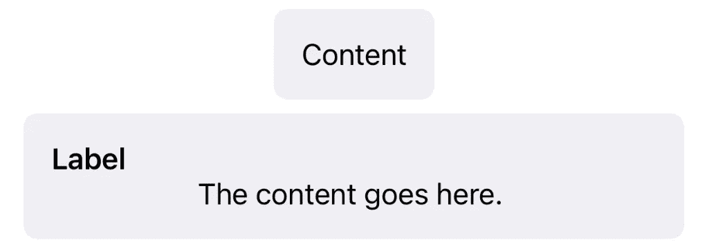
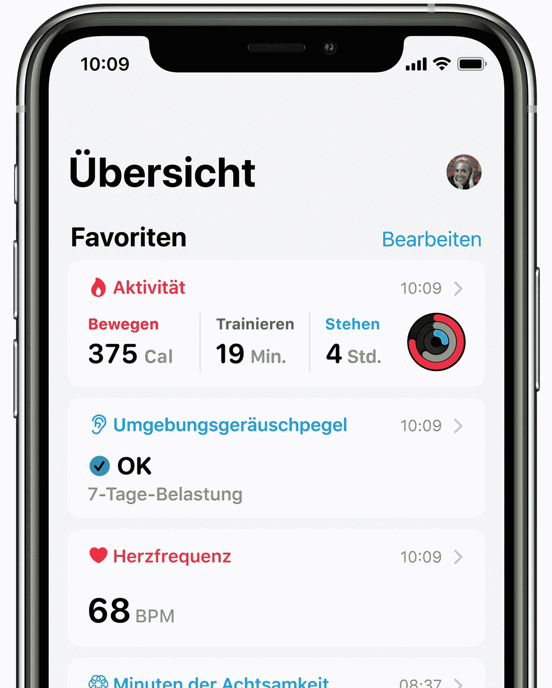
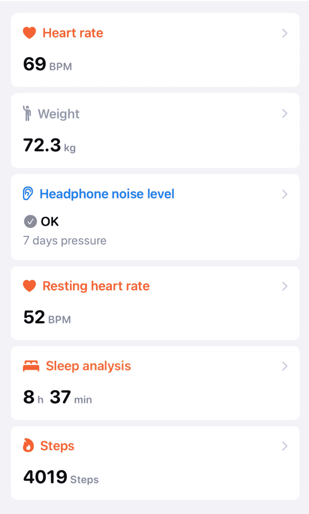
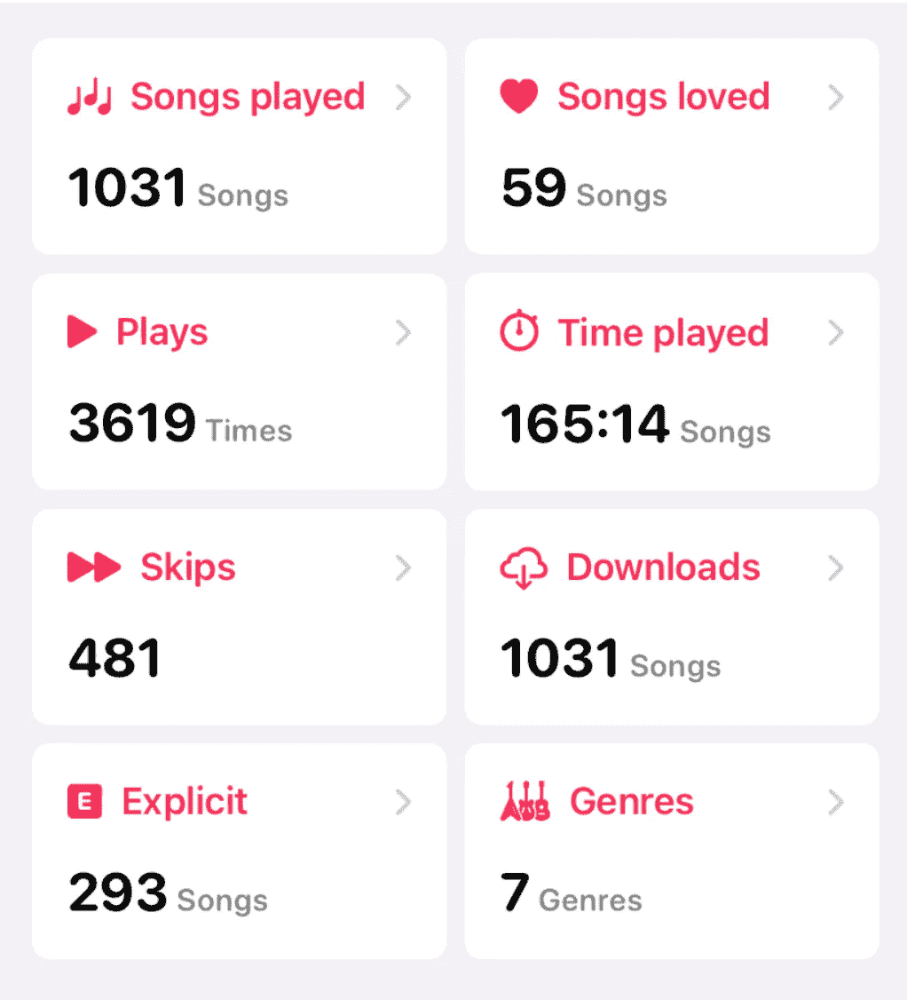
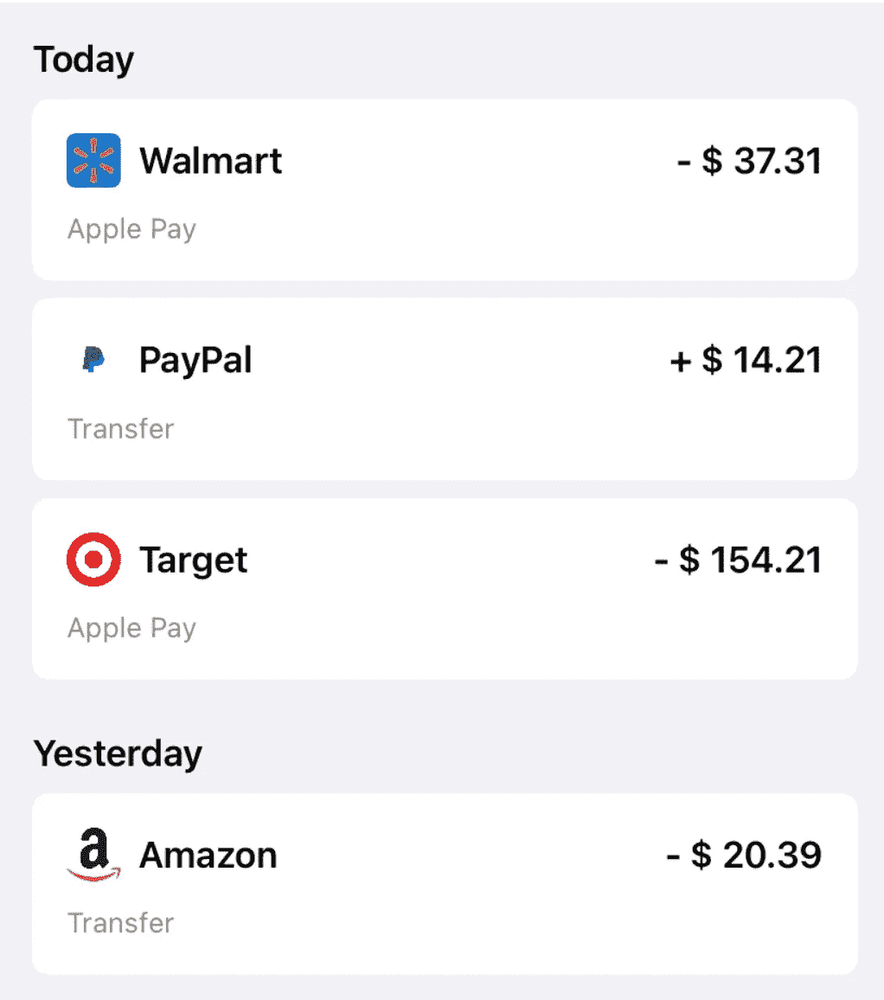
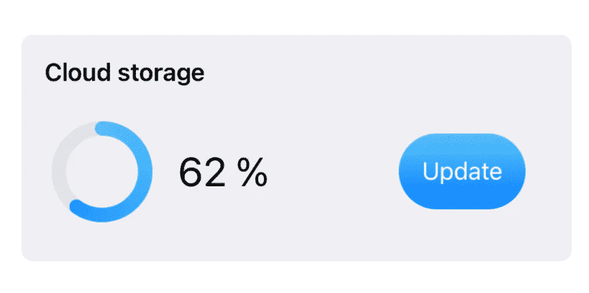

# iOS 版 SwiftUI GroupBox

> 原文：<https://itnext.io/swiftui-groupbox-for-ios-bb16aa71469c?source=collection_archive---------3----------------------->

可以使用分组框将内容分组在一起。通过 SwiftUI 2，它们也可以在 iOS 上使用。默认`GroupBox`有两种可能的状态。如果没有标签，背景大小取决于内容。有了标签，背景推到一边。

`GroupBox`的语法非常简单。除了文本，你可以使用任何视图。

默认情况下，内容放在一个`VStack`中。

在我看来，分组框非常适合显示信息、统计数据、成就、历史等等。苹果的健康应用程序就是一个很好的例子。他们使用类似分组框的字段来显示信息。

为了重新创建它，我们可以添加一个`GroupBoxStyle`。

# 重新创建健康应用分组框

健康信息框中的标签不仅包含系统图像和标题，还包含日期和山形符号。下面是内容。

大多数时候，内容包含一个值和一个单元。为了重用它，我们创建了另一个视图。

然后我们可以把分组框放在一个垂直的`ScrollView`里面。

这看起来非常非常好，但是有很多代码，而且不是动态的。

就这样，你可以把你的数据放在`ForEach`里。

# 例子和想法

## 音乐统计应用

您可以在分组框中显示统计数据。当你不想要空白的时候，你可以用一个`LazyVGrid`，而不是一个`VStack`。

## 银行应用程序

显示银行帐户的变化。

## 云存储应用程序

显示存储和其他信息。

