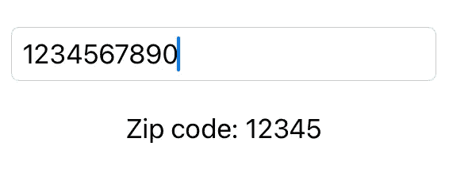

# SwiftUI:限制 TextField 视图中的字符数量

> 原文：<https://itnext.io/swiftui-limit-the-amount-of-characters-in-a-textfield-view-906e819529a5?source=collection_archive---------1----------------------->

照片由[帕特里克·福尔](https://unsplash.com/@patrickian4?utm_source=medium&utm_medium=referral)在 [Unsplash](https://unsplash.com?utm_source=medium&utm_medium=referral) 拍摄

> **⚠️更新:** **这个例子只适用于 iOS 15 之前的 iOS 版本。自从 iOS 15 和 XCode 13 发布后，这个例子就不再起作用了。**

有时，您需要限制用户可以在应用程序的输入字段中输入的字符数量，例如在输入邮政编码时。

在 UIKit 中，您可能熟悉 [*文本字段(_:shouldchangecharacters in:replacementString:)*](https://developer.apple.com/documentation/uikit/uitextfielddelegate/1619599-textfield)*方法来限制 UIKit 文本字段的字符。*

*SwiftUI 中的 TextField 似乎缺乏这种功能，因为它没有为我们提供完成这种任务的回调或方法，但仍然有一种方法可以解决这一问题——你只需要改变思维方式。*

## *问题是*

*如果你试图限制用户可以输入的字符数量，你会很孤独。即使您截断了 TextView 本身的绑定值，它也会忽略这个值，因此用户仍然可以在输入中输入字符。*

*类似以下示例的内容将不起作用，因为它只会截断结果字符串，而不会截断文本字段本身的值:*

*运行这段代码只会产生类似这样的结果:*

**

*非工作示例结果*

*改变 *zipCode* 变量本身也不起作用。这将导致更糟糕的状态，因为它既不会限制字符串，也不会限制文本视图的值。*

## *解决方案——真理的单一来源*

*随着 SwiftUI 的推出，苹果给开发者带来了一种新的应用编程方法。开发人员现在不得不遵从 MVVM 模式，而不是通常的 UIKit MVC 模式，这需要一种新的思维方式。*

*一个中心关键词是“真理之源”。有关该主题的更多信息，我推荐 WWDC 会议视频，请点击此处:*

*🎬[https://developer.apple.com/videos/play/wwdc2020/10040/](https://developer.apple.com/videos/play/wwdc2020/10040/)*

*这种*编写应用程序的新思路*是我们问题的解决方案。操纵绑定本身可能是不可能的，但是在视图模型的帮助下，我们可以实现我们想要的功能。*

## *视图模型*

*对于我们的例子，我们坚持输入邮政编码，为了简单起见，我们将只构建一个非常基本的模型。*

*我们的邮政编码模型可能如下所示:*

*该模型由一个指定最大字符数的整数和一个保存邮政编码本身的字符串变量组成。在该字符串的属性观察者 *didSet* 中，我们将该字符串截断到我们指定的长度。*

*这基本上是我们限制 SwiftUI TextField 视图中可能的字符数量所需要的所有魔法。*

*在视图模型的帮助下，所有截断字符串的逻辑都被封装，并且与文本视图本身的绑定不冲突。*

## *完整示例*

*让我们看看如何在一个完整的示例中使用该模型:*

*代码应该非常简单——和往常一样。第一行是上面的模型，ContentView 本身只定义了一个可观察的对象，带有一个模型实例和一个 TextField 视图。绑定被设置为模型的字符串值。*

*就是这样！剩下的只是化妆品。现在，用户只能输入指定数量的字符(在我们的例子中是五个)，在达到限制后，输入将不允许任何进一步的输入。*