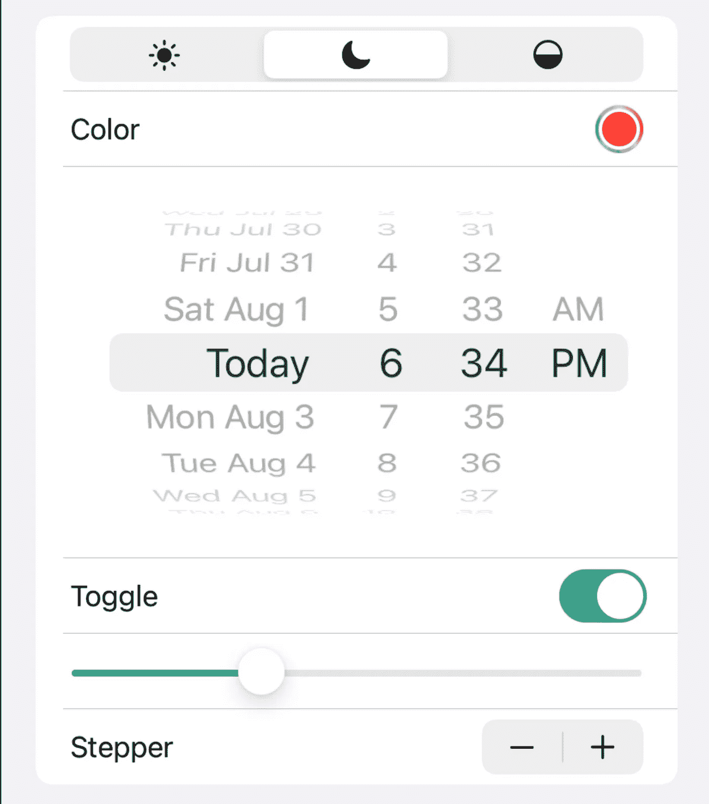

# SwiftUI 选择器、切换、滑块和步进器的详细说明

> 原文：<https://itnext.io/swiftui-picker-toggle-slider-and-stepper-fully-explained-3ad1a273bb4d?source=collection_archive---------0----------------------->

# 采摘者

选择器可用于让用户从一组固定的选项中选择一个值。

SwiftUI 中有多种类型的拣选器，`Picker`，`DatePicker`，`ColorPicker`，在某种程度上也有`TabView`。

## 创建选取器的方法

创建选取器最突出的方式是使用整数值。但是您也可以使用所有其他值类型作为选择。例如布尔值:

当然，像这样的布尔选择器是没有意义的，最好用`Toggle`来代替，但是如果你只有两个值，不代表`true`或`false`，你可以使用布尔选择器。那么你就不需要把整数“转换”成布尔值。您也可以使用字符串选择，以便直接获得值。

你也可以在`.tag()`中放置一个自定义对象。当你不想要默认值时，设置`@State`为一个不在选择器中的值。

## 更改选取器视图

选择器内容只是一个视图，就像任何其他视图一样。这意味着，您可以将选取器内容提取到一个`View`，例如当您想要重用选取器内容时。但是你不能只把 picker 内容放在`var body: some View`里，因为一个变量不能有多个 return 对象。但是这很容易解决，只需将内容包装在一个`List`中。

当你有一个对象数组，用户可以从中选择，你不需要硬编码的选择器。相反，您可以使用`ForEach`或`List`。

对于像这样有大量选择的拾取器，您可以使用`WheelPickerStyle`。根据值所代表的内容、视图的计数和样式，您也可以使用一个`Slider`、`Stepper`或`TextField`。当你只有少数几个选项时，用户应该很容易找到，你可以使用`SegmentedPickerStyle`。

## 选取器视图的样式

默认选取器的工作方式类似于`NavigationLink`。这意味着您可以像普通视图一样设置视图的样式。

还可以加上`.navigationBarItems()`。例如，您可以解释选取器选项及其作用。

为了让选项更加详细，你可以从`Text`切换到`Label`。

直接选取器看起来更漂亮，选项也更清晰。请注意，使用`SegmentedPickerStyle`，您只能显示`Text`或`Image`，而不能同时显示两者。您也可以在选择器中使用复杂的视图。例如，当让用户选择应用程序色调时，您可以在名称旁边显示颜色。该视图也显示在选取器预览中。

您可以在选取器内容上使用几乎所有的视图修改器。但是一定要保持选取器内容清晰。你可以在项目上使用一个`.contextMenu()`，但是你应该确保视图不会混乱。当您希望选项显示在`Menu`中时，您可以使用`MenuPickerStyle()`。

## 条件选取器

有时您希望选取器内容是有条件的。例如，当用户可以通过应用内购买解锁功能时，picker 中的一些选项应该被禁用。你可以用一个 if 闭包。

当然，您可以像这样使用 switch 语句。当您想要显示所有选项，但使一些不可选择时，您也可以这样做。合理的方法是使用`.disabled()`，但是现在还不支持。但是要做的事情更简单，只需去掉`.tag()`并添加一个`.secondary`的颜色就可以了。

# 颜色选择器

颜色选择器只是让用户选择一种颜色。您可以像使用选择器一样使用它们，只是不需要选择器内容。

如果用户可以更改不透明度，您也可以选择。

# 日期选择器

日期选择器让用户选择一个日期。他们就像采色员一样简单。

没有`displayedComponents`，用户也可以选择一个时间，这在生日选择中是不需要的。您也可以定义封闭的范围。您可以使用`.datePickerStyle()`更改日期选择器的样式。

# 选项卡视图

一个`TabView`让用户在多个视图之间切换。

在 iOS 上，您可以创建一个可滑动的选项卡视图，方法是将其添加到您的`TabView`中。当有一个`Image`或`Label`作为`.tabItem()`时，该图标显示为选项卡项目，否则视图用项目符号标记。

当您的背景为白色时，您可以使用以下选项向页面索引添加背景:

您还可以使用以下选项隐藏项目符号:

# 触发器

在`true`和`false`之间切换。

在 macOS 上，您有许多选项来设置切换样式。在 iOS 上，你可以只改变 on-tint。

# 滑块

滑块让用户在一系列值之间进行选择。

您可以定义一个范围和可选的步骤。如果不指定步长，将会得到类似于 53.117264 的值。

# 跳舞者

使用步进器，用户可以在语义上增加或减少一个值。

默认情况下，要添加的数量是 1，但您可以像这样更改:

# 结论

如果你想让用户选择一个值，改变一个值，选择一个视图，增加或减少一个值，SwiftUI 有一个很大的选项板可供选择。