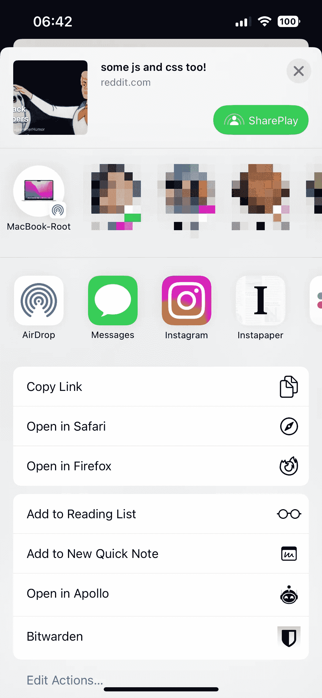
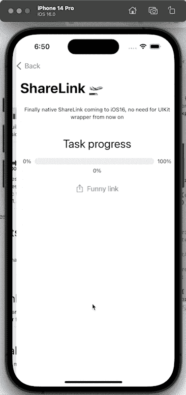

# swift ui share link——不拥挤的新分享方式

> 原文：<https://itnext.io/swiftui-sharelink-new-way-of-sharing-without-hustle-bfd27861a356?source=collection_archive---------1----------------------->

*从现在开始文章也可以在我的个人网站上找到，以后会有越来越多策划的内容:*[](https://verticalcoding.com/swift-project-in-2023/)**强烈推荐你关注我的网站:)**

*有了新的 SwiftUI，我们有了一种新的显示股票的方式，但也有了新的调整。*

> *本文是 iOS 16 和 Mac OS 13 中 SwiftUI4 新功能系列文章的一部分。如果你愿意看以前的文章，这里有第一篇文章的链接:[swift ui navigation stack——如何去深度链接和有什么新内容](https://medium.com/better-programming/swiftui-navigation-stack-how-to-deeplink-and-whats-new-64b1401cb9af)。其余的你可以直接在我的个人资料页面找到。现在，让我们继续阅读。*

*在学习和准备我将在上面演示的 iOS Meetup 的过程中(如果你来自波兰，请随意加入，我们将主要讨论 SwiftUI，还会有一些啤酒和披萨)，我决定分享一下*

*[](https://www.linkedin.com/events/iosmeetup6975431003225899009/about/) [## 注册| LinkedIn

### 5 亿多会员|管理您的职业身份。建立并参与你的职业网络。访问…

www.linkedin.com](https://www.linkedin.com/events/iosmeetup6975431003225899009/about/) 

给我团队中朋友的一些文章，我注意到 share sheet 对于 iOS 开发者和生态系统是多么重要。当我发现这一点时，我是多么高兴:

```
func shareButton() {		
		let url = URL(string: "https://designcode.io")
		let activityController = UIActivityViewController(activityItems: [url!], applicationActivities: nil)

		UIApplication.shared.windows.first?.rootViewController!.present(activityController, animated: true, completion: nil)
}
```

不再需要用 SwiftUI 打开它，甚至它看起来还有点娱乐性。

*

# *共享链接—基本实施*

*显示心爱的共享表的新方式是 ShareLink！我知道这听起来可能不是什么有趣的事情。但是等待实现。与本系列的前几部分一样，我将使用我创建的存储库来实现这个目的:*

*[](https://github.com/LSWarss/iOS-16-MacOS-13-SwiftUI-Showdown) [## GitHub-lsw arss/iOS-16-MAC OS-13-swift ui-摊牌:新的 SwiftUI 4 为 iOS16+提供了示例应用程序

### 你正面临着 iOS16 和 MacOS13 带来的所有新功能。下面你会看到…

github.com](https://github.com/LSWarss/iOS-16-MacOS-13-SwiftUI-Showdown) 

因此，实现是简单明了的，从文档中你可以看到，ShareLink 需要的强制变量可以是字符串，Url，基本上是任何符合可转移的内容。下面你可以找到两个这样的例子:

共享链接的基本示例

# 共享链接——额外的东西

苹果添加到 ShareLink 的东西我称之为额外的东西。虽然我们可以为所有开发人员使用简单的已知类型，但我们也可以创建符合可转移协议的自定义类型，这使我们能够与 ShareSheet 共享这些自定义类型。下面我创建了这样一个自定义类型的实现，用于进度，标签为 gauge。通过这种方式，我们可以分享游戏中某些任务的当前进度，或者阅读文章的进度。

看起来是这样的:



我肯定会在我的 iOS16+应用程序中大量使用 ShareLink，我认为你也应该这样做，与旧方法相比，它提供了很大的灵活性。

感谢你阅读这篇文章，如果我写错了什么，或者你有什么建议，请留下你的评论。如果您想讨论 ShareLink 或 Swift 和 SwiftUI，您可以在这里找到我:

*   [https://www.linkedin.com/in/%C5%82ukasz-stachnik-495a46184/](https://www.linkedin.com/in/%C5%82ukasz-stachnik-495a46184/)
*   https://gist.github.com/LSWarss*