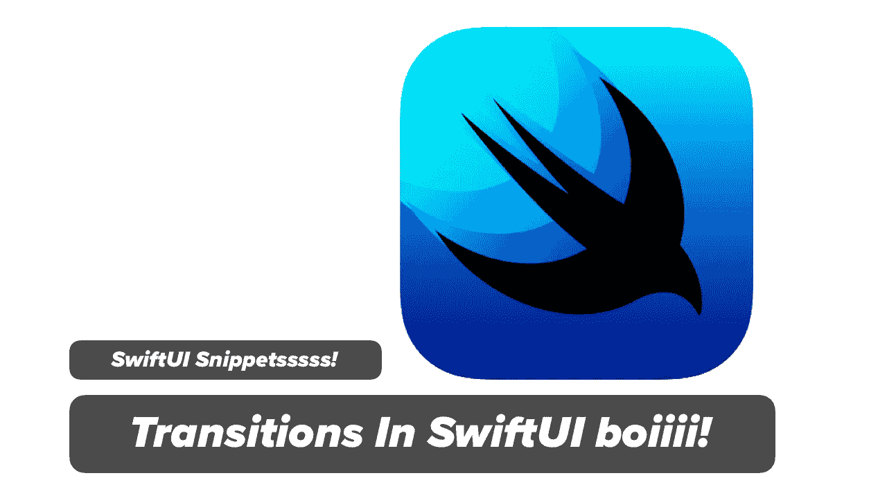
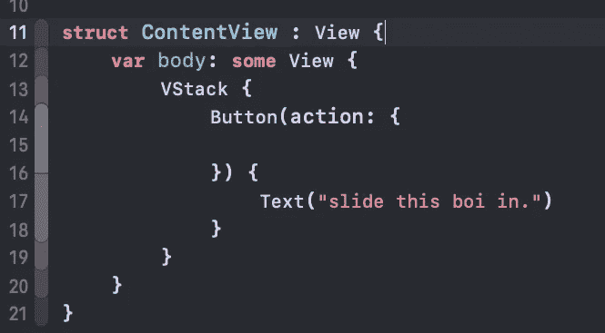
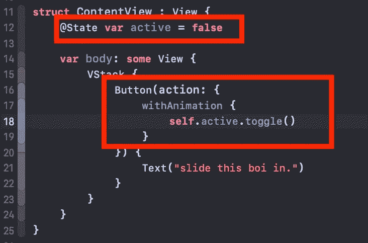
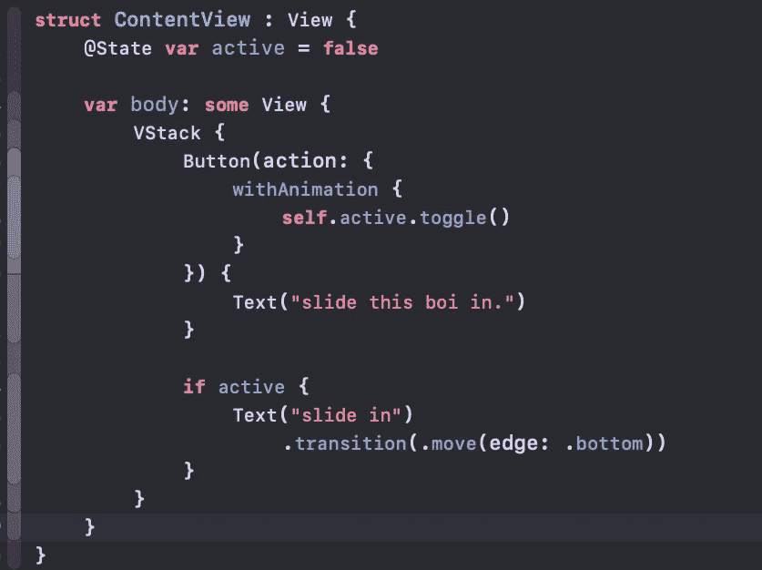

# SwiftUI 转换—在 SwiftUI 中用状态和转换制作视图动画

> 原文：<https://itnext.io/swiftui-transition-animating-views-with-state-and-transitions-in-swiftui-580764327869?source=collection_archive---------3----------------------->

今天，您将探索一个非常基本的 swift 片段，其中您将学习如何使用 ***。SwiftUI 和 Xcode 11 中的过渡*和**

**目标:**目标是让用户点击一个按钮，让一些文本滑入，反之亦然。

我叫**麦克斯韦**，跑[***maxcodes . io***](https://www.maxcodes.io/)**。很高兴终于见到你了。**

> [**点击我观看本指南免费视频讲解。**](https://youtu.be/qyDkQRBATAo)

# 步骤 1 —创建新的 SwiftUI 应用程序。

确保选择 SwiftUI

# 步骤 2 —添加带有标签按钮的 VStack。

我们不想要默认文本，我们想要一个 VStack 和一个按钮，我们可以用来切换我们的状态。

*   暂时将操作留空。
*   为我们的按钮标签添加文本视图

当你编译的时候，你应该在你的屏幕上有一个标签按钮。

# 步骤 3 —状态，让我们切换它。

为了跟踪文本是否需要滑入或滑出，我们需要创建一个状态变量。一旦我们创建了，我们需要切换它，然后最后我们需要动画它。

*   创建一个名为 active 的状态变量
*   每当单击按钮时切换为活动
*   用动画包装切换动作

# 步骤 4 —过渡到所需的内容

现在，我们需要做的就是检查 active 的真值，然后将一个转换应用到我们滑入的任何视图中。

*   检查 Active 是否为真
*   如果 Active 为 true，则在 VStack 中添加一个文本视图
*   应用冷效果的过渡

# 第 5 步—这就是所有人！

***每当你点击*** 按钮，新文本就会滑入滑出

如果您想了解更多有关 SwiftUI 的信息，并了解更多有关 SwiftUI 的信息，例如在 SwiftUI 中绘制路径和形状， [***请使用此折扣券查看完整的 SwiftUI 开发课程。***](https://www.udemy.com/swift-ui/?couponCode=MEDIUMDEVELOPERS)

[***发微博给我***](https://twitter.com/maxcodes1) 你的文章和视频请求，我都会满足！

# 谢谢范姆！

我真的很感谢那些观看我的视频，阅读我的文章，参加我的课程的人。

谢谢，

一如既往，我们将在下一段视频中再见。

***-Max*** 。