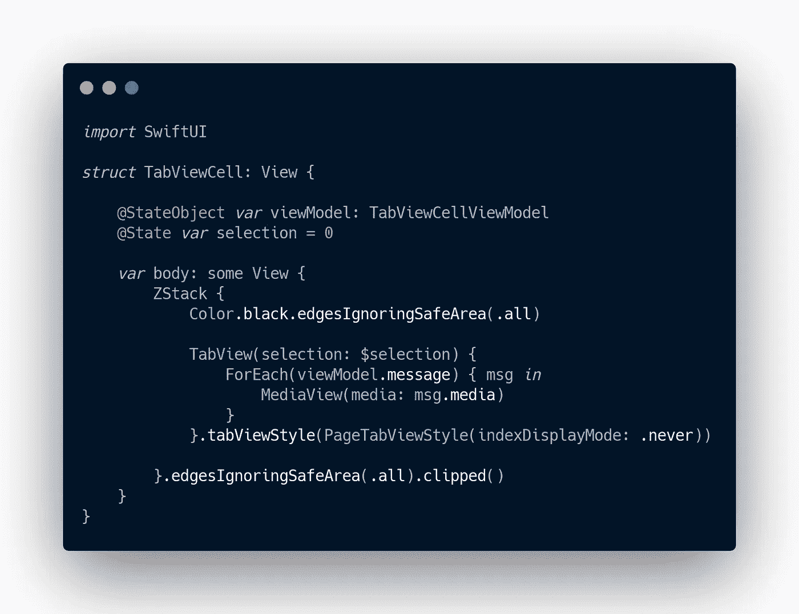
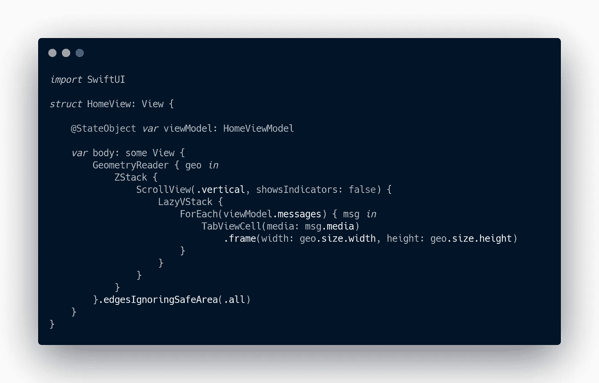
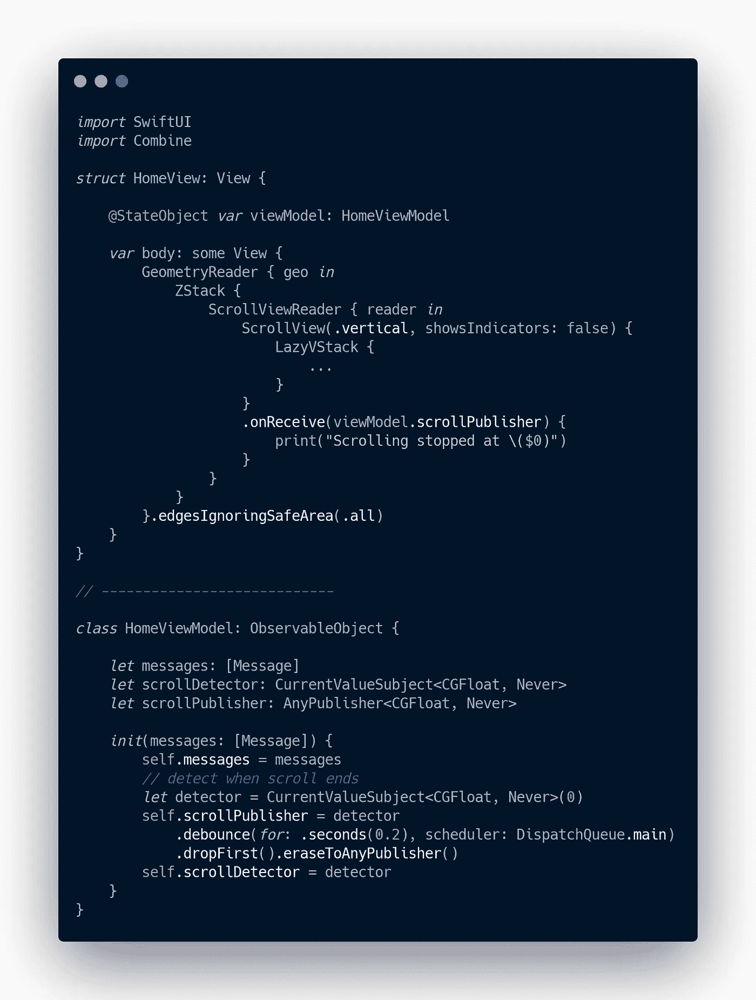
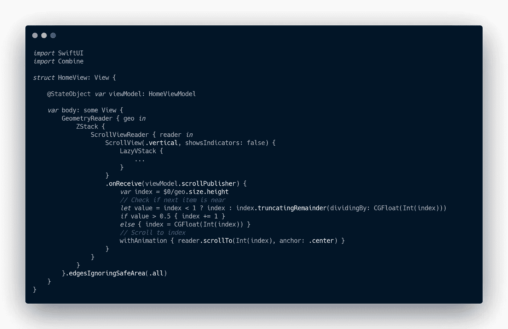

# SwiftUI -双向快照列表

> 原文：<https://itnext.io/swiftui-two-directional-snaplist-95cb852957be?source=collection_archive---------2----------------------->

嘿伙计们，在这篇文章中我们将看到如何创建两个方向的快照列表。创建一个单一方向的快照列表变得更加容易，因为我们已经在 TabView 中“ *PageTabViewStyle* ”。

但是实现两个方向的快照列表仍然是具有挑战性的，因为在一个垂直的标签视图中有一个水平的标签视图*。旋转(。度(90))"* 可以制造一些怪异的卷轴 bug。

因此，我们将使用相同的 TabView 进行水平滚动，但我们将它们添加到垂直 ScrollView 中，并为 ScrollView 单元格创建一个自定义的捕捉行为。

还有其他方法，如创建一个 VStack 修改器并根据 DragGesture 调整它的偏移量，但这种方法也会产生问题，因为默认情况下 TabView 中有垂直滚动。下面的方法使用 ScrollView 抑制了 TabView 的滚动行为。

你可以在 [GitHub](https://gist.github.com/sameersyd/fce9599687963fca90677d959dce7a6e) 上找到该代码的要点。

# 第一步

*   创建新的 SwiftUI 项目。
*   创建水平 TabView 单元格。它看起来会像这样👇🏻

# 第二步

*   添加 ForEach 以在父视图中生成垂直 TabViews，并将它们包装在 ScrollView 中，除了垂直滚动不能捕捉和自由流动之外，应该可以获得水平和垂直滚动的预期行为。
*   在接下来的步骤中，我们将向垂直滚动添加对齐行为，但此时父视图代码将类似于以下内容👇🏻

# 第三步

*   在这一步中，我们将向 ScrollView 添加一个方法，通过该方法我们可以知道滚动时它的偏移量。
*   添加一个“ *PreferenceKey* ”。*圆顺空间*“，”。背景(颜色偏好键)“和”。 *onPreferenceChange* ”。它将帮助我们了解 ScrollView 偏移量的变化。
*   我们再加上这个"*。coordinate space*name to scroll view 和其他方法到“*lazyv stack”*，之后我们的代码看起来会是这样的👇🏻

*   添加此内容后，您的代码将在每次滚动时打印 ScrollView 偏移量。

# 第四步

*   现在，我们将使用 combine 来添加一个发布者和检测器，以了解 ScrollView 何时停止滚动，这样我们就可以捕捉视图。
*   添加下面的代码来初始化发布器和检测器。当滚动首选项改变时，调用“ *detector.send(value)* ”而不是之前的“ *print* ”方法。
*   现在请听出版商的介绍。 *onReceive* ，当滚动结束时会传递滚动偏移量。

*   在 ViewModel 中添加 detect 方法，因为它是一个“*变异*函数。

# 第五步

*   现在我们已经得到了滚动结束后的滚动偏移量，让我们来捕捉视图。
*   我们需要将滚动结束偏移量除以静态的 TabViewCell 高度来获得当前索引。
*   调用 ScrollViewReader”之前。*scroll to*position，我们还应该检查下一个索引是否在附近，否则视图将一直捕捉到当前索引，直到它被完全滑动。
*   还不忘加上“*”。id* "到 ScrollView 的单元格，这样它就可以滚动到索引。

 [## TDSnapList。MP4

### 这是演示的链接

drive.google.com](https://drive.google.com/file/d/1K0qyVd4Ao42voE5G23c1BgYKX6LTlnaa/view?usp=sharing) 

万岁🎉！！！我们终于创建了一个双向快照列表。

你可以在 [GitHub](https://gist.github.com/sameersyd/fce9599687963fca90677d959dce7a6e) 上找到该代码的要点。

让我知道你的想法和建议。你可以在推特上找到我。

如果你觉得有用，👏🏻它激励人们！