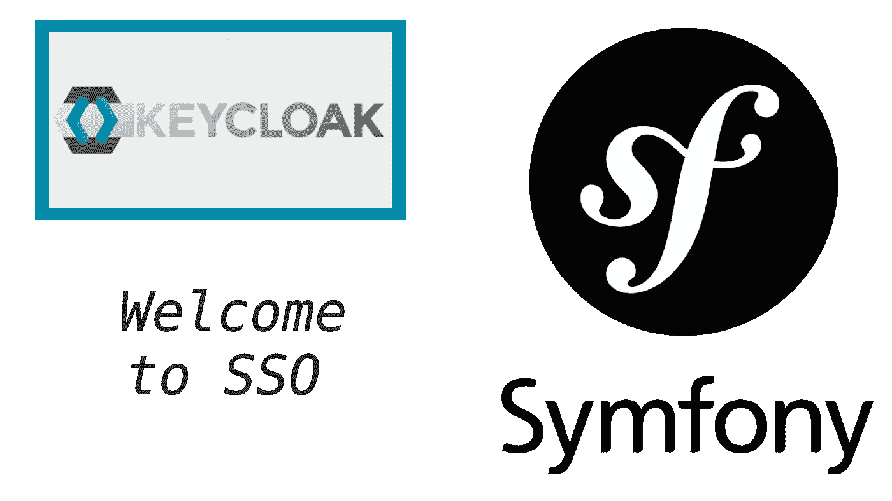
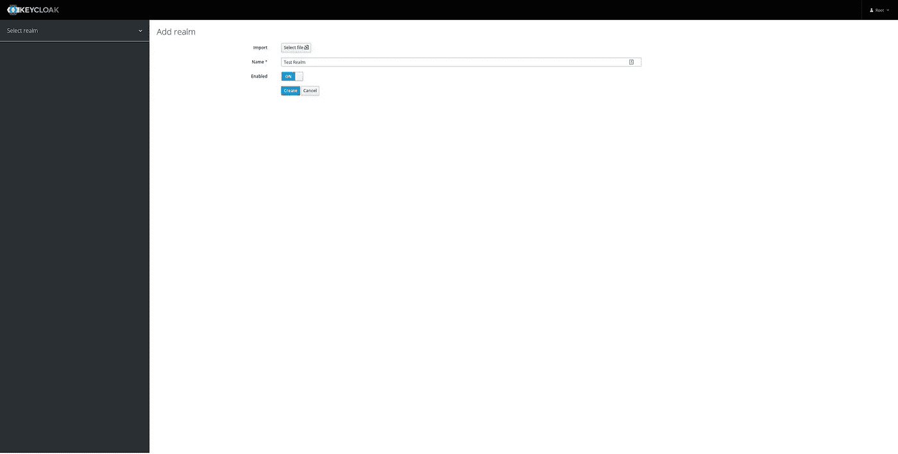
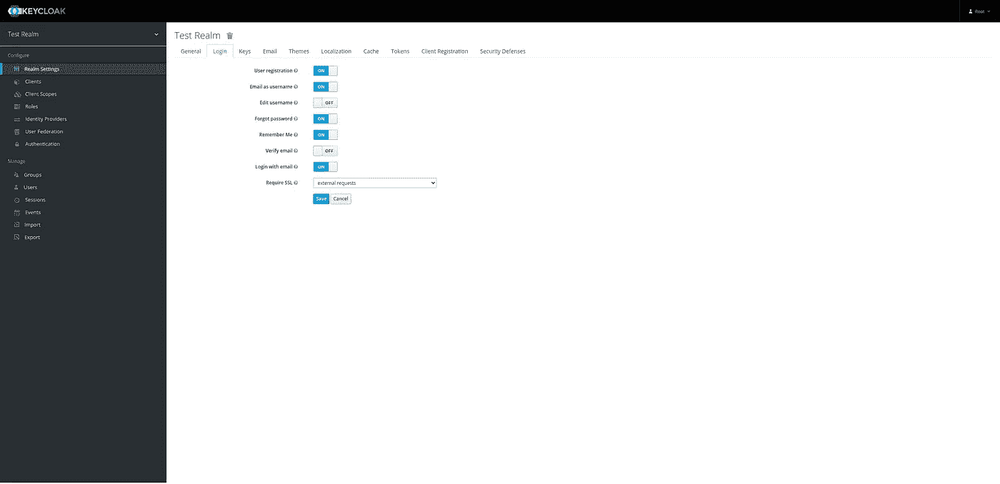
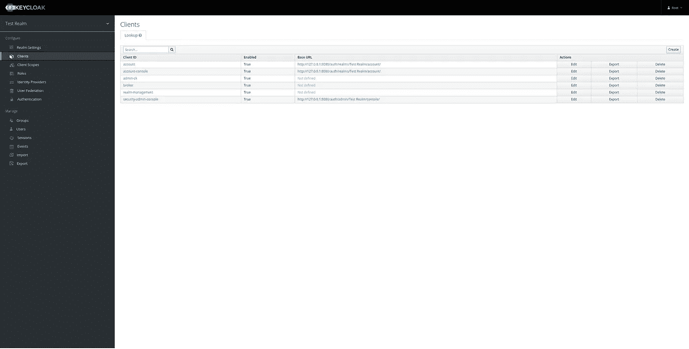
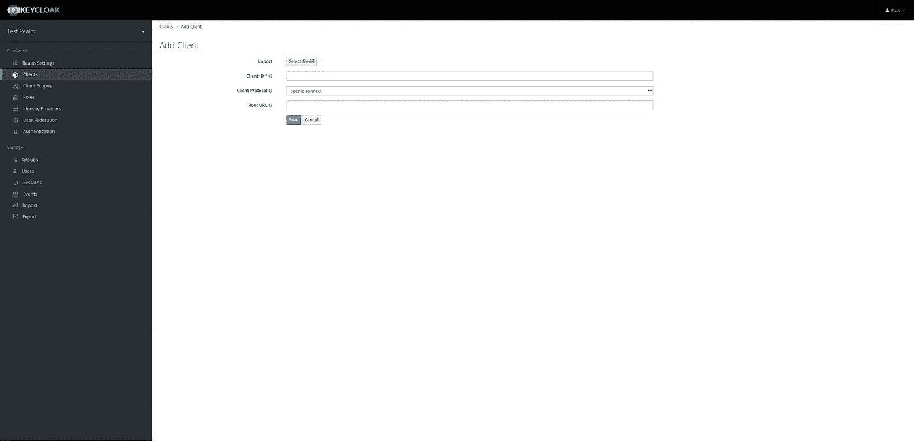
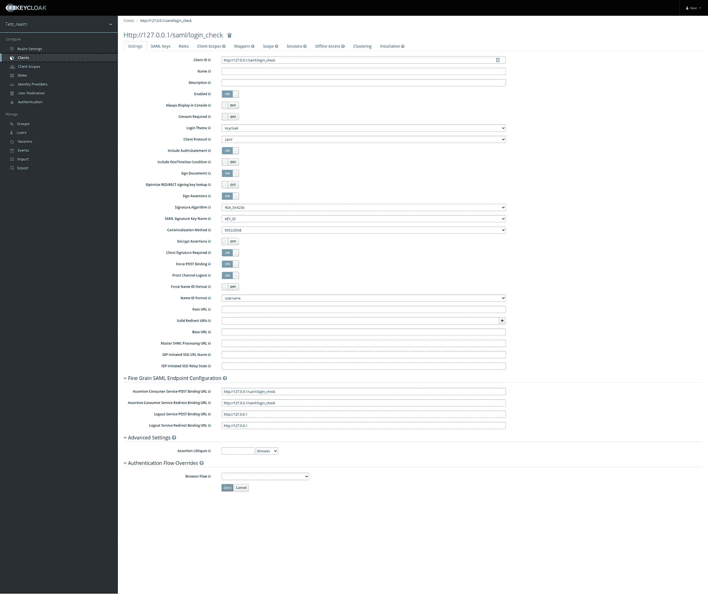
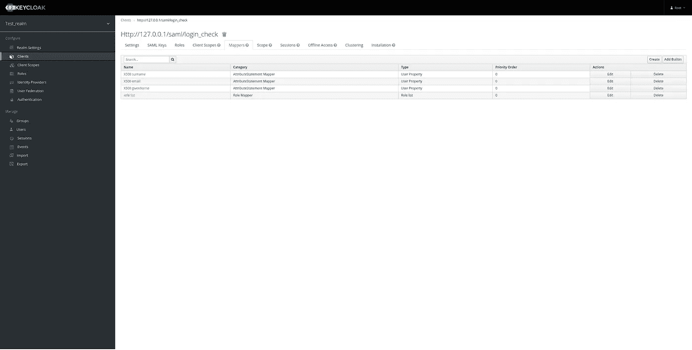
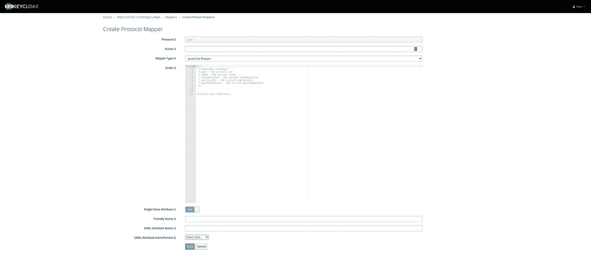

# 使用 Keycloak IDP 和 SAML 协议的 Symfony SSO

> 原文：<https://itnext.io/symfony-keycloak-sso-saml-262e249d7160?source=collection_archive---------4----------------------->

## Symfony —带 SAML 协议的 Keycloak SSO 权威指南



欢迎来到 Symfony — Keycloak SSO

答在网上做了大量研究后，我努力寻找合适的全面的文档来解释通过正确使用 SAML 协议用 Symfony 和 Keycloak 实现 SSO。所以我决定写一个。

首先，在开始描述所有的配置过程和必要的设置之前，我想说我们将使用一个 **docker-compose** 设置来提供以下服务:
* Symfony 4
* MySQL 5.7
* PHP 7 . 4 . 16
* NGINX
* key cloak

> 完整的设置和配置可以在这个 git repo[https://github.com/abame/symfony-keycloak-sso](https://github.com/abame/symfony-keycloak-sso)中找到。

只需运行`docker-compose up -d`,您就可以立即启动环境并运行所有必要的配置。

我们可以通过访问[http://127 . 0 . 0 . 1:8080](http://127.0.0.1:8080)
并使用用户名`**root**`和密码`**root**`登录来访问我们的 Keycloak 管理。

## 自动布线

由于我们将在 Symfony 中为大多数服务进行用户自动连接，我们将在这里描述的服务不需要服务定义。

要完全使用自动连线，我们需要在`config/services.yml`下添加以下内容，并将`$samlEntityId`绑定到客户端 id，我们将在下面的`[http://127.0.0.1/saml/login_check](http://127.0.0.1/saml/login_check)`步骤中配置客户端 id。

```
LightSaml\Build\Container\BuildContainerInterface: '@lightsaml.container.build'
LightSaml\Binding\BindingFactoryInterface: '@lightsaml.service.binding_factory'
LightSaml\Provider\TimeProvider\TimeProviderInterface: '@lightsaml.system.time_provider'
App\Store\IdStoreInterface: '@App\Store\IdStore'
```

# 1.创建一个领域

使用 docker 启动并运行环境后，我们需要做的第一件事是在我们的 Keycloak IDP 中创建一个领域。

a.将鼠标悬停在左上角的侧边栏菜单上，点击**添加领域**，可以创建一个领域。

根据需要输入领域名称，并确保**启用**打开**。**然后点击**创建按钮**。我将它命名为 Test_realm，如下所示。或者，您可以将一个领域作为 JSON 文件导入。我不会在这里上传任何 JSON 配置，这样我们就可以完成这些步骤，但是在 docker-compose 设置中，当环境启动并运行时，会导入一个 JSON 配置。这个 JSON 文件可以在名为`realm-export.json`的项目根目录下找到。



添加领域

b.之后，在**领域设置**页面上，我们必须如下图所示配置登录部分，然后单击保存。



登录配置

其他的**领域设置**我们可以保持原样，因为它们与本文的范围无关。你可能想改变的唯一一件事是**主题**，但这也是可选的，而且非常简单。我们需要做的另一件事是将 **General** 下的`SAML 2.0 Identity Provider Metadata` XML 复制到一个`saml-idp.xml`文件中，因为我们稍后会用到它。

*Ps。如果你使用* `*docker-compose up -d*` *命令，你也必须下载* `*SAML 2.0 Identity Provider Metadata*` *，因为这将是第一次运行这个设置和元数据，是时间敏感的。第一次之后，配置存储在 MySQL 数据库中，您不需要再次下载它，因为它不会改变。*

# 2.添加客户端

在成功地创建了包含所有配置的领域之后，我们需要向我们的领域添加一个客户机来满足我们的需求。一旦我们进入左侧的**客户**菜单，我们会看到一些现有客户。这些客户端是在创建领域时添加的，并且是领域正常运行所必需的。



客户列表

在上图中，我们在客户列表的右上角有一个“创建”按钮。当我们点击该按钮时，我们会看到下面的界面。



创建客户端

这里我们提供了客户端 id，在我们的例子中是[http://127 . 0 . 0 . 1/SAML/log in _ check](http://127.0.0.1/saml/login_check)，我们选择`saml`作为协议，然后保存客户端。保存后，我们将面对一个新的界面来完全配置客户端。



客户端设置

在此界面中，我们希望启用以下选项:
a .包含 AuthnStatement
b .签署文档
c .签署声明
d .需要客户端签名
e .强制 POST 绑定
f .前通道注销

我们还需要选择主题，不是强制性的，但很好拥有，给`Assertion Customer Service POST Binding URL`的值[http://127 . 0 . 0 . 1/SAML/log in _ check](http://127.0.0.1/saml/login_check)和`Logout Service POST Binding URL`的值 [http://127.0.0.1](http://127.0.0.1) 。另外两个 URL 是可选的。

##SAML 密钥
当客户尝试登录和注册时，这两个密钥是签署请求和断言所必需的。我们需要将这两个键存储在它们各自的`.crt`和`.key`文件中。

我们需要的另一个配置是**地图绘制器**，其余的都是可选的，我会让你去探索它们。点击表格右上角的`Add Builtin`按钮后,“地图绘制者”部分有一些默认的地图绘制者，如下图所示。



映射者列表

添加了默认的映射器后，我们需要添加一个自定义的映射器来显示 Keycloak 用户 id。为此，我们点击`Create`按钮，出现以下界面:



创建自定义映射器

当我们在这个部分作为**映射器类型**时，我们必须选择**用户属性**。添加名称为`X500 ID`，并用值`id`填充`Property`和`Friendly Name`。在`SAML Attribute name`上，我们添加`urn:oid:1.2.840.113549.1.9.1`并保存配置。

至此，我们完成了客户端的配置。

# 3.在 Symfony 中设置 SAML 配置

要在 Symfony 中配置 SAML，我们首先必须通过运行`composer require lightsaml/sp-bundle`来安装一个外部依赖项。该包将自动注册，在`config/routes.yml`下，我们必须通过添加以下代码来加载 SAML 路由:

```
lightsaml_sp:
    resource: "@LightSamlSpBundle/Resources/config/routing.yml"
    prefix: saml

logout:
    path: /logout
```

然后我们必须添加可以在`src/Entity/*`下找到的`User`和`IdEntry`实体。在`User`实体中，密码必须是`null`，因为登录将由 IDP 处理，但是`UserInterface`实现需要该属性。

`IdEntry`的目的是存储给定客户端的会话 id 和到期时间。从 LightSAML 文档中，

> 虽然包中没有明确要求，但是强烈建议您跟踪收到的消息 id，以防止消息重复。出于这些目的，您需要一个实体来持久化这些 id。

在我们有了实体之后，我们需要运行`docker-compose exec php bin/console doctrine:schema:update **--force**`

## 创建 ID 存储服务

ID 存储用于通过使用`set`和`has`方法来创建/检查身份记录，其中`set`创建/更新和`IdEntry`记录，而`has`方法检查条目是否存在并且仍然有效且没有过期。该服务可在`src/Store/IdStore.php`下找到

## 配置 SAML 桥

在`config/packages/light_saml_symfony_bridge.yml`下，我们添加以下配置:

```
light_saml_symfony_bridge:
    own:
        entity_id: "http://127.0.0.1/saml/login_check"
        credentials:
            -
                certificate: "%kernel.root_dir%/../config/saml/saml.crt"
                key:         "%kernel.root_dir%/../config/saml/saml.key"
                password:    ~
    party:
        idp:
            files:
                - "%kernel.root_dir%/../config/saml/saml-idp.xml"
    store:
        id_state: App\Store\IdStoreInterface
```

其中`saml.crt`、`saml.key`和`saml-idp.xml`是我们从领域和客户端配置中检索的文件。

## 用户创建者服务

当用户从 Keycloak IDP 登录，而 Symfony 数据库中不存在该用户时，需要使用此服务`\App\Security\User\UserCreator`在 Symfony 数据库中创建用户。该服务用于从`\LightSaml\SpBundle\Security\Authentication\Provider\LightsSamlSpAuthenticationProvider`检查我们在 IDP 中是否有登录用户。如果我们有，我们在 Symfony 应用程序中验证用户，否则我们在用户登录 IDP 后从响应中验证。authenticate from 响应然后检查是否可以从 Symfony 应用程序数据库加载用户，或者我们是否需要创建用户。

## 配置安全性

配置`config/packages/security.yml`、`firewalls`部分，在`main`下，我们需要添加以下配置。

```
light_saml_sp:
    provider: app_user_provider
    user_creator: App\Security\User\UserCreator
    login_path: /saml/login
    check_path: /saml/login_check
    default_target_path: /
    require_previous_session: truelogout:
    path: 'lightsaml_sp.logout'
    target: default
    invalidate_session: false
    success_handler: App\Services\SamlLogoutHandler
```

## 注销处理程序服务

此服务`\App\Services\SamlLogoutHandler`的目的是正确处理 Symfony 应用程序与 IDP 之间的注销过程。我们检查是否有一个`LogoutRequest`,我们将它委托给 IDP，以便我们可以在 IDP 中注销用户，一旦用户在 IDP 中注销，请求将被重定向回我们的应用程序，我们将得到一个`LogoutResponse`,我们将使我们的应用程序中的会话无效，以便在 Symfony 应用程序中完全登录用户。


由 [Alex](https://unsplash.com/@alx_andru?utm_source=medium&utm_medium=referral) 在 [Unsplash](https://unsplash.com?utm_source=medium&utm_medium=referral) 拍摄的照片