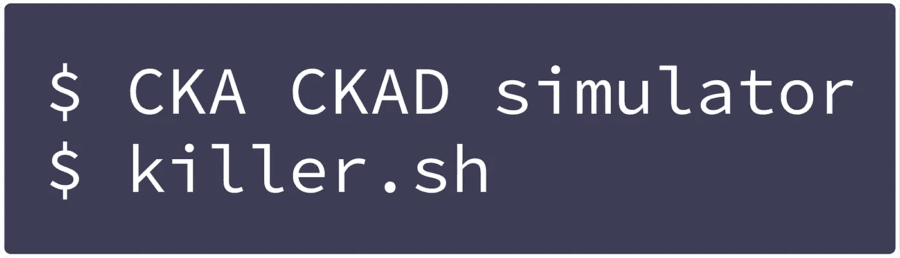

# Kubernetes 上的 Symfony 信使工作者

> 原文：<https://itnext.io/symfony-messenger-worker-on-kubernetes-77f75725b5ed?source=collection_archive---------0----------------------->

## 如何在 Kubernetes 上正确运行 Symfony Messenger Worker 而不在消息处理过程中被杀死


## 零件箱生命周期

1.  [防止队列工人吊舱在部署过程中被杀死](/k8s-prevent-queue-worker-pod-from-being-killed-during-deployment-4252ea7c13f6?source=friends_link&sk=7abba2425e2f8b77ff932b1ceb55a7a7)
2.  (本文)

## 零件 Symfony

1.  [答应 Symfony4 的信使](https://medium.com/@wuestkamp/say-yes-to-the-symfony4-messenger-queue-f6a4fe16ee4?source=friends_link&sk=8d731ddaa5ed22067b12e3be8b2143f1)
2.  [symfony 4 Messenger 的单元+功能测试](https://medium.com/@wuestkamp/unit-functional-test-the-symfony4-messenger-9eef328dce8?source=friends_link&sk=0619aa9ae17a0f405ed9fb4cf99d4d88)
3.  (本文)

## 我们将讨论什么？

Symfony Messenger 很棒，正如第一部分[中描述的那样。但是，如果您想在 Kubernetes 上以 Pods 的形式运行 worker 进程呢？](https://medium.com/@wuestkamp/say-yes-to-the-symfony4-messenger-queue-f6a4fe16ee4?source=friends_link&sk=8d731ddaa5ed22067b12e3be8b2143f1)

## 有什么问题？

Kubernetes 上的豆荚/应用被认为是短暂的/可替换的。这意味着在任何时候，比如在一个新的应用程序版本的部署过程中，Pods 可以被终止，而其他的 Pods 可以被启动。这是 Kubernetes 部署资源自带的一个很棒的特性。

但是如果您更新了您的 Symfony worker 映像并部署它会怎么样呢？正确，你所有的工人舱都会被杀死，不管他们是否正在处理信息。

## TL；速度三角形定位法(dead reckoning)

我们可以挂钩到 Kubernetes Pod 生命周期事件，以防止工人 Pod 在处理消息时被杀死。

将 terminationGracePeriodSeconds 设置为工作进程处理您的消息所需的最长时间，甚至可以更长一些。这里最好保守一点。然后，一旦不再有消息被处理，就通过挂钩生命周期事件来控制更早的删除。

# Pod 生命周期

如果一个吊舱被杀死，手动通过`kubectl`或任何 k8s 控制器，像在部署期间，它将立即从运行状态变为终止状态。同时，SIGTERM 信号将被发送到该容器内的所有容器。

## 处于终止状态的 Pod

当 Pod 处于终止状态时，它仍然像以前一样被调度，并使用相同的资源(CPU/内存)。但是没有新的请求被 k8s 服务重定向到终结点。在终止状态下，Pod 可以并且应该正确地自行关闭。

当处于终止状态时，如果容器结束，容器不会重新启动。每当 Pod 内的容器在运行状态下停止时，该容器就会重新启动。这样做是因为除非发生错误，否则 Pod 应该一直运行。

Pod 停留在终止状态的最长时间为 terminationGracePeriodSeconds 设置的时间，默认情况下为 30 秒。如果所有 Pod 的容器都自行结束，则可以提前离开终止状态。一旦 Pod 离开终止状态，它将被移除并取消计划。

## 关于 Pod 生命周期的更多信息

如果您想了解本文中提供的示例 YAML 声明的更多背景信息，请查看[我的文章，此处的](/k8s-prevent-queue-worker-pod-from-being-killed-during-deployment-4252ea7c13f6?source=friends_link&sk=7abba2425e2f8b77ff932b1ceb55a7a7)通过更一般的示例提供了一些简单的解释。

# 员工 Pod 示例

在本例中，我们运行了 Symfony runner 的 8 个副本。我们还定义了 Pod 停留在终止状态的最长时间为 1 小时(3600)。我们使用生命周期钩子捕获 Pod SIGTERM 并创建文件`/tmp/kill_me`。

Symfony 工作进程被定义为只处理 1 条消息，最多等待 60 秒。当进程结束时，shell while 循环将再次启动它，但前提是文件`/tmp/kill_me`不存在。因此，如果通讯器处理消息，Pod 将继续运行。

如果收到 SIGTERM，这将导致工作线程不会再次启动。因此，工作进程只处理当前正在处理的任何消息，或者等待 60 秒等待新消息，然后结束。

# 边车集装箱示例

如果我们有另一个 sidecar，比如 Nginx 代理或 Python Flask 应用程序也在运行，会怎么样？如果它们本身不处理 SIGTERM 信号，那么我们必须像这样实现它:

这里我们引入了一个共享卷，两个容器可以通过它进行通信。当代理容器接收到 SIGTERM 时，它通过创建文件`/tmp/kill_me`通知 Symfony runner 不要再次启动。当 while 循环退出时，文件`/share/kill_sidecar`被创建。

sidecar 容器也收到了 SIGTERM，但是会一直等到文件`/share/kill_sidecar`通过挂钩生命周期事件被创建。这样，它会一直保持活动状态，直到主容器完成处理。

# 伊斯迪奥

如果你在 Kubernetes 上运行 Istio，那么你可能需要禁用它。因为对于 sidecar 容器如何处理 SIGTERM 还没有明确的处理方式(Istio 版本 1.4.3)。我们可以通过以下方式禁用:

```
apiVersion: apps/v1
kind: Deployment
metadata:
  name: agent
spec:
  replicas: 8
  selector:
    matchLabels:
      id: agent-pod
  template:
    metadata:
      labels:
        id: agent-pod
 **annotations:
        sidecar.istio.io/inject: "false"**
```

# 概述

将 terminationGracePeriodSeconds 设置为工作进程处理您的消息所需的最长时间，甚至可以更长一些。这里最好保守一点。然后，一旦不再有消息被处理，就通过挂钩生命周期事件来控制更早的删除。

在生产环境中实施该解决方案使我能够部署新的工作映像版本，而不必担心正在运行的任务被中断。

你如何运行你的 Symfony 信使工人？

# 成为 Kubernetes 认证

[](https://killer.sh)

[https://killer.sh](https://killer.sh)