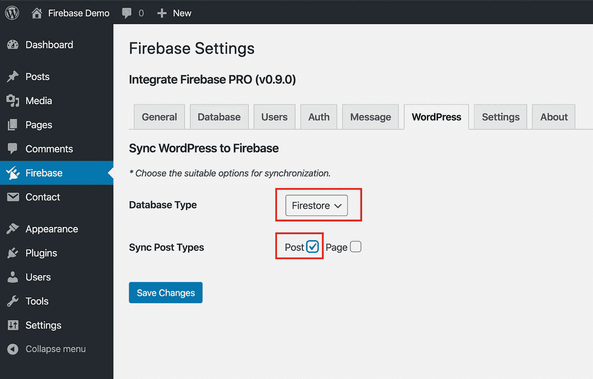
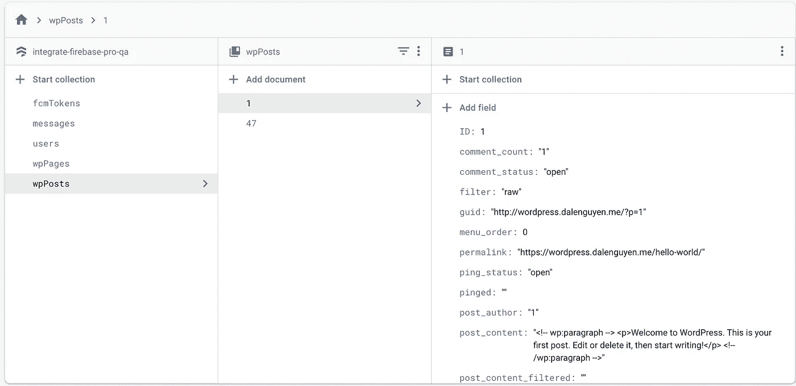

# 将数据从 WordPress 同步到 Firebase

> 原文：<https://itnext.io/sync-data-from-wordpress-to-firebase-d6e5860d3a06?source=collection_archive---------2----------------------->

> 如果你对 Integrate Firebase PRO 版本感兴趣，请阅读完整更新的文档:[*【https://firebase-wordpress-docs.readthedocs.io/】*](https://firebase-wordpress-docs.readthedocs.io/)

**演示:**[**https://wordpress.dalenguyen.me/**](https://wordpress.dalenguyen.me/)

*   文章 1: [如何将 Firebase 整合到 WordPress](/how-to-integrate-firebase-and-wordpress-b017ee274687)
*   第 2 篇:[如何从 Firestore 检索数据并显示在 WordPress 上](/how-to-retrieve-data-from-firestore-and-display-on-wordpress-8638854a762e)
*   第 3 篇:[如何在 WordPress 中使用 Firebase 自定义声明](https://medium.com/@dalenguyen/how-to-work-with-firebase-custom-claims-in-wordpress-aaf83965bd20?sk=85786e3739d42b18c3e2c7344bc5f436)
*   第 4 条:[将数据从 WordPress 保存到 Firebase(实时+ Firestore)](/how-to-save-data-from-wordpress-to-firebase-realtime-firestore-2eda917d01fb)
*   第五条: [Firebase WordPress 用户集成](/firebase-wordpress-user-integration-c18a28e41cbd)
*   第六篇:[如何在 WordPress 仪表盘中管理 Firebase 用户](/firebase-users-management-in-wordpress-dashboard-61b4a1ca066)
*   第七篇: [**如何从 WordPress 同步数据到 Firebase**](/sync-data-from-wordpress-to-firebase-d6e5860d3a06)
*   第 8 条:[一键登录 WordPress & Firebase 或通过电子邮件链接](https://medium.com/@dalenguyen/one-click-login-to-wordpress-firebase-or-via-email-link-d7610d71cd23)
*   第 9 条:[从 WordPress](https://medium.com/@dalenguyen/upload-files-to-cloud-storage-from-wordpress-e8acc8ce70cd) 上传文件到云存储
*   第十条:[远程 URL 登录到 Firebase & WordPress](/remote-url-login-to-firebase-wordpress-2027fad7c159)
*   第 11 条:[添加 Firebase 认证到 WordPress 的 2 种方法& WooCommerce](https://dalenguyen.medium.com/2-ways-to-add-firebase-authentication-to-wordpress-woocommerce-df500c3b104e)
*   第 12 条:[如何将 WooCommerce 购买数据发送到 Firebase](https://dalenguyen.medium.com/how-to-send-woocommerce-purchase-data-to-firebase-8c8b4c8cff39)
*   第 13 条:[从 WordPress](https://dalenguyen.medium.com/create-manage-firebase-database-from-wordpress-13347d8ffb2e) 创建&管理 Firebase 数据库

̶i̶'̶m̶̶n̶o̶t̶̶s̶u̶r̶e̶̶w̶h̶y̶̶y̶o̶u̶̶w̶a̶n̶t̶̶t̶o̶̶i̶n̶t̶e̶g̶r̶a̶t̶e̶̶f̶i̶r̶e̶b̶a̶s̶e̶̶a̶n̶d̶̶w̶o̶r̶d̶p̶r̶e̶s̶s̶.̶在与许多试图寻找将 Firebase 整合到 WordPress 网站或者相反的方法的客户合作后说道。我对业务需求和用例有了更多的理解。

这种实现的一个例子是为移动应用创建一个灵活的 [WordPress CMS。](/wordpress-cms-for-mobile-apps-ionic-firebase-part-1-4-983fea94d12)

从 0.9.0 版本开始，插件支持从 WordPress 同步**帖子&页面**到 Firebase。这意味着当你添加或更新一个新的职位或页面。内容将自动更新到 Firebase(实时/ Firestore)。

*   对于帖子，它们位于 **wpPosts** 集合名称下。
*   对于页面，它们位于 **wpPages** 集合名称下。

# 1.安装

确保插件的版本至少是:v0.9.0。然后你可以选择将哪种类型的数据同步到 Firebase。

*同步配置*

在这个例子中，它将选择 Firestore 作为数据库，每个新的或更新的帖子都将被同步到 Firestore。您可以选择文章和页面类型。

# 2.创建一个示例帖子

之后，您可以创建新帖子或更新现有帖子。

*创建新帖子*

保存后，文章将被添加到 Firestore。文章的文档 id 也是用于查询目的的文章 id。

*Firestore 中的新帖子*

当您更新当前帖子时，它将覆盖 Firestore 中的数据，以确保它总是更新的。

这个同步特性的优点是，您可以拥有一个云函数来监听 **wpPosts** 集合，然后在数据库有更新时向客户端(web /移动应用程序)发送推送通知。