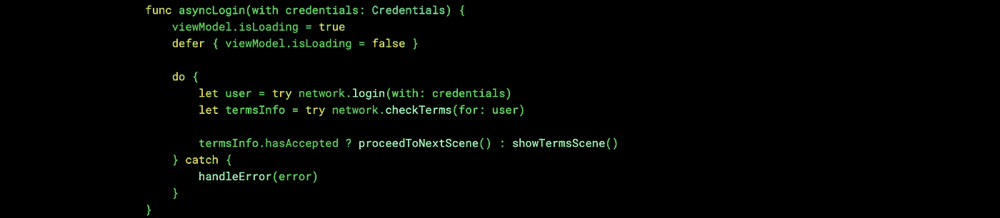

# Swift 中的同步处理

> 原文：<https://itnext.io/synchronous-processing-in-swift-e6923e56a232?source=collection_archive---------1----------------------->

## 我最近在使用 JavaScript 时体验了 async/await。如果我们在 Swift 中也能做到这一点，那该多好啊！

这是我们今天要实现的，实际上我不会像这样使用三元运算符…我只是想让这个片段很好地适合媒体封面图像😅

提供一个异步接口，一旦抽象的网络调用完成，闭包就会被调用。我们对此都很熟悉，它鼓励我们以类似的方式编写自己的网络层。典型的网络呼叫可以定义为:

对于那些滚动条不会自动隐藏的人，我在最后留了一个空行

考虑一个场景，您需要一个接一个地进行多个 API 调用，如下所示:

> 登录后，请求最新的条款和条件。如果用户尚未接受，则显示条款和条件屏幕。否则，请转到仪表板。

为了实现这一点，您将在登录 API 的完成闭包内调用条款和条件 API。您还需要在屏幕上显示加载指示器，并处理可能出现的任何错误。最后，生成的代码可能会很长:

除了冗长，我觉得还有几件事可以用更好的方式来完成:

*   `[weak self]`每次必须手动处理
*   总是需要一个`switch`来检查 API 调用是否成功
*   `isLoading`必须手动处理。当登录调用过早完成时，我们将其设置为`false`:在某些情况下，这可能会导致加载动画在条款和条件调用开始之前重置
*   代码不是从上到下读的。你不能只看`login(with:)`就说如果通话成功就会出现一个场景

**如果我们能够一个接一个地同步调用这两个 API，会怎么样？**

(假设你是用 Combine 或者 similar 来订阅 isLoading。稍后将详细介绍)

有了上面的:

*   没有必要总是引用自己的名字
*   所有的错误都在 catch 中处理——没有必要在`Result<Response, Error>`上`switch`
*   设置`isLoading`标志不符合我们的重要逻辑。本质上，我们只是简单地说“当这个函数运行时显示一个负载指示器”
*   代码简洁，从上到下阅读

# 我们如何才能使这成为现实？

我们需要做的第一件事是将`URLSession.dataTask(with:completionHandler:)`转换成一个同步函数。如果您一直在使用 Swift 进行脚本编写，那么您可能之前已经这样做过了。我决定使用一个`Semaphore`来冻结调用线程，直到任务返回值:

您的网络代码的其余部分可以保持与平常几乎一样——额外的好处是不需要传递完成闭包！只需从函数中返回解析后的模型，并`throw`任何出现的错误。

当然，我们绝对不希望在网络操作发生时冻结主线程。我一直假设我所有的主要逻辑都将在后台运行。当按下按钮调用我的控制器*上的一个函数时，我会立即使用[一个我编写的简单函数](https://gist.github.com/maxchuquimia/12fbe51a7402bf9fff4b0c87c8750755)转移到一个新线程。`async(_:)`存在于协议中，因此它可以将对`Self`的弱化引用传递到闭包中:

通过这种方式，我知道前缀为`async`的函数内部的所有东西都安全地运行在后台线程上。当然，将一个函数注释为`@async`会比用相同的签名维护两个函数更好……但是我们可能需要等待另一个 Swift 版本来工作。

**控制器是我称之为 ViewModel 的对象。我觉得“视图模型”这个术语有误导性，因为“模型”通常是静态存储…*

## 回调主线程

当然，我们不能从后台更新 UI。然而，当我们切换回主线程时，有许多方法可以很好地避免代码不可读。在 WWDC19 之前，我实际上使用了这种模式，使用我自己的 observable 类型，但是现在有了`Combine`，确保发布者的所有订阅者都通过`receive(on:)`在主线程上得到通知变得非常简单。下一节中的示例:

# 把所有的放在一起

假设我们有一个超级简单的应用程序，用户按下按钮，下载并显示他们的最新消息。首先我们需要一个代表屏幕上所有内容的`ViewModel`:

然后我们需要一个`Controller`来负责下载最新的消息并显示最新的消息:

我们甚至可以做一些聪明的事情，当线程产生时，控制器中的 async 函数自动将 isLoading 属性设置为 true，当线程终止时，将它设置回 false😉

最后，`ContentView`将自身绑定到`Controller.viewModel`并转发按钮按下动作:

# 真的更好吗？

是的。也许吧？也许不是。当然，有一些事情需要考虑。我已经用强类型的方式解决了同时进行两个网络调用的问题[这里](https://gist.github.com/maxchuquimia/12fbe51a7402bf9fff4b0c87c8750755)，但是我确定还有其他情况我还没有遇到。值得注意的是，克里斯·拉特纳等人正在讨论异步/等待风格的操作，所以这种语法可能很快会成为标准。