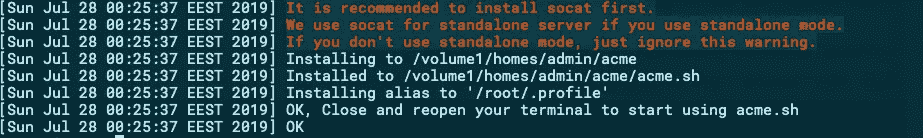
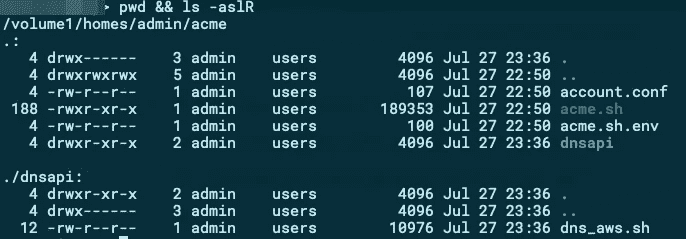
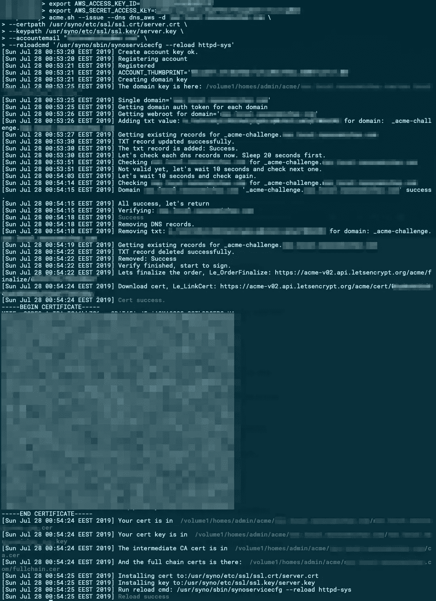
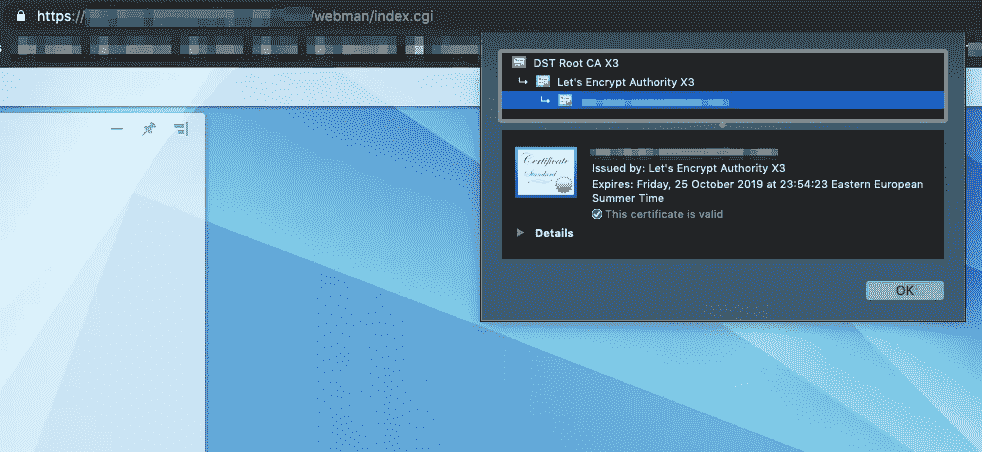
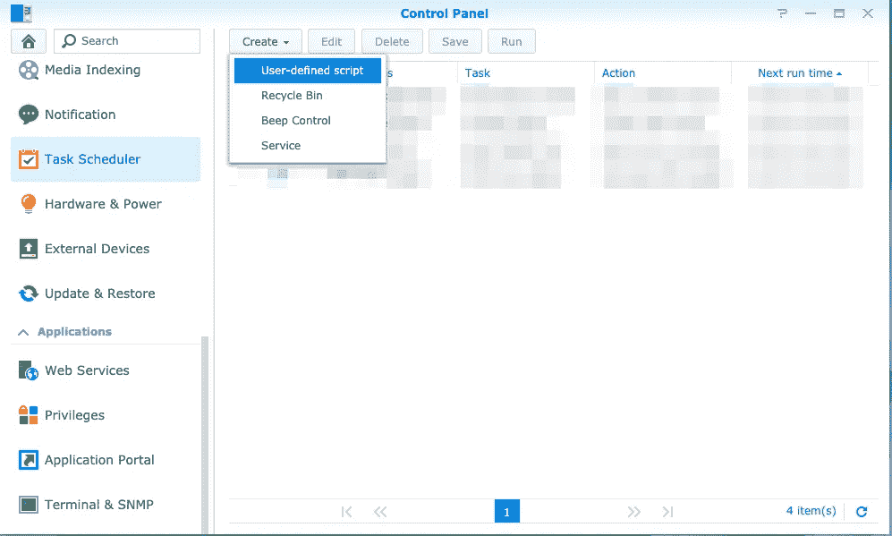
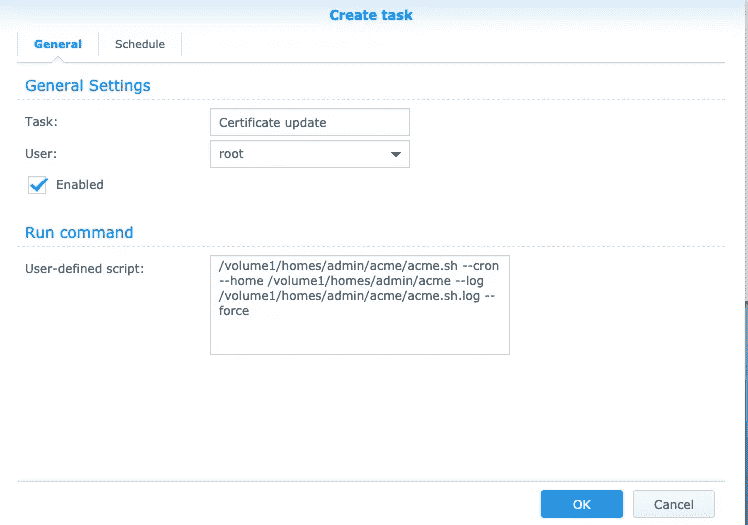
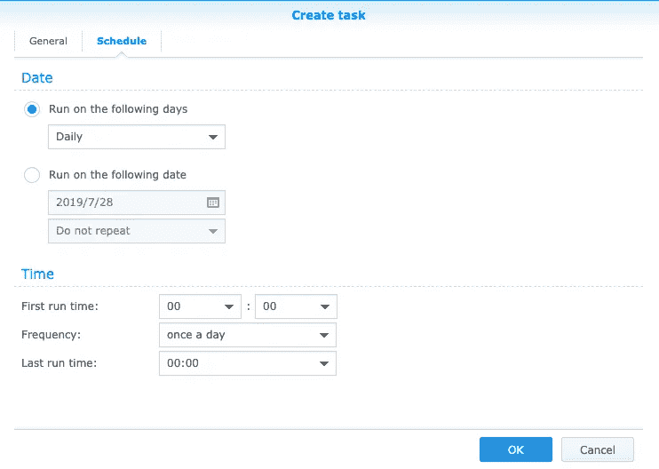

# Synology NAS 带有私有域上的免费 SSL 证书

> 原文：<https://itnext.io/synology-lets-encrypt-dns-01-challenge-acme-sh-and-route53-af491786d262?source=collection_archive---------1----------------------->

## 如何停止在浏览器中看到证书警告


帕特里克·林登伯格在 [Unsplash](https://unsplash.com?utm_source=medium&utm_medium=referral) 上拍摄的照片

*如果您(仍然)在*[*Synology*](https://www.synology.com)*[*DSM*](https://www.synology.com/en-global/dsm)*5 . x 上，并且您想要使用自动更新的* [*让我们加密*](https://letsencrypt.org) *证书来访问 NAS 的 web 管理界面，那么这篇文章就是为您准备的。**

*考虑到您的 NAS 的 web 管理员很可能不接触互联网，简单的 HTTP-01 挑战对您不起作用，相反，您需要 DNS-01 挑战和受 [acme.sh](https://github.com/Neilpang/acme.sh) 脚本支持的 DNS 服务。在这篇文章中，我将向您展示如何配置您的 NAS 来自动颁发和更新证书。您需要什么:*

*   *带有 DSM 5.x 固件的 Synology NAS。*
*   *一个由`acme.sh`支持的 DNS 服务(我用的是 [AWS](https://aws.amazon.com) [Route53](https://aws.amazon.com/route53) )。*
*   *SSH 访问您的 NAS。*

## *在 NAS 中安装 acme.sh*

*   *SSH 到您的 NAS(使用用户`root`，而不是`admin`)。*
*   *切换到临时目录:`cd /tmp`。*
*   *下载`acme.sh`客户端:
    `wget [https://raw.githubusercontent.com/Neilpang/acme.sh/master/acme.sh](https://raw.githubusercontent.com/Neilpang/acme.sh/master/acme.sh)`*
*   *安装客户端:
    `sh ./acme.sh --install --nocron --home /volume1/homes/admin/acme` 这是您应该得到的输出，您可以忽略这些错误/警告:*

**

*acme.sh 安装默认输出*

*   *安装 AWS 的客户端 API:
    `mkdir /volume1/homes/admin/acme/dnsapi && \
    cd /volume1/homes/admin/acme/dnsapi && \
    wget https://raw.githubusercontent.com/Neilpang/acme.sh/master/dnsapi/dns_aws.sh`。*
*   *客户端的安装应该为您提供以下文件结构:*

**

*acme.sh 文件结构*

*   *安装程序会创建一个链接到根用户的`.profile`的`acme.sh.env`文件，所以一旦你重新登录，你只需输入`acme.sh`就可以运行客户端。*

## *创建 AWS IAM 用户来管理 Route53 上的托管区域*

*创建一个 [AWS IAM](https://console.aws.amazon.com/iam) 用户，并提供必要的权限来处理您计划使用的域的托管区域。因为我使用的 AWS 帐户是为这篇文章创建的，所以我只是通过一个用户组授予了`AmazonRoute53FullAccess`策略；也许您可以选择一些权限:*

**

*拥有处理路线 53 所需权限的 AWS IAM 用户组*

*⚠️ *确保你为你的用户下载了凭证。**

## *使用 DNS-01 质询颁发您的初始证书*

*   *注销并 SSH 回您的 NAS(使用`root@`，而不是`admin@`)。*
*   *使用您在 AWS IAM 中创建的用户的详细信息创建 shell 变量:
    `export AWS_ACCESS_KEY_ID=your_id
    export AWS_SECRET_ACCESS_KEY=your_secret`*
*   *颁发您的初始证书:*

```
*acme.sh --issue --dns dns_aws -d your_domain \
 --certpath /usr/syno/etc/ssl/ssl.crt/server.crt \
 --keypath /usr/syno/etc/ssl/ssl.key/server.key \
 --accountemail "your_email" \
 --reloadcmd '/usr/syno/sbin/synoservicecfg --reload httpd-sys'*
```

**

*用于创建初始证书的 acme.sh 输出*

## *测试您新颁发的证书*

*只需打开 DSM 浏览器(如果已经打开，请关闭并重新打开或硬刷新)并检查证书:*

**

*您在 DSM 上安装的有效证书*

## *计划证书的自动续订*

*转到`Control Panel > Task Scheduler > Create > User-defined script`:*

**

*创建用户定义的计划作业*

*使用以下脚本创建任务:*

*`/volume1/homes/admin/acme/acme.sh --cron --home /volume1/homes/admin/acme --log /volume1/homes/admin/acme/acme.sh.log`*

**

*续订证书的计划任务*

*设置每天执行的任务。`acme.sh`将检查您的证书的到期日期，并且不会尝试重新颁发新证书，除非自颁发日期起已经过了 60 天:*

**

*计划证书续订*