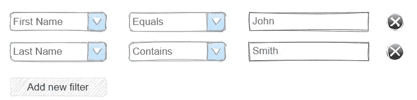
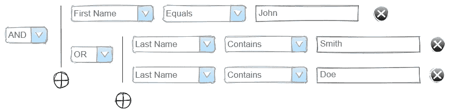
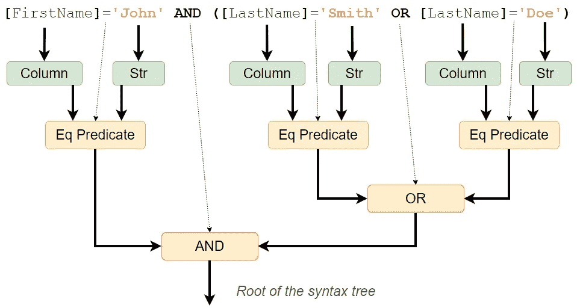
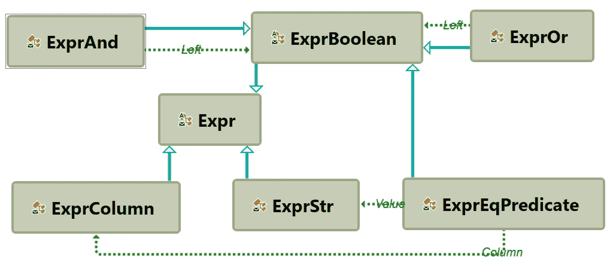
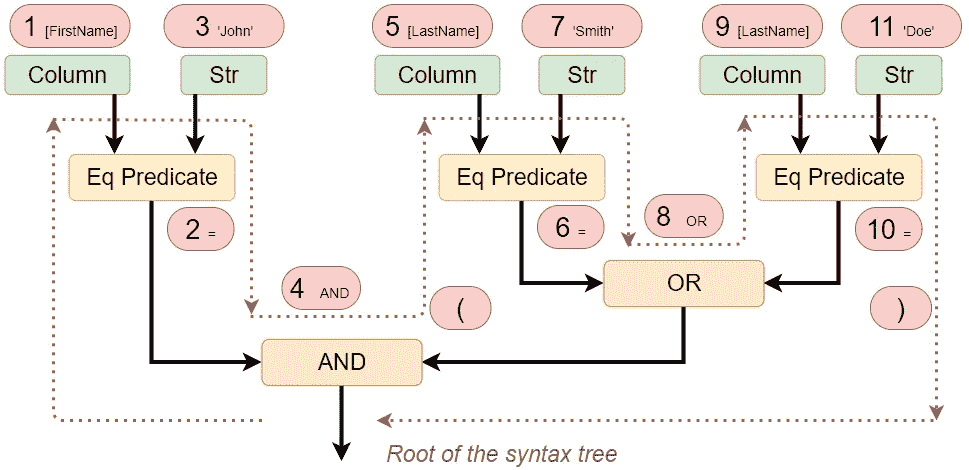
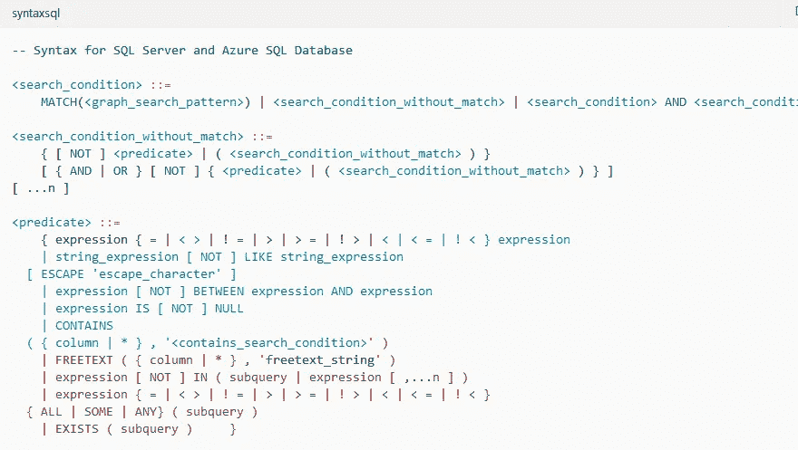
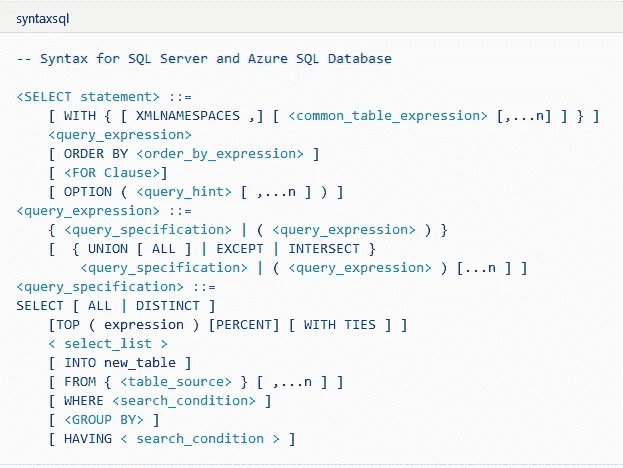

# 语法树和与 SQL 数据库交互的 LINQ 的替代方案

> 原文：<https://itnext.io/syntax-tree-and-alternative-to-linq-in-interaction-with-sql-databases-656b78fe00dc?source=collection_archive---------1----------------------->


这是一个遗留的企业项目，我被要求改进它的“高级”过滤功能。

在他们有这样的东西之前:



但是想要这样的东西:



让我们跳过 UI 部分，专注于数据访问层。像 99%的类似项目一样，这个项目使用 sql 数据库(MS SQL，但这并不重要),这个项目属于类似项目的一部分，它不与实体框架斗争，而是将所有逻辑放在存储过程中。执行“高级”搜索的过程如下所示:

```
CREATE PROCEDURE dbo.SomeContextUserFind
    ([@ContextId](http://twitter.com/ContextId) int, [@Filter](http://twitter.com/Filter) nvarchar(max)) AS
BEGINDECLARE [@sql](http://twitter.com/sql) nvarchar(max) = 
    N'SELECT U.UserId, U.FirstName, U.LastName
    FROM [User] U
    INNER JOIN [SomeContext] [C]
      ON ....
    WHERE [C].ContextId = [@p1](http://twitter.com/p1) AND ' + [@Filter](http://twitter.com/Filter);EXEC sp_executesql 

    [@sql](http://twitter.com/sql),
    N'[@p1](http://twitter.com/p1) int',
    [@p1](http://twitter.com/p1)=[@ContextId](http://twitter.com/ContextId)
END
```

生成过滤器字符串的代码如下所示:

当然，这不是你见过的最棒的代码，但是不幸的是遗留项目(或者甚至还没有遗留)经常充满了类似的东西。不管怎么说，它就是这样，应该有所改进。

我想到的第一个想法是在“FilterItem”中添加更多的字段，使构建逻辑更加复杂，但我很快意识到这是一条没有出路的道路——维护这样的代码非常困难，我永远也不会实现所需的功能。

在这一点上，我想起了“抽象语法树”，这显然是这种情况下的最佳选择，现在我将解释它是什么以及它如何有所帮助。

**抽象语法树**

首先，让我们看看将要创建的过滤器字符串，例如:

```
[FirstName]='John' AND ([LastName]='Smith' OR [LastName]='Doe')
```

这里我们可以注意到一些结构:



这个结构是一棵树，这意味着我们可以创建几个简单的类来描述它:



使用这些类，我们可以创建一个表示原始过滤器的对象:

事实上，这种被称为“抽象语法树”的结构可以用来表示更复杂的查询，但它们都有一个可以存储在单个对象中的“根”。

“抽象语法树”是用定义的语法规则解析某种形式语言(在我们的例子中是布尔表达式语言)的短语的结果。这样的规则有特定的符号。例如，我们简单语言的规则(布尔表达式的子集)可以写成:

```
<eqPredicate> ::= <column> = <str>
<or> ::= <eqPredicate>|or|<and> OR <eqPredicate>|or|<and>
<and> ::= <eqPredicate>|(<or>)|<and> AND <eqPredicate>|(<or>)|<and>
```

*注意:“抽象”意味着语法没有描述所有的语言细节，例如，分组括号、额外空格等。*

解析本身是一个独立的大主题，现在它并不那么重要，因为我们已经准备好了语法树，所以让我们专注于我们可以用它们做什么。

**SQL 代码生成**

显然，我们最重要的任务是将语法树转换回文本，我们有几种方法可以做到这一点。

第一种方法是使用模式匹配，这非常简单:

因此，构建器将包含以下行:

```
[FirstName]='John' AND ([LastName]='Smith' OR [LastName]='Joe')
```

看来这就是我们所需要的！

**访客**

尽管我热衷于函数式编程，但在这种情况下，面向对象的方法可能会提供更有效的解决方案——我说的是“访问者”模式。这种模式的思想是，我们不试图确定一个对象的类型，而是给它一个所有可能动作的列表(以接口的形式)，对象自己选择最适合它的类型的动作。让我们来定义这个列表:

任何物体(我们的结构)都可以接受选择:

现在我们可以将 sql 代码的生成提取到一个单独的类中:

并按如下方式使用它:

结果，我们将得到所需的字符串:

```
[FirstName]='John' AND ([LastName]='Smith' OR [LastName]='Joe')
```

与模式匹配相比，使用“访问者”模式有几个优点。因此，例如，具体类型的选择总是详尽的，因为向结构中添加新类型总是会导致 **IExprVisitor** 接口的变化，结果是需要扩展其所有实现(否则将会出现编译错误)。

**遍历和括号**

这个算法有几个方面需要注意。

首先，它到底是如何工作的？

事实上，这里我们正在对语法树进行深度优先遍历，sql 代码是该遍历的一个轨迹:



第二，括号会怎么样？

重点是布尔表达式有一定的求值顺序。首先计算“与”运算，然后计算“或”运算。需要括号来改变这个顺序，因为括号中的任何表达式在计算中都有更高的优先级。但是在语法树中，求值的顺序是由结构本身给出的(从分支到根)，所以不需要单独的括号类型。

**语法的扩展**

当然，在现实中，我们还需要其他谓词，例如“不等于”,为了能够使用它，我们只需要添加一个新的类:

由于我们有了一个新类型，编译器告诉我们需要为它实现 SQL 代码生成:

我们只创建了一组非常简单的布尔谓词，MS SQL 支持更多，但是正如您所看到的，您可以轻松地添加所有需要的语言结构。

顺便说一下，SQL Server 文档包含所有非常有用的 [SQL 语法](https://docs.microsoft.com/en-us/sql/t-sql/queries/search-condition-transact-sql)规则:



**操作员超载**

显然，通过调用类构造函数来创建语法树一点也不方便。然而，C#运算符重载可以帮助我们做到这一点。

让我们执行以下操作:

现在我们可以用一种非常简单明了的方式创建一个语法树:

结果还是会是:

```
[FirstName]='John' AND ([LastName]='Smith' OR [LastName]='Doe')
```

*注意:C#不允许重载* **& &** *和* **||** *操作符，实际上这是有意义的，因为如果结果已知，这些操作符将停止进一步的计算，但是我们需要所有的部分来构建语法树(它将由 SQL 数据库进行计算)。*

**接下来是什么**

我们似乎已经用布尔过滤器解决了这个问题，但是排序和分页呢？有时还需要附加 sql 视图(或派生表)来对计算字段进行筛选(或排序)。

没问题！让我们实现所有的 [SQL SELECT](https://docs.microsoft.com/en-us/sql/t-sql/queries/select-transact-sql) 语法:



当然，您不需要自己去做，因为有几个库([例如我的](https://github.com/0x1000000/SqExpress))已经实现了这一点，所以只需将这种方法视为与 SQL 数据库交互的另一种方式。

**LINQ 的替代方案**

我们所做的操作符重载有点类似于 LINQ 表达式，事实上有一些实际的相似之处。C#编译器生成语法树，然后实体框架或“LINQ 到 SQL”等库将这些树转换成真正的 SQL 代码。这种方法的主要问题是编译器生成 C#语言的语法树，但是我们需要 SQL！将命令式 C#反映到声明式 SQL 中并不是一件容易的事情，而且结果往往是不可预测的。

我更喜欢一种不同的方法——它可以使用真正的 SQL 语法，而不是使用 C #语法作为基础。除了编译器，它还可以使用运算符重载、扩展方法和流畅的生成器。

一方面，使用这种方法，我们获得了几乎与使用存储过程相同的灵活性。另一方面，我们有强大的类型、智能感知和不移动到数据库的业务逻辑。和…没有必要谷歌如何使用 LINQ 左连接)

另一个优点是数据更新语句(插入、更新、删除甚至合并)也可以以相同的方式实现，并且不需要从数据库中加载成千上万的记录来更新一个列。

这是一个使用真正的 SQL 语法作为基础可以做什么的例子(t [从这里开始](https://github.com/0x1000000/SqExpress#more-tables-and-foreign-keys)):

**结论**

语法树是一种非常强大的数据结构，你迟早会遇到它。这些可能是 LINQ 表达式，或者你可能需要创建一个罗斯林分析器，或者你可能想自己创建自己的语法，就像我几年前为了重构一个遗留项目所做的那样。无论如何，理解这种结构并能够使用它是很重要的。

[*链接到 SqExpress*](https://github.com/0x1000000/SqExpress) *—一个部分包含本文代码的项目。*