# 系统设计:打字头建议

> 原文：<https://itnext.io/system-design-typehead-suggestion-3956d0cec0a4?source=collection_archive---------0----------------------->

# 问题陈述

对于任何现代搜索文本来说，键入建议或自动完成都是一个很有影响力的功能。当用户输入文本进行搜索时，它会向用户推荐单词。它根据用户输入的字符给出不同单词或句子的列表。

图 1: Google Typehead 建议

它帮助用户很好地构建他们的搜索查询。它方便用户搜索可用的和经常搜索的术语。

# 要求

需求是任何产品开发的系统设计策略的重要方面。以下是在需求时必须阐明和涵盖的重要主题:

*   向后运行
*   功能需求
*   非功能性需求

# 向后运行

向后运行主要关注客户体验来定义需求。以下是应该牢记的问题:

*   识别顾客及其性格类型
*   客户或用户的用例
*   从商业角度考虑问题，而不仅仅是技术角度。

以下是针对客户或用户的**类型标题建议的功能倒推点:**

*   客户只需输入有限的字符或单词，就可以得到所需的建议列表。
*   可能有许多客户不精通搜索文本或单词的正确拼写。
*   客户不仅会期望加快他们的搜索速度，还会帮助他们更好地表达他们的搜索查询。

# **傅**职能要求

功能需求描述了产品的特性或功能。它主要关注其系统或组件的需求。这要从客户体验说起。

**字体建议的功能要求**

当用户在文本框中输入内容时，它会给出一个以他们输入的内容开始并与之匹配的条目列表。

功能需求收集的问题/答案:

建议的数量。

图 2:关于建议数量的问题

建议的顺序。

图 3:关于建议顺序的问题

本地存储。

图 4:关于本地存储的问题

个性化。

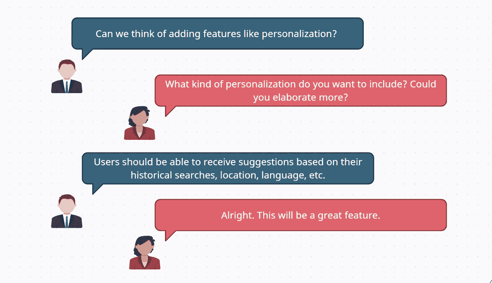

图 5:关于个性化的问题

# 非功能性需求

非功能需求描述了软件系统的质量特征。

非功能性需求应考虑以下主题:

*   指定缩放要求
*   指定延迟要求
*   指定可用性要求

与非功能需求相关的问题/答案:

图 6:关于每天搜索次数的问题

用户的搜索延迟。

问题 7:问题-与查看建议的搜索延迟相关

问题 8:关于用户为获得建议而需要输入的最少字符数的问题

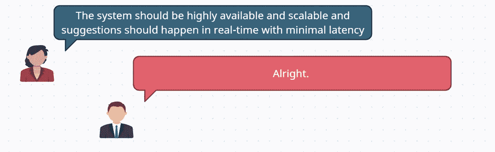

问题 8:可用性和可伸缩性

# 可扩展性评估

这是任何软件在开始开发之前的一个重要考虑因素。这包括关于用户请求数量的性能测量。基于这种测量系统可以扩大或缩小。它包括硬件、软件和数据库。

## 交通量估计

假设系统预计每天有**50 亿**次搜索。因此，每秒的搜索次数将是:

问题 9:交通量估计

在 50 亿个查询中会有很多重复的查询。因此，我们可以假设 50 亿个查询中有 20%是唯一查询。

每日唯一查询:

问题 10:每日唯一查询

由于在 50 亿个查询中会有一堆重复，我们可以认为其中只有 20%是唯一的。假设我们有 1 亿个独特的查询，我们希望在这些查询上构建一个索引。

## 存储估计

图 11:每个查询的大小估计

根据我们的对话，让我们取以下值:

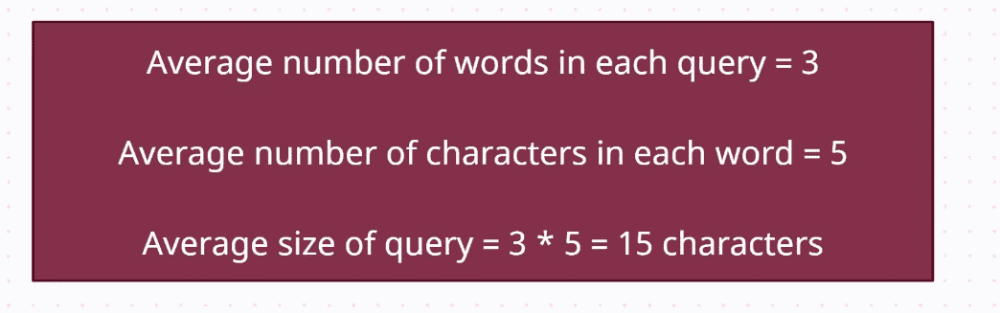

图 12:查询的平均大小

让我们根据上述查询大小来计算数据库存储大小:

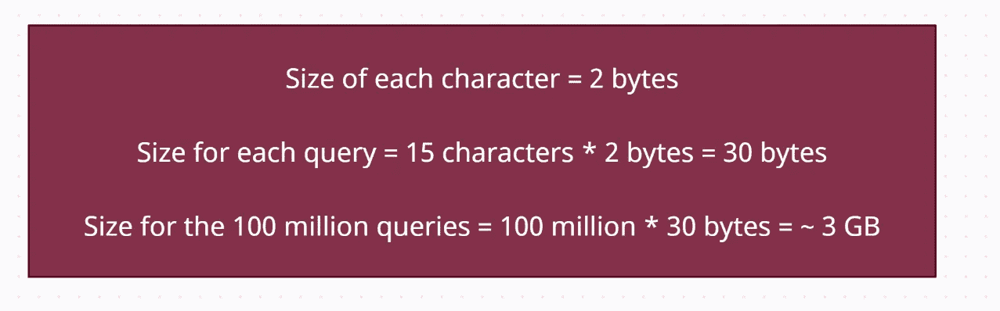

图 13:1 亿个查询的数据库存储大小

每天都会有新的独特的查询出现，对于这些查询，我们也需要估计数据库的大小。

图 14:新的唯一查询的存储估计

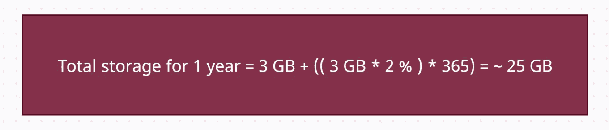

图 15:1 年的总存储量

## 带宽估计

我们预计每秒约有 **60K** 次搜索，因此，typeahead 建议服务的总输入数据将为:

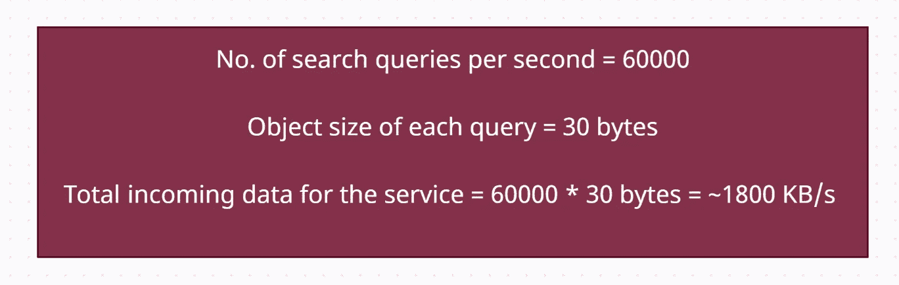

图 16:每秒的带宽估计值

# 算法讨论

此外，这个问题与大量字符串及其搜索相关。因此，非常重要的是，要想出一种方法来构造术语，并为这些术语设计一种数据结构，以便这些术语可以很容易地与用户的前缀匹配。

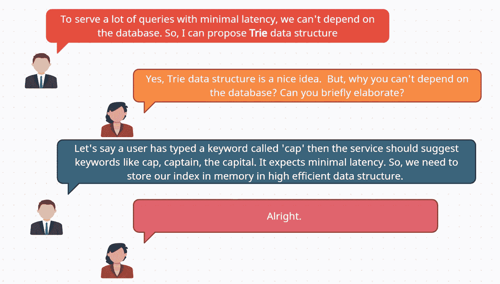

图 17:为什么选择数据结构

**Trie** 是一种令人难以置信的基于字符串前缀的合理数据结构。它用于描述数据检索的特征。它存储可以像图形一样可视化的字符串。它由节点和边组成。

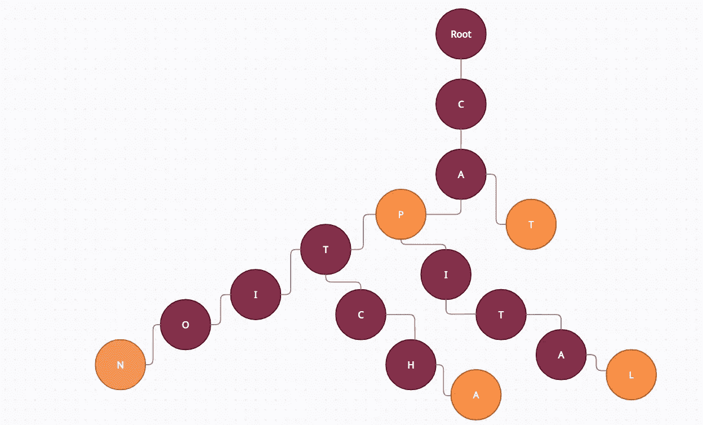

图 18:Trie 数据结构中搜索查询的存储

例如，用户键入单词**‘CAP’**，它会提示以下关键词:

*   无檐软平帽
*   标题
*   验证码
*   首都

在键入单词时，CAP 服务将其作为前缀，并遍历 trie 以构建所有前 10 个关键词。

图 18:热门或流行的关键词或建议

计算每个建议节点。

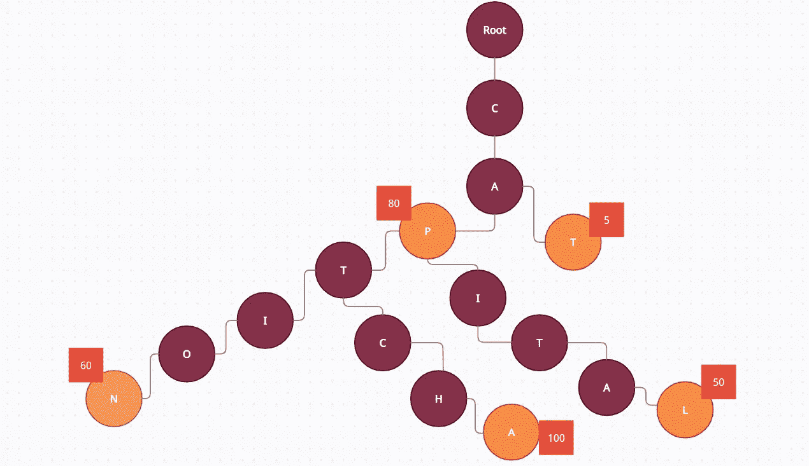

图 19:每个建议节点的计数

这里，在上图中，每个搜索到的建议节点都保持其计数，因此根据搜索频率，它将列出如下建议:

*   验证码
*   帽子
*   标题
*   资本

为了发现对一个已分配前缀的最佳建议，我们可以遍历它下面的子树。

图 20:效率的提高

关于树节点的构造和遍历的问题。

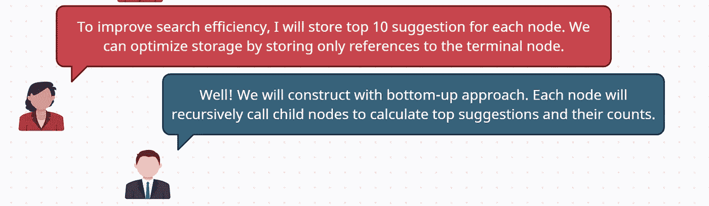

图 21:关于树节点的构造和遍历的问题。

问题-与用户的位置、语言等相关。

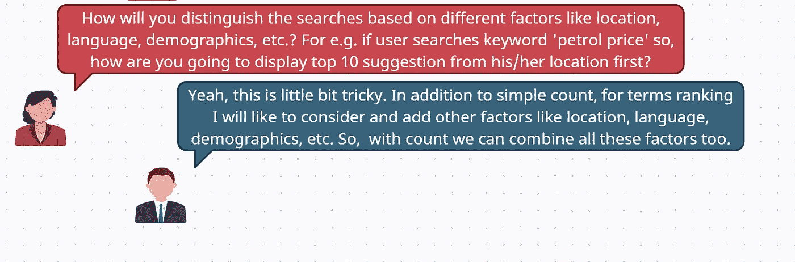

图 22:与用户的位置、语言等相关的问题。

例如，谷歌的行为如下:我搜索了汽油价格关键字，它的顶部建议来自我的位置和国家。

图 23:基于用户位置的谷歌建议

## 每次搜索的 Trie 更新策略

与更新 trie 相关的问题。

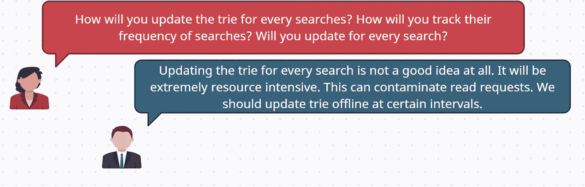

图 24:您将如何更新 trie

计算频率。

图 24:通过 Map Reduce 计算频率

要更新频率，有一个奇妙的方法叫做“**指数移动平均线(EMA)** ”。

## 指数移动平均线

指数移动平均线(EMA)，也称为指数加权移动平均线(EWMA)。它是一个一阶无限脉冲响应滤波器，应用指数递减的加权因子。与旧数据相比，新数据的权重更高。

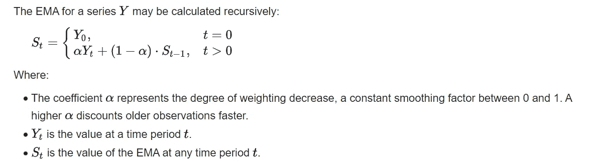

图 25: EMA

EMA 计算的好处:

*   这将增加最新数据的权重。

# 永久存储的数据库选择

如果服务器宕机，我们需要在某个数据库中永久存储 trie，以便可以重建 trie。

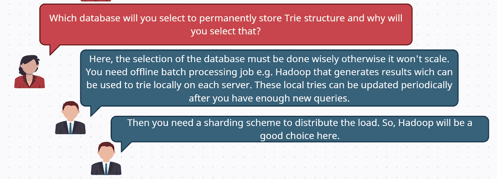

图 26:Trie 结构的存储

Trie 的存储方案如下:

让我们看看下面。

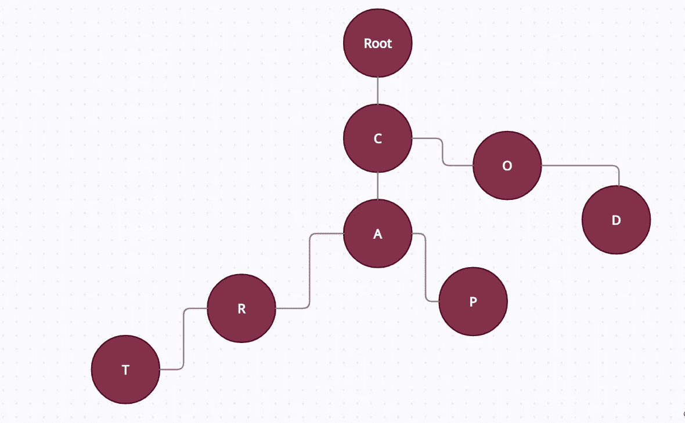

图 27: Trie 结构

我们可以像下面这样存储上面的 Trie:

图 28:上述 trie 的存储结构

# 高级系统设计

高层设计(HLD)定义了用于开发系统的架构。架构图提供了整个系统的轮廓，确定了为产品开发的主要组件及其接口。

低于高层系统设计。

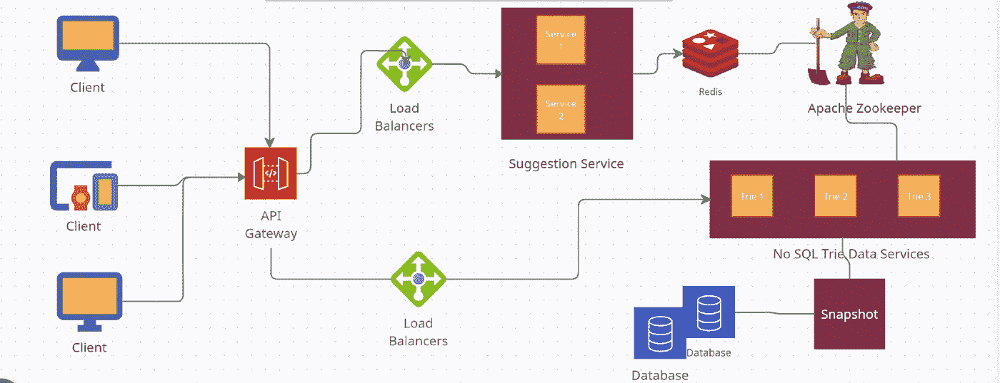

图 29:高层设计

问题-与 Trie 数据库的缩放有关。

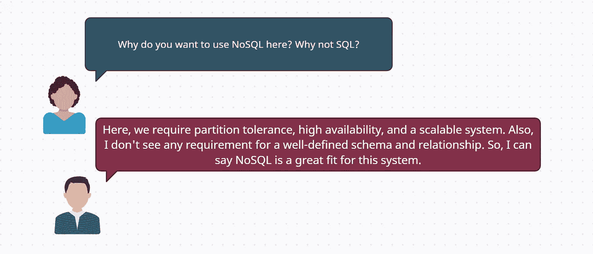

图 30: SQL 与 NoSQL

问题-与动物园管理员有关。

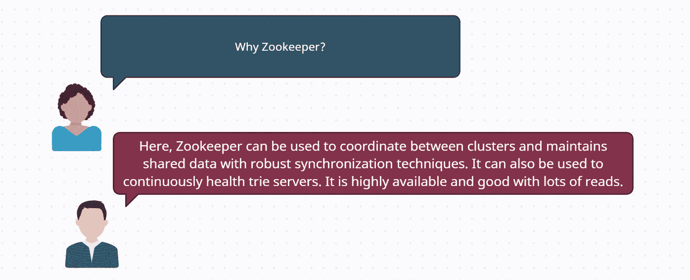

图 31:为什么选择动物园管理员？

问题-与设计中的缓存相关。

图 32:为什么要缓存？

问题-与快照相关。

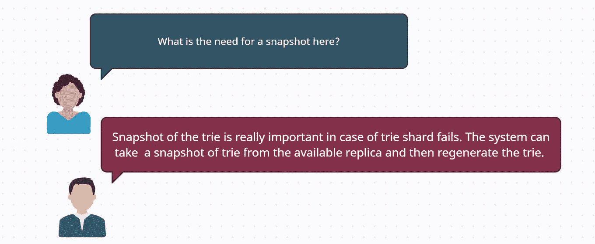

图 33:为什么在这里拍快照？

问题-与数据库的最终一致性有关。

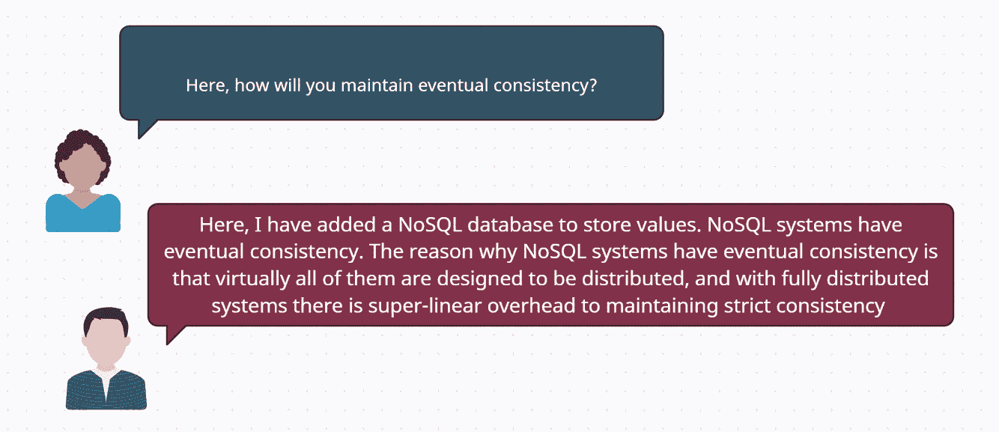

图 34:您将如何维护数据库的最终一致性。

问题-与容错相关。

图 35:你将如何使系统容错？

# 低层次设计

低层次设计(LLD)是一种组件层次的设计方法，追求一步一步的进步过程。这种方法可用于设计数据结构、所需的软件架构、源代码以及最终的性能算法。

## 预计算数据的存储

缓存中的键-值结构将作为前缀(键)-建议(值)。

键值结构下:

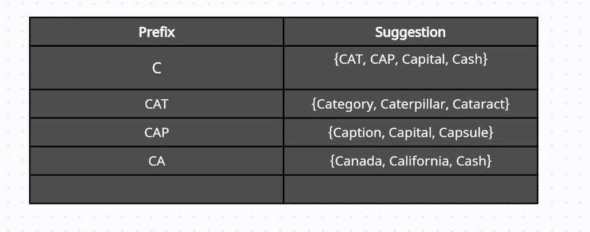

图 36:键值存储

这个键值存储存储了 top 建议。在这里，每一个建议，我们也可以添加计数。

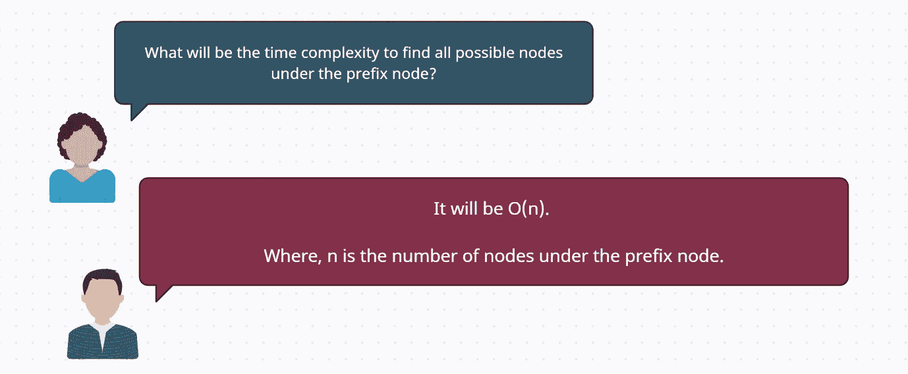

图 37:时间复杂度

## API 设计

下面是基本的 API。

获取 10 大建议列表。

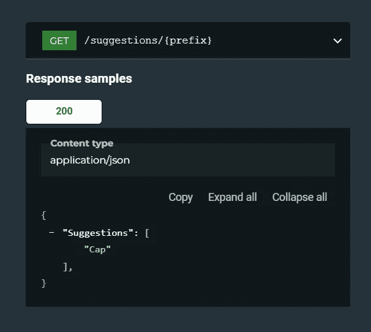

图 38:获取建议

已经被搜索超过特定阈值的新的唯一趋势查询将被存储在数据库中。

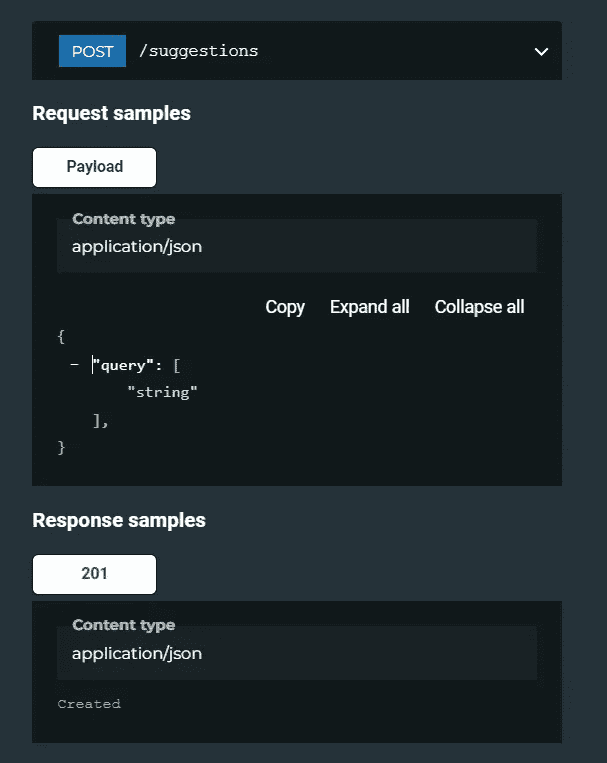

图 39:存储新的唯一查询

一个基本的类图如下:

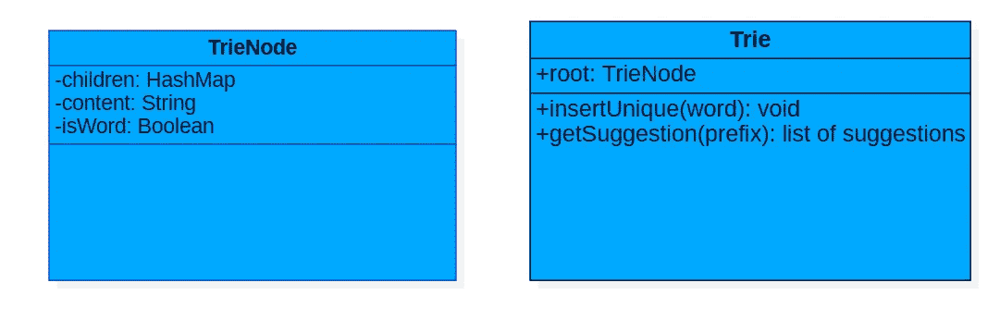

图 40:类图

# 考虑

在设计系统、服务或数据库时，需要考虑的事项很少:

*   即使出现问题，您如何确保数据保持正确和完整？
*   即使系统的某些部分降级了，您如何为客户提供持续良好的性能？
*   您如何扩展以应对负载的增加？
*   一个好的服务 API 是什么样子的？

## 你如何使你的系统可靠？

*   以最小化出错机会的方式设计系统。例如，设计良好的抽象、API 等。
*   将人们犯最多错误的地方与可能导致失败的地方分离开来。
*   在所有级别进行彻底测试。
*   允许从人为错误中快速轻松地恢复。
*   设置详细而清晰的监控，如性能指标和错误率。

## 总结扩展系统以支持数百万用户

*   保持 web 层无状态。
*   在每一层建立冗余。
*   尽可能多地缓存数据。
*   支持多个数据中心。
*   在 CDN 中托管静态资产。
*   通过分片扩展您的数据层。
*   将层划分为单独的服务。
*   监控您的系统并使用自动化工具。

# 结论

系统设计是软件开发的关键活动。在提出具体的数据库解决方案之前，一定要理解关于规模、一致性和可用性的要求。询问更多问题，以澄清设计所需的几个因素。您可能需要平衡预算和可用性，因为客户会要求您构建一个有足够能力承受任何合理规模的故障的系统。有几点必须澄清，比如客户或用户可以容忍多长时间的停机时间。从高级组件开始。你必须考虑其他方面，比如如果我们突然收到一波流量或数据，会发生什么。