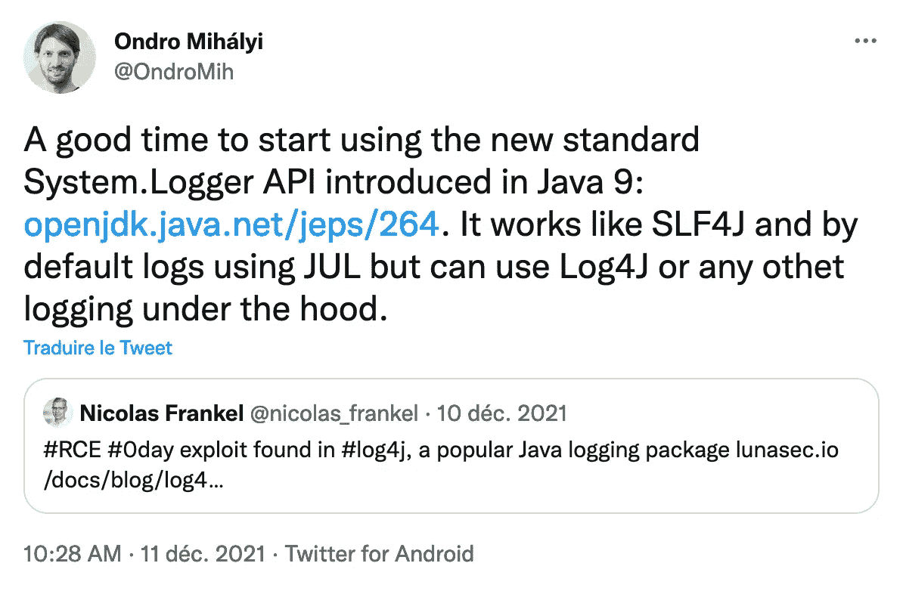
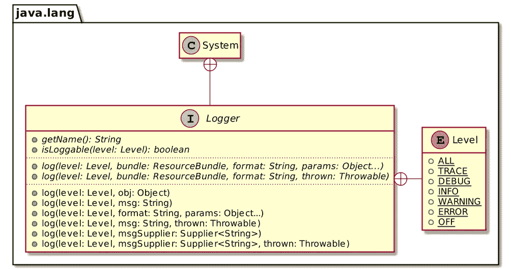
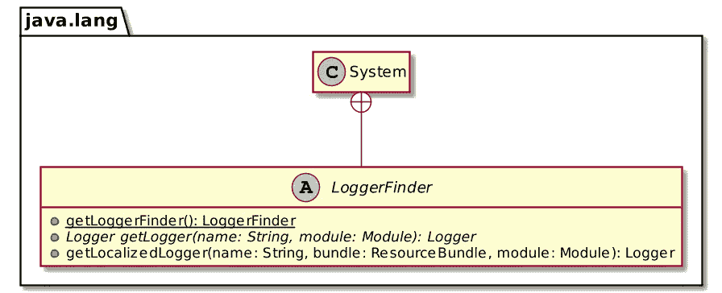

# 系统日志器

> 原文：<https://itnext.io/system-logger-d4ce82f687a3?source=collection_archive---------1----------------------->


12 月对 Java 开发人员来说不是一个好时机，对 Ops 来说更是如此。前者必须用一个固定的 Log4J 版本重新打包他们的应用程序，而后者必须重新部署它们——好几次。然而，每片乌云都有一线光明。以我为例，我了解了`System.Logger`。



简而言之，`System.Logger`是您的日志引擎的一个外观。比方说，不使用 SFL4J 的 API 和想要的实现，而是使用`System.Logger`而不是 SLF4J。它从 Java 9 开始就有了，我只是最近才知道这一点，真是令人失望。

# 系统。记录器 API

该 API 与其他日志记录 API 略有不同:它避免了不同的日志记录方法，如`debug()`、`info()`，而是支持传递日志记录`Level`参数的单个`log()`方法。



如果没有在类路径上提供任何相应的实现，`System.Logger`默认为 JUL。

```
public class LoggerExample { private static final System.Logger LOGGER = System.getLogger("c.f.b.DefaultLogger"); // 1 public static void main(String[] args) {
      LOGGER.log(DEBUG, "A debug message");
      LOGGER.log(INFO, "Hello world!");
  }
}
```

1.  去找伐木工

运行上面的代码片段会输出以下内容:

```
Dec 24, 2021 10:38:15 AM c.f.b.DefaultLogger main
INFO: Hello world!
```

# 兼容实现

目前大多数应用程序使用 [Log4J2](https://logging.apache.org/log4j/2.x/) 或 [SLF4J](https://www.slf4j.org/) 。两者都提供了兼容的`System.Logger`实现。

对于 Log4J，我们需要添加两个依赖项:

```
<dependencies>
    <dependency>
        <groupId>org.apache.logging.log4j</groupId>
        <artifactId>log4j-core</artifactId>            <!-- 1 -->
        <version>2.17.0</version>
    </dependency>
    <dependency>
        <groupId>org.apache.logging.log4j</groupId>    <!-- 2 -->
        <artifactId>log4j-jpl</artifactId>
        <version>2.17.0</version>
    </dependency>
</dependencies>
```

1.  Log4J 实现
2.  从`System.Logger`到 Log4J 的桥接

与上面相同的日志记录片段现在输出以下内容:

```
11:00:07.373 [main] INFO  c.f.b.DefaultLogger - Hello world!
```

要改用 SLF4J，请使用以下依赖项:

```
<dependencies>
  <dependency>
    <groupId>org.slf4j</groupId>
    <artifactId>slf4j-simple</artifactId>               <!-- 1 -->
    <version>2.0.0-alpha5</version>
  </dependency>
  <dependency>
    <groupId>org.slf4j</groupId>
    <artifactId>slf4j-jdk-platform-logging</artifactId> <!-- 2 -->
    <version>2.0.0-alpha5</version>
  </dependency>
</dependencies>
```

1.  基本 SLF4J 实现。任何其他实现都可以，*例如*回退
2.  从`System.Logger`到 Log4J 的桥

代码片段输出:

```
[main] INFO c.f.b.DefaultLogger - Hello world!
```

# 您自己的`System.Logger`实现

`System.Logger`依赖于 Java 的 [ServiceLoader](https://docs.oracle.com/javase/7/docs/api/java/util/ServiceLoader.html) 机制。`log4j-jpl`和`slf4j-jdk-platform-logging`都包含一个指向`LoggerFinder`实现的`META-INF/services/java.lang.System$LoggerFinder`文件。



我们可以基于`System.out`创建自己的用于教育目的。第一步是实现记录器本身。

```
public class ConsoleLogger implements System.Logger { private final String name; public ConsoleLogger(String name) {
        this.name = name;
    } @Override
    public String getName() {
        return name;
    } @Override
    public boolean isLoggable(Level level) {
        return level.getSeverity() >= Level.INFO.getSeverity();
    } @Override
    public void log(Level level, ResourceBundle bundle, String msg, Throwable thrown) {
        if (isLoggable(level)) {
            System.out.println(msg);
            thrown.printStackTrace();
        }
    } @Override
    public void log(Level level, ResourceBundle bundle, String format, Object... params) {
        if (isLoggable(level)) {
            System.out.println(MessageFormat.format(format, params));
        }
    }
}
```

然后，我们需要对`System.LoggerFinder`进行编码:

```
public class ConsoleLoggerFinder extends System.LoggerFinder { private static final Map<String, ConsoleLogger> LOGGERS = new HashMap<>(); // 1 @Override
    public System.Logger getLogger(String name, Module module) {
        return LOGGERS.computeIfAbsent(name, ConsoleLogger::new);              // 2
    }
}
```

1.  保留一份所有现有伐木工的地图
2.  如果记录器不存在，创建一个并存储它

最后，我们创建一个服务文件:

```
ch.frankel.blog.ConsoleLoggerFinder
```

现在，运行相同的代码片段输出:

```
Hello world!
```

# 结论

虽然这个 API 比其他更成熟的日志 API 更有限，但是`System.Logger`是一个很好的主意。它的正面是 JDK 的一部分。因此，它避免了使用需要将调用连接到另一个不相关的实现的第三方外观，*，例如* SLF4J 到 Log4J2。

出于这个原因，我想我会尝试一下`System.Logger`，哪怕只是为了获得一些实践经验。

这篇文章的完整源代码可以在 Maven 格式的[那里](https://github.com/ajavageek/system-logger)找到。

**更进一步:**

*   [JEP 264:平台日志 API 和服务](https://openjdk.java.net/jeps/264)
*   [类服务加载器](https://docs.oracle.com/javase/7/docs/api/java/util/ServiceLoader.html)
*   [没有第三方框架的最简单的 Java 解耦](https://blog.frankel.ch/simplest-java-decoupling-without-3rd-party-frameworks/)
*   [将 ServiceLoader 迁移到 Java 9 模块系统](https://blog.frankel.ch/migrating-serviceloader-java-9-module-system/)
*   [Java 服务加载器 vs Spring 工厂加载器](https://blog.frankel.ch/java-service-loader-vs-spring-factories/)

*原载于* [*一个 Java 怪胎*](https://blog.frankel.ch/system-logger/)*2022 年 2 月 13 日*