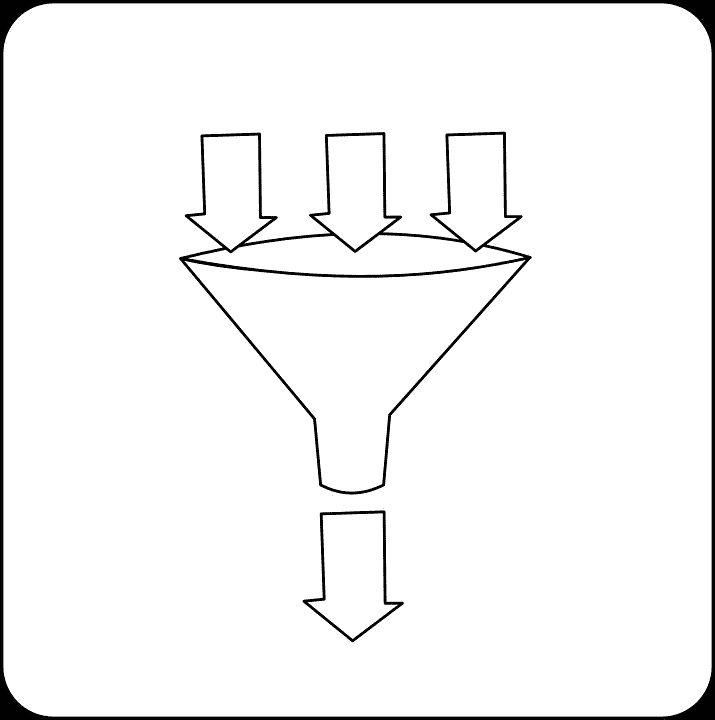

# 合并并发 IAsyncEnumerable <t>操作以提高性能</t>

> 原文：<https://itnext.io/merging-concurrent-iasyncenumerable-t-operations-for-increased-performance-d8393005c6ae?source=collection_archive---------2----------------------->



最近，我终于有机会使用一些 IAsyncEnumerable 方法，而不仅仅是尝试这些新的异步流的一些概念证明。因为它非常适合，我认为我可以同时运行多个 IAsyncEnumerable，但是我很快注意到没有好的内置方法将多个异步流合并为一个，所以我决定开始构建自己的系统！

# 快速 IAsyncEnumerable 简介

如果您还不熟悉 IAsyncEnumerable，我会为您做好准备。这是 C#8 引入的一个(相对)新特性，本质上代表了一个基于异步拉的流。它是众所周知的 IEnumerable 的异步对应。如果你现在想知道为什么我们需要它，因为我们已经可以使用 Task <ienumerable>>，主要的区别是新的 API 允许一个生成器，一旦有东西被返回，它就产生执行。这在 IEnumerable 中是不可能的，因为它没有异步生成器。你总是一次就得到所有的结果，中间什么都没有。</ienumerable>

下面是一个演示 IAsyncEnumerable 的示例:

```
async Task Main()
{
 await foreach (var item in Iterate())
 {
  Console.WriteLine(item);
 }
}public async IAsyncEnumerable<int> Iterate()
{
 for (var i = 0; i < 5; ++i)
 {
  await Task.Delay(100);
  Console.WriteLine("Yielding");
  yield return i;
 }
}// Output:
Yielding
0
Yielding
1
Yielding
2
Yielding
3
Yielding
4
```

# 合并 IAsyncEnumerable

太好了，现在我们知道它是如何工作的了。让我们回到我最初面临的问题。本质上，我想消费一个端点，比如

```
public async IAsyncEnumerable<int> Iterate()
{
 for (var i = 0; i < 5; ++i)
 {
  await Task.Delay(100);
  yield return i;
 }
}
```

多次，同时。但是，假设我们一次创建多个 IAsyncEnumerable <int>:</int>

```
var asyncIterators = Enumerable.Range(0, 3).Select(_ => Iterate());
```

现在，我们如何迭代它们呢？

如果我们逐个迭代，那么我们基本上是先迭代第一个 IAsyncEnumerable，然后第二个，然后第三个。我们总共需要 15*100 毫秒才能完成。与常规的“热”任务不同，IAsyncEnumerable number 2 和 3 也不会在后台开始迭代——记住，我们处理的是基于拉的生成器。除非有人从中抽取内容，否则什么都不会发生。

所以，我们走吧。我的主要目标是将合并后的东西也作为 IAsyncEnumerable <t>公开，这样外界就不必改变它们的用法并适应不同的模式。</t>

首先，我创建了一个类，它接受任意数量的 IAsyncEnumerable <t>，并从 IAsyncEnumerable <t>继承:</t></t>

```
public class MergedAsyncEnumerable<T> : IAsyncEnumerable<T>
{
 private readonly IAsyncEnumerable<T>[] _asyncEnumerables;public MergedAsyncEnumerable(params IAsyncEnumerable<T>[] asyncEnumerables)
 {
  _asyncEnumerables = asyncEnumerables;
 }public IAsyncEnumerator<T> GetAsyncEnumerator(CancellationToken cancellationToken = default)
  => ConsumeMergedAsyncEnumerabled().GetAsyncEnumerator(cancellationToken);private async IAsyncEnumerable<T> ConsumeMergedAsyncEnumerabled()
 {
...
```

GetAsyncEnumerator 是由接口引入的方法，所以我们必须实现它。我还添加了一个方法，我们将使用该方法来消费合并的流，我们返回该合并流的枚举数以符合接口。

现在我们有了这个设置，我们需要做的就是在 ConsumeMergedAsyncEnumerabled 方法中直接得到我们的逻辑。核心思想是将我们的异步可枚举数转换成一个结构，该结构同时遍历每个单独的异步可枚举数，并允许我们为每个可枚举数提取一个任务。

一旦我们有了每个异步可枚举的当前“未决”任务，我们就可以使用 Task。WhenAny(…)获取第一个完成的任务，并在相应的索引处向前移动迭代器。如果任何一个异步枚举没有更多的条目，我们将在下一个 WhenAny 中忽略它，并继续这样做，直到所有的条目都被处理。

这是我们的索引迭代器结构:

```
private record IndexedIteratorResult(T Item, bool HasMore, int Index);private class IndexedIterator
 {
  private int _index;private readonly IAsyncEnumerator<T> _asyncEnumerator;public IndexedIterator(IAsyncEnumerable<T> asyncEnumerable, int index)
  {
   _asyncEnumerator = asyncEnumerable.GetAsyncEnumerator();
   _index = index;
  }public async Task<IndexedIteratorResult> MoveAhead()
  {
   var hasMoreEntries = await _asyncEnumerator.MoveNextAsync();
   return new IndexedIteratorResult(_asyncEnumerator.Current, hasMoreEntries, _index);
  }
 }
```

它接受 IAsyncEnumerator 并按需前进。

综上所述，这是最终的实现:

```
private async IAsyncEnumerable<T> ConsumeMergedAsyncEnumerabled()
 {
  var iterators = _asyncEnumerables
   .Select((x, index) => new IndexedIterator(x, index))
   .ToArray();var tasks = iterators
   .Select(x => x.MoveAhead())
   .ToArray();while (tasks.Any(x => x is not null))
  {
   var winningTask = await Task.WhenAny(tasks.Where(x => x is not null));
   var (Item, HasMore, Index) = winningTask.Result;if (!HasMore)
   {
    tasks[Index] = null;
    continue;
   }yield return Item;
tasks[Index] = iterators[Index].MoveAhead(); }
 }
```

首先，我们创建一个 IndexedIterators 数组，每个数组对应一个异步枚举。

然后，我们通过将每个迭代器向前移动一位来开始最初的任务数组。这将同时发生。

接下来，我们循环遍历任务，直到所有的任务都为空，这基本上表明没有异步可枚举的剩余项。

我们获取集合中第一个完成的任务，yield 返回它的值(并因此为我们的组合 IAsyncEnumerable <t>的消费者生成一个条目),并根据它是否还有条目，或者将它标记为完成，或者推进它的迭代器。</t>

所有这些工作背后的驱动力是所有异步流的任务同时运行的事实，我们只是碰巧选择了第一个完成的，而其余的只是继续工作。

为了证明这确实有效，我们得到了以下结果:

```
sw.Restart();var asyncIteratorsMerged = new MergedAsyncEnumerable<int>(Enumerable.Range(0, 3).Select(_ => Iterate()).ToArray());await foreach (var item in asyncIteratorsMerged)
 {
  Console.WriteLine(item);
 }sw.Stop();
 Console.WriteLine(sw.Elapsed);
}// Output:
0
0
0
1
1
1
2
2
2
3
3
3
4
4
4
00:00:00.5737606
```

完美！我们达到了 500 毫秒，而不是 1500 毫秒，保持了 IAsyncEnumerable <t>的处理，并正确地使一切并行工作！</t>

请注意，我完全意识到这可能不是最聪明或最有效的方式，但这是我解决的问题，它帮助我正确理解 IAsyncEnumerable <t>，它的约束和它的底层机制。</t>

希望有帮助！