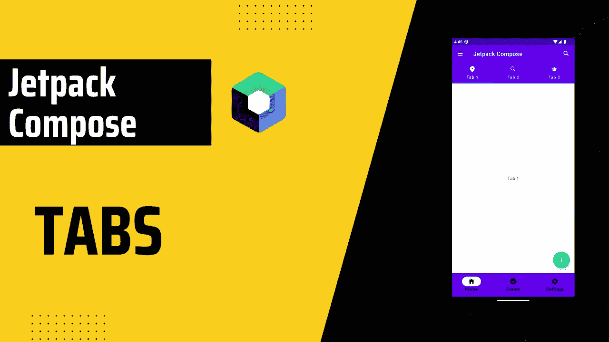
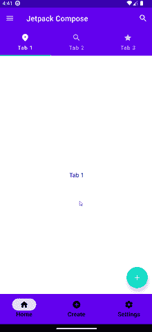

# Jetpack 撰写中的选项卡(TabLayout)

> 原文：<https://itnext.io/tabs-tablayout-in-jetpack-compose-cd1f84d3a381?source=collection_archive---------1----------------------->



> 选项卡对于在不同的和相关的信息组视图之间切换很有用。选项卡跨不同的屏幕、数据集和其他交互组织内容。

# 目录

*   [Gettings 开始](#539f)
*   [准备工作](#3af0)
*   [实施](#a5ac)

# 入门指南

我们需要两个伴奏者的依赖。你可以从[这里](https://github.com/google/accompanist/tree/main/pager#pager-composable-for-jetpack-compose)查看最新版本。

```
def accompanist_version = "0.28.0"
implementation "com.google.accompanist:accompanist-pager:$accompanist_version" // Pager
implementation "com.google.accompanist:accompanist-pager-indicators:$accompanist_version" // Pager Indicators
```

# 准备

在实现选项卡之前，我们将创建数据类和屏幕。

```
data class TabRowItem(
    val title: String,
    val icon: ImageVector,
    val screen: @Composable () -> Unit,
)
```

该数据类别可以根据要求进行更改。您可以移除`title`或`icon`，但至少要保留其中一个。

这将用于我们的示例。以后你可以也应该改变它。

最后，让我们创建标签列表。

```
val tabRowItems = listOf(
    TabRowItem(
        title = "Tab 1",
        screen = { TabScreen(text = "Tab 1") },
        icon = Icons.Rounded.Place,
    ),
    TabRowItem(
        title = "Tab 2",
        screen = { TabScreen(text = "Tab 2") },
        icon = Icons.Rounded.Search,
    ),
    TabRowItem(
        title = "Tab 3",
        screen = { TabScreen(text = "Tab 3") },
        icon = Icons.Rounded.Star,
    )
)
```

准备部分到此结束。

# 履行

```
val pagerState = rememberPagerState()
val coroutineScope = rememberCoroutineScope()
```

`pagerState`将有必要记住&保持传呼的状态。

`coroutineScope`将用于`pagerState`滚动。

我们首先添加`TabRow`，它将是`Tab`的容器。

`selectedTabIndex`，当前选中标签页的索引。

`indicator`，表示当前选择了哪个标签。

在`TabRow`内部，我们将创建`Tab`。因为我们已经创建了选项卡列表，我们将简单地调用`tabRowItems.forEachIndex`并设置`Tab` s。

`selected`，是否选中该页签。

`icon`和`text`是可选的。你可以选择其中一个或者两个都选，就像我们的例子一样。

在`onClick`方法中，我们启动`coroutineScope`并调用`animateScrollToPage`函数。它只是动画显示给定页面到视窗的中间。

> `*HorizontalPager*`一个水平滚动的布局，允许用户在项目之间左右翻转。

最后我们再加上`HorizontalPager`。`count`是页面的数量，`state`是用来控制或观察页面状态的对象，我们已经在上面创建过了。

在`HorizontalPager`中，我们将获取当前页面并调用`screen`，这也是我们已经在自定义数据类中创建的。


完整代码，



标签 GIF

就是这样！我希望它是有用的。👋👋

## 来源:

*   [约翰·科迪欧斯](https://johncodeos.com/how-to-create-tabs-with-jetpack-compose/)
*   [选项卡—材料设计 3](https://m3.material.io/components/tabs/overview)
*   [androidx.compose.material3 |安卓开发者](https://developer.android.com/reference/kotlin/androidx/compose/material3/package-summary#Tab(kotlin.Boolean,kotlin.Function0,androidx.compose.ui.Modifier,kotlin.Boolean,kotlin.Function0,kotlin.Function0,androidx.compose.ui.graphics.Color,androidx.compose.ui.graphics.Color,androidx.compose.foundation.interaction.MutableInteractionSource))

你可以联系我，

*   [领英](https://www.linkedin.com/in/burak-fidan/)
*   [Github](https://github.com/MrNtlu)
*   [推特](https://twitter.com/BurakFNtlu)