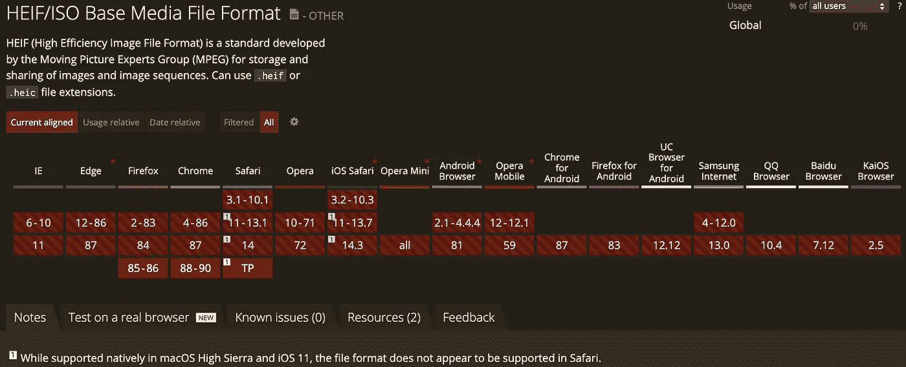

# 在 HTML5 中处理 iPhone 或 iPad 图像支持

> 原文：<https://itnext.io/tackling-iphone-or-ipad-images-support-in-browser-8e3e64e9aaa1?source=collection_archive---------1----------------------->

## java 描述语言

## 在浏览器中显示 HEIF/HEIC 图像

好吧，好吧，好吧……你可能已经猜到了，HEIC 和 HEIF 文件不被 HTML5 中的`img`标记所支持。



来源:[https://caniuse.com/heif](https://caniuse.com/heif)

最常见的情况是，你会遇到这些扩展是突发照片或任何其他苹果图像功能，生成`.heic`或`.mov`文件。然而，它并不严格地与苹果设备相关。

[](https://en.wikipedia.org/wiki/High_Efficiency_Image_File_Format) [## 高效图像文件格式

### 比较 JPEG，JPEG 2000，JPEG XR 和 HEIF 文件在类似的文件大小文件扩展名。嘿，嘿。heifs。heic…

en.wikipedia.org](https://en.wikipedia.org/wiki/High_Efficiency_Image_File_Format) 

在我当前的项目中，我们必须显示存储在 AWS s3 桶中的图像，这些图像是由我们的用户上传的。然而，HEIC 上传的图像与我们的 web 界面(在 Vue.js 中开发)不兼容。对于我的同事来说，每次这类文件出现时，下载图像真的很痛苦。

我将向您展示我是如何克服这个障碍的:在 web 浏览器中显示 HEIC 或 HEIF 图像。


照片由 [Szabo Viktor](https://unsplash.com/@vmxhu?utm_source=medium&utm_medium=referral) 在 [Unsplash](https://unsplash.com?utm_source=medium&utm_medium=referral) 上拍摄

# 行动计划

## 处理步骤

由于 HTML5 不支持这些扩展名，所以现有的唯一选项是文件转换。因此，以下是要遵循的步骤:

*   将运行中的文件转换成`Buffer`
*   将`Buffer`解析成一个 Base64 字符串
*   向`img`标签提供输出

## 选择转换库

为了转换图像，我首先尝试了 Alex Corvi 的 heic2any 库。

[](https://github.com/alexcorvi/heic2any) [## alexcorvi/heic2any

### 在浏览器中将 HEIF/HEIF 图像格式转换为 PNG/GIF/JPEG

github.com](https://github.com/alexcorvi/heic2any) 

但是，我得到了问题`Could not parse HEIF file`。即使我尝试了各种配置选项，我也无法转换文件。

这就是为什么我跳到了第二个现存的库:`heic-convert`并且成功了！

[](https://github.com/catdad-experiments/heic-convert#readme) [## cat dad-实验/heic-转换

### 将 HEIC/HEIF 图像转换为 JPEG 和 PNG 将 HEIC 中的主图像转换为 JPEG 将 HEIC 中的主图像转换为…

github.com](https://github.com/catdad-experiments/heic-convert#readme) 

让我们在实践中看看这个库！

# 实践

作为先决条件，将包添加到您的项目中，这要归功于:

```
npm install --save heic-convert# ORyarn add -D heic-convert
```

[](https://www.npmjs.com/package/heic-convert) [## 高度转换

### 将 HEIC/HEIF 图像转换为 JPEG 和 PNG 将 HEIC 中的主图像转换为 JPEG 将 HEIC 中的主图像转换为…

www.npmjs.com](https://www.npmjs.com/package/heic-convert) 

## 1 —转换为缓冲

第一个语句是通过使用`fetch`方法的[获取 API](https://developer.mozilla.org/en-US/docs/Web/API/Fetch_API) 来检索文件。

然后，我用`arrayBuffer`函数将文件内容转换成一个`Buffer`。该缓冲区将作为转换库提供的`heicConvert`转换方法的输入。

> 有关转换器配置的更多详细信息，您可以在此处阅读文档。

由于我们处理的是承诺(包裹退回)，所以有必要在适当的地方加上`async`、`await`关键词。

## 2 —转换为 Base64

目前，`output`变量存储一个有符号整数数组。这对于输入一个`img`标签的源来说是不方便的。这就是为什么，必须将其转换为 Base64 字符串。

为此，`[btoa](https://developer.mozilla.org/en-US/docs/Web/API/WindowOrWorkerGlobalScope/btoa)` [浏览器 API](https://developer.mozilla.org/en-US/docs/Web/API/WindowOrWorkerGlobalScope/btoa) 函数将非常方便地实现这种转换:

## 3-编码到图像标签

因为我得到了一个 Base64 图像字符串，所以我只需要将它提供给我的图像标记。有必要添加一个前缀，以便浏览器能够处理它。

# 把所有的放在一起

最后，我们到了:从指向 HEIC 图像的`url`到用`img`在 HTML5 中处理的东西。

# 走得更远

根据图像的特征(尺寸、质量)，转换可能需要几秒钟。我建议您:

*   一边转换一边放一个加载器(当然！)
*   使用[映射](https://developer.mozilla.org/en-US/docs/Web/JavaScript/Reference/Global_Objects/Map)将转换的输出保存在内存中(您可以使用文件名作为映射键)

# 结束想法

事实上，处理 HEIC 格式并不复杂。在将图像显示成合适的 HTML5 标签之前，只需要几个转换步骤。

另一个可行的解决方案可能是在用户必须上传图像时实现这个代码。或者甚至在后端处理转换。无论如何，有了十几行代码，我们就可以在浏览器中管理它了！

**参考文献**

 [## 我能用吗...HEIC/HEIF—html 5、CSS3 等的支持表

### “我可以使用吗”提供了最新的浏览器支持表，以支持桌面和移动设备上的前端 web 技术…

caniuse.com](https://caniuse.com/heif) [](https://en.wikipedia.org/wiki/High_Efficiency_Image_File_Format) [## 高效图像文件格式

### 比较 JPEG，JPEG 2000，JPEG XR 和 HEIF 文件在类似的文件大小文件扩展名。嘿，嘿。heifs。heic…

en.wikipedia.org](https://en.wikipedia.org/wiki/High_Efficiency_Image_File_Format) [](https://github.com/alexcorvi/heic2any) [## alexcorvi/heic2any

### 在浏览器中将 HEIF/HEIF 图像格式转换为 PNG/GIF/JPEG

github.com](https://github.com/alexcorvi/heic2any) [](https://www.npmjs.com/package/heic-convert) [## 高度转换

### 将 HEIC/HEIF 图像转换为 JPEG 和 PNG 将 HEIC 中的主图像转换为 JPEG 将 HEIC 中的主图像转换为…

www.npmjs.com](https://www.npmjs.com/package/heic-convert)