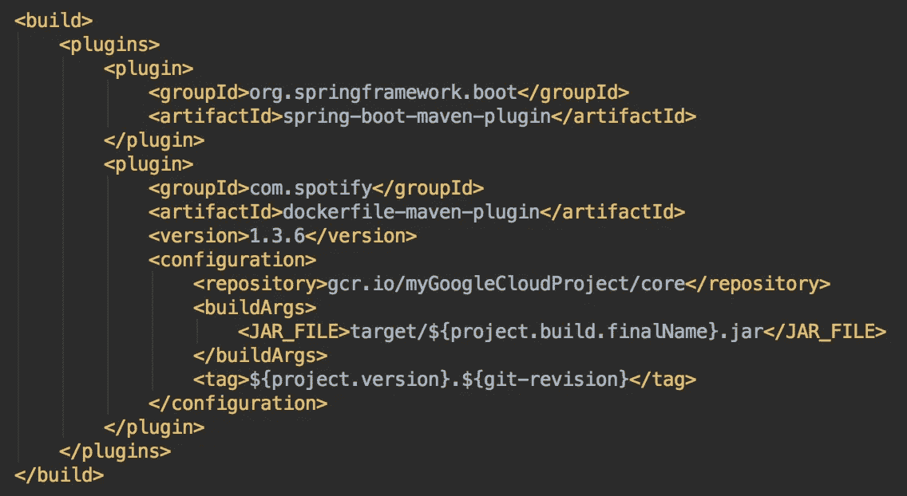
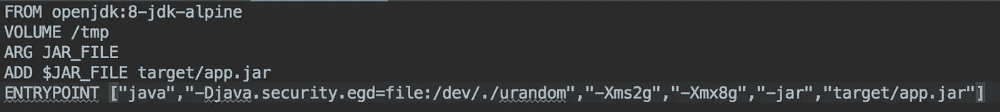
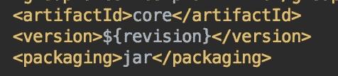
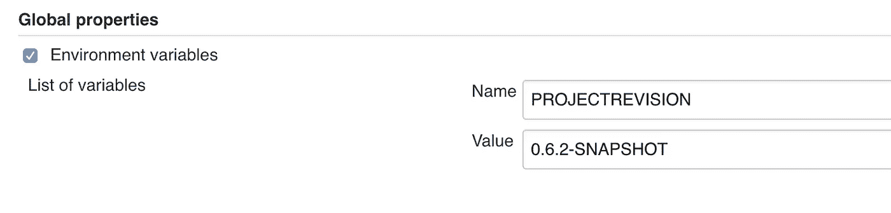
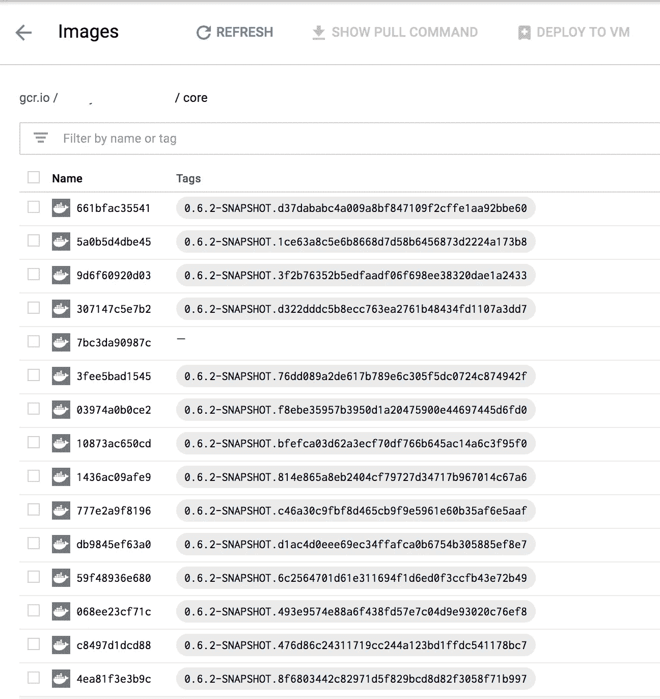

# 使用 Maven 构建时标记您的 Docker 图像

> 原文：<https://itnext.io/tag-your-docker-images-while-building-with-maven-915c8043d2e0?source=collection_archive---------1----------------------->

在我最近的故事中，我解释了我如何“在 Kubernetes 上发布 Spring Boot 应用程序”。在这个故事中，我想解释一下我是如何标记由 com . Spotify . Docker-maven-plugin 从 Spring Boot 源代码构建的 Docker 图像的。

BIZIMKILER 你要做的第一件事就是把 com . Spotify . docker-maven-plugin 添加到你的 pom.xml 中。在我的环境中，我既可以通过 spring boot maven 插件在本地运行它，也可以通过 com . Spotify . docker-maven-plugin 进行 dockerize。这是我的示例配置



构建 my pom.xml 的一部分

上面的构建配置只对与同一个模块相关联的 Dockerfile 有意义。这是档案。



pom.xml 的 JAR_FILE 参数在 Dockerfile 中用来指出 Spring Boot 构建的 JAR 包。那是主要的应用。但这个故事关注的重要部分是为 Docker 图像定义的标签。

请仔细注意 pom.xml 的**存储库**和**标签**节点。这些节点配置 dockerfile-maven-plugin，用特定的构建标签标记容器化的 Docker 映像。标签节点包含两部分:

这是我们在 pom.xml 之上定义的一个变量



pom.xml 顶部定义项目(模块)变量

但是我们如何为每个构建定义${revision}?我们使用詹金斯的全球资产。

在 Jenkins 构建 Docker 映像的工作中，我们给出以下命令:

```
./mvnw install dockerfile:build -Drevision=${PROJECTREVISION} -Dgit-revision=$GIT_COMMIT
```

这个命令通过使用 dockerfile-maven-plugin 构建 docker 映像。您可以看到，pom.xml 中使用的这个命令设置了 **revision 和 git-revision 参数。**

嗯哼！${PROJECTREVISION}和$GIT_COMMIT 变量怎么样？

＄{ project revision }来自 Jenkins 管理员设置的 Jenkins 全局属性。(在我的例子中，我每周为每个 scrum 增加版本)



詹金斯的全球财产

$GIT_COMMIT 变量由 Jenkins 环境自动设置。当 Jenkins 从主分支获取最新的源代码时，这个变量被设置为 GIT 提供者(在我的例子中是 Gitlab)给出的提交 id

[这里是你可以在 Kenkins 构建中使用的 env 变量](https://wiki.jenkins.io/display/JENKINS/Building+a+software+project)

2 ${git-revision}:如上所述，这个 pom.xml 变量是由 Jenkins env 变量在 Jenkins 命令上设置的。

在这个版本的末尾，您得到了一个标记有项目版本和 git 提交 Id 的 Docker 映像。以下是我在 Jenkins 中使用的完整命令，用于构建该图像并将其推送到 Google 容器注册表

```
./mvnw install dockerfile:build -Drevision=${PROJECTREVISION} -Dgit-revision=$GIT_COMMIT
docker push gcr.io/mygooglecloudproject/core:${PROJECTREVISION}.$GIT_COMMIT
```

这是我的 Google 容器注册表示例，它为每个主分支提交标记了各种图像。

