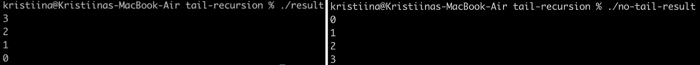
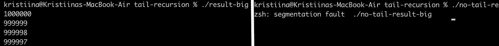
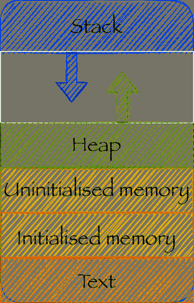
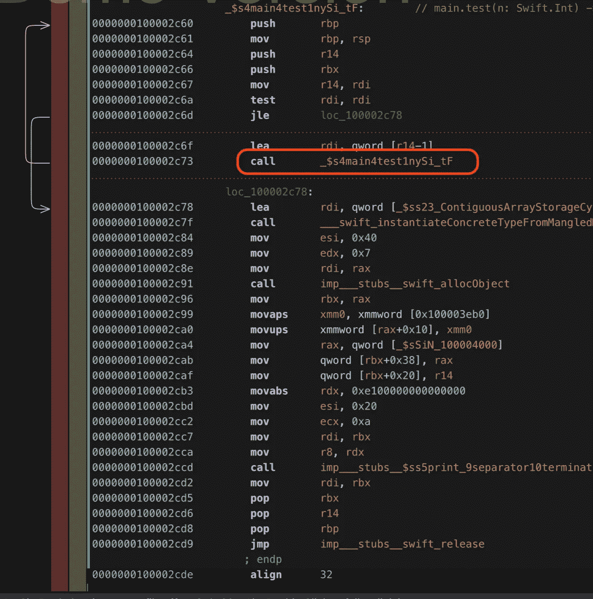
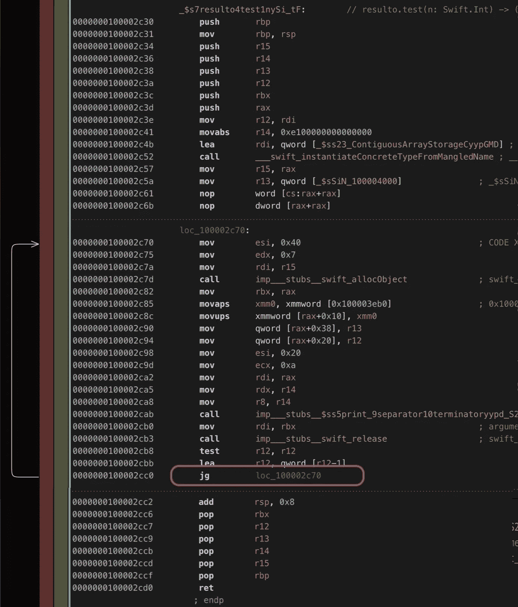

# swift 中的尾部递归

> 原文：<https://itnext.io/tail-recursion-in-swift-6aa73ed7bf56?source=collection_archive---------4----------------------->

## 它是什么以及如何避免调用堆栈溢出的示例。

到目前为止，作为一名 iOS 开发人员，除了我在大学学到的东西之外，我很少接触调用栈。我工作过的大多数应用程序都不是资源密集型的。我曾经开发过复杂的应用程序，但是这种复杂性主要是为了提供良好的用户体验。

在过去的两年里，作为我博士研究的一部分，我一直在开发一个分析源代码历史的 swift 应用程序。对于非常大的应用程序和很长的源代码历史，我有时会遇到我的工具因**分段错误**而崩溃的问题。当时，我并不知道问题出在哪里，但我知道，当要分析的数据变得太大时，就会出现这种情况。我稍后将回到这一点。

在做一个 C 和汇编编程课程的项目时，我偶然发现了尾部递归优化，并决定在 swift 中尝试一下。

## **什么是尾递归？**

一个**递归函数**是一个调用自身的函数，例如下面的函数将打印出从 n 到 0 的所有数字。

**尾部递归函数**是一个递归函数，其中对自身的调用位于函数的末尾，如下例所示:

这些函数以相反的顺序打印出数字，但在其他方面具有相同的功能:打印出 n 和 0 之间的所有数字。

## 为什么重要？

让我们编译这些程序并运行它们。可以通过调用以下命令来编译程序:

> xcrun swift c-O tail . swift-or result

这些程序可以通过调用

> 。/结果

我们来试试小 n (n=3)。

现在让我们尝试一个大的 n (n=10000)。

这里我们回到**分段故障。**这只发生在无尾递归程序中。为什么会这样？什么是分段故障，为什么只有一个程序崩溃？为了回答这些问题，我将从调用堆栈开始。

## 什么是调用栈？

当一个方法在程序中被调用时，它被添加到调用堆栈中。当在这个方法中调用另一个方法时，它也被添加到调用堆栈中。当方法返回时，它将从调用堆栈中移除。

因此，来自递归函数的重复方法调用都被添加到调用堆栈中，直到满足停止条件并且最后一个方法调用返回。

## 什么是分段故障？

调用堆栈存储在堆栈内存段中。左图显示了内存布局。

当向调用堆栈添加太多方法调用时，分配给调用堆栈的有限内存将变满，调用堆栈外的内存位置将被覆盖。首先是堆，然后是未初始化的内存，已初始化的内存，最后是文本段。

试图写入文本段会导致分段错误，程序执行会暂停。这是一种安全机制。

## 尾部递归优化。

Swift 使用尾部递归优化，这意味着如果递归函数中的方法调用位于函数的末尾，编译器能够使用跳转语句而不是方法调用。这意味着递归中对自身的调用不会添加到调用堆栈中。

当我们使用 Hopper 反编译前面的两个程序时，我们看到每个程序的汇编代码都有很大的不同。

带有递归函数的程序产生汇编代码，如下所示。我们可以看到在方法 _$s4main4test2nySi_tF 中有一个对 iself 的方法调用。

另一方面，具有尾部递归的程序得到了优化。我们可以看到，有一个跳转(jg)指令，而不是方法调用。

我一直喜欢编写递归函数，但我从未想过使用它们会有缺点。当然，上面的例子是应该使用循环编写的，但是仍然是一个很好的例子，说明意外溢出调用堆栈是多么容易。

我现在知道为什么我的源代码分析工具在非常大的应用程序中崩溃了，我将致力于优化代码以防止它在未来发生。

## 外卖

*   如果可能的话，最好使用循环而不是递归。
*   编写递归函数时，如果可能的话，在方法的末尾编写对自身的调用。