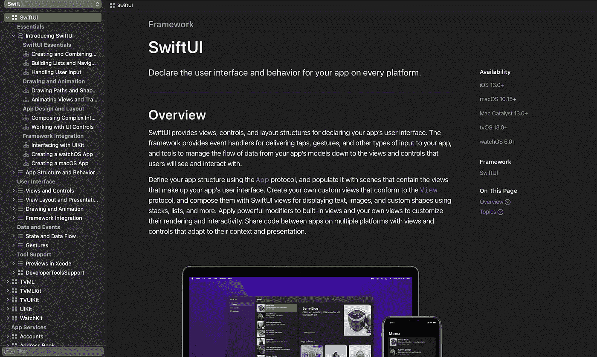
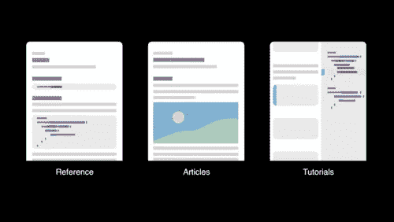
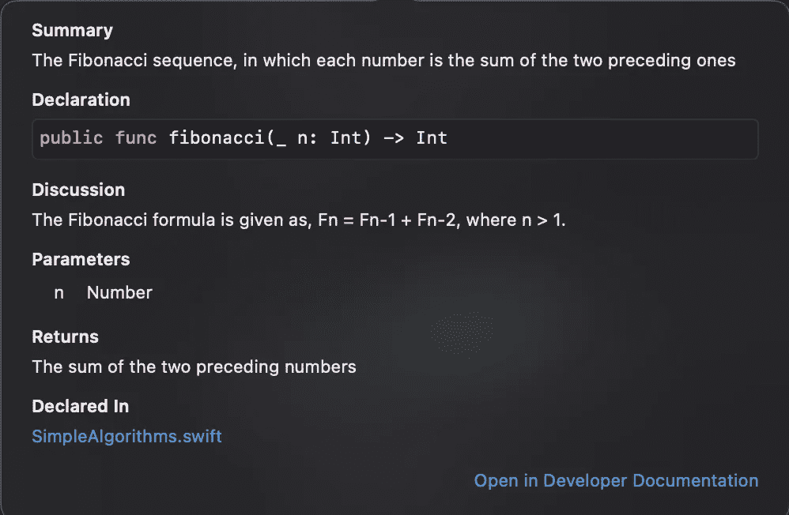
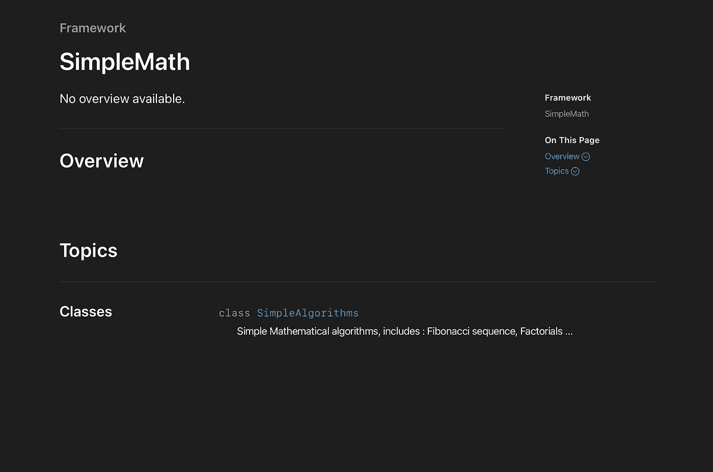
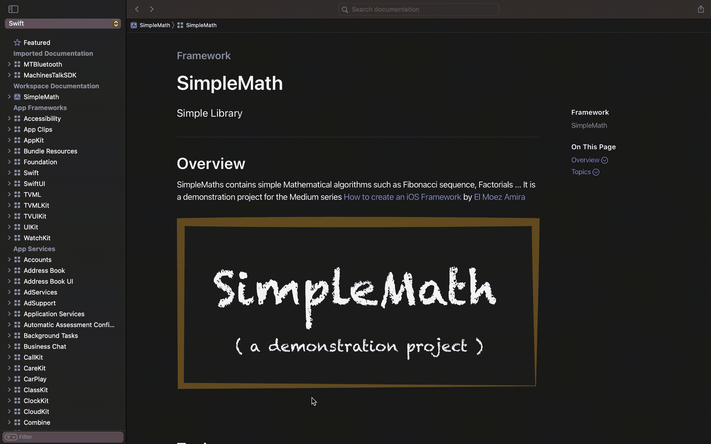

# 让您的文档技能更上一层楼——如何创建 iOS 框架 Pt2

> 原文：<https://itnext.io/take-your-documentation-skills-to-the-next-level-how-to-create-an-ios-framework-pt2-94193527691f?source=collection_archive---------2----------------------->

无论你是打算在内部发布你的框架还是向全世界公开发布，文档都是你不能跳过的关键步骤，尤其是因为 XCFrameworks 是二进制框架，这意味着开发人员看不到里面是什么，换句话说，他们不知道如何有效地使用它。现在你们中的一些人可能会认为文档很无聊(有时会这样)，但是在今天的帖子中，我们会做一些非常像样、组织良好、易于阅读的东西，所以坚持到最后，见证 DocC 可以有多棒！(剧透:如下截图)

在 Xcode 中查看 SwiftUI 文档:在这篇文章的最后，我们将为我们的演示框架 SimpleMath 创建类似的东西

# DocC 是什么？

DocC 代表**文档编译器**，它是 [WWDC2021](https://developer.apple.com/videos/play/wwdc2021/10166/) 中引入的主要特性之一，DocC 可以让你生成苹果风格的文档。DocC 扩展了 Markdown 的语法，加入了一种称为文档标记的方言，这种方言增加了符号链接、改进的图像支持和术语列表等功能

编译器通过将您在源代码中编写的注释与扩展文件、文章和 Xcode 项目中的其他资源相结合来构建您的文档。

> DocC 产生一种叫做**doccar archive**的文件类型，可以通过 Xcode 查看，可以托管在服务器上。DocC 档案是紧密联系在一起的文件，包括 3 种类型的文档。

除了**参考文档**，DocC 还允许我们创建另外两种类型的文档，**文章**和**互动教程**，尽管今天的重点不是它们，这里先来看看 DocC 还可以创建什么:

## DocC 文章:

Sloth creator 框架:入门文章

文章是具有自由形式内容的页面，它们非常擅长给出一个框架如何工作的更大画面，并解释如何完成一个特定的任务。

## DocC 互动教程:

互动教程是向开发人员传授你的框架细节的好方法，它们提供一步一步的指导来构建使用你的框架的应用程序，这些教程有独特的语法，值得单独关注，它们将是未来帖子的主题，我在系列文章的第 5 部分专门就这个主题发了一整篇[帖子。](https://medium.com/@elmoezamira/docc-interactive-tutorials-how-to-create-an-ios-framework-pt5-51b7a1040604)

## 实施:

在[上一篇](https://medium.com/@elmoezamira/build-your-first-xcframework-how-to-create-an-ios-framework-pt-1-d1a889fdb40d)中，我在创建我们的框架时勾选了“ ***添加文档*** ”框，结果，Xcode 给我们的项目添加了一个目录，如果你还没有这样做，不要担心，你可以通过创建一个新文件>文档目录来添加它。

所以让我们拿起上周的项目并记录下来。这是我们之前的 SimpleAlgorithms 类，它包含两个未记录的函数，让我们修复它

右键单击斐波那契函数>显示代码操作>添加文档。这个操作为我们的函数生成了一个文档注释，

你可能注意到的第一件事是我们使用了 3 条斜线而不是 2 条，多余的斜线向 DocC 表明注释是可编译的。

第一行是为简短描述保留的，返回该行本身不会做任何事情，但是一旦你第一次跳过一行(你留下一个空的 3 斜线注释，如下例所示)，你将自动移动到**讨论部分**，你可以根据需要扩展它的长度。

我们现在要做的就是用真实的描述替换占位符。完成后，再次右键单击该功能>显示快速帮助

快速帮助在结构上看起来应该与我们的注释相似，在视觉上看起来也与真实的文档非常相似。点击“**开发者文档**”即可查看。

到目前为止，我们只记录了一个函数，我相信你会为你所有的公共函数和类做同样的事情，然后，点击产品>构建文档。Xcode 将编译您的注释，然后生成一个文档归档，看起来应该是这样的:

很整洁不是吗？从视觉上来说，DocC 创建了漂亮的、有组织的文档，但是我们的文档感觉很空洞，因为它缺少一些关键元素，比如概述，所以让我们改变这一点！

让我们转到我们的**文档目录** ( SimpleMath.docc)并选择 SimpleMath.md，用真实的描述替换摘要和概述文本占位符。

> 要添加指向外部页面/网站的链接，请使用以下语法:
> 
> [所选字符串](链接)，例如，下面是我如何链接我的 [Twitter 账户](https://twitter.com/elmoezamira)

> [El Moez Amira](https://Twitter . com/elmoezamira)

现在唯一缺少的是添加一个徽标，首先要做的是将您的图像添加到文档目录的 resources 文件夹中

> 图像语法非常类似于链接，你只需要添加一个前导“！”符号，而不是链接，在参数中使用图像名称。

> ！[simple math logo](simple math logo . png)

下面是您的文件渲染后的样子:

> 显然，我无法在一篇文章中涵盖整个 Markdown 语法，但是这里有一个你可以遵循的指南。

文档可以是:

*   在 Xcode 中本地查看(就像之前的 GIF)
*   像普通文件一样发送给开发者，例如通过邮件，或者从网站下载
*   作为 web 应用程序托管在您的网站上

> 关于文档分发的更多信息，你可以查看苹果文档中的[这篇文章](https://developer.apple.com/documentation/Xcode/distributing-documentation-to-external-developers)。

## 结论:

记录你的框架不仅仅是一件有趣的事情，它是任何库/框架作者都不能跳过的重要步骤，而且在 Xcode 13 中，文档看起来从来没有这么棒过！所以你应该为你的工作感到自豪，并记录下来！

这标志着这篇文章的结束，所以请务必点击鼓掌按钮👏👏如果你喜欢的话。

如何创建一个 iOS 框架是一个**周刊**系列，所以**在**媒体**或 [**推特**](https://twitter.com/elmoezamira) 上关注我的**来了解最新的帖子，像往常一样，我们总是感谢你的反馈。

编码快乐！

El Moez Amira

## 如何创建 iOS 框架

[View list](https://medium.com/@elmoezamira/list/how-to-create-an-ios-framework-739461924d14?source=post_page-----94193527691f--------------------------------)6 stories