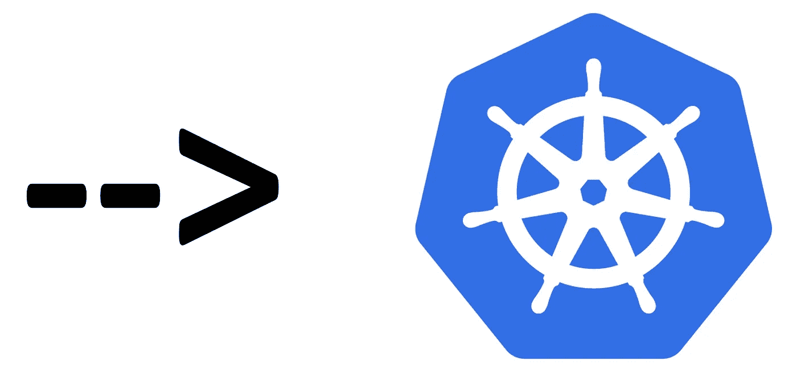
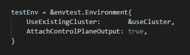
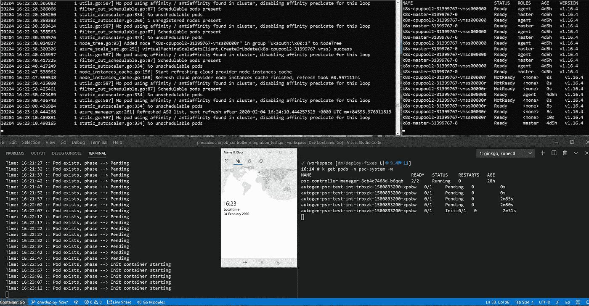
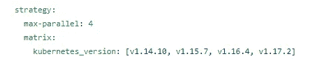
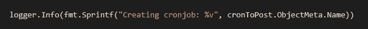
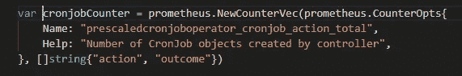
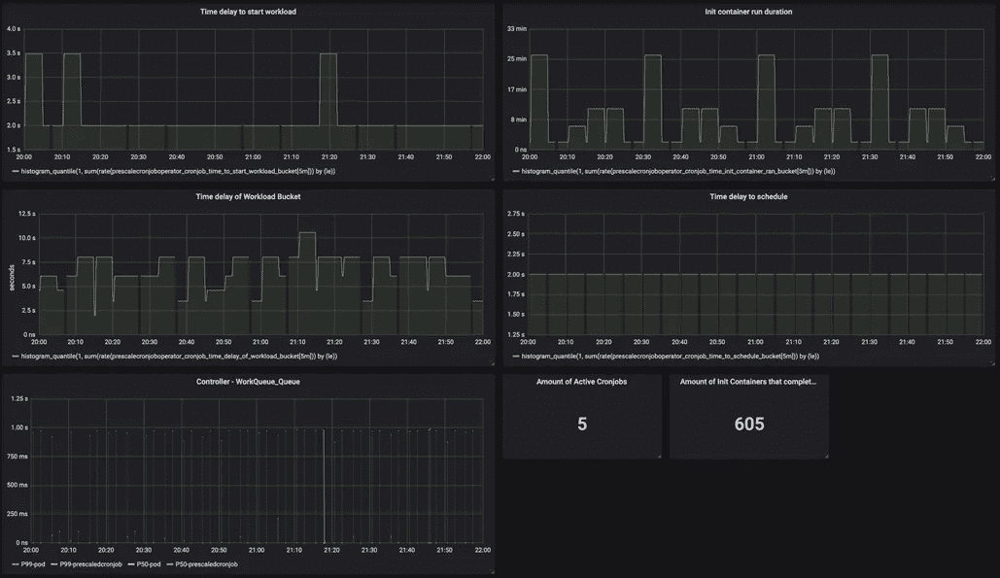
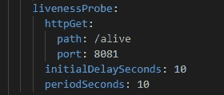
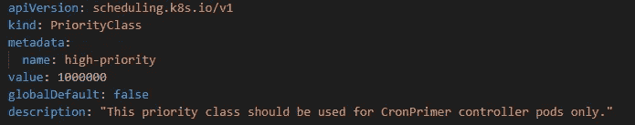
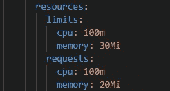

# 让 Kubernetes 运营商投入生产

> 原文：<https://itnext.io/taking-a-kubernetes-operator-to-production-bc59708db420?source=collection_archive---------1----------------------->

在最近的一次客户接触中，我们的团队编写了“CronJob 预分频器”操作符。该运算符的目的是在 cronjob 需要启动之前，强制集群通过 autoscaler 进行扩展，从而允许作业准时启动，而不是等待扩展。代码在这里:[https://github.com/microsoft/k8s-cronjob-prescaler](https://github.com/microsoft/k8s-cronjob-prescaler)。我将引用这段代码的各个方面来说明各个要点。

虽然操作员的功能大部分是用几个 sprints 编写的，但是有信心在您精心保护的生产集群中部署和运行它是另一回事。这篇文章记录了我们为“生产化”操作员所进行的高级活动。

对于上下文，我们使用 Kubebuilder(【https://kubebuilder.io/】见*)构建了操作符。这个团队是:[巴特·詹森](https://github.com/bart-jansen)，[劳伦斯·抓手](https://github.com/lawrencegripper/)，[戴夫·斯托里](https://github.com/storey247)，[埃利斯·塞林](https://github.com/EliiseS)，[斯图尔特·里克斯](https://github.com/Stuartleeks)，[亚历杭德罗·马根西奥](https://github.com/magencio)，[马丁·佩克](https://github.com/martinpeck)，&本人。这个帖子试图将每个人的好想法收集到一个地方。*

## *1.单元测试*

*这通常是不言而喻的——然而——在这里对你的代码进行单元测试并不是必然的。对于 cron 预分频器操作符，我们发现实际单元测试的逻辑非常少。大部分代码都是获取一个 CRD，更改一些属性并提交回 k8s。*

*务实一点，能单元测试就单元测试，但不要试图复试 k8s。对我们来说，这意味着为 cron 操作逻辑*编写单元测试(参见*[*utilities _ test . go*](https://github.com/microsoft/k8s-cronjob-prescaler/blob/master/controllers/utilities_test.go)*)*。对于其余的，我们转移到集成测试。*

## *2.集成测试*

*对于我们的项目，这些测试发展成两种类型:*

*   ***【本地】集成测试，实物运行**。如果你正在使用 kubebuilder，那么银杏测试框架已经为你搭建好了，Kind 已经成为你构建/部署过程的一部分。这里有两种方法——要么使用作为测试一部分启动的本地 API 服务器，要么使用“现有集群”——这意味着无论`kubectl`指向什么(对我们来说，Kind)。因为我们的操作符创建了一个`CronJob`对象并将其发送回 k8s，所以我们需要标准的`CronJob`操作符运行——这意味着一个现有的集群。如果您的运营商不交互或不依赖其他 k8s 功能，您可以简化并使用“嵌入式”API 服务器。
    检查该区块的`[suite_test.go](https://github.com/microsoft/k8s-cronjob-prescaler/blob/f44bc23d206e584ec2f7fbf4d3239b559db3bfeb/controllers/suite_test.go#L48)`:*

**

*使用现有集群进行集成测试*

*   ***“长期运行”集成测试，在真实集群上运行。**针对 Kind 的测试非常棒，因为它快速、可重复、独立，并且可以在构建代理上运行。然而，为了验证您的操作者在一个真实的集群上确实表现良好，您需要在一个真实的集群上运行您的测试。方便的是，如果您选择使用现有集群进行集成测试，那么就需要更改 kube 上下文并再次运行测试(假设操作者已经部署并运行在该集群中)。下图显示了在我们观察 pod/nodes/auto scaler 时运行的集成测试——测试在左下角的终端中运行。*

**

*通过银杏对实时集群进行集成测试*

## *3.CI 和矩阵构建*

*当然，这些测试——尤其是针对 Kind 运行的测试——可以在您的 CI *中运行(参见我们的*[*GitHub Actions*](https://github.com/microsoft/k8s-cronjob-prescaler/actions?query=workflow%3ACI)*)。**

*k8s 有很多版本，所以我们需要明确我们的目标是哪一个——并进行适当的测试。假设您的测试套件正在使用 Kind，您可以通过 env var 甚至矩阵传递版本，这样您就可以确保给定的更改不会损害对您当时没有考虑的 k8s 版本的支持*(参见*[*main . YAML*](https://github.com/microsoft/k8s-cronjob-prescaler/blob/master/.github/workflows/main.yml)*)*:*

**

*用于矩阵构建的 Yaml*

**

*GitHub 操作中的矩阵构建*

## *4.可观察性*

*如果没有合理的可观察性，你的操作员就成了一个黑盒，坐在另一个黑盒里。这一点不仅对“获得刺激”至关重要，而且对开发整个事物也很重要——所以一定要安排充足的时间来充实这一点。*

*   ***日志**。可观察性的最明显和最基本的方面。对伐木要慷慨。这是在一个地方捕捉操作员正在做的所有事情的好方法，并且允许您在观看它运行的同时流式传输日志:`kubectl logs my-pod-name manager -f`*

**

*记录所有的事情*

*   ***事件**。事件允许您将消息发送回您的操作员正在监视的 CRD。这样做的好处是，最终用户可能无法访问操作员日志，但可以运行`kubectl describe MyCustomResource`，这将向他们显示与其资源相关的事件。**当心**，然而默认情况下*事件在 90 分钟后消失(我相信)。**
*   ***指标**。普罗米修斯已经成为监控 k8s 的标准，为什么不推自己的度量让它刮呢？使用 Prometheus 客户端*(github.com/prometheus/client_golang/prometheus)*输出您认为相关的任何指标。*

**

*将指标推送到端点*

*   ***图形**。度量是好的，但是只有当你能够理解它们并使用它们来做决策时才是真正有用的。这就是格拉夫纳的用武之地。它能很好地配合普罗米修斯，帮助你从远处观察你的操作员。这是第二天行动的关键。你怎么知道你的操作员还在做它应该做的事情？*

**

*为您的操作员提供单一的玻璃疼痛*

## *5.稳定性和恢复*

*我们必须记住，操作符很可能在单个 pod 中的一个线程中运行(您可以运行多个，但默认情况下是单个)。这意味着如果它倒下了，任何依赖它的东西也会失败。这又有多危险取决于你的操作者实际在做什么——但这需要考虑。我们不得不考虑:*

*   ***输入验证**。有人会向你的操作员发送一个文本文件(可能是 yaml)。他们在里面放了什么会破坏你的代码？幸运的是，模式验证发生在您的代码被调用之前——所以您可以确信一个`int`字段将包含一个`int`值。然而，如果你正在期待`1-10`而有人给你发来`1000000`呢？你的代码会有什么反应？*
*   ***等幂**。这不仅对于恢复很重要，而且考虑到如果(当)您的操作程序重新启动，k8s 将所有 CRD 交给它重新处理时会发生什么。接下来会发生什么？您需要考虑要创建的对象已经存在的代码路径。你怎么知道它的存在？你怎么知道它有效？*
*   ***活性/准备就绪探测器**。k8s 怎么知道你运营商不开心？它能判断运行时中的某些东西是否变得没有响应了吗？这就是活跃度和准备度变得重要的地方。我们的很好也很简单，如果项目变得更复杂，还可以扩展:*

**

*manager.yaml 中的 livenessProbe*

**

*活着的时候返回 200—main . go*

## *6.Pod 元数据*

*你的操作员会像其他人一样在一个舱里运行。考虑到这一点，良好的卫生习惯非常重要:*

*   ***吊舱优先级**。在资源受限的集群中，如果您的操作员出现故障，或者部署了更多的 pod，会发生什么情况？如果这是您的集群中的一个“核心”服务，您希望它运行——它比其他 pods 更重要。所以设定优先级。*

**

*为您的操作员舱创建超高优先级类别*

*   ***资源限制&请求。**告诉 k8s 运行你的操作符需要什么。*

**

*manager.yaml 中的资源*

# *最后的想法…*

*不要为了让项目‘上线’而把这些活动推到最后一分钟。添加适当的测试和可观察性实际上会帮助您加速开发，因为预先付出代价会导致更清晰、更简单和更安全的开发。*