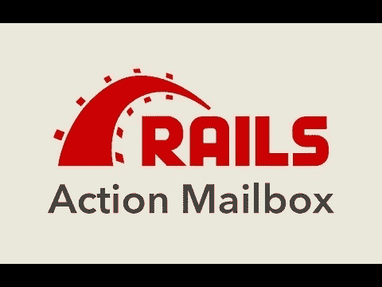
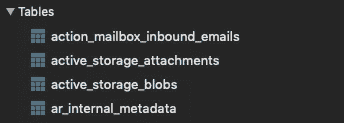
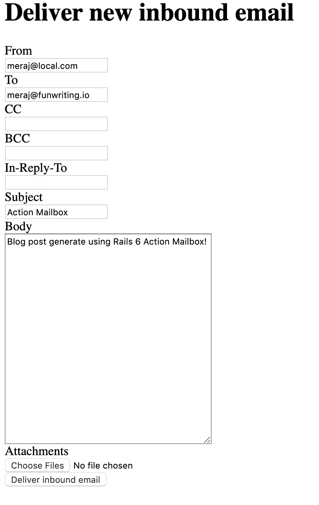
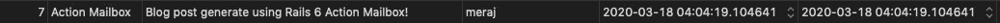

# 带着 Rails 6 的动作邮箱兜一圈

> 原文：<https://itnext.io/taking-rails-6s-action-mailbox-for-a-spin-104d0e34d379?source=collection_archive---------3----------------------->



动作邮箱是 [Rails 6](https://edgeguides.rubyonrails.org/6_0_release_notes.html) 的新功能之一。[摘自 Basecamp 3](https://weblog.rubyonrails.org/2018/12/13/introducing-action-mailbox-for-rails-6/) ，动作邮箱—“*将收到的电子邮件路由到类似控制器的邮箱，在 Rails 中进行处理。它附带了 Mailgun、Mandrill、邮戳和 SendGrid 的入口。您还可以通过内置的 Exim、Postfix 和 Qmail ingresses 直接处理入站邮件。*

*这些入站电子邮件使用 Active Job 异步路由到一个或多个专用邮箱，这些邮箱能够直接与您的域模型的其余部分进行交互。*【1】

在本文中，我将试用 Action Mailbox，并编写一个简单的 Rails 6 应用程序来演示 Action Mailbox。

# 设置

让我们使用下面的命令创建一个新的 rails 项目 **action_mail_test**

> $rails 新动作 _ 邮件 _ 测试

因为我将使用 postgresql 作为数据库，所以我在 Gemfile 中添加了 **pg** gem

```
gem 'pg', '1.2.2'
```

接下来是—

> $捆绑安装

我更新了 **database.yml** 来包含开发和测试数据库配置。因为这只是为了在开发环境中演示，所以我跳过了生产数据库配置。这个文件看起来如下—

```
default: &default
  username: meraj
  password:
  adapter: postgresql
  host: localhost
  pool: 10
  timeout: 5000

development:
  <<: *default
  database: mailbox_dev

*# Warning: The database defined as "test" will be erased and
# re-generated from your development database when you run "rake".
# Do not set this db to the same as development or production.* test:
  <<: *default
  database: mailbox_test
```

配置好数据库后，我使用下面的命令创建了开发和测试数据库—

> $rails 数据库:创建

现在是安装 InboundEmail 所需的迁移并确保设置活动存储的时候了。为此，我运行了以下命令—

> $ rails action_mailbox:安装
> 
> 将 application_mailbox.rb 复制到 app/mailbox
> 
> 创建应用程序/邮箱/应用程序 _ 邮箱. rb
> 
> 已从活动存储复制迁移 20200318005908 _ create _ active _ storage _ tables . active _ storage . Rb
> 
> 已从 action_mailbox 复制迁移 20200318005909 _ create _ action _ mailbox _ tables . action _ mailbox . Rb

该命令生成了一些迁移文件。运行 **rails db:migrate** 创建如下所示的四个表



# 按指定路线发送

在这个阶段，我在自动生成的文件**app/mailbox/application _ mailbox . Rb**中设置路由

```
class ApplicationMailbox < ActionMailbox::Base
  POSTS_REGEX = /meraj@funwriting.io/i

  *# routing /something/i => :somewhere* routing POSTS_REGEX => :posts
end
```

我的意图是创建一些基于入口电子邮件的博客帖子。因此，这种路由实质上是为收到的电子邮件建立了一个路由，从 **meraj@funwriting.io** 到 **posts** 邮箱。

根据您的实际需要，您需要正确配置路由，这可能会更复杂。

# 生成邮箱

为了生成邮箱**帖子**，我发出了以下命令—

> $ rails 生成邮箱帖子
> 
> 在进程 85759 中通过 Spring 预加载程序运行
> 
> 创建 app/mailbox/posts _ mailbox . Rb
> 
> 调用测试单元
> 
> 创建测试/邮箱/帖子 _ 邮箱 _ 测试. rb

除了 **posts_mailbox.rb** 之外，它还生成了一个测试文件 **posts_mailbox_test.rb** 。

# 处理入站电子邮件

在 **posts_mailbox.rb** 中唯一需要的方法是 **process** 来处理收到的邮件。在这种情况下，我想自动生成一些博客文章，文章的标题设置为邮件的主题，正文设置为邮件的正文，所有者设置为邮件的 from 部分的名称。

为此，首先我生成了 **Post** 模型，并运行相应的迁移以在数据库中创建 **posts** 表

> $rails g 模型文章标题:字符串主体:文本所有者:文本
> 
> $rails db:迁移

同样，对于更实际的用法，所有者应该是来自用户表的某个 id，可以使用电子邮件地址来查找。

在创建了 **posts** 表之后，我已经将下面的代码放到了 **posts_mailbox.rb** 文件中—

```
class PostsMailbox < ApplicationMailbox
  before_processing :process_owner

  def process
    Post.create(title: mail.subject, body: mail.body, owner: @owner)
  end

  private
  def process_owner
    @owner = mail.from.first.split('@').first
  end
end
```

基本上，它所做的是—

*   **before _ processing filter**—在**进程**方法执行之前运行，从**邮件中提取名称部分(之前的部分@)**
*   **process** 方法——创建一个 **Post** ，标题设置为 **mail.subject** ，正文设置为 **mail.body** ，所有者设置为 **@owner** ，由 process_owner 私有方法生成。

# 本地测试

我先启动了服务器—

> $rails 服务器

Rails 提供了一种便捷的方式来使用以下途径生成入站电子邮件—

[http://localhost:3000/rails/conductor/action _ mailbox/inbound _ emails/new](http://localhost:3000/rails/conductor/action_mailbox/inbound_emails/new)

**主机名**(本地主机)和**端口** (3000)需要根据您的设置进行修改。但是这应该会弹出一个如下所示的漂亮的 GUI



我通过点击“**发送入站电子邮件**”创建了一个样本帖子，包含上面截图中的信息



# 生产用途

对于生产用途，您可能希望使用 SendGrid 或其他入口。如何配置这些入口在官方的[操作邮箱基础](https://edgeguides.rubyonrails.org/action_mailbox_basics.html)指南中有记录。

# **焚烧收件箱**

默认情况下，已成功处理的收件箱邮件将在 30 天后被销毁。实际的焚化是通过计划在`**config.action_mailbox.incinerate_after**`时间后运行的`**IncinerationJob**`完成的。这个值默认设置为`**30.days**`，但是您可以在您的 **production.rb** 配置中更改它。

在本文中，我试用了 Rails 6 的 Action Mailbox，并试图通过编写一个示例应用程序来演示如何使用它。我希望这能帮助一些读者熟悉 Rails 6 的这个重要特性。该应用的源代码可以在我的 GitHub 上找到，链接如下:[*https://github.com/imeraj/action_mailbox_test*](https://github.com/imeraj/action_mailbox_test)

*如需更多详细和深入的未来技术帖子，请关注我这里或上*[*Twitter*](https://twitter.com/meraj_enigma)*。*

# 参考

[1][https://edge guides . ruby on rails . org/action _ mailbox _ basics . html](https://edgeguides.rubyonrails.org/action_mailbox_basics.html)