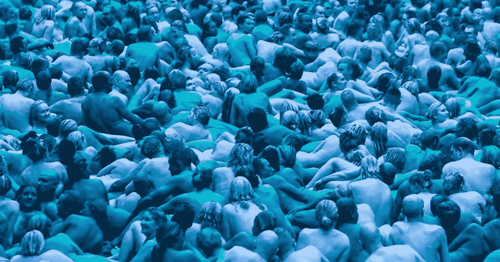
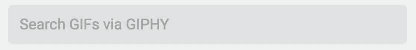
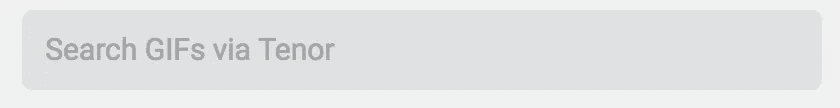
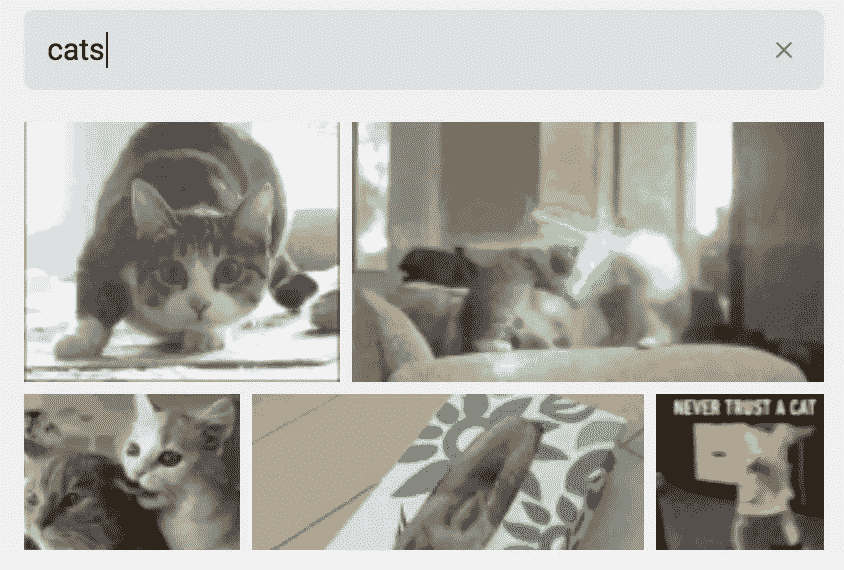
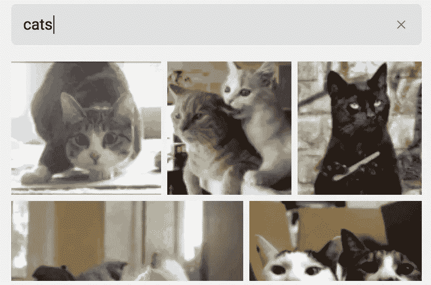
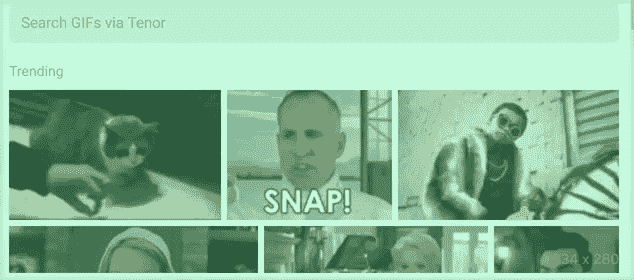
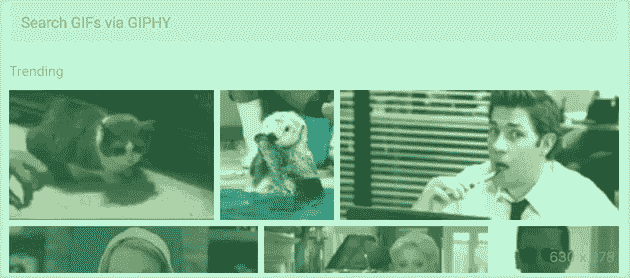
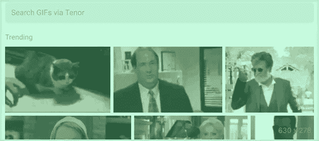

# 解锁 WhatsApp 的隐藏 GIF 提供程序(Giphy / Tenor)并探索代码

> 原文：<https://itnext.io/taking-the-training-wheels-off-whatsapps-gif-search-to-include-nsfw-and-choose-between-giphy-and-885dd1c7a98c?source=collection_archive---------1----------------------->



图片来自[赫尔每日邮报](https://www.hulldailymail.co.uk/news/hull-east-yorkshire-news/spectacular-sea-hull-pictures-spencer-112231)

答在[上一篇报道](/exploiting-freely-accessible-whatsapp-data-or-why-does-whatsapp-know-my-battery-level-ddac224041b4)获得了压倒性的浏览量后，我决定继续探索 WhatsApp 的源代码，看看我是否能找到其他有趣的东西，我是说**谁不喜欢喝着咖啡浏览 109000 行代码呢**？。

> 正如我之前关于 WhatsApp 的[故事](/exploiting-freely-accessible-whatsapp-data-or-why-does-whatsapp-know-my-battery-level-ddac224041b4)一样，这是关于 WhatsApp web 的，我不会详细介绍如何做到这一点，主要是探索和分享结果

几个月前，我想在群聊中给一个朋友回复一张某人模拟开枪自杀的 GIF，我想要一张《我是如何遇见你母亲的》*在哪里[巴尼·斯丁森](http://how-i-met-your-mother.wikia.com/wiki/Barney_Stinson)中的特定图片。我找不到它，也找不到任何有点 NSFW 或暴力的东西，我明白，孩子们使用这个应用程序(他们不应该这样做，但他们这样做了)，我们必须保护我们的孩子，但…我能对我自己的 WhatsApp 做些什么，以便在不离开标签的情况下，我可以改善我的 GIF 搜索体验吗？*

*让我们来了解一下！*

# *你说的这个男高音是什么？*

*你可能听说过 [Tenor](https://tenor.com/) gif 键盘，它可以让你搜索大量的 gif 图片，并轻松地将它们插入到你用来聊天的应用程序中，我肯定**从未听说过它们**。在随意查看 WhatsApp 网站的源代码时，我注意到有一个可疑的 switch 语句，它考虑了用户不使用 [Giphy](https://giphy.com/) 搜索引擎的可能性。*

```
*function n() {
    switch (c["default"].gifSearch) {
        case "giphy":
            return u;
        case "tenor":
        default:
            return f
    }
}*
```

**

*我的默认 gif 搜索引擎*

*默认情况下，`f`应该是`"tenor"`,但我在搜索对话中使用的有趣的 GIF 时，总是会看到上面的图片。在网上阅读时，你可能会认为他们在同一个搜索中整合了这两者，也许对于 iPhone 用户来说就是这样，没有办法验证这一点。然而，看一下代码就可以清楚地看到(不管流在通过混淆器后变得多么迟钝),它来自两个独立的 API。*

*   *吉菲利用[https://api.giphy.com/v1/](https://api.giphy.com/v1/)*
*   *男高音使用[https://wa.tenor.co/v1](https://wa.tenor.co/v1)*

*将`c["default"].gifSearch`的值更改为“*期限*”或除了“ *giphy* ”之外的任何值，将使您的查询通过期限 API 并提供不同的结果。我敢肯定，无论是在 web 应用程序还是 Android 应用程序中都没有改变 GIF 提供者的选项，但如果有，请让我知道，因为这样整个部分都变得很傻。*

**

*我们有所发现，我们可以搜索高音！*

# *这两个搜索引擎相比如何*

*我读到过，搜索到的最常见的 gif 是猫的 gif，所以为了比较结果，在我尝试去 NSFW 之前，我将使用术语“*猫*”。让我警告你，结果至少是反气候的。*

*为什么 WhatsApp 有这个能力在两者之间选择却替我们决定？我猜这可能与你来自的国家有关，也许他们与每个公司都有协议，并根据用户的位置将流量转移到一个或另一个公司，但这是纯粹和有趣的推测性谈话。*

****

*我想，吉卜利在左边，男高音在右边*

**完全编造了那个说法，不好意思，想交猫税。**

# *我们使用 PG-13 版本的搜索*

*抛开比较不谈，这两个搜索引擎有一些共同点，它们都将搜索结果限制在 PG-13 美国电影协会级别。男高音网站上有一个表格，列出了这包括哪些内容(不包括明显的裸露)[。在源代码中，这被设置为“*中度*”，删除了图形暴力、强烈的亵渎、毒品和带有伤害意图的武器。](https://tenor.com/gifapi/documentation#localization)*

*Giphy 的代码部分设置了一个" *pg-13* "值，但没有说明它究竟阻止了我们的结果，而是将我们指向美国电影协会电影分级官方网站。*

*在[打嗝](https://portswigger.net/burp)上设置匹配和替换规则，用“*关*”和“ *r* ”替换“*中等*”和“ *pg-13* ”值，应该可以消除这种限制，并允许搜索这些提供商的完整目录，但是 pg 等级对头像结果没有影响。或者实际上任何进一步的关键字。*

**

*唉，至少我在找男高音而不是吉菲，对吗？*

*说到底，两家提供商**都有非常严格的 NSFW 指导方针**，如果它们的目录中没有，我们就没有办法找到它，所以我们也可以不去管它，我们可以添加模仿 giphy 和 tenor APIs 的其他端点，但这没什么意思。*

*简单地将引擎从 giphly 改为 tenor 会为关键字“*裸体”、*产生完全不同的一组结果，但是正如我提到的，没有一个结果是显式的。
还有另一件值得注意的事情，那就是搜索结果是按受欢迎程度排序的，因此，由于大多数人无法在没有过滤器的情况下进行搜索，即使有更明确的结果，那些过滤后的结果也会出现在顶部。*

****

*giphy 和 tenor 的结果比较，是的，我的互联网糟透了*

# *结论*

*我能有什么结论？唯一的结论是我现在有太多的空闲时间。我很好奇将 Tenor 作为默认设置但在某个时候被 Giphy 覆盖的原因，所以我做了更多的研究，但我只能确定数据的来源是来自他们服务器的 websocket 消息:*

```
*MESSAGE_INFO:true
SET_BLOCK:true
SPAM:true
announceGroups:1001
bucket:""
edit:1
fbCrashlog:true      
gifSearch:"giphy"    #There we go
groupDescLength:512
groupsV3:1
imageMaxEdge:1600
imageMaxKBytes:1024
maxFileSize:100
maxParticipants:257
maxSubject:25
media:64
restrictGroups:1
videoMaxEdge:960
webPresence:false*
```

*有一个巨大的对象，内部称为`c["default"]`，包含这一个和另一个设置，如电池警告阈值(默认为 15 和 5，测试更改为 99，果然我得到了低电池警告)，以及一些显然未使用的谷歌地图设置(可能在网络中未使用，在 iPhone 中使用)名为`GOOGLE_MAPS_DO_NOT_AUTH`。难倒我了…*

*现在就这样吧，我会用这些设置再玩一些，如果我发现什么就告诉你们。*