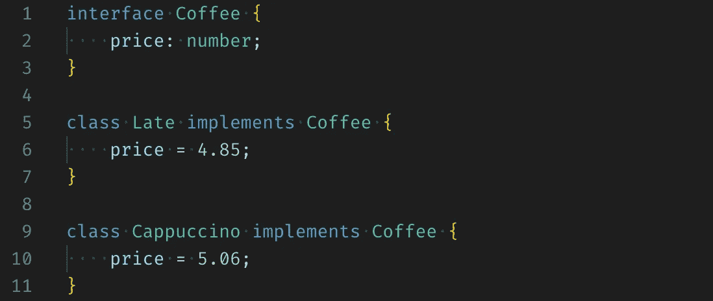
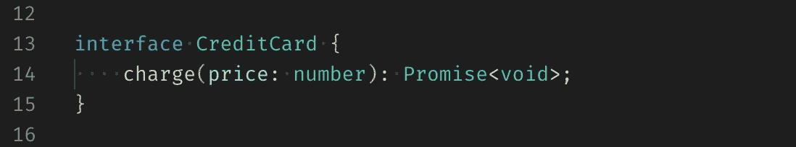
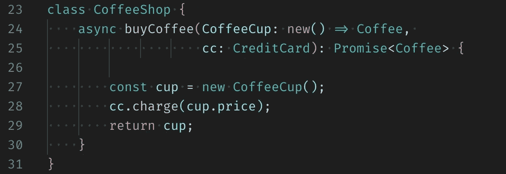
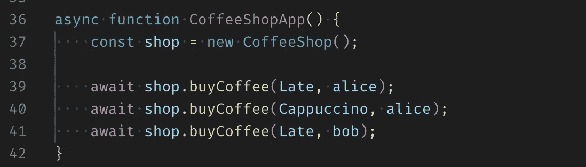
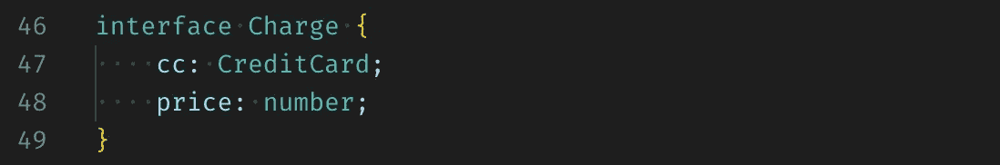
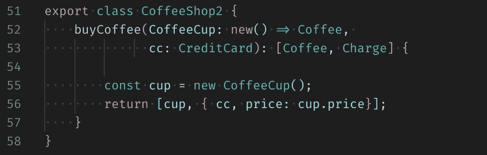
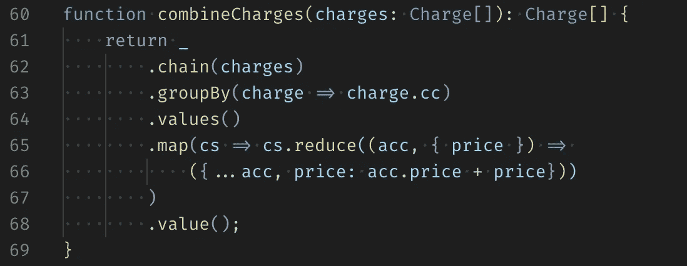
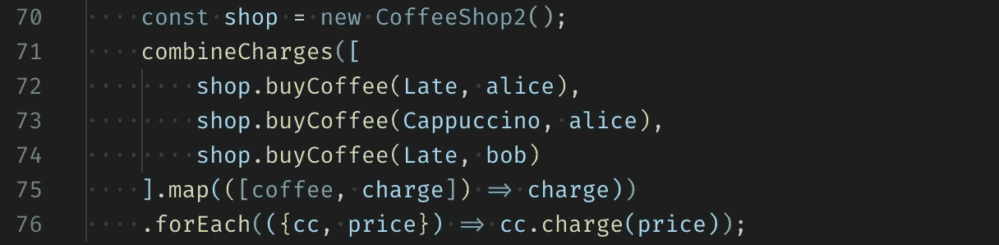

# JavaScript 中函数式编程的味道

> 原文：<https://itnext.io/taste-of-functional-programming-in-javascript-57fc0035238?source=collection_archive---------2----------------------->

咖啡店就是一个很好的例子，展示了函数式编程的好处。

函数式编程(FP)基于一个简单的思想，即使用 [**纯函数**](https://en.wikipedia.org/wiki/Pure_function) 来构造程序。一个纯函数为相同的参数返回相同的值，它的求值没有 [**副作用**](https://en.wikipedia.org/wiki/Side_effect_(computer_science)) (即没有局部静态变量、非局部变量、可变引用参数或 I/O 流的突变)。JavaScript 中纯函数的一个简单例子是在数组数据结构的原型上定义的[映射](https://developer.mozilla.org/en-US/docs/Web/JavaScript/Reference/Global_Objects/Array/map)、[过滤](https://developer.mozilla.org/en-US/docs/Web/JavaScript/Reference/Global_Objects/Array/filter)和[减少](https://developer.mozilla.org/en-US/docs/Web/JavaScript/Reference/Global_Objects/Array/Reduce)方法。

让我们看一个例子来演示 FP 和纯函数的好处。

# 咖啡店

假设，我们正在实现一个处理咖啡店购物的程序。我将从一个有副作用的简单程序开始，然后用纯函数重写它。域实体是不同种类的咖啡，有相应的价格(图 1)和支付给定订单的信用卡(图 2)。

图一。Base Coffee 接口，Late 和 Cappuccino 实现。

图二。信用卡提供了一个异步方法“charge()”来执行给定价格的订单。为了简单起见，它返回一个没有“无效”的承诺。

咖啡店应用程序的简单实现应该允许选择一种咖啡并下订单(图 3)。

图 3。顾客可以买一杯咖啡。

在这个实现中，行# 28**cc . charge(cup . price)**是副作用的一个例子，因为对信用卡收费涉及到与外界的一些交互。

假设有两个客户:Alice 和 Bob。爱丽丝点了一杯拿铁和卡布奇诺，鲍勃——只要拿铁。

图 4。客户下了订单。

可能有更多的顾客，他们中的一些人想点 12 杯咖啡。按照目前的实施方式，这将涉及对支付系统的 12 次单独呼叫，这可能会增加更高的处理费用和更慢的操作速度。将属于同一张信用卡的订单合并成一笔交易似乎是个好主意。我们能做些什么呢？

# 咖啡店 2

FP 解决方案是消除副作用。我们需要让 **buyCoffee()** 成为一个纯函数。这可以通过引入另一个名为 Charge 的对象来实现，该对象将封装有关信用卡和订单价格的信息。

图 5。收费对象包含信用卡和订单价格。

我们不是立即执行订单，而是返回订单和支付信息的元组(图 6)。

图 6。返回一个元组[咖啡，收费]。

现在可以用不同的支付方式下多个订单，组合这些订单(图 7)并在每张信用卡的一次交易中执行(图 8)。

图 7。通过信用卡合并订单。下划线变量是一个“lodash”库。

图 8。下单，组合，执行。

我们现在能够编写订单并应用不同的支付策略，因为咖啡店不需要了解支付处理。总的来说，这个解决方案非常灵活。

这只是 FP 的一个味道。不可变的数据结构和纯函数使得代码更不容易出错，更易测试，并能适应业务需求的变化。如果你想了解更多关于 FP 的知识，我最喜欢的书是保罗·丘萨诺和罗纳·比雅纳松的《Scala 函数式编程》。