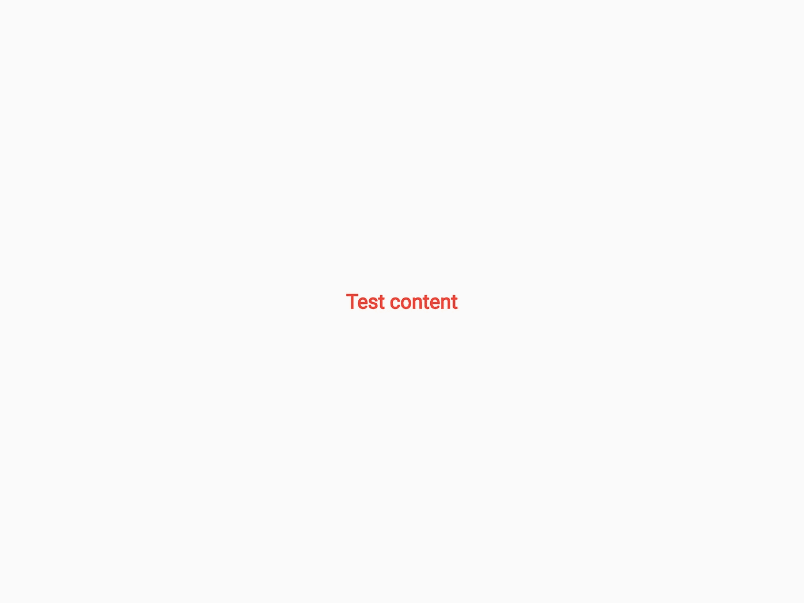
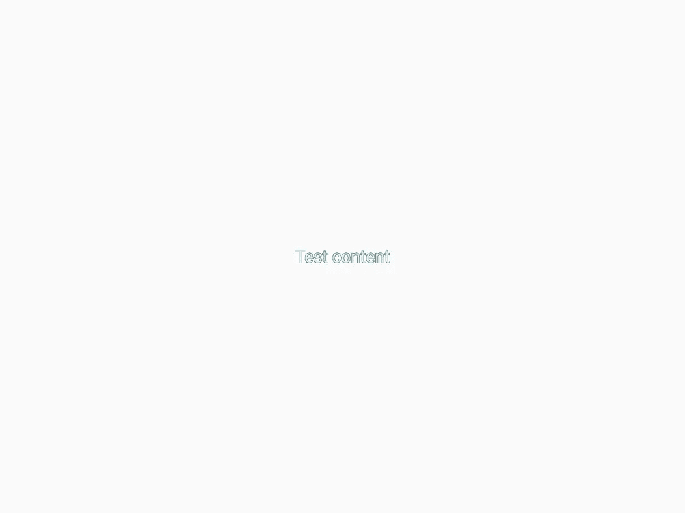
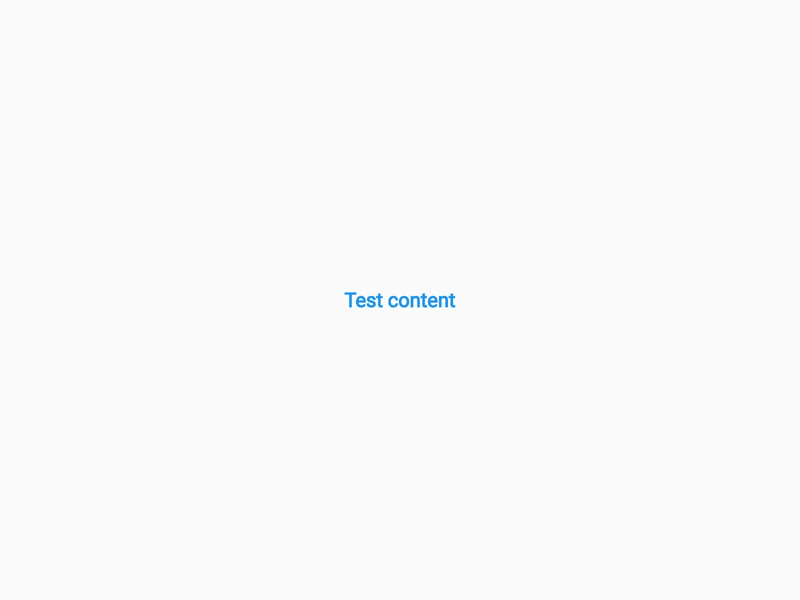

# Flutter 中的 TDD 第 3 部分:测试小部件

> 原文：<https://itnext.io/tdd-in-flutter-part-3-testing-your-widgets-c5e87d76a864?source=collection_archive---------1----------------------->

大家好，距离上一集已经有一段时间了，但现在终于来了，我准备向你们解释如何测试你们的小部件。在第三部分，我将向你解释如何使用`testWidgets`以及如何使用快照比较来渲染带有 [golden_toolkit](https://pub.dev/packages/golden_toolkit) 包的小部件。

你现在可以在一个专门的[列表中找到所有以前的文章:TDD in Flutter](https://rouxguillaume.medium.com/list/tdd-in-flutter-64d0d5f07854) 。


# testWidgets()

这个方法的工作方式与`test()`方法相同，基本上是在测试环境中执行你的颤振代码。主要区别在于，这个测试环境是为构建小部件并与之交互而设计的。为此，这里有一些方法可以用来通过`WidgetTester`模拟小部件上的动作:

*   `pumpWidget`:用给定的小工具模拟对`runApp()`的调用。

pumpWidget 示例

*   `drag`和`dragFrom`:模拟给定控件上给定偏移量的拖动动作。
*   `ensureVisible`:给定一个在`Finder`中指定的小部件 W 和一个在其祖先树中可滚动的小部件 S，它将滚动 S 以使 W 可见。
*   `enterText`:将焦点放在`Finder`中指定的文本输入窗口小部件上，并用给定的文本替换其内容，就好像它是由屏幕键盘提供的一样。
*   `fling`和`flingFrom`:尝试从给定小工具的中心开始，移动给定的距离，达到给定的速度，做出一个甩动手势。
*   `idle`:如同应用程序进入空闲状态。
*   `press`、`longPress`、`longPressAt`、`tap`和`tapAt`:在给定的小工具(假设是暴露的)或位置的中心向下/向上调度指针。
*   `showKeyboard`:将焦点放在`Finder`中指定的文本输入小工具上，就像屏幕键盘已经出现一样。
*   `startGesture`:在特定点创建一个初始向下的手势。

您可能已经理解了这些方法，您可能需要使用一个`Finder`类来搜索一个小部件。您可以使用它来查找想要对其应用特定操作的小部件，或者确保小部件正确显示。

finder 示例

# 睾丸酮

这个测试方法是由包 [golden_toolkit](https://pub.dev/packages/golden_toolkit) 提供的，它允许你测试你的 UI 以确保它保持不变。这种测试的工作方式是拍摄上一个 UI 的快照，并与新的 UI 进行比较。如果新的 UI 看起来与以前不同，黄金测试将被视为失败。

让我们举个例子，这是一个显示一些文本的简单小部件:

简单 _ 文本.镖

这将在一个具有预定义样式的`Text`小部件中显示`content`。

这是我们黄金测试的测试文件:

简单 _ 文本 _ 测试.镖

在运行黄金测试之前要做的第一件事是生成初始快照，它将是您的匹配样本。为此，只需使用命令`flutter test --update-goldens`即可，它将运行您所有的单元测试，但只会为您的黄金测试生成或更新快照。这是我们的小测试的输出:



test/goldens/simple _ red _ text . png

现在让我们假设我想让我的`SimpleText`小部件在我的应用程序中更加灵活，例如通过设置颜色变量。代码可以这样发展:

通过遵循 TDD 原则，因为我们的代码仍在编译中，所以我们不需要更新我们的测试。所以让我们运行它，但是这次不用`— update-goldens`参数。

```
$> flutter test
00:01 +0: loading D:\Documents\Projects\so_tests\test\golden_test.dart00:02 +0: golden: simple red text
══╡ EXCEPTION CAUGHT BY FLUTTER TEST FRAMEWORK ╞════════════════════════════════════════════════════
The following assertion was thrown while running async test code:
Golden "goldens/simple_red_text.png": Pixel test failed, 0.16% diff detected.
Failure feedback can be found at /D:/Documents/Projects/so_tests/test/failuresWhen the exception was thrown, this was the stack:
#0      LocalFileComparator.compare (package:flutter_test/src/_goldens_io.dart:100:7)
<asynchronous suspension>
<asynchronous suspension>
(elided one frame from package:stack_trace)
════════════════════════════════════════════════════════════════════════════════════════════════════
00:02 +0 -1: golden: simple red text [E]
  Test failed. See exception logs above.
  The test description was: golden: simple red text00:02 +0 -1: Some tests failed.
```

如您所见，我们的测试失败了，我们可以检查`test/failures`文件夹中的输出:

*   这是预期的图像:


simple _ red _ text _ master image . png

*   测试期间生成的输出:


simple_red_text_testImage.png

您甚至可以获得显示两者差异的快照:



simple _ red _ text _ isolated diff . png(左)—simple _ red _ test _ maskeddiff . png(右)

现在我们有一个未通过的测试，我们可以更新代码，这样它将再次通过:

如果我们再次运行我们的测试:

```
$> flutter test
00:03 +0: loading D:\Documents\Projects\so_tests\test\golden_test.dart00:04 +1: All tests passed!
```

耶！它再次通过，但我们还没有测试我们的新颜色参数是否可以用于除红色以外的其他颜色，所以让我们添加另一个测试。

重新生成我们的黄金文件后，这里是新的输出:



简单 _ 蓝色 _ 文本. png

通过进行这些测试，我确保了向我的`SimpleText`小部件添加新功能不会导致我的 UI 出现任何倒退，这与对代码进行单元测试一样重要。

另一个重要的信息是，目前生成的黄金文件在 OS 和 Flutter 版本之间不一致。这意味着，如果快照是在 Windows 和 MacOS 上生成的，或者是在不同的 Flutter 版本上生成的，它们可能会有所不同。目前唯一的解决方案似乎是在某个容器中运行您的黄金测试，该容器将保持一个恒定的环境。

# 结论

乡亲们来了！一如既往，我希望你喜欢我的这篇小文章。再次，我对前一次发布之间的延迟深感抱歉。我还有其他项目要处理。尽管如此，如果你仍然想表达你对这个系列的支持，你可以鼓掌或者发表评论，阅读你的留言总是一件愉快的事。下一篇文章将讨论如何使用软件包 [mockito](https://pub.dev/packages/mockito) 来模仿你的类，所以如果你不想错过的话，请不要犹豫，继续关注我的文章。而如果你想查阅之前的文章，可以在他们的专用阅读列表中找到全部:[https://rouxguillaume . medium . com/list/TDD-in-flutter-64d 0 D5 f 07854](https://rouxguillaume.medium.com/list/tdd-in-flutter-64d0d5f07854)